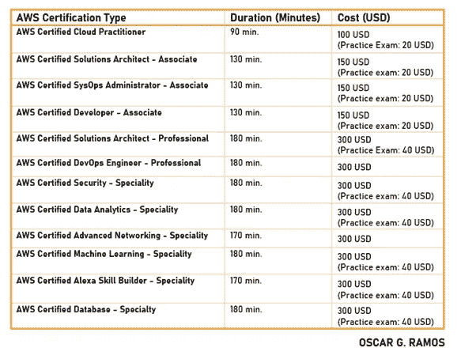

# 获得 AWS 认证—准备参加 2020 年 AWS 认证考试

> 原文：<https://towardsdatascience.com/becoming-aws-certified-prepare-for-your-aws-certification-exam-2020-f5392fcbec44?source=collection_archive---------29----------------------->

## 根据角色和专业从各种认证考试中进行选择，旨在帮助个人和团队实现您的独特目标。

如果您想要验证您的技术技能和云专业知识，以促进您的职业和业务发展…

**祝贺你，今天是你的大日子！**

将工作负载迁移到公共云是一项持续的艰巨任务，以前这是公司内部的一项技能，现在它已经成为任何业务团队的核心能力。

凭借 33%的市场份额，亚马逊 AWS 继续引领 2020 年 Q2 公共云的采用，目前提供 12 项认证，其次是微软 Azure 和谷歌云平台，分别占 18%和 9%。

凭借超过 175 种不同的服务，AWS 提供了大约 40 种其他云提供商不提供的服务。

照片由 [Cookie 在](https://unsplash.com/@cookiethepom?utm_source=unsplash&utm_medium=referral&utm_content=creditCopyText) [Unsplash](https://unsplash.com/collections/10484025/dogs-working-from-home?utm_source=unsplash&utm_medium=referral&utm_content=creditCopyText) 上的 Pom 拍摄

> [**以 50%的折扣获得为期 1 年的所有 Whizlabs 课程—立即订阅**](https://shareasale.com/r.cfm?b=1551042&u=2501293&m=43514&urllink=&afftrack=)

或者

> [**成为 AWS 认证专家|使用优惠券— WHIZAWS20 并享受八折优惠|立即购买**](https://shareasale.com/r.cfm?b=1373704&u=2501293&m=43514&urllink=&afftrack=)

## [与+1K 人一起加入我的电子邮件列表，获取更多独家内容](https://www.oscargarciaramos.com/newsletter-exclusive-content)

# 成为 AWS 认证需要多长时间？

我会告诉你，根据我的经验，在全职工作的情况下，需要投入 2 到 3 个月的时间。也就是说，总共投入 80 到 120 个小时来准备所有的认证。

随着您知识的增长，许多认证共享高级概念、服务和其他细节，您将在学习过程中不断强化这些内容。从基础知识开始，然后进入解决方案架构师—助理学习路径。

# 我从哪里开始？哪个云认证最好？

AWS 目前总共提供 12 种不同的认证:

*   **一项基础认证:** AWS 认证云从业者
*   **三项助理级认证:**
    AWS 认证开发人员助理
    AWS 认证系统运行管理员助理
    AWS 认证解决方案架构师助理
*   **两项专业级认证:**
    AWS 认证 DevOps 工程师-专业
    AWS 认证解决方案架构师-专业
*   **六大专业认证:** S 认证数据分析-专业(旧大数据-专业)
    *如果你想了解更多，去查一下* [*成为 AWS 认证数据分析-2020 年 4 月新*](/becoming-an-aws-certified-data-analytics-new-april-2020-4a3ef0d9f23a)
    AWS 认证高级联网-专业
    AWS 认证安全-专业
    AWS 认证机器学习-专业
    AWS 认证数据库-专业
    AWS 认证 Alexa 技能构建器-专业

您可以在此找到所有学习途径[的完整概述。](https://aws.amazon.com/certification/)

## [获取 AWS 认证解决方案架构师学习指南](https://amzn.to/3asbfxc)

# 我如何获得 AWS 认证？

嗯，每个人都有一套窍门。虽然没有单一的方法来准备每一项认证，但至少以我的经验来看，我确实使用特定的方法来参加和通过认证。

1.  **下载考试指南和样题。**

我想说，这是开始任何认证工作之前要做的第一件事。重要的是要知道从哪里开始，每个认证涵盖的材料，并能够选择哪一个适合您的需求或关注。例如，准备 AWS 认证数据库—专业与准备 AWS 认证数据分析不同。虽然他们可能会分享知识和服务，但你应该提前知道你想专注于哪里。

**2。探索 AWS 学习途径**

每种认证都提供了不同的学习途径，详细介绍了成功通过认证的建议步骤。

在每条学习路径中，都推荐了不同的入门或免费培训课程、要阅读或至少要考虑的 AWS 白皮书，以及用户在参加最终考试之前必须具备的其他要求或知识。

此外，每个步骤都根据其复杂程度(基础、中级或高级)进行分类，如有必要，还包括为保证当前认证成功而必须获得的推荐的先前认证。

**3。阅读 AWS 白皮书**
这似乎是不必要的，当然，在许多情况下我们忽略了这一步，但我告诉你这是值得的。

这些文章中涉及的所有细节对于深入理解考试中涉及的每项服务的内容至关重要。

事实上，许多问题都是从这些白皮书中摘录的，因此，如果我是您，我会花时间阅读这些白皮书，并查看您的认证中的一些常见问题或主题。

**4。参加考试准备培训**
我在上一次认证中发现了这一步骤，并取得了成功。
这些免费的 AWS 培训允许用户学习如何解释考试问题，并为考试中的每个部分分配必要的时间。

根据认证的不同，我们会以面对面课程、在线和其他网络研讨会的形式提供不同的培训，在这些培训中，我们会复习每个领域中的试题示例，以及如何解释不同的可能答案，以便更轻松地消除错误答案。**全力推荐！**

**5。练习考试**
练习，练习，练习。如果你想确保你控制了考试的所有环节，你想在考试中减轻任何担心或压力，那就练习吧！

而且不止一次，很多次。直到你差不多把问题和答案都背熟了。开始的几次可能是一场灾难，然后就值得了。
我建议在你以至少 80–85%的分数通过所有考试或测试之前，不要参加考试。

*你的口袋会很感激！*

# 获得 AWS 认证需要多少钱？

根据您考试的认证级别，价格如下:

*   **从业者** = 100 美元
*   **关联** = 150 美元
*   **专业** = 300 美元
*   **特产** = 300 美元

记住，一旦你通过了一门考试，你在下一门考试中会得到 50%的折扣。因此，如果您选择较便宜的联营公司(150 美元)，您将获得较贵的联营公司(300 美元)的 50%。

让我用一个表格来分享这 12 项认证的详细信息:

耶，我有了我的第一个认证！现在怎么办？…

# 重新认证和保持最新状态

**恭喜！这是第一步，但还没有全部完成。AWS 每年提供的新功能和服务的数量，我甚至可以说每个月都在增加。为了证明这不是巧合，并且您继续拥有更新 AWS 服务所需的经验和知识，认证持有者需要每两年重新认证一次。**

**您有两种选择:**要么通过同一认证的专业水平重新认证，要么通过当前认证的重新认证考试。*考试持续 80 分钟，费用 75 美元。*

# 我可以在线获得 AWS 认证吗？

**全力推荐。**我上一次认证是 100%在线。
现在，您可以在线参加 AWS 认证，也可以在自己舒适的家中参加。但是，有些方面您可能需要考虑:

*   你必须能够与说英语的监考人交流。考试可以用不同的语言进行，但会有一个“控制者”在考试前问你一系列问题，并帮助你解决任何问题。总是用英语。您可以用英语、日语、韩语或简体中文参加考试，但与监考人的交流将使用英语。
*   在参加考试之前，您必须确保您的计算机符合系统要求(浏览器、麦克风、摄像头，以及工作区)。您必须拍摄工作空间的照片，以验证它是一个有效的房间。
*   考试期间不能被打扰，考场必须在一个私密安静的地方。
*   与面对面考试不同，考试期间你不允许离开房间或离开摄像头的范围(准备坐 3 个小时😉)
*   目前，在线监考仅适用于与我们的考试供应商皮尔逊 VUE 安排的 AWS 认证考试。

# 最后，让我来帮你！

关于不同 AWS 认证的所有信息可以在[这里](https://aws.amazon.com/certification/)找到。

不过，让我来帮你让这次冒险更加愉快:

*   [**edu reka 的 AWS 架构师认证培训**](https://shareasale.com/r.cfm?b=852241&u=2501293&m=50811&urllink=&afftrack=) 掌握使用亚马逊 Web 服务设计基于云的应用的技巧。了解更多！
*   [**以 50%的折扣获得为期 1 年的所有 Whizlabs 课程—立即订阅**](https://shareasale.com/r.cfm?b=1551042&u=2501293&m=43514&urllink=&afftrack=)
*   [**成为 AWS 认证专家|使用优惠券— WHIZAWS20 并享受八折优惠|立即购买**](https://shareasale.com/r.cfm?b=1373704&u=2501293&m=43514&urllink=&afftrack=)

*那都是乡亲。希望这篇文章对你有用。*

欢迎发表评论或分享这篇文章。跟随 [*me*](https://medium.com/@ogarciaramos) *进行未来岗位。*😉

祝你考试顺利！

## [与+1K 人一起加入我的电子邮件列表，获取更多独家内容](https://www.oscargarciaramos.com/newsletter-exclusive-content)

【oscargarciaramos.com】记住，如果你想了解更多，可以在 [***找我***](https://oscargarciaramos.com)

 [## AWS 认证数据分析-专业是由亚马逊网络服务培训和…

### 获得该认证的人员对如何使用 AWS 服务进行数据收集、存储…

www.youracclaim.com](https://www.youracclaim.com/badges/0b507f03-8d5d-40bf-b950-eedcfa763480/public_url)  [## AWS 认证解决方案架构师助理由亚马逊网络服务培训和…

### 获得该认证的人员对 AWS 服务和技术有全面的了解。他们展示了…

www.youracclaim.com](https://www.youracclaim.com/badges/36a66d5e-c27d-4ca6-bd65-80b64fec61a4/public_url)