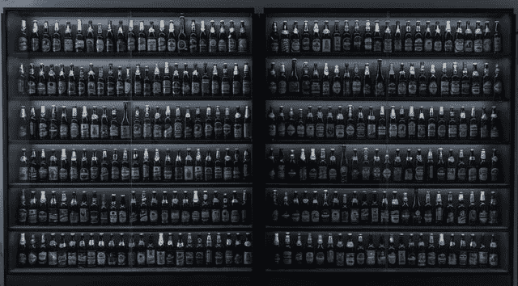
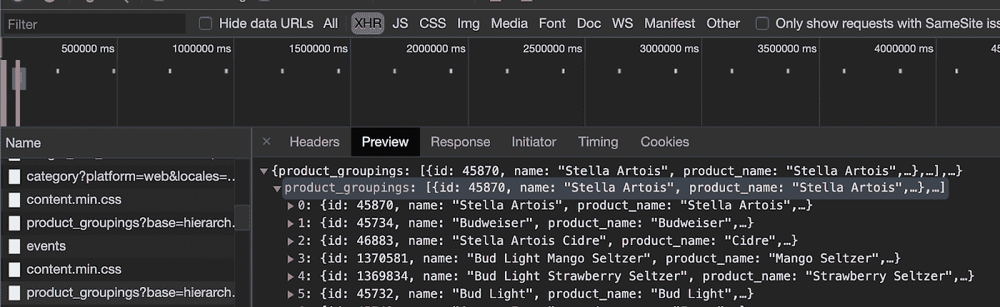
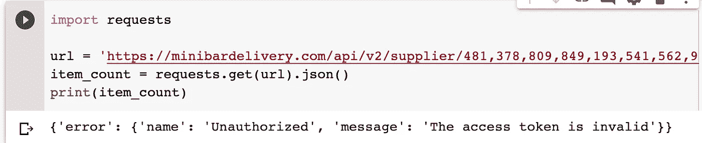
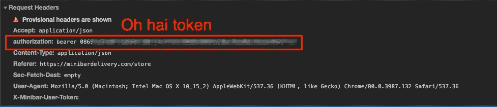
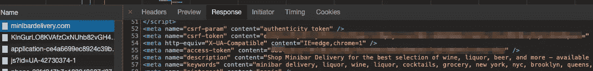
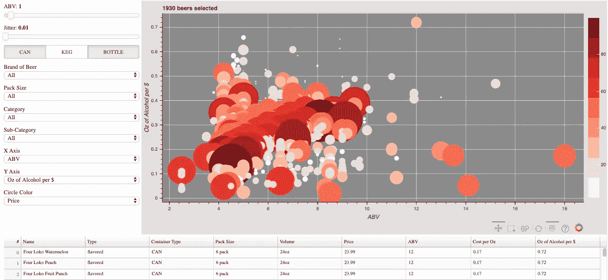
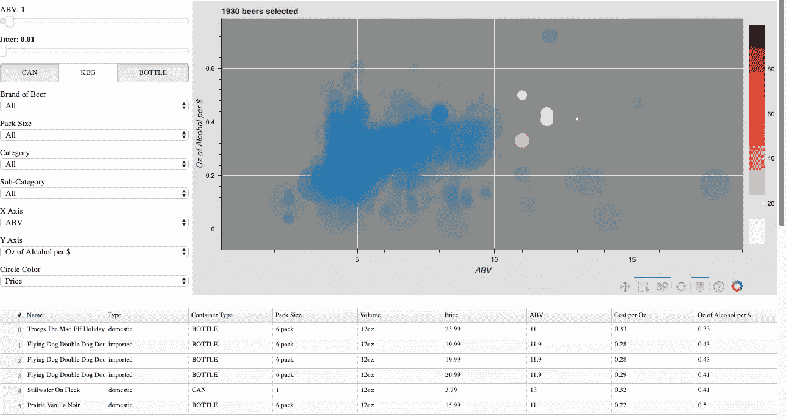

# 啤酒分析——从网络数据中分析啤酒价格的指南

> 原文：<https://towardsdatascience.com/beeralytics-a-guide-to-analyzing-beer-prices-from-web-data-37d4ba206071?source=collection_archive---------30----------------------->

## *使用散景在交货地点寻找价格最优惠的啤酒*



由[阿尔班·马特尔](https://unsplash.com/@albanmartel?utm_source=unsplash&utm_medium=referral&utm_content=creditCopyText)在 [Unsplash](https://unsplash.com/s/photos/beers?utm_source=unsplash&utm_medium=referral&utm_content=creditCopyText) 上拍摄的照片

几周前，我和女朋友在酒吧喝酒，开始争论菜单上最便宜的啤酒是什么。挑战本身是 20 种左右的啤酒有多种尺寸和酒精含量，这使得简单的比较成为一个挑战。赌注下好了，我们开始做手机数学(我发誓我们一直都这么兴奋),用一个基本公式来标准化它们:

> 奥兹。每$' =(('总盎司。'* '酒精%') / 100) /价格

这表明，高 ABV 的 IPAs 是你的钱的最大价值！现在我又输给了我的女朋友，我很好奇这是一个当地的选择(也许酒吧很难出售这种饮料)还是这种定价在规模上是一致的？这似乎是一个有趣的数据科学问题，所以我开始头脑风暴来回答这个问题。

10 年前，如果没有专有数据集或走访每家商店并记下所有价格，这可能是不可能的(我肯定店主喜欢这样)。相反，我们现在有过多的送货服务，如 Drizly 和 Minibar，它们通过当地商店提供啤酒送货服务。

本文的其余部分将介绍如何使用 Python [Requests](https://requests.readthedocs.io/en/master/) 库从网站中提取数据的方法、基于所提取数据类型的图表和库选择，以及使用 [Bokeh](https://bokeh.org/) 库的中级到高级可视化技术。下面解释的最终文件和代码可以在这里找到并分支。

# 数据争论

正如我在介绍中所说的，第一个挑战是捕获数据，以便我可以对其进行分析。两者都没有 API，所以我开始研究他们的网站和网络调用的结构，看看哪一个/哪一个是可行的。Drizly 有一种非常奇怪的方式将数据直接注入 react 组件，这样在网络调用中就不会有简单的 JSON 有效载荷(也许是为了混淆的目的？)，显然要花很多时间才能把它变成可用的形式。将焦点转移到 Minibar 上，我很快发现他们不仅有一个容易抓取的标准 JSON 有效载荷，而且还有一堆元数据，耶！



XHR 的 JSON 来电

一旦我发现了这一点，就可以使用 Requests 库来拉 JSON 了…或者我是这样认为的。创建一个简单的请求后，我遇到了一条错误消息:



告诉我你的秘密

嗯，这有点尴尬。运行`item_count.status_code`还确认了一个 [401 未授权错误](https://developer.mozilla.org/en-US/docs/Web/HTTP/Status/401)，这意味着我们的响应正确地到达了服务器，但是由于请求中缺少某种凭证而被拒绝。由于令牌不是凭空创建的，并且站点不需要登录，唯一合乎逻辑的结论是，一旦用户访问站点，就必须为会话创建令牌。这促使我检查上面提到的 XHR 请求的请求头部分，瞧，我发现了一个不记名令牌:



啊，缺失的拼图

一旦我添加了[头参数](https://requests.readthedocs.io/en/master/user/quickstart/#custom-headers)，我就能够确认这个工作并返回数据了！下一个挑战是弄清楚如何以编程方式获取不记名令牌并将其添加到请求中，因为令牌可能会在一定时间内自动过期。我的计划大致变成了:

1.  首先向[https://minibardelivery.com/](https://minibardelivery.com/)发出请求，因为它不需要特殊授权就可以访问并获取它给我的不记名令牌
2.  使用头有效负载中的载体向我的目标 JSON 目标发出请求
3.  循环遍历并将数据展平到一个数据帧中

在主页上很难找到持有人，因为它不在任何 XHR 请求中，而是作为一个元名称标签包含在内:



偷偷摸摸

那么如果它不在 json 中，我们如何获取它呢？简单，我们就当普通网页用[美汤](https://www.crummy.com/software/BeautifulSoup/)！这可以通过编写一个非常简单的函数来实现:

```
def get_token():
    url = '[https://minibardelivery.com'](https://minibardelivery.com')
    r = requests.get(url)
    soup = BeautifulSoup(r.text, 'html.parser')
    bearer_token = soup.findAll(attrs={"name":"access-token"})[0]['content']
    return bearer_token
```

如您所见，我们所做的只是向 Beautiful Soup 指定文本应该像 HTML 一样处理，然后告诉它返回 access-token 属性的内容。这使我们不用做任何复杂或容易出错的正则表达式来寻找令牌。既然我们可以随时动态获取数据，那么只需将它展平到一个数据帧中。

查看 JSON，许多啤酒都有“变种”(不同的价格取决于包装尺寸/特定商店的销售额/容器类型等。)我也想捕捉和对比。使用下面的代码，我能够根据初始调用中的 count 变量遍历所有的 beers，将每个变量添加为单独的行项目，然后将其输出到单个数据帧中

```
import requests
import pandas as pd 
import numpy as np
import time
from bs4 import BeautifulSoupdef get_token():
    url = '[https://minibardelivery.com'](https://minibardelivery.com')
    r = requests.get(url)
    soup = BeautifulSoup(r.text, 'html.parser')
    bearer_token = soup.findAll(attrs={"name":"access-token"})[0]['content']
    return bearer_tokenurl = '<the json url>'
bearer_token = get_token()
header = {'Authorization': 'bearer {}'.format(bearer_token)}
item_count = round(requests.get(url+str(1), headers=header).json()['count']/20)def alc_pct(x):
    if x is None:
        x = np.nan
    else:
        x = x['value']
    return xbeer_df = pd.DataFrame([])
for x in range(1,item_count+1):   
    time.sleep(3)
    data = requests.get(url+str(x), headers=header).json()
    for i in range(0, len(data['product_groupings'])):
        core_data = {key: data['product_groupings'][i][key] for key in data['product_groupings'][0].keys() & {'name','type','brand'}} 
        core_data['hierarchy_type'] = data['product_groupings'][i]['hierarchy_type']['name']
        core_data['hierarchy_subtype'] = data['product_groupings'][i]['hierarchy_subtype']['name']
        core_data['alcohol_pct'] = alc_pct(next((item for item in data['product_groupings'][i]['properties'] if item["name"] == "Alcohol %"), None))
        variant_df = pd.DataFrame([])
        for v in range(0, len(data['product_groupings'][i]['variants'])):
            variant_data = {key: data['product_groupings'][i]['variants'][v][key] for key in data['product_groupings'][i]['variants'][v].keys() 
                            & {'price','short_pack_size','short_volume','container_type','supplier_id'}}
            core_data.update(variant_data)
            variant_df = variant_df.append(core_data, ignore_index=True)
        beer_df = beer_df.append(variant_df)beer_df.to_csv('beer_data.csv')
```

一旦我的数据框中有了大约 2000 瓶啤酒，我就使用 [missingno](https://github.com/ResidentMario/missingno) 库来了解这些数据有多完整:


哎呀，酒精百分比

结果是，酒精百分比，我整个实验的关键，在很多啤酒中都找不到，大约是数据集的 3/5。固执和热情蒙蔽了我的双眼，我做了任何一个理性的人在这种情况下都会做的事情——我从商店里拿了一罐 6 罐装啤酒，然后花了几个小时手动输入我在搜索 https://untappd.com/[等网站时找到的数值。最终，我完成了啤酒和数据输入，并准备进入下一阶段。](https://untappd.com/)

# 选择正确的可视化

现在我们有了一个好的数据集，我们需要考虑如何有效地可视化数据。数据有定量和分类两个维度，我们想要比较诸如啤酒类型、容器类型等。针对不同的属性。考虑到任何给定点的潜在数据点的数量，散点图是一个很好的选择，因为它们能够轻松地显示模式和相关性趋势。我还知道我想用可视化来执行一些不同的高级交互:

*   我希望它是高度互动的，因为“最好”的啤酒可能是我再也不想喝的(看着你[眼镜王蛇](https://www.beeradvocate.com/beer/profile/29/66/))。我还想过滤和理解复杂的情况，如“价格最好的 IPA 6 包装，ABV 至少为 6%”
*   我希望能够将颜色映射到显示中的定量点和分类点。这将使得在查看不同度量时更容易识别模式成为可能。由于一些数据也是高度基数的，我想分配独特的颜色，而不是一遍又一遍地重新映射 10 或 20 种颜色。

在尝试了一些熟悉的简单图形库之后，我意识到如果没有一个高度灵活和可定制的库，这是行不通的。我最终选择了[散景](https://docs.bokeh.org/)，它不仅有一个巨大的预制图表库，还提供了一些很棒的例子——尤其是这个[移动评级一](https://demo.bokeh.org/movies)。我决定这一个将适合我的需要，只有小的调整，所以它是全速前进！

# 被散景弄得又脏又脏

我现在警告你，如果你想用散景做基本图形之外的事情，[阅读文档](https://docs.bokeh.org/en/latest/docs/user_guide.html)。一开始我很抗拒，结果我像一个迷路的孩子一样在 Stack Overflow 和 Google 上过滤了几个小时。理解在哪里访问和更新像字形这样的对象的结构以及`ColumnDataSource`如何更新数据是你应该尝试和理解的关键概念，而不要深入太多。

我的第二个免责声明是，这些代码中的一些可能效率不高，但如果我试图调整/理解它，我就永远不会发表这些。

# 脚手架

在浏览了他们网站上的一些例子后，大部分散景都很容易理解，而且我基本上是用电影的例子。要点中的想法是:

*   导入库和数据，创建所需的自定义指标，对数据集应用任何格式化/清理:

```
import os
import pandas as pd
from bokeh.io import curdoc
from bokeh.layouts import column, layout
from bokeh.models import ColumnDataSource, Div, Select, Slider, LinearColorMapper, ColorBar, CategoricalColorMapper, Legend, LegendItem, CustomJS
from bokeh.plotting import figure
from bokeh.transform import jitter
from bokeh.palettes import Reds9, Turbo256, d3
from bokeh.models.widgets import CheckboxButtonGroup, DataTable, TableColumndf = pd.read_csv('beer_data.csv')
df['brand'] = ['uncat' if str(x) == 'nan' else x for x in df['brand']]
df['hierarchy_type'] = ['uncat' if str(x) == 'nan' else x for x in df['hierarchy_type']]
df['hierarchy_subtype'] = ['uncat' if str(x) == 'nan' else x for x in df['hierarchy_subtype']]
df['total_oz'] = df['short_pack_size_num'] * df['standard vol']
df['cost_per_oz'] = round(df['price'] / df['total_oz'], 2)
df['oz_of_alcohol_per_dollar'] = round(((df['total_oz'] * df['alcohol_pct']) / 100) / df['price'], 2)
```

*   为轴和颜色选择创建字典。用户可以选择 x/y 轴以及颜色所基于的尺寸/度量:

```
axis_map = {
    "Oz of Alcohol per $": "oz_of_alcohol_per_dollar",
    "Cost per Oz": "cost_per_oz",
    "ABV": "alcohol_pct",
    "Pack Size": "short_pack_size_num",
    "Volume (Oz)": "standard vol",
    "Price": "price"}color_axis_map = {
    "ABV": "alcohol_pct",
    "Brand": "brand",
    "Container Type": "container_type",
    "Category": "hierarchy_type",
    "Sub-Category": "hierarchy_subtype",
    "Price": "price",
    "Pack Size": "short_pack_size",
    "Volume": "short_volume",
    "Supplier": "supplier_id",
    "Type": "type",
    "Oz of Alcohol per $": "oz_of_alcohol_per_dollar",
    "Cost per Oz": "cost_per_oz"}
```

*   创建工具提示格式，一个解释图表的描述部分，然后我们将在边上使用的小部件过滤器。然后，我们将为图形和表格创建一个 ColumnDataSource:

```
tooltips = [
    ("Name", "[@name](http://twitter.com/name)"),
    ("Brand", "[@brand](http://twitter.com/brand)"),
    ("Price $", "[@price](http://twitter.com/price)"),
    ("ABV", "[@alcohol_pct](http://twitter.com/alcohol_pct)"),
    ("Category", "[@hierarchy_type](http://twitter.com/hierarchy_type)"),
    ("Category Sub-type", "[@hierarchy_subtype](http://twitter.com/hierarchy_subtype)")]# Create description at top of webpage
desc = Div(text=open("description.html").read(), sizing_mode="stretch_width")# Create unique option lists for some of the widget filters
container_options = list(df['container_type'].unique())
pack_size_options = sorted(list(df['short_pack_size'].unique()))
hierarchy_options = sorted(list(df['hierarchy_type'].unique()))
sub_hierarchy_options = sorted(list(df['hierarchy_subtype'].unique()))
brand_options = sorted(list(df['brand'].unique()))for i in [pack_size_options, hierarchy_options, sub_hierarchy_options, brand_options]:
    i.insert(0, "All")# Create widget filters
min_abv = Slider(title="ABV", start=0, end=20, value=1, step=1)
jitter_amt = Slider(title="Jitter", start=0, end=1.0, value=0.1, step=0.1)
container_check = CheckboxButtonGroup(labels=container_options, active=[0, 2])
brand = Select(title="Brand of Beer", value="All", options=brand_options)
pack_size = Select(title="Pack Size", value="All", options=pack_size_options)
hierarchy = Select(title='Category', value="All", options=hierarchy_options)
sub_hierarchy = Select(title='Sub-Category', value="All",
                       options=sorted(sub_hierarchy_options))
y_axis = Select(title="Y Axis", options=sorted(axis_map.keys()),
                value="Oz of Alcohol per $")
x_axis = Select(title="X Axis", options=sorted(axis_map.keys()), value="ABV")
circle_color = Select(title="Circle Color",
                      options=sorted(color_axis_map.keys()), value="Price")# Create Column Data Sources that will be used by the plot and table
source = ColumnDataSource(data=dict(df))
table_source = ColumnDataSource(data=dict(df))
```

这看起来有很多代码，但主要是为过滤器创建唯一的列列表，将这些列表分配给小部件，并为过滤器设置默认值。

我们还将添加一个部分来创建图形、字形和最终图表所需的所有样式。我们在这里有一个条形图和图例，因为我们需要切换它们的可见性，以便在定量和分类选择之间切换:

```
p = figure(background_fill_color='black', background_fill_alpha=0.5,
           border_fill_color='gray', border_fill_alpha=0.25,
           plot_height=250, plot_width=500,               toolbar_location='below', tooltips=tooltips, tools="pan,box_select,wheel_zoom,reset,help",
           active_drag="box_select", active_scroll='wheel_zoom'))c = p.circle(x=jitter('x', width=jitter_amt.value, range=p.x_range),
             y=jitter('y', width=jitter_amt.value, range=p.y_range),
             source=source, size='price', line_color=None,
             fill_color={"field": color_axis_map[circle_color.value], "transform": cmap})bar = ColorBar(background_fill_color='gray', background_fill_alpha=0, color_mapper=cmap, location=(0, 0), visible=True)legend = Legend(items=[LegendItem(label=dict(field="x"), renderers=[c])],location=(10, -30), background_fill_alpha=0, visible=False)columns = [
    TableColumn(field="name", title='Name'),
    TableColumn(field="type", title='Type'),
    TableColumn(field="container_type", title='Container Type'),
    TableColumn(field="short_pack_size", title='Pack Size'),
    TableColumn(field="short_volume", title='Volume'),
    TableColumn(field="price", title='Price'),
    TableColumn(field="alcohol_pct", title='ABV'),
    TableColumn(field="cost_per_oz", title='Cost per Oz'),
    TableColumn(field="oz_of_alcohol_per_dollar", title='Oz of Alcohol per $')]data_table = DataTable(source=table_source, columns=columns, selectable=False)p.add_layout(bar, "right")
p.add_layout(legend, 'right')
```

完美！既然基础知识已经完成，我们可以进入更高级的概念了。

# 挑战 1 —色彩映射

我想做的事情之一是将分类数据或定量数据映射到图上的点。我希望颜色条也能根据定量数据进行调整，否则异常值(比如小桶的价格)会扰乱过滤数据的颜色分布。在没有深入基本问题的情况下，我的逻辑最终是这样的:

*   基于默认变量定义初始颜色映射。我选择了 price，所以我默认使用 Bokeh 的`LinearColorMapper`,但是如果我默认使用一个分类值的话，我会把它变成一个`CategoricalColorMapper`
*   创建一个`rescale_color`函数，在更新时将线性颜色映射重新调整到新的最小/最大过滤值
*   创建一个`categorical_color_scale`函数，将分类色标映射到提供的任何分类列表。我还添加了一个特殊的色标，用来更好地映射高度基数的数据(比如品牌)
*   创建一个`cat_linear_color_toggle`函数，在更新时确定颜色窗口小部件过滤器中的当前活动值是分类的还是定量的
*   创建一个`show_hide_legend`函数来切换颜色条(定量图例)和图例(分类图例)的可见性

```
def rescale_color(cmap, df):
    """Rescale the linearcolormapper based on the dataframe provided"""
    cmap.low = min(df[color_axis_map[circle_color.value]])
    cmap.high = max(df[color_axis_map[circle_color.value]])
    return cmapdef categorical_color_scale(color_list):
    """Returns a different size color scale based on color list size"""
    if len(color_list) < 30:
        colors = d3['Category20'][20]+d3['Category20b'][10]
    else:
        colors = Turbo256
    return colorsdef cat_linear_color_toggle(color_col, df):
    """Changes color scale based on whether color is displaying a quantitative
    or categorical value upon a transformation"""
    if df[color_col].dtype == 'float64' or df[color_col].dtype == 'int64':
        color_mapper = rescale_color(cmap, df)
    else:
        cat_list = list(df[color_col].astype(str).unique())
        color_mapper = CategoricalColorMapper(
            factors=cat_list, palette=categorical_color_scale(cat_list))
    return color_mapperdef show_hide_legend(attr, old, new):
    """Used for switching to and from categorical scale"""
    color_val = color_axis_map[circle_color.value]
    if df[color_val].dtype in (float, int):
        p.legend.visible = False
        bar.visible = True
    else:
        p.legend.visible = True
        bar.visible = False
```

现在我们已经有了更新色标/图例的框架，我们可以继续讨论一旦用户与我们的小部件过滤器交互，如何更新所有内容。

# 挑战 2 —更新图表和过滤数据

为此，我们将在很大程度上反映电影图表示例，但我将简要介绍一下这些概念。我们希望创建一个名为`select_beer()`的函数，它将为我们的小部件过滤器找到所有当前值，然后根据这些选择过滤数据集:

```
def select_beers():
    """Filter data source based on widget filter input"""
    container_check_val = container_check.active
    abv_val = min_abv.value
    brand_val = brand.value
    pack_size_val = pack_size.value
    hierarchy_val = hierarchy.value
    sub_hierarchy_val = sub_hierarchy.valueselected = df[df['alcohol_pct'] > abv_val]
    if (container_check_val != 4):
        container_name_list = [container_check.labels[i] for i in container_check_val]
        if len(container_name_list) == 0:
            container_name_list = container_options
        selected = selected[selected.container_type.isin(container_name_list)==True]
    if (brand_val != "All"):
        selected = selected[selected.brand.str.contains(brand_val)==True]
    if (pack_size_val != "All"):
        selected = selected[selected.short_pack_size.str.contains(pack_size_val)==True]
    if (hierarchy_val != "All"):
        selected = selected[selected.hierarchy_type.str.contains(hierarchy_val)==True]
    if (sub_hierarchy_val != "All"):
        selected = selected[selected.hierarchy_subtype.str.contains(sub_hierarchy_val)==True]
    return selected
```

我们要写的下一件事是一个`update()`函数，它将更新图形元素(例如轴的名称和所选啤酒的总数),以及更新`ColumnDataSource`,这是图形上的数据是如何更新的。它将通过调用`cat_linear_toggle`并更新图例，最终强制更新图例/色标。最后一点适用于新过滤数据的抖动:

```
def update():
    """Updates graph elements and source.data based on filtering"""
    filtered_df = select_beers()
    x_name = axis_map[x_axis.value]
    y_name = axis_map[y_axis.value]
    p.xaxis.axis_label = x_axis.value
    p.yaxis.axis_label = y_axis.value
    p.title.text = "%d beers selected" % len(filtered_df)
    color_select = color_axis_map[circle_color.value]source.data = dict(
            x=filtered_df[x_name],
            y=filtered_df[y_name],
            name=filtered_df["name"],
            brand=filtered_df["brand"],
            price=filtered_df["price"],
            container_type=filtered_df["container_type"],
            hierarchy_type=filtered_df["hierarchy_type"],
            hierarchy_subtype=filtered_df["hierarchy_subtype"],
            short_pack_size=filtered_df["short_pack_size"],
            alcohol_pct=filtered_df["alcohol_pct"],
            short_volume=filtered_df["short_volume"],
            supplier_id=filtered_df["supplier_id"],
            type=filtered_df["type"],
            oz_of_alcohol_per_dollar=filtered_df["oz_of_alcohol_per_dollar"],
            cost_per_oz=filtered_df["cost_per_oz"])
    table_source.data = source.datatransform_scale = cat_linear_color_toggle(color_select, filtered_df)
    c.glyph.fill_color = {"field": color_select, "transform": transform_scale}
    p.legend.items[0].label = {'field': color_select}
    if filtered_df[color_select].dtype in (float, int):
        bar.color_mapper = rescale_color(cmap, filtered_df)
    c.glyph.x = jitter('x', width=jitter_amt.value, range=p.x_range)
    c.glyph.y = jitter('y', width=jitter_amt.value, range=p.y_range)
```

在这之后，我们需要做的就是为我们所有的控件设置回调。最终输出与电影示例中的普通散景非常相似。我在末尾添加了一个`os.system(...)`,以便于在本地运行:

```
# Determine if legend type needs to change
circle_color.on_change('value', show_hide_legend)controls = [min_abv, jitter_amt, container_check, brand, pack_size, hierarchy,
            sub_hierarchy, x_axis, y_axis, circle_color]for control in controls:
    if (control == container_check):
        container_check.on_change('active', lambda attr, old, new: update())
    else:
        control.on_change('value', lambda attr, old, new: update())inputs = column(*controls, width=320, height=500)
inputs.sizing_mode = "fixed"
l = layout([[desc], [inputs, p], [data_table]], sizing_mode="scale_both")update()  # initial load of the datacurdoc().add_root(l)
curdoc().title = "Beer Plot"os.system("bokeh serve --show bokeh_scatter.py")
```

运行这一切让我第一次看到了我们放在一起的东西，不错！



最终的图形，过滤器，色标和数据表！

# 最终挑战—基于图形选择的过滤

在这一点上，我对输出感到非常满意，并认为我已经完成了，但是一旦我开始检查数据，我就试图突出显示图表上的点区域来过滤数据表。许多数据点相互重叠，如果没有办法看到底层的选择区域，就很难进行检查。散景图自然地通过它们的默认工具如`box_select`来处理图表上的数据选择，但是没有默认的方法来在数据表上反映这一点。

在阅读和搜索了更多相关信息后，我得出了一个不幸的结论，那就是使用默认库无法做到这一点……ughhhhh。幸运的是，Bokeh 允许通过 [CustomJS 模型](https://docs.bokeh.org/en/latest/docs/user_guide/interaction/callbacks.html#javascript-callbacks)使用 JavaScript，我需要完成的事情只需要很少的 JS 知识。我们想要做的如下:

*   当**源**数据上的**选择**发生变化时，创建一个执行定制 javascript 的回调
*   获取所选点的**指数**
*   如果 selection > 1，则创建一个空字典，然后用 source.data 中索引与索引匹配的数据填充
*   用新字典更新表格

```
# Use custom JS so that filtering on the graph affects the data table as well
source.selected.js_on_change('indices', CustomJS(args=dict(source=source, table_source=table_source), code="""
        var inds = cb_obj.indices;
        var d1 = source.data;if(inds.length == 0){
            table_source.data = d1
        }
        else{
        d2 = {'name': [], 'type': [], 'container_type': [],
              'short_pack_size': [], 'short_volume': [], 'price': [],
              'alcohol_pct': [], 'cost_per_oz': [], 'oz_of_alcohol_per_dollar': []}for (var i = 0; i < inds.length; i++) {
            d2['name'].push(d1['name'][inds[i]])
            d2['type'].push(d1['type'][inds[i]])
            d2['container_type'].push(d1['container_type'][inds[i]])
            d2['short_pack_size'].push(d1['short_pack_size'][inds[i]])
            d2['short_volume'].push(d1['short_volume'][inds[i]])
            d2['price'].push(d1['price'][inds[i]])
            d2['alcohol_pct'].push(d1['alcohol_pct'][inds[i]])
            d2['cost_per_oz'].push(d1['cost_per_oz'][inds[i]])
            d2['oz_of_alcohol_per_dollar'].push(d1['oz_of_alcohol_per_dollar'][inds[i]])
        }
        table_source.data = d2
        }
    """))
```

我们做到了！最终结果应该只显示数据表中反映的选定点，类似于我在图表上选择几个数据点时看到的内容:



选择被突出显示，表格被动态过滤

# 结论

我知道你可能在想什么——那真正的啤酒呢？！结果很少有惊喜，麦芽饮料品牌 4Loko(又名罐装电池酸)是我所在地区最便宜的，每盎司酒精 0.72 美元，比第二名挑战者每盎司便宜 0.10 美元。“酒精%”(ABV)被证明是价值的最佳基线预测值，您可以通过[探索性数据分析](/a-beginners-guide-to-grabbing-and-analyzing-salary-data-in-python-e8c60eab186e?source=friends_link&sk=343d0c494a90e460a0c57f8867f74743)或其他方式进行确认。

最终，您可能会做更多的事情，例如将额外的邮政编码区域或站点包括在此分析中，但是过多的丢失数据肯定会影响您在没有一些手动数据清理的情况下所能做的事情。使用散景也很有趣，但我不确定将来我会不会把它作为图形的首选。也许如果我正在做数据可视化的工作，我会考虑它，但是对于人们需要用图表显示的大多数东西来说，学习曲线是相当陡峭的。

希望这对任何人都有帮助，并随时联系或在下面评论问题/评论。感谢阅读！