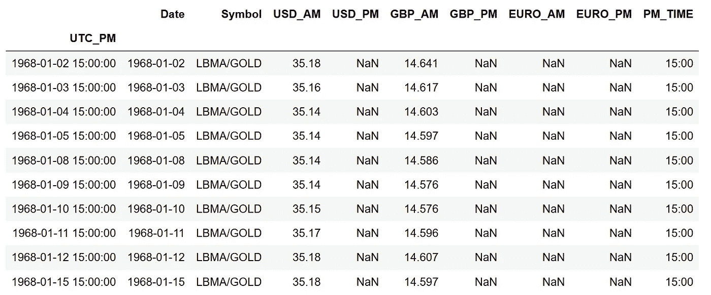
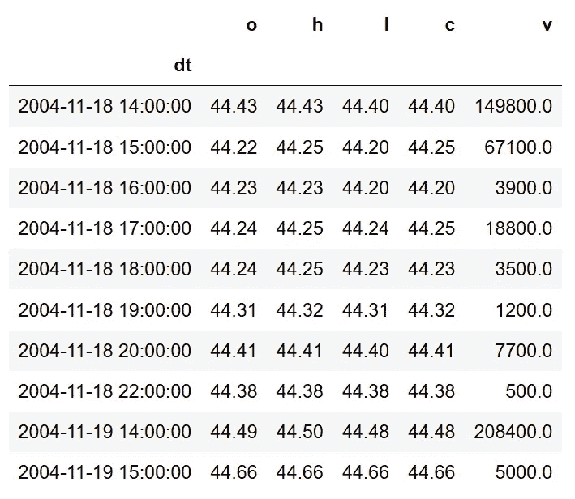
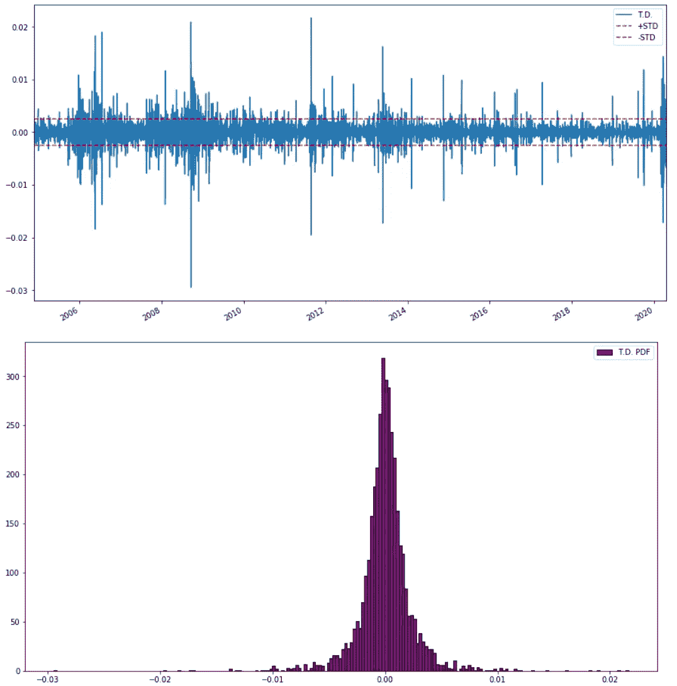
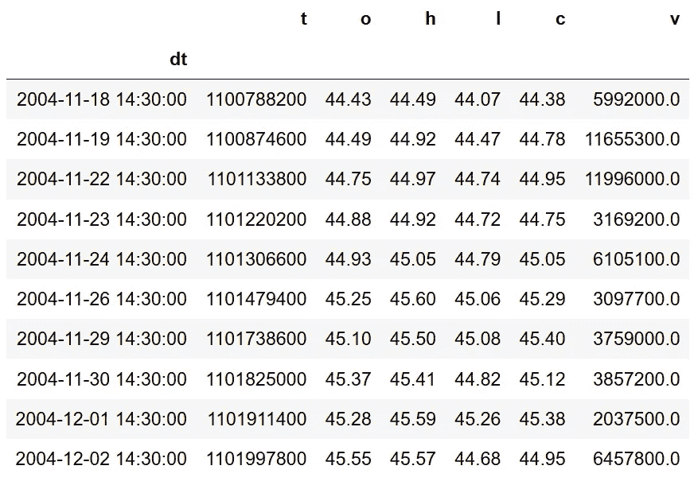
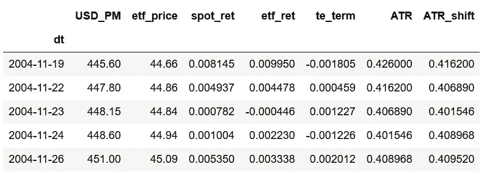
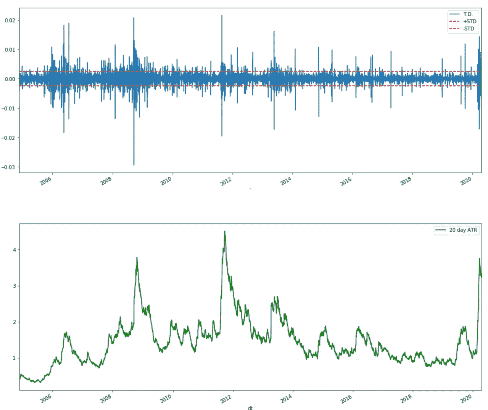
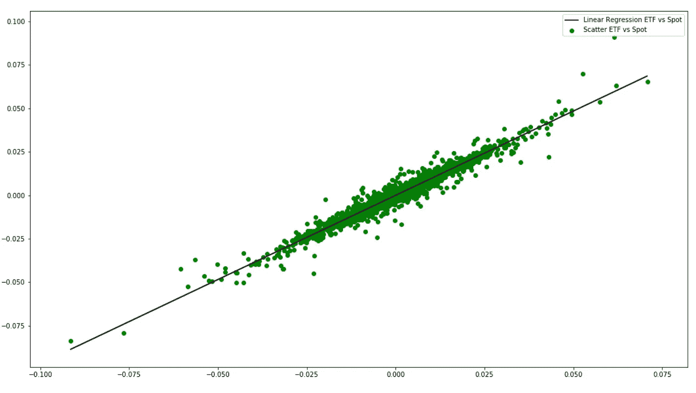
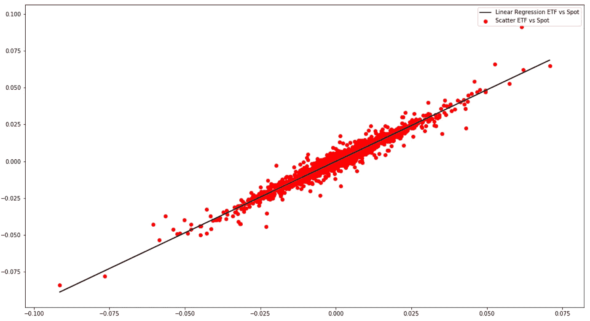

# 预测黄金之前:探索 ETF 的跟踪误差

> 原文：<https://towardsdatascience.com/before-predicting-gold-exploring-etfs-tracking-error-9e7c3bec4490?source=collection_archive---------36----------------------->

## 金的探索性数据分析

## 跟踪误差 EDA。使用 ETF 作为因变量的好处和注意事项。

> “作为人类，我们被五颜六色的树叶所吸引，有时很少注意对树的生命至关重要的根、茎和枝。这相当于做一个金融模型，一个定量分析师新手没有花足够的时间探索数据的复杂细节就匆忙开始建模过程。


来自笔记本的 LBMA PM Fix 和 GLD ETF

在这篇文章中，我将分享我个人做全球贵金属研究项目的经验。我的公司是贵金属市场的利基参与者，为潜在客户提供从销售和交易到储存和交付贵金属的全球端到端服务。他们的目标是“给传统的物理作业带来一些量化的实践”。我将参与这场革命，并帮助公司实现一种系统化的方法来将资金配置到黄金上。该公司可能不熟悉回归模型的数学成本函数，但他们知道黄金行业的机制。我总是对围绕这种两极分化的资产的大量信息和发现感到惊讶，这从第一天起就点燃了我的探索。

***我告诉自己“忘了建模吧，该学学黄金了”。***

***使用黄金交易所交易基金作为黄金现货价格的替代品进行建模有很多好处和警告。我还会提到基金跟踪误差的概念和偏离的潜在因素。跟踪误差存在于每一个跟踪基准的基金中。因为它的存在，人们不得不质疑黄金 ETF 是否能代表黄金的真实价值。它不仅给黄金模型制作者，也给投资者带来了警示。本文不会深入探讨跟踪错误的机制，但会引导您了解我的解决方法。***

***本文将在开发黄金模型之前解决以下考虑事项:***

*   ***我们的模型所基于的普通黄金资产，以及为什么 ETF 是一个可行的选择***
*   **计算/可视化不同黄金 ETF 的跟踪误差**
*   ***验证影响黄金 ETF 跟踪误差的因素***
*   ***根据跟踪误差选择黄金 ETF***

# 关于黄金选择的一点细节

所以我们想创造一个黄金投资模型。第一个问题是我们用哪种黄金资产建模。一些资产选择包括:

1.  实物黄金:伦敦黄金场外交易市场(LBMA)向投资者提供黄金这种有形资产。以这种方式持有黄金可以维持长期财富，而没有任何交易方风险。尽管 LBMA 位于伦敦，但市场可以在全球范围内交易。 [**LBMA 网站**](http://www.lbma.org.uk/lbma-gold-price) 保存了一些关于定价和交易条款的有用信息。
2.  **交易所期货合约**:期货合约交易者主要由套期保值者和投机者组成。套期保值者将买入/卖出他们希望持有的黄金的当前合约价格(在未来交割),并对冲到期日之前价格上涨/下跌的风险。投机者进行交易是为了从他们对价格运动的投机中获利，因为他们的目标不是持有实物黄金本身。
3.  **黄金追踪交易所交易基金(ETF)** :这类 ETF 通过持有实物黄金和期货合约来追踪现货黄金价格的回报。投资者将投资于 ETF 的股票。期货投机者和 ETF 投资者类似，因为他们交易黄金而不持有黄金。还有一些黄金 ETF 不直接投资于该商品，而是投资于专门从事黄金的公司。

# 那么用哪种黄金做模特呢？

> 假设你的目标是投资和储存黄金。黄金的分配将每周重新平衡。我们决定使用一个 ML 模型，通过每日观察来预测一周的回报方向。

使用期货价格是不可能的，因为我们既不对冲也不投机期货价格。我们可以将模型建立在 LBMA 现货价格的基础上，但是这种方法在构建我们的特征集时会带来一些问题。

**数据-时间对齐问题** — LBMA 每天两次在拍卖中设定黄金价格(工作日伦敦夏令时 **10:30** 和 **15:00** )。因此，只有每日**上午**和**下午**的价格数据。考虑这些场景:

*   **包含存在于不同时区的非伦敦 BST 市场指标**要求这些指标的生成时间与 AM 或 PM 价格相匹配。如果我们想使用 GC 期货的价格衍生品，那么我们必须在美国东部时间 10:00 对每日观察数据进行采样，以匹配伦敦夏令时 15:00。然而，并不是每个人都可以访问当天的数据，数据订阅会产生巨大的成本。想象一下，必须将 50 个基于美国的特征与现货金对齐。大多数美国经济指标都不是当天的，调整这些指标是不明智的。
*   **调整我们的投资组合**以包括其他资产，如现货白银(不同的 LBMA 结算时间)*将在投资组合回溯测试中造成障碍* *，因为现货价格不一致。我们也有向前/向后看的偏见的风险。*

**解决方案** — **这就是黄金 ETF 的用武之地。**因为我们的许多功能都是基于美国的(大多数模型都是这样)，所以使用在美国交易所交易的黄金 ETF 作为目标变量是明智的。与使用 LBMA 现货价格不同，现在时区是同步的，数据对齐过程变得更容易。你可能不得不使用一些日内数据，但是你减少了大量不必要的工作。此外，投资组合现在也可以通过使用白银 ETF 的价格作为现货白银的代理来进行调整。通过使用相应的收盘价，可以毫不费力地调整黄金 ETF 价格和白银 ETF 价格。

**然而，由于 ETF 的跟踪误差，与使用现货价格相比，使用 ETF 的价格作为代理会出现一些回溯测试滑动。**每个试图跟踪指数/资产的 ETF 都会有跟踪误差。好消息是，我们可以选择一只黄金 ETF，表现出可容忍的跟踪误差。

***总的来说，我们正在用最小的滑动来换取正确和干净的数据。***

# 导入数据和时区

对于后续的分析，我们将需要 LBMA 黄金固定和 ETFs 数据。我们知道这些时间序列位于不同的时区。为了适应性，我们将把所有时间序列标准化为 UTC，消除日光节约的细微差别。

我们导入 ***pytz*** 并定义时区实例:

```
import pytz
london_tz = pytz.timezone('Europe/London') ***# for LBMA fix***
est_tz = pytz.timezone('US/Eastern') ***# for ETFs***
target_tz = pytz.timezone('UTC') ***# target timezone***
```

我们从[**Quandl**](https://www.quandl.com/data/LBMA/GOLD-Gold-Price-London-Fixing)**下载 LBMA 黄金修复 CSV 数据，通过熊猫导入。数据来自 1968 年 1 月 2 日。通过使用 PM fix time，我们可以确保对应的 ETF 价格在市场时段(伦敦时间 15:00 相当于美国东部时间 10:00)。**

```
***#importing LBMA Gold Fix data***from datetime import datetime
import pandas as pd
lbma_gold = pd.read_csv('LBMA-GOLD.csv',index_col = 0,parse_dates=True).sort_index()***#creating gold settlement london pm time***
lbma_gold = lbma_gold.reset_index() 
lbma_gold['PM_TIME'] = '15:00'***#joining date and time***
dt = pd.to_datetime(lbma_gold['Date'].astype(str) + ' ' + lbma_gold['PM_TIME'])***#localize the datetime using london TZ and normalize using UTC TZ***
lbma_gold['UTC_PM'] = [pd.to_datetime(target_tz.normalize(london_tz.localize(x)).strftime("%Y-%m-%d %H:%M:%S")) for x in dt]lbma_gold = lbma_gold.set_index('UTC_PM')lbma_gold.head(10)
```

****

**UTC LBMA 金牌服务从笔记本中修复数据**

**处理 NaN 值的方法将在后面介绍。**

**接下来，我们将获取以下 ETF 数据进行分析:**

*   ****GLD-SPDR 黄金信托公司****
*   ****IAU-iShares 黄金信托公司****

**这些 ETF 在 NYSEARCA 交易所交易，并跟踪金条，这使它们成为衡量其表现的候选对象。我们将使用来自 [**、firstratedata.com**](https://firstratedata.com/)的分钟数据，这是一家可靠的各种资产的日内数据提供商。数据下载到每个跑马灯的多个文本文件中，并按日期范围分开。我们也将美国东部时间转换为 UTC 时区。**

```
***# function for loading txt files, input in a list of file names***
def load_etf(file_list):
    df = pd.DataFrame()for txt in file_list:
        ***#iterate and concat data***
        temp_df = pd.read_csv(txt,sep=',',header=None)
        temp_df.columns = ["dt", "o", "h", "l","c","v"]
        df = pd.concat([df,temp_df]) 

    df['dt'] = pd.to_datetime(df['dt'])
    df = df.set_index('dt')
    ***#sample to hourly, to speed up time normalization process***  
    df = resample_prices(df,freq='H').dropna() #sample to hour
    df = df.reset_index()
    ***#normalize to UTC* **  
    df['dt']  =  [pd.to_datetime(target_tz.normalize(est_tz.localize(x))
.strftime
("%Y-%m-%d %H:%M:%S")) for x in pd.to_datetime(df['dt'])]df = df.set_index('dt')return df
#==========================================================***# GLD***
gld = load_etf(['GLD_2000_2009.txt',
'GLD_2010_2019.txt','GLD_2020_2020.txt'])***# IAU***
iau = load_etf(['IAU_2000_2009.txt',
'IAU_2010_2019.txt','IAU_2020_2020.txt'])gld.head(10)
```

****

**笔记本中的 UTC GLD 数据**

# **计算跟踪误差和跟踪差**

**跟踪误差来源于跟踪差。根据 etf.com[T5的说法，跟踪差的定义是“ETF 的表现与指数表现之间的差异”。跟踪误差是指基金的总回报表现与其标的指数的总回报表现之间的跟踪差异的年化标准差。根据每日回报数据，可以通过找出指数回报和 ETF 回报之间的差异来计算每日观察的相应跟踪差异。由此，我们可以计算每日跟踪差异的年化标准差。](https://www.etf.com/etf-education-center/etf-basics/understanding-tracking-difference-and-tracking-error?nopaging=1)**

**我们现在将 LBMA 金牌 PM 修复与 GLD 保持一致。我们移除任何 NaN 行，而不是使用前端填充，因为我们希望我们的计算尽可能真实。**

```
lbma_gld = lbma_gold.merge(gld,how='inner',
left_index=True,right_index=True).loc[:,['USD_PM','o']].dropna()lbma_iau = lbma_gold.merge(iau,how='inner',
left_index=True,right_index=True).loc[:,['USD_PM','o']].dropna()
```

**下面是计算跟踪误差和创建一个新的有跟踪差的数据帧的函数:**

```
***# T.E.Function***
def tracking_error(dff):

    df = dff.copy()
    ***# spot and etf returns* ** 
    df['spot_ret'] = df['USD_PM']/df['USD_PM'].shift(1) - 1
    df['etf_ret'] = df['o']/df['o'].shift(1) - 1
    df = df.dropna()***# daily T.D.***
    df['te_term'] = (df['spot_ret'] - df['etf_ret'])
    ***# take annualized std of daily T.D.***
    te = df['te_term'].std() * np.sqrt(252)return(te,df)lbma_gld_te,lbma_gld_te_df = tracking_error(lbma_gld)
print("Spot vs GLD TE: " + str(lbma_gld_te * 100) + '%')lbma_iau_te,lbma_iau_te_df = tracking_error(lbma_iau)
print("Spot vs IAU TE: " + str(lbma_iau_te * 100) + '%')
```

****与 GLD 一起可视化****

```
import matplotlib.pyplot as plt
%matplotlib inline***# T.D. with std reference lines***
fig = plt.figure(figsize=(15,8))
lbma_gld_te_df['te_term'].plot(label='T.D.')
plt.axhline(lbma_gld_te_df['te_term'].std(), color='r',     
                        linestyle='--',label='+STD')
plt.axhline(-lbma_gld_te_df['te_term'].std(), color='r', 
                        linestyle='--',label='-STD')
plt.legend()
plt.show()***# T.D. probability density plot***
fig = plt.figure(figsize=(15,8))
plt.hist(lbma_gld_te_df['te_term'], color = 'purple', edgecolor = 
                        'black',bins = 200,label='T.D. PDF')
plt.legend()
plt.show()
```

****

**GLD 每日时间序列和 PDF 图**

****时间序列和 PDF 图中偶尔会出现时间峰值。理论上，它们代表了异常值，但实际上，它们反映了 GLD 的实证表现。****

**在下一节中，我们将调查 T.E .和建议因素之间的因果关系。**

# **影响热电势的潜在因素**

**以下是一些可能影响商品跟踪基金 T.E .的潜在因素:**

1.  ****基金费用率****
2.  ****波动性****
3.  ****期货滚动****

****费用率****

**每个基金都有一个费用比率费用。这是向投资者收取的管理费和运营费。潜在的情况是，费用越高，基金在跟踪指数时的表现差距就越大。让我们比较一下 GLD 和 IAU 的费用率和成本费用。众所周知，GLD 的费用率高于 IAU。此外，我们将仅使用 2017 年的数据来重新计算我们的 T.E 。,因为它将描绘与当前费用率更现实的关系。**

```
lbma_gld_te,lbma_gld_te_df =       
                     tracking_error(lbma_gld.loc['2017-01-01':])print("Spot vs GLD TE: " + str(lbma_gld_te * 100) + '%')lbma_iau_te,lbma_iau_te_df = 
                     tracking_error(lbma_iau.loc['2017-01-01':])print("Spot vs IAU TE: " + str(lbma_iau_te * 100) + '%')
```

*****成绩对比:*****

****费用率取自 ETF.com****

****GLD****

*****费用率:0.40%*****

*****(2017 年起):3.05%*****

*****(自成立以来):3.91%*****

*****IAU*****

*****费用率:0.25%*****

*****(2017 年起):2.95%*****

*****(自成立以来):3.87%*****

**结果表明，教育费用与费用率之间存在正相关关系。考虑到 GLD 较高的费用率，IAU 的 T.E .一直相对低于 GLD。**

****波动性****

**人们的假设是，当价格大幅波动时，基金将更难跟踪黄金的走势，从而造成回报之间的差异。让我们和 GLD 一起利用这一点。**

**我们将需要来自 [Finnhub.io](https://finnhub.io/) 的 GLD 每日数据来使用 Wilder 的 ATR 计算滚动波动率。Finnhub 提供了一个免费的 api，允许我们从一开始就获取股票/ETF 的每日数据。**

```
# fetch data from finnhub start and end date in unix timestamp
gld_daily = pd.read_csv('https://finnhub.io/api/v1/stock/candle?symbol=GLD&resolution=D&from=1009843200&to=1588291200&adjusted=true&format=csv&token=' + apikey)# extract UTC timestamp from unix timestamp
gld_daily['dt'] = [datetime.utcfromtimestamp(x) for x in        
                   gld_daily['t']]
gld_daily = gld_daily.set_index('dt')gld_daily.head(10)
```

****

**来自笔记本的 GLD 每日数据(Finnhub)**

**我们定义 ATR 函数和一个数据框架函数来创建一个新的数据框架，将现有的 T.D .数据框架与包含每日滚动 ATR 的数据框架合并。20 天的回顾用于定义波动性，相当于 1 个月的跨度。**

```
***# wilder's atr***
def wwma(values, n):
    **"""
     J. Welles Wilder's EMA 
    """**
    return values.ewm(alpha=1/n, adjust=False).mean()def atr(dff, n):
    data = dff.copy()
    high = data['h']
    low = data['l']
    close = data['c']
    ***# calculate true range***
    data['tr0'] = abs(high - low)
    data['tr1'] = abs(high - close.shift())
    data['tr2'] = abs(low - close.shift())
    tr = data[['tr0', 'tr1', 'tr2']].max(axis=1)

   ** *# find ewm of true ranges for n lookback***
    atr = wwma(tr, n)

    return atrdef make_atr_df(df,df_te,n=20):
    mdf = df.copy()
    mdf_te = df_te.copy()
    mdf['ATR'] = atr(df,n)

    ***# convert datetime to date***
    mdf_te['dt'] = list(mdf_te.reset_index()['index'].dt.date)
    mdf['date'] = list(mdf.reset_index()['dt'].dt.date)***# merge atr df with original tracking difference df***
    dff = mdf_te.merge(mdf,how='inner',left_on='dt',right_on='date')
.loc[:,['dt','USD_PM','o_x','spot_ret',                                                            'etf_ret','te_term','ATR']]

 ***# need shifting since vol of previous day will reflect on 
    # subsequent price on 10 AM next day***
    dff['ATR_shift'] = dff['ATR'].shift(-1) dff['dt'] = pd.to_datetime(dff['dt'])
    dff = dff.set_index('dt')

    dff = dff.rename(columns={'o_x':'etf_price'})return(dff.dropna())gld_atr_df = make_atr_df(gld_daily,lbma_gld_te_df,n=20)
gld_atr_df.head(10)
```

****

**笔记本中的组合数据帧**

****用 T.D .可视化波动****

```
fig = plt.figure(figsize=(17,7))
graph = gold_atr_df.copy()
graph['te_term'].plot(label='T.D.')plt.axhline(graph['te_term'].std(), color='r', linestyle='--',label='+STD')
plt.axhline(-graph['te_term'].std(), color='r', linestyle='--',label='-STD')plt.legend()
fig = plt.figure(figsize=(17,7))
graph['ATR_shift'].plot(color='green',label = '20 day ATR')plt.legend()
plt.show()
```

****

**波动性对交易时间的影响**

**这些图说明了 ETF 的价格波动对 T.D .的影响。当出现突然的波动峰值时，T.D .也会随后出现峰值。在最近的新冠肺炎疫情期间，黄金价格的熊市下跌导致新台币上涨。**这些是波动性和 ETF 表现之间因果关系的证据。****

****期货卷****

**许多商品交易所交易基金通过期货市场跟踪商品的价格。该基金将在交割日期前卖出附近的合约，以便**【滚动】买入下一个附近的合约。由于黄金期货的期货溢价性质，即使现货价格保持不变，期货价格上涨也会给 ETF 带来损失。我们不确定 GLD 是否存在这种机制，也不确定基金滚动合同的时间。下面的分析检验了我们的假设。****

```
*****# extract the day of date***
gold_atr_df['day'] = list(gold_atr_df.reset_index()['dt'].dt.day)**
```

****黄金期货合约的第一个交割日期是每个月的第一个交易日。**因此，假设 GLD 将在每月**的最后 10 天滚动其合约，考虑到某些天不是交易日。我们将数据框架分为 3 天范围:每月的 1 日至 10 日、11 日至 20 日和 21 日至 31 日。然后我们计算每个数据帧的时间长度。为了保证我们分析的可信度，我们每年迭代一次，计算每年的 T.E .并取每年值的平均值。前提是，我们的数据应该代表总体。****

```
*****# separate T.D. series by date ranges***
gld_te_1st_df = gold_atr_df[(gold_atr_df['day'] >= 1) & (gold_atr_df['day'] <= 10)]['te_term']
gld_te_2nd_df = gold_atr_df[(gold_atr_df['day'] >= 11) & (gold_atr_df['day'] <= 20)]['te_term']
gld_te_3rd_df = gold_atr_df[(gold_atr_df['day'] >= 21) & (gold_atr_df['day'] <= 31)]['te_term']***# extract unique years***
years = np.unique(gold_atr_df.index.strftime('%Y'))***# initiate list to store yearly T.E. for each series***
te_1st = []
te_2nd = []
te_3rd = []***# iterate through each year and calcualte T.E.***
for y in years:

    te_1st.append(gld_te_1st_df.loc[y].std() *np.sqrt(252))
    te_2nd.append(gld_te_2nd_df.loc[y].std() *np.sqrt(252))
    te_3rd.append(gld_te_3rd_df.loc[y].std() *np.sqrt(252))***# take the mean* **   
print(np.array(te_1st).mean())
print(np.array(te_2nd).mean())
print(np.array(te_3rd).mean())**
```

*******结果*******

*   *******第一至第十区间 T.E.: 3.26%*******
*   *******第 11 至 20 个区间 T.E.: 3.67%*******
*   *******第 21 至 31 个区间 T.E.: 4.02%*******

******我们的结果表明，随着日期范围接近月末，T.E .会增加。虽然 values 没有准确地推断出 T.E .的上升是由于期货滚动结算，但它表明存在一些导致基金表现不佳的交易/再平衡活动。至少，我们确信 GLD 在接近月底时会出现追踪困难。这为未来关于 T.E .上升的潜在月末活动提供了研究机会..******

# ****GLD vs IAU:哪一个更好？****

****我们现在将选择我们的候选 ETF。ETF 的价格将被选为我们预期 ML 模型的目标变量。****

****方法是计算每个 ETF 的回报对现货回报的敏感度。这种灵敏度被称为线性系数β。另一个要观察的指标是 R 平方，这是衡量 ETF 和黄金价格变动相关性的统计指标。越接近 1，基金表现越好。****

****我们对每个 ETF 数据框架进行线性回归，观察 R 平方和 Beta，并使用线性拟合可视化散点图。****

```
*****# Beta, R-Squared and plots***
def sensitivity_score(df,c):

    X = df['spot_ret'].values.reshape(-1,1)
    y = df['etf_ret'].values.reshape(-1,1)
    reg = LinearRegression(fit_intercept=False).fit(X, y)print(reg.score(X, y)) ***# R-Squared***
    print(reg.coef_[0][0]) ***# Beta coefficient***

    y_line = reg.coef_ * X ***# Regression line***

    fig = plt.figure(figsize=(18,10))
    plt.scatter(X,y,label='Scatter ETF vs Spot',color=c)
    plt.plot(X,y_line,label='Linear Regression ETF vs Spot',color='black')
    plt.legend()
    plt.show()sensitivity_score(lbma_gld_te_df,'green')
sensitivity_score(lbma_iau_te_df,'red')**
```

********

****GLD vs 即期回报+回归线****

********

****IAU vs 即期回报+回归线****

*******分数:*******

*   *******GLD:β= 0.955，R = 0.967*******
*   *******IAU:贝塔= 0.956，R = 0.97*******

****IAU 的分数略高于 GLD。仅基于相关性的标准，分数彼此如此接近，以至于我们可以使用 GLD 或 IAU。然而，IAU 的跟踪误差低于 GLD，这反映了 IAU 更好的长期表现。此外，IAU 的费用率低于 GLD，因此我们可以预期长期回报偏差较低。因此，这表明 IAU 可能是一个更好的模型候选人。****

# ****结论****

****我们已经走过了建立黄金模型的先验知识的过程。该流程的重点是分析您的黄金数据，并研究跟踪误差的小细节，从而为模型构建流程添加上下文。我们分析了基金跟踪误差的潜在因素，并提出了一种选择黄金 ETF 目标变量的方法。这里的要点是探索数据与构建高性能 ML 模型一样重要。****

*******未来考虑*******

*   *****对比其他黄金追踪 ETF 的结果*****
*   *****考虑流动性。流动性与买卖价差有直接关系，这一特征会导致回溯测试中的滑动*****

******联系人******

****[*领英简介*](https://www.linkedin.com/in/chayaponlee13/)****