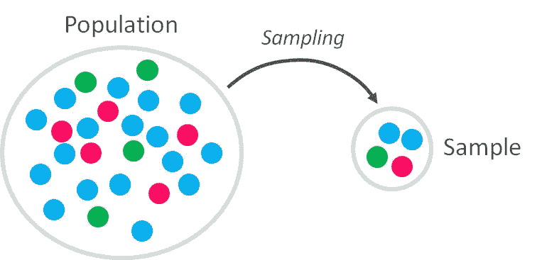
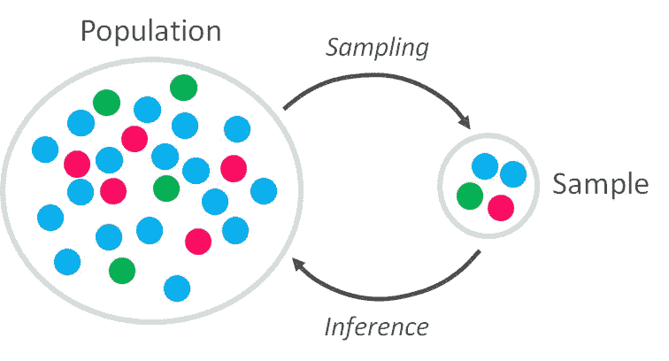

# 概率分布之前

> 原文：<https://towardsdatascience.com/before-probability-distributions-d8a2f36b1cb?source=collection_archive---------11----------------------->

## 为什么我们要使用概率分布，为什么它们很重要？

梅尔·普尔在 [Unsplash](https://unsplash.com?utm_source=medium&utm_medium=referral) 上的照片

我决定写这篇介绍概率分布的文章，目的很明确:解释我们为什么使用它们，并应用现实生活中的例子。学习概率时，我厌倦了听掷硬币、纸牌游戏和编号球。除非你只喜欢赌博(这不是我的情况)，你需要真正务实地应用概率概念来解决其他问题，而不是彩票中奖的几率。但是在陷入实用主义之前(这将是我们的第一次冲突)，我们需要经历一些概念上的事情。这篇文章描述了我们为什么关心概率，并且将帮助你发展一些关键术语，我们将需要这些术语来理解如何把它应用到我们的现实生活问题中。

> 概率是什么，我们为什么要关心它？

概率是关于解释和理解生活中的随机事件，由于我们生活在绝对的随机性中(即使我们试图相信我们没有)，它的有用性变得相当明显。**概率是某个随机过程发生某种结果的长期可能性。它基本上告诉你不同种类的事件发生的频率。**

使用概率的一些实际例子是:

*   **金融:**通过估计给定金融资产在特定范围内下跌的可能性，可以开发交易策略来捕捉预测的结果。
*   天气预报:气象学家不能准确预测天气，所以他们使用工具和仪器来确定下雨、下雪或冰雹的可能性。他们还检查历史数据库，以估计当天或一周的高温和低温以及可能的天气模式。
*   **保险:**概率在分析保险单以确定哪些计划最适合客户以及他们需要多少免赔额时起着重要作用。
*   **运动:**运动员和教练用概率来决定游戏和比赛的最佳运动策略。像 BWin 这样的公司已经以此为业，你甚至可以使用不同的策略下注。
*   **广告:**概率用于根据潜在客户的消费模式，估计他们更有可能对特定活动做出积极反应。

从数字上来说，概率是一个范围从 0(意味着事件不可能发生)到 1(意味着事件肯定会发生)的数字，如果你把所有可能的结果加起来，你的总和就是 1。概率值越大，事件发生的可能性越大。

所以比如你会说明天下雨的概率是 40%(表述为" *P(雨)=0，4"* )，或者某个特定地区发生汽车盗窃的概率是 2%(定义为" *P(汽车盗窃)=0，02* )。在第一种情况下，您对变量“雨”感兴趣，而在第二种情况下，您对变量“偷车”感兴趣。这些变量，以及任何其他随机过程的结果，被称为“随机变量”。

> **随机变量是一个受随机变化影响的变量，因此它可以呈现多个不同的值，每个值都有一个相关的概率**

它没有特定的值，而是潜在值的集合。在进行测量并显示具体值后，随机变量就不再是随机变量，而变成了数据。

当试图估计它们时，不同的概率呈现不同的复杂性。通常，过去的数据被用作可能发生的事情的代理，但这并不总是适用的(例如，对于没有历史的新事件)，或者在极端事件发生时可能具有误导性:想想 2011 年的[福岛事故](https://carnegieendowment.org/files/fukushima.pdf)，海啸的高度被低估了，因为概率计算导致了比实际发生的地震小得多的地震。也有不同的方法来计算概率(例如，使用计算机模拟，或收集数据并计算事件发生的时间百分比)，但所有这些方法都和你用来提供它们的数据一样好。

# 概率分布

**概率分布是一个随机变量所有可能结果的列表，以及相应的概率值。概率分布将随机变量或过程的每个结果与其出现的概率联系起来。例如，如果你在一个给定的地方采集不同个体的血液样本，你可以计算出他们血型的概率分布:**

你在这里做的是统计不同血型的个体数量，然后用每个血型组除以个体总数。这样你就能得到每种血型的概率。

在这种情况下，血型是随机变量。概率分布显示，A 型血的人发病概率最高，而 AB 型血的人发病概率最低。同样，如果你把不同的概率加起来，你会得到 1。你是怎么做到的？简单:你定义你要分析的随机变量(在这个例子中是“血型”)，你设置你要统计的类别(“O”、“A”、“B”和“AB”)，你统计每个类别中出现的次数。然后，你要么处理这个绝对数字(例如，150 例血型为“A”的病例)，要么用它除以病例总数(使它占总数的百分比，就像我们的例子一样)。

但是这里有一个技巧。当您估计随机变量(如血型或任何其他变量)的概率分布时，您实际上是在使用仅代表您正在分析的随机变量的真实行为的一部分的数据。你没有看到所有可能的数据值(用概率术语定义为**“群体”**)，因为你只从给定时间和空间的一个子集(称为**“样本”**)中获得数据。

样本是总体的子集

由于随机变量的值在分析它们的上下文中会发生变化，所以每次计算结果的概率时，您都需要获取数据的子集(采样)，并且由于您是在特定条件下进行的，这意味着如果您将来再次重复分析，您可能会得到不同的结果(由于变量的随机性)。有些值今天比其他值更有可能产生，但其他值可能在其他时间更有可能产生。这样，样本就是我们想要分析的人群的代表，但它永远不会与它 100%相同。

> 如果我们随时随地测量我们感兴趣的随机变量的所有可能结果，并捕捉它的真实行为，会怎么样？

我的答案是，如果你能做到这一点，那么你的问题就解决了:你可以绝对确定地计算所有结果的概率分布，理解你感兴趣的随机变量的行为，甚至更准确地预测它。然而，大多数情况下(如果不是一直的话),获取您感兴趣的全部数据是极其昂贵的(有时甚至是不可能的)。

举个例子:假设我们对 2000 个成年人进行调查，估计德国(+8000 万栖息地)赞成死刑的成年人比例。如果我们得出 60% (1.200)的被调查者是赞成的，是否可以得出 60%的德国人也是这么想的？显然不是。我们需要使用概率(和统计)工具从我们的样本中建立一个结论，或者获得全部数据，忘记那些烦人的概率概念。你能想象调查 8000 万人吗？

> 如果你只有有限的结果，而且它们的行为也是随机的，你怎么能描述你正在分析的随机变量的真实行为呢？

好了，现在我们知道，我们想要根据我们在分析中发现的东西(仅限于我们可以得到的样本)，对随机变量的“真实行为”得出可靠的结论(不仅在我们的样本中，而且在样本之外)。有没有一种方法可以概括这些结果，使它们具有代表性？

答案是肯定的，这个**概括掌握着预测**的秘密。如果您可以将特定随机变量的样本结果推广到总体，那么您就可以预测这些随机变量的行为。

# 预测的力量

有*概率分布模型*帮助你预测特定情况下的结果。当满足某些条件时，这些**概率分布模型**会帮助您计算每个结果概率、长期平均结果，并估计随机变量结果的可变性，而不需要您感兴趣的随机变量的所有实际结果。

这意味着有一种方法可以将你对随机变量的有限分析结果推广到更广泛的行为，这将帮助你节省时间和金钱，并获得更有信心的结果。许多概率分布模型存在于不同的情况下，关键是你必须选择一个适合你的数据，并帮助你解释你试图理解的正确的模型。

简单来说，**概率分布模型是你用来拟合随机变量以概括其行为的指南**。这些模型有数学背景，可能非常挑剔。为了使它们正常工作，**您试图拟合的随机变量必须满足不同的假设**，以便模型的结果具有正确的概率，并且您可以根据随机变量的真实数据来测试和验证模型。

## 随机变量的类型

到目前为止，我们一直在谈论随机变量，但有不同类型的随机变量。嗯…有意思，但是我们为什么要关心它呢？因为在定义应该选择哪种概率分布模型时，随机变量的类型是一个关键参数。

有两种主要类型的随机变量:

*   **离散随机变量:**是那些有有限或可数个可能结果的变量。你通过*计数*来计算它的值。

比如，想一想“某年某个地方的出生人数”。这是一个离散的随机变量，因为结果可能是 0，1，2…999 或任何其他值。你通过计数得到变量的值。在离散随机变量中，如果你选择任何两个连续的结果，你不可能得到一个介于两者之间的结果。

*   **连续随机变量:**有不可数的无限个可能值。你通过*测量*来计算它的值。

考虑“一个算法运行一项任务所需的时间”。时间通常被四舍五入到合适的间隔，比如秒或毫秒，但事实是它实际上是一个连续体:它可能需要 1.6666666…秒才能运行。体重，温度，价格，都是连续的随机变量。

在概率术语中，离散和连续随机变量是两种不同的生物，应该完全分开对待，它们中的每一个都有不同的概率分布模型。这意味着，如果你在处理一个离散的随机变量(例如，某一地区房主的手机数量)，你需要选择一个处理离散随机变量的概率分布模型(你不能选择一个只处理连续随机变量的模型)。

# 与统计数据共舞

概率与统计学有着密切的关系。事实上，它们是如此紧密地联系在一起，以至于谈论一个而不提及另一个几乎是不可能的。**统计学被应用于数据集，以确定表征它们的因素或属性**，从而获得关于它们的信息:它是一门与收集和解释定量数据有关的学科，它与概率相结合，使我们有可能对结果进行预测。

一个**统计是一个描述数据**的一些属性的数值度量，信不信由你，我们每天都在使用它们。例如，当你检查一个足球运动员的平均得分率(在统计学术语中称为“平均值”)，或在给定时期你的国家最受欢迎的新生男孩的名字(在统计学术语中称为“模式”)，你是在使用统计学。

> *统计中只描述数据的部分叫做* ***【描述性统计】*** *，而让你做出预测的部分叫做* ***【推断统计】*** *。*

均值、众数、中位数、方差、标准差，这些是你可以用来描述数据的一些统计数据，就像在概率中一样，除非你可以访问所有可用的数据(总体)，否则一个**“统计数据”**总是从一个样本中获得:如果你可以从总体中获得它，你会称它为一个**“参数”**。根据这些信息，可以建立预测模型，并在结果真正实现之前确定某些结果的**概率**。这样，你就可以用统计学来计算出某一事件发生的概率。

例如，如果你想知道你的假日飞机坠毁的几率(抱歉这个黑暗的例子)，你可以想到一年内通常有多少架飞机坠毁，由于这个数字非常小，你可以推断出你的飞机坠毁的概率也很小。在这里，您实际上是通过计算某个参数来应用统计数据，例如失事飞机的数量除以航班总数。或者，您可以使用统计数据，例如来自给定城镇的女性样本数据，对居住在城市等更大区域的大量女性(年龄范围相似)做出推断。

> 再说一次，我们这样做是因为估计或推断参数比处理现实生活更容易。我们需要统计学来描述我们的可用数据，理解它，然后将它与概率混合，以猜测“真实”(不可用)数据的行为。

这是因为统计数据是可观察的，是根据观察结果计算出来的，而总体参数是抽象的，是不可观察的，必须进行估计(除非您完全可以访问它)。

可以从样本中估计总体参数(推断)

> **那么，我们如何推断呢？**

随机变量的可能结果可以使用统计和概率以不同的方式进行估计:

1.  计算一个随机变量的*单个结果*的值(如股票价格均值的精确值)，称为**点估计**。
2.  估计一个随机变量*可能结果*的一个区间或范围(如股票价格均值的不同值)，称为**区间估计**。
3.  通过使用统计方法来确认或拒绝某个陈述，从而测试该陈述(相对于总体参数)的有效性。这种说法被称为假设，用于此目的的统计测试被称为统计**假设测试。**

这些方法依赖于概率分布的概念，因为您需要使用概率分布模型来进行推断和归纳您的结论。

# 最后的想法

概率分布有助于模拟我们的世界，使我们能够获得某一事件可能发生的概率估计，或估计发生的可变性。它们是描述和预测事件概率的一种常用方法。

主要的挑战是定义我们试图描述其行为的变量的特征，因为有必要确定什么分布应该应用于特定过程的模型。

正确分布的识别将允许模型(例如，标准化正态分布)的适当应用，该模型将容易预测给定事件的概率。

> *对这些话题感兴趣？关注我* [*Linkedin*](https://www.linkedin.com/in/lopezyse/) *或* [*Twitter*](https://twitter.com/lopezyse)