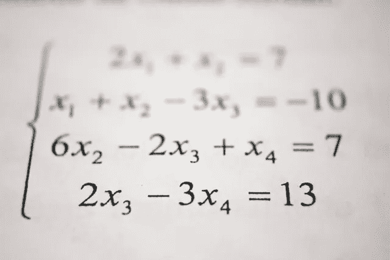

# 在您开始在线学习数据科学之前

> 原文：<https://towardsdatascience.com/before-you-start-learning-data-science-online-e82415ff8909?source=collection_archive---------40----------------------->

## 关于年轻有志者在线学习数据科学时犯的错误以及如何克服这些错误的笔记。

背景图片由[斯坦纳**恩格兰**](https://unsplash.com/@steinart)

我们每天产生超过 2.5 万亿字节的数据。仅在过去两年中，我们拥有的世界上 90%的数据都是由[[1](https://blazon.online/data-marketing/how-much-data-do-we-create-every-day-the-mind-blowing-stats-everyone-should-read/)创造的。于是，出现了很多与数据相关的领域。许多年轻的有志之士每天都开始学习数据科学。我见过我的朋友和其他人在学习它的时候开始犯错误。当我开始学习数据科学时，我也犯过错误。

有很多来自数据科学领域知名机构的伟大教授开设的令人惊叹的课程。很多年轻考生都犯过错误，至少有一次是在学习的时候。甚至你可能曾经犯过这些错误，或者希望有人在你开始学习数据科学之前告诉你这些事情。当我开始的时候，我没有意识到很多事情。我整理了一些人们在开始在线学习数据科学之前应该知道的要点。

## 在线课程不会教你领域知识

在解决任何问题之前，您需要拥有正确的领域知识。正确的领域知识将帮助您很好地理解数据集的特征，并帮助您构建分析数据集的方法来讲述其中的故事。大多数有志青年都忘记了这一点。领域知识是最容易被忽视的技能，但对初学者来说却是最重要的。但是人们应该意识到，花时间去了解这个领域和他们试图解决的问题是必要的。

> 领域知识是解决问题的第一步。这是整个解决方案所依赖的基础。

## 你需要理解数据集

在您匆忙寻找丢失的值或开始清理数据之前，请适当地查看数据集，并尝试很好地理解它。使用 pandas 库中的 describe()方法提取关于数据的更多信息，如平均值、标准差、第一个四分位数。从数据集中选取任何特定的示例，并使用特征来理解它。

图片由[斯科特·格雷厄姆](https://unsplash.com/@sctgrhm)

## 不要急于创建机器学习模型

许多初学者在预处理任何数据之前直接应用 ML 算法。任何人都可以写两到三行来训练算法和预测结果。数据科学家花费 80%的时间准备和管理数据。寻找异常值和相关性，填写缺失值。了解哪个功能影响最大。例如，如果你想解决一个分类问题，那么就要检查分类的不平衡。通俗地说，如果类不包含相同数量的例子，数据集就是不平衡的。例如，在一个二元分类任务中，我的 A 类占总数据的 99%，B 类占 1 %。不平衡的数据可能会导致所谓的过度拟合。

> 花时间准备和管理数据。在这个预处理中花点时间是没问题的。

## **在解作业之前理解已经写好的代码**

许多初学者通常会学习他们之前在课程的那一周所做的事情，并将其应用到数据中。例如，如果学生正在学习支持向量机(一种分类算法)。在作业中，如果学生必须训练和测试我的模型。大多数学生都会完成这项任务。他们不会注意到之前编写的关于预处理数据的代码。

## 不要羞于提问

论坛是提问的好方法。不要羞于提问。永远清除你的疑虑。任何人都不应该对提问感到尴尬。继续满足你的好奇心。

> 重要的是不要停止质疑。好奇心有它存在的理由。——阿尔伯特·爱因斯坦

## 如果你不懂算法，那就从头实现

如果你在理解一个特定的算法时有问题，那么最好的方法就是自己编写算法。在这个过程中，您将了解它，这将帮助您理解 scikit-learn 这样的库是如何工作的。

图片由 [Hitesh Choudhary](https://unsplash.com/@hiteshchoudhary) 提供

## 不要欺骗自己

当你做作业或测验时，不要抄袭互联网资源。如果你被任务困住了，那就慢慢来。而是你认为解决问题有多聪明，而不仅仅是为了一个证书。我学到的大部分东西都来自于被困在一个问题中。

图像由【JESHOOTS.COM】********

## ******以前的编码和数学知识是非常有益的******

******我不同意有人说学一些数据科学的课程不需要有编码方面的经验。有编码的基础知识有助于相处。他们以后可能会教你 Python/R，但是如果你正在某个课程中学习它，那么我会建议你在像 [HackerRank](https://www.hackerrank.com/) 、 [HackerEarth](https://www.hackerearth.com/) 这样的平台上解决问题，以获得更多关于特定语言的经验，这样以后如果你使用任何像 matplotlib、NumPy 这样的库，你就可以轻松地编写它的代码了。如果你不知道基础数学，那么不要担心，YouTube 上有很好的资源可以学习。如果你想学微积分，那么我会推荐 [3Blue1Brown](https://www.youtube.com/channel/UCYO_jab_esuFRV4b17AJtAw) 的微积分、线性代数频道，以及 [Stat Quest](https://www.youtube.com/user/joshstarmer) 的统计学频道。对于希望开始学习数据科学数学的初学者来说，它们是极好的。******

************

******图片由 [Antoine Dautry](https://unsplash.com/@antoine1003) 提供******

## ******不要满足于 ML 算法的初始结果******

******您可以随时调整各种算法的值来改进您的模型。不要满足于模型的初始结果。始终使用超参数调整来获得更好的结果。许多算法允许您更改它们的超参数值，如 K 最近邻算法允许您更改可能会改善结果的邻居数量。记住你总是可以表现得更好。******

## ******永远不要停止学习******

******完成任何在线课程后，不要停止学习。在线课程将帮助你建立坚实的基础，但你必须不断学习。不断寻找各种数据集，练习。实践是做好任何工作的关键。不断查看各种博客帖子、笔记本、视频、研究论文，以了解更多信息。永远不要限制自己做任何事。作为一名数据科学家，你需要不断学习新技术。不要放弃。******

************

******图像由[元素 5 数字](https://unsplash.com/@element5digital)******

## ******参考资料:******

******[1] blazon，[我们每天创造多少数据](https://blazon.online/data-marketing/how-much-data-do-we-create-every-day-the-mind-blowing-stats-everyone-should-read/) (2019)******