# 初学者指南，在 10 分钟内构建、比较和评估机器学习模型

> 原文：<https://towardsdatascience.com/beginner-guide-to-build-compare-and-evaluate-machine-learning-models-in-under-10-minutes-19a6781830de?source=collection_archive---------35----------------------->

## 通过 Python 示例笔记本，探索构建机器学习模型的主要步骤。

初学者指南，在 10 分钟内建立、比较和评估机器学习模型。约书亚·索蒂诺在 [Unsplash](https://unsplash.com/s/photos/data-science?utm_source=unsplash&utm_medium=referral&utm_content=creditCopyText) 上拍摄的照片

本笔记本的目标是给出构建和评估机器学习模型的步骤的高级概述。这是通过将每一步总结成最短的形式来完成的，所以请记住，在现实生活中，每一步都要复杂得多。

*你可以跟着一起过来* [*完整笔记本*](http://jooskorstanje.com/Machine_Learning_Example_Under_10_Minutes.html) *。*

## **机器学习的步骤**

1.  **数据准备—** 检查并准备数据集
2.  **定义模型验证策略—** 在训练、验证和测试集中拆分数据
3.  **模型开发—** 使用 Python 中的 sklearn 库构建三个不同的模型:随机森林、决策树、逻辑回归。
    **模型评估和微调**使用 [GridSearch](/gridsearch-the-ultimate-machine-learning-tool-6cd5fb93d07) 交叉验证
4.  **型号选择**
5.  **最终模型评估**

## 步骤 1:数据准备

对于这个项目，我将使用现有的网络安全数据集。该数据集的目标是预测某个连接是否是网络攻击。

数据集包含许多历史连接数据。对于这些连接中的每一个，已经注册了关于它们的不同变量。我们还有一个变量来表示连接是否危险(网络攻击)。

目标是开发一个能够“学习”如何区分正常连接和危险连接的模型。我们还不知道如何做到:我们的机器学习模型将不得不学习这一点。

这一行的结果:scikit learn 获取数据集。

下面我们看到了数据的快速打印。第一列给出了关于连接类型的信息，其他列是关于连接的数字信息(参见 [kddcup99](http://kdd.ics.uci.edu/databases/kddcup99/kddcup99.html) 以获得关于变量内容的更多详细信息)。

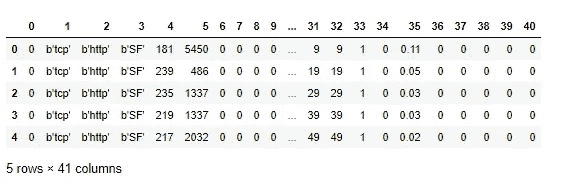

这一行的结果:我们数据的前 5 行。

在现实生活中的机器学习案例中，我们需要检查这些数据，并找出我们应该使用哪些变量，或者我们应该明确忽略哪些变量。但这是一个简单的例子，所以我们按原样取数据，看看我们在 10 分钟内可以获得什么样的精度。因此，我们删除了关于连接类型的列，并且我们以相同的方式对待每种类型的连接。

我们还检查了因变量，我们注意到它不是我们想要的数字 1 对 0 格式。让我们改变这一点。

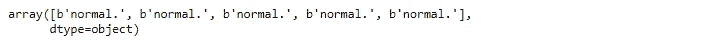

这是目标变量的格式。我们想把它转换成 0 和 1。

为了快速了解数据，我们在数据中绘制了攻击和正常连接的计数。请注意，我们的数据是有偏差的，因为“攻击”连接比正常连接多得多。

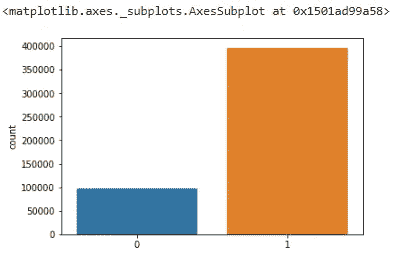

正常(0)连接和攻击(1)连接的最终分布不是 50–50。

## **第二步:定义模型验证策略:训练验证测试分割**

为了验证任何预测模型，我们最好将一部分数据分开。当完成开发一个模型时，我们将能够在这个测试数据上应用它。这允许我们在实际部署模型之前，测量我们的模型在现实生活中的效果。

我们有很多观察结果，所以我们可以允许分成三个部分:训练、验证、测试。在数据较少的情况下，我们通常一分为二:训练和测试。

*   *训练数据*:用于开发 3 个模型，并通过超参数调谐(网格搜索)进行微调
*   *验证数据*:用于型号选择
*   *测试数据*:用于对我们的分类模型的样本外精度有一个客观的最终估计

## **第三步:模型开发**

在模型开发步骤中，我们将构建三个不同的模型，并应用 [GridSearch](/gridsearch-the-ultimate-machine-learning-tool-6cd5fb93d07) 进行超参数调整。实际上，测试三个模型是您应该测试的最少模型数量。尝试更多的模型有更高的机会找到一个伟大的结果！

我们将使用的三种模型是:

*   随机森林
*   决策图表
*   逻辑回归

除了玩模型的选择，我们还可以玩每个模型的超参数的选择。有一种自动化的方法可以测试大量的超参数组合，并保留最佳评分超参数组合:[网格搜索](/gridsearch-the-ultimate-machine-learning-tool-6cd5fb93d07)。

将使用 GridSearchCV 调整以下超参数:

*   对于随机森林:“最大特征”
*   对于决策树:“最大特征”和“最小样本分割”
*   对于逻辑回归:“C”

**步骤 3a:随机森林超参数调整**

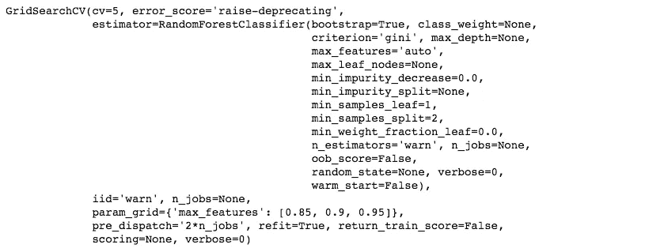

**步骤 3a 结果:对验证数据应用随机森林并打印 roc_auc_score**

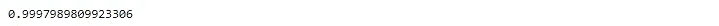

99%很高！

**步骤 3b:决策树超参数调整**

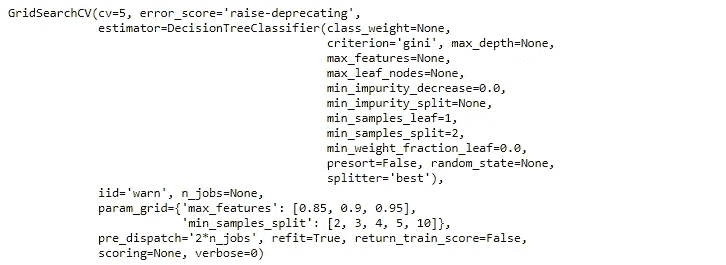

**步骤 3b 结果:对验证数据应用决策树并打印 roc_auc_score**

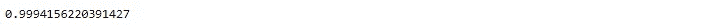

也 99%，也很高！

**步骤 3c:逻辑回归超参数调整**

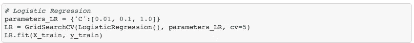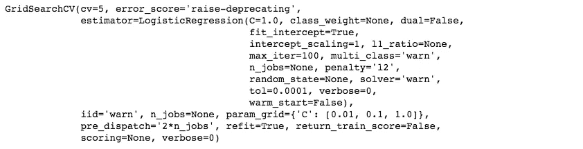

**步骤 3c 结果:对验证数据应用逻辑回归并打印 roc_auc_score**

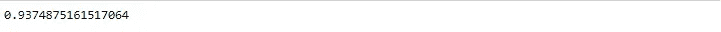

94%也高，但是有点不太好。

## **第四步:在验证数据集上选择性能最佳的模型**

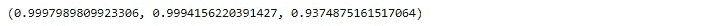

根据 GridSearch 的分数，选择的模型将是随机森林！

## **步骤 5:精度的最终估计:将选择的模型应用于测试数据**

为了获得随机森林准确性的最终估计，我们将其应用于测试数据。这为我们提供了一个新的准确度分数，该分数可能更接近于从任何新的(外部)数据中获得的分数。

分数相差不大，可以保留模型。

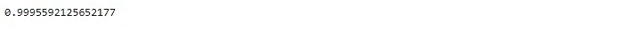

*虽然机器学习建模的实际过程比这要复杂一点，但我希望这篇文章确实对需要采取的不同步骤进行了很好的高层次描述。记得你可以跟着* [*一起把*](http://jooskorstanje.com/Machine_Learning_Example_Under_10_Minutes.html) *的完整笔记本拿过来。希望你喜欢这篇文章。感谢阅读，不要犹豫，继续关注更多！*