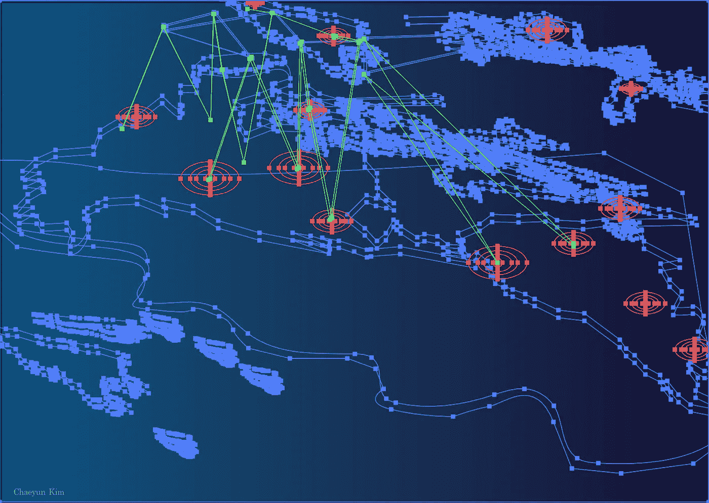
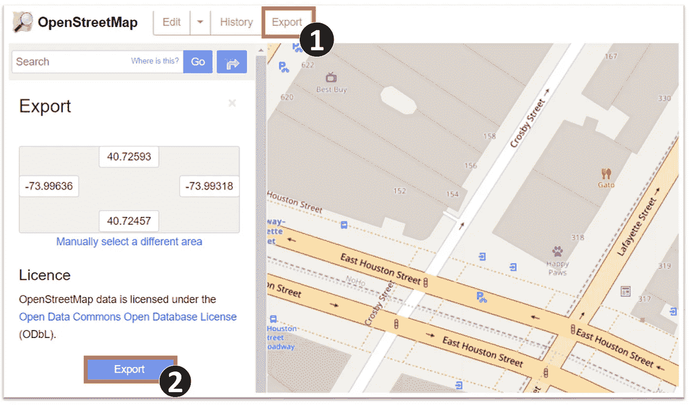
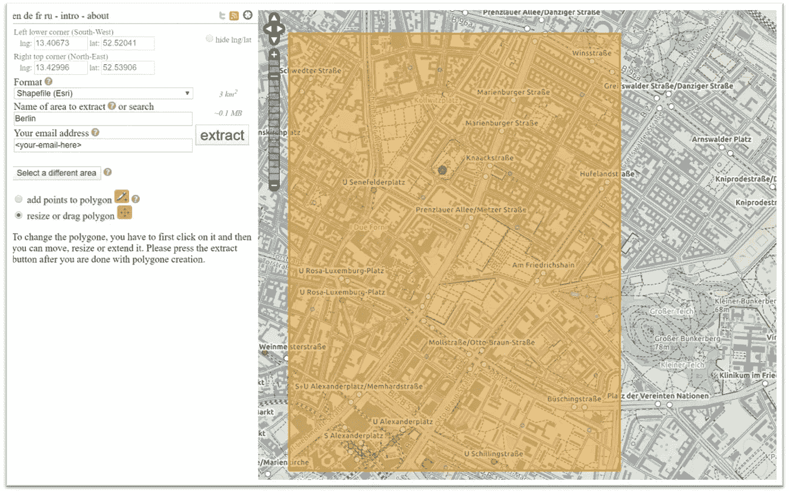
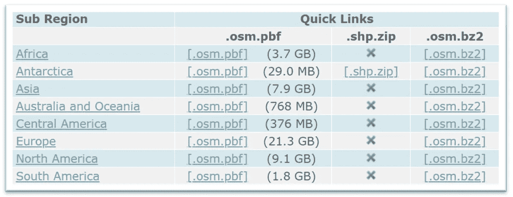
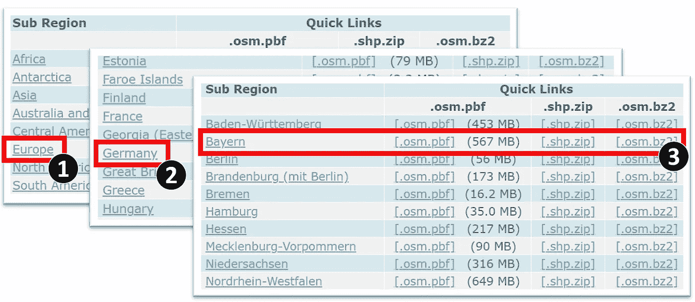
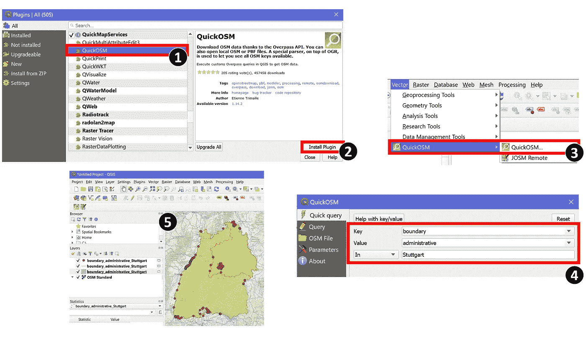

# 如何从 OpenStreetMap 下载数据集？

> 原文：<https://towardsdatascience.com/beginner-guide-to-download-the-openstreetmap-gis-data-24bbbba22a38?source=collection_archive---------9----------------------->

## 面向所有人的开源 GIS 数据



插图作者:金彩云

# 为什么选择 OpenStreetMap？

## 它是免费的。💸

有许多可用的地图提供商，如**谷歌、OS Survey、Mapbox、**等等。但是数据是有版权的，达到限额后你要为你使用的东西付费。而 **OpenStreetMap(OSM)** 对每个人都是免费的，没有任何隐性费用。它是在[开放数据公共开放数据库许可](https://opendatacommons.org/licenses/odbl/1.0/) (ODbL)下许可的。每个人都可以自愿贡献数据，每个人都可以免费使用这些数据！

## 获取原始数据！📂

大多数商业地图提供商不会让您访问地图背后的数据。使用 **OpenStreetMap** ，您可以完全访问数据库，并且可以提取所需位置的原始 GIS 数据。

## 全球数据覆盖🌍

世界各地成千上万的贡献者不断更新数据，使 OpenStreetMap 成为覆盖世界各地的最新 GIS 数据库之一。

# 从 OpenStreetMap 获取 GIS 数据

有几个在线工具可以从 OpenStreetMap 数据库下载 GIS 或地图数据。在这些工具中，您可以根据所需的输出数据格式、大小和要求的边界区域来选择它们。

## 案例 1:如果您需要一个带有指定边界框的小型 GIS 数据集。

在这种情况下，您可以直接从主[**OpenStreetMap**](https://www.openstreetmap.org)网站获取数据，非常快速简单，虽然输出数据格式和大小有限。它允许您在*中导出 GIS 数据。osm* 格式，面积限制为 0.25 度( )平方(例如 1 x0.25 或 0.5x0.5 等)，其中 1 约为 69 英里或 111 公里。如果您的项目需要更大的数据，请使用其他可用的工具。



从 https://www.openstreetmap.org/[导出 OSM 数据](https://www.openstreetmap.org/)

要提取数据，你只需浏览到 **OpenStreetMap** 网站，像任何其他网络地图一样使用搜索、平移、缩放工具找到你想要数据的区域。然后，使用顶部工具条菜单上的**导出**工具，在导出数据前确认边界框区域。就是这样！

如果在某处保存了边界框区域，还可以使用以下结构直接构造对 OpenStreetMap API 的 HTTP 调用，以下载 OSM 数据:

```
https://api.openstreetmap.org/api/0.6/map?bbox=**<min long>**, **<min lat>**, **<max long>**, **<max lat>**
```

无论哪种方式，都会得到*中所选区域的数据。osm* 格式。如果想要其他数据格式，请使用其他工具。

## 情况 2:如果您需要一个具有指定边界框的较大 GIS 数据集。

现在，假设您的项目需要更大的数据，您可以使用 [**BBBike Extract**](https://extract.bbbike.org) 服务提取指定边界框区域的 GIS 数据。该 web 应用服务允许您提取和下载多种格式的 OSM 数据，包括 *OSM* 、 *PBF* 、 *Garmin* 、 *Shapefile* 、 *mapsforge* 、 *OsmAnd* 、 *SVG* 、 *GeoJSON* 、 *SQL* 等。每个请求的最大请求大小为 512 MB，处理大约需要 2-7 分钟。



BBBike 摘录 Web 界面

要使用这项服务，你只需要在地图界面中平移或缩放到你想要的区域，并绘制出你需要的区域的边界框区域。然后，点击**提取**按钮，等待您的结果，您可以在[https://download.bbbike.org/osm/extract/](https://download.bbbike.org/osm/extract/)看到您的数据提取状态

## 案例 3:如果您需要特定行政区域的 GIS 数据集。

如果您需要世界上任何特定行政区域的 GIS 数据， [GeoFabrik 下载服务器](http://download.geofabrik.de/)将是您的正确选择。它提供每天更新的现成 GIS 数据，并允许您下载不同级别的数据，包括洲、国家、州和更小的级别。该工具为您提供了中的数据。面向全球的 osm 格式和面向小型数据集的 *ESRI 形状文件*格式。访问该网站后，您会在页面的左下角找到可用数据的表格列表。您可以选择直接从各大洲下载 *.osm.pbf* 或 *.osm.bz2* 格式的数据。



GeoFabrik 下载服务器中的可用区域列表

或者如果你只需要特定的子区域，比如德国拜仁州某个地区的数据，你可以通过子区域菜单*欧洲* > *德国* > *拜仁*简单选择。更深层次的数据可以在*下载。osm* 和 *ESRI shapefile* 格式。



GeoFabrik 下载服务器中的子区域区域数据

或者，如果您想要使用 *GeoJSON* 格式的数据，您可以使用 [**OSM 跨线提取**](https://www.interline.io/osm/extracts/) 工具以相同的方式提取数据，但其数据覆盖范围较小。

## 案例 4:如果你需要一个完整的 OSM 数据集。

如果您的项目需要一个完整的 OSM 数据集并使用数据库，请随时前往 [**行星 OSM**](https://planet.openstreetmap.org/) 服务，您可以找到并下载整个 OSM 数据集。它有一个压缩的 *XML* 文件(超过 88GB)和一个定制的 *PBF* 格式文件(超过 50GB)。你可以点击 查看用于处理这些 OSM 文件类型 [*的工具列表。此外，历史 OSM 数据集也可用于此源。更多关于 OSM 星球的数据和网络可用性的信息可以在*](https://wiki.openstreetmap.org/wiki/Databases_and_data_access_APIs) *[*这里*](https://wiki.openstreetmap.org/wiki/Planet.osm) 找到。*

## 案例 5:如果您想要查询部分 OSM 数据集。

您可以看看 [**立交桥 API**](https://wiki.openstreetmap.org/wiki/Overpass_API) 来查询您需要的部分 OSM 地图数据。如何使用立交桥 API 的教程在 [*这里*](https://wiki.openstreetmap.org/wiki/Overpass_API/Overpass_API_by_Example) 有。你可以在 [**天桥 Turbo**](http://overpass-turbo.eu/) 上试试，作为直接通过 web 查询 OSM 数据的界面。

如果您已经在使用 QGIS 软件，您可以尝试使用 **QuickOSM** 插件来轻松查询您需要的特定数据集。在后端，该插件使用 trans 过场 API 下载查询到的 OSM 数据，并将数据转换为 *QGIS 矢量图层*。假设您的机器上已经安装了 QGIS 的更新版本，让我们来看看如何安装和使用 **QuickOSM** 插件的基本指南:



如何使用 QuickOSM 插件 QGIS 软件的基本指南

1.  打开 QGIS 软件后，在插件菜单中找到名为 **QuickOSM** 的插件。
2.  安装插件！！
3.  安装完成后，你会在 Vector 菜单栏中找到这个工具。
4.  查询你需要的数据。例如，上图显示了对斯图加特地区行政边界的查询。然后，等待插件下载完数据。如果你愿意，你也可以在查询标签中使用天桥 API。
5.  搞定了。数据图层被添加到 QGIS 中。请注意，您应该将项目坐标系设置为 WGS 84/伪墨卡托(EPSG:3857)以使用 OSM 数据集。

请注意，您还可以使用任何其他选项来下载 GIS 数据，因为 QGIS 默认支持 OSM 矢量文件。

## 案例六:还有什么？🤔

如果你熟悉 Python3 或 Docker，想为你的项目自动化一些流程，可以使用 OpenMapTiles[**download-osm**](https://github.com/openmaptiles/openmaptiles-tools#multi-streamed-osm-data-downloader)工具下载指定位置或整个星球的 osm 数据。如果你热爱 Java，请查看一下 [**渗透**](https://github.com/openstreetmap/osmosis) repo，这是一个用于处理开放街道地图数据的命令行 Java 应用程序。

## 作者消息:

大概就是这样。有多种工具可用于从 OSM 提取或下载 GIS 数据。我希望这篇文章能帮助你找到适合你的项目的合适的工具或方法。如果你有任何问题，请随时给我发信息。

关于我&查看我所有的博客内容:[链接](https://joets.medium.com/about-me-table-of-content-bc775e4f9dde)

**平安健康！**
**感谢阅读。👋😄**