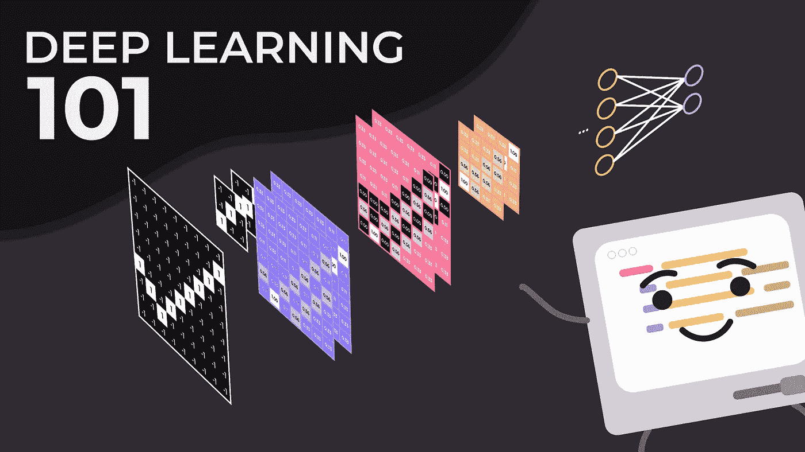
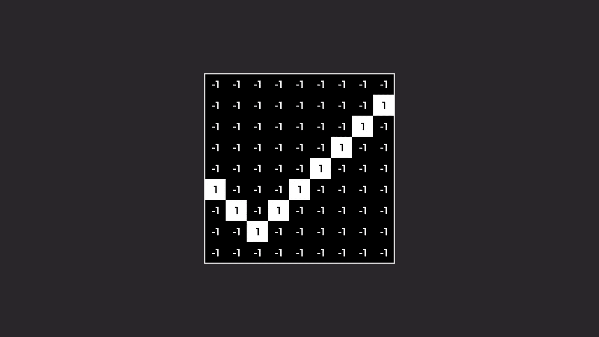
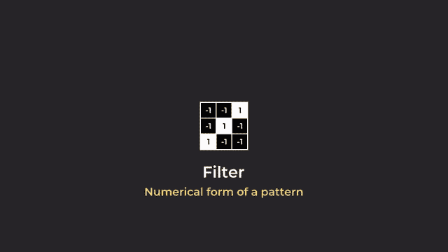
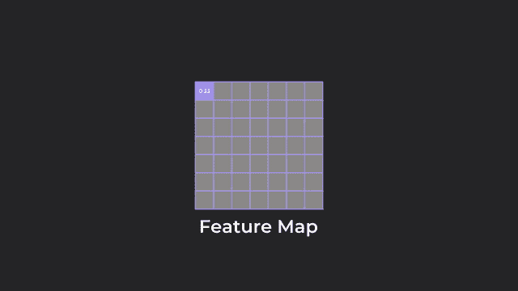
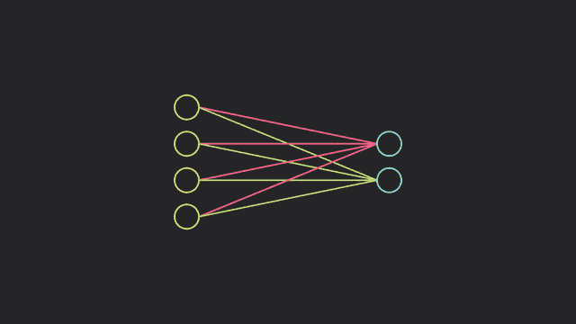
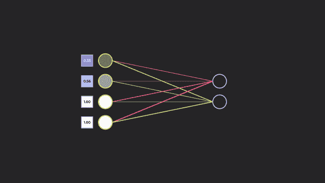

# 深度学习和 CNN 的初学者速成班

> 原文：<https://towardsdatascience.com/beginners-crash-course-to-deep-learning-and-cnns-a32f35234038?source=collection_archive---------26----------------------->

## 没有复杂数学的生动解释。

> 注:这是我关于[深度学习和卷积神经网络](https://youtu.be/n80E7nlEpE0)的视频总结。如果你感兴趣，可以随时观看，了解更多信息！

本文中的所有资产和图像都是由我创建的

深度学习极其迷人。从识别和分类图像，到甚至产生梦一样的幻觉，深度学习都做到了。

当我了解到这个话题时，我不断受到极其复杂的数学方程和无数充满缩写词的术语的轰炸，听起来像是深度学习的口袋妖怪等价物。然而，剥去所有这些，深度学习实际上变得直观了。欢迎来到我的深度学习和卷积神经网络的“动画”指南！

# 图像分类

我们将通过使用一个蜱的黑白图像来简化事情，其中一层代表一个专用的黑白通道。黑色用-1 表示，而白色用正 1 表示。

分笔成交点的数字表示

现在，如果我们想对图像本身进行分类，我们需要首先对输入进行一些处理。

## 卷积步骤

这里的主要目的是从输入图像中提取关键特征。

为了检测特征，我们需要一个叫做**过滤器**的东西。过滤器只是一种模式的数字表示。从这里，我们可以看到，这定义了蜱的茎的模式。

滤波器的数值表示

从左上角开始，这个过滤器试图找到与它所具有的特征相匹配的特征。请注意，这个过滤器在任何时间点都只关心一个小区域。这个区域被称为**感受野**。

为了找到匹配，过滤器对它正在查看的图像部分执行一系列数学运算。

过滤器对图像的一部分执行的数学运算

首先，对于每个对应的图像和过滤器像素，将这些值相乘。然后，将它们相加给出一个结果。然后将该值除以过滤器中的像素总数，得到平均值。计算结果随后存储在**特征图**中的一个像素上。

整个图像的卷积过程

当滤波器逐步移动并在每个点执行操作时，我们对整个图像重复这个过程。滤波器的这种滑动运动概括了**卷积**的全部思想。过滤器在每一步移动的距离称为**步长**，在本例中为 1。

此时，您可能想知道:功能图的意义是什么？特征图实际上是我们的过滤器的特征与图像匹配程度的空间表示。理解上面的值的直观方式是，1 表示完全匹配，而-1 表示完全不匹配。中间的任何剩余值仅仅表示部分匹配。

我们可以使用不同的过滤器来帮助检测其他特征。可以相应地定制每个滤波器的大小和我们想要在这个卷积步骤中使用的滤波器的数量。

至此，我们的第一个卷积层就完成了。

## 整流线性单位

校正线性单位—标准化过程

现在，我将添加一个层来将我们的特征图中的所有负值变成零，这是一种纠正特征图的*归一化*的形式。这被称为 **ReLU** 层，代表整流线性单元。

## 最大池化

步长为 2 的 2px x 2px 区域的池化过程

此外，我们可能还会添加一个层来做一些精简，以帮助提高计算速度。一种方法是从一个区域中取出最重要的值(也就是最大值)并记录下来。这就是所谓的**最大池层**。在这种情况下，我的 max-pooling 层汇集了一个 2px 乘 2px 的区域，并设置为步长为 2，一次移动两个像素并记录值。

我们像汉堡一样重复和堆叠上述层，以形成卷积神经网络的肉，增加了有助于图像分类的特征的复杂性。

## 全连接层

最后，我们添加一个完全连接的层来解释结果。这基本上是你通常看到的代表神经网络的通用神经元和突触模型。

为了直观地理解它，这只是网络决定某个特征的重要性的地方。越重要，“**权重**”越重——用粗线表示——意味着神经元之间的联系越强。

全连接层介绍和图像展平演示

第一层神经元代表在一系列卷积、ReLU 和汇集循环之后创建的特征图的每个单独像素，像这样被展平成一维。该像素的值可以被视为神经元的信号强度，值越高表示信号越强。因此，随着连接越来越强，这组神经元发出的信号的更大比例可以通过。

最后一层神经元的激活

这最后一层神经元将告诉我们它在预测某个对象时有多自信。这些神经元的激活是基于它接收到的信号的强度。更高的激活意味着来自先前神经元的累积信号更强。

因为我们要在两类物体之间做出决定，所以我们会有两个输出神经元——一个用于滴答，一个用于十字。激活 1 表示将图像分类为它所对应的任何类别的百分之百的置信度，而 0 表示完全拒绝。如果你愿意，你可以在它们之间堆叠更多的神经元层，使你的模型更加动态。

# 学习过程

## 直觉的、非数学的解释

训练模型的想法就像你训练宠物变戏法一样。如果宠物玩得好，你就奖励它们一份礼物。嗯，对于机器来说，它们的“待遇”是以**成本函数**的形式定义的。如果他们表现得更好，成本函数的值就会更低，这意味着他们的方向是正确的，反之亦然。神经网络想要尽可能地最小化这个成本。

为了训练神经网络，我们需要称为训练集的数据。训练集包含一组图像，在我们的例子中是勾号和叉号，它们都标有正确的答案。每当我们向网络提供一幅图像时，它就会通过所有层，根据它认为的图像生成一个响应。根据输出，网络会对自己进行评估，并确定它与正确答案的差距。

然后，网络调整权重，以试图通过找到正确的组合来提高其准确性，从而将自己导向正确的方向。这是通过反向传播和梯度下降完成的，这涉及到一点微积分，在这里将不深入讨论。

最小化成本函数的图形表示

然而，从图形上来说，它试图编辑成本函数，以便最终达到**局部最小值**。它学习的速率可以通过改变它的**学习速率**来修改。

然后，我们使用一个验证集，这是一组神经网络看不到的图像，来检查它在训练阶段后的性能。这就好比让神经网络考试，看它考得怎么样。

然后，如果需要的话，我们进一步训练该模型，以获得可能的最佳结果。现在，你已经对卷积神经网络和深度学习有了直观的了解！

我确实希望这篇文章能帮助你更好地理解深度学习和 CNN。感谢您的阅读！