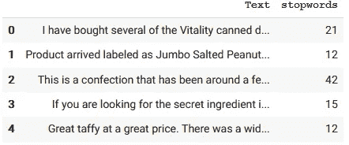
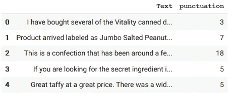
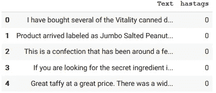
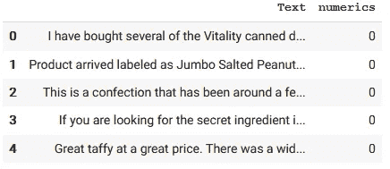
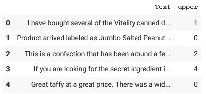
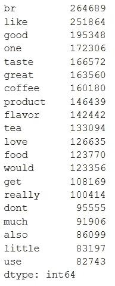
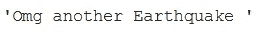
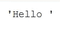
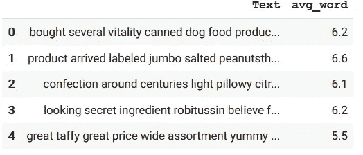
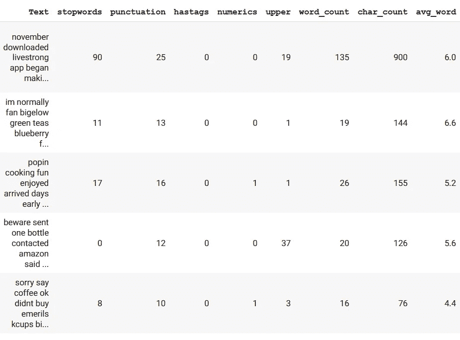

# 自然语言处理中数据清理和特征提取初学者指南

> 原文：<https://towardsdatascience.com/beginners-guide-for-data-cleaning-and-feature-extraction-in-nlp-756f311d8083?source=collection_archive---------24----------------------->


来源:[莱弗吉尼亚州](https://www.shutterstock.com/g/ievgeniiya)途径:[摄影记者](https://www.shutterstock.com/image-illustration/painted-hand-shows-concept-hologram-data-1078657103)

本文将解释使用神经语言处理(NLP)进行文本分析的数据清理和未来提取的步骤。

在网上，有很多很棒的文字清理指南。一些指南在文本清理之后进行特征提取，而一些指南在文本清理之前进行特征提取。这两种方法都很好。然而，**这里有一个很少被关注的问题**:在数据清理过程中，我们丢失了一些可能的特征(变量)。在数据清洗之前，我们需要进行特征提取。另一方面，有些特征只有在数据清理后提取时才有意义。因此，我们还需要在数据清洗后进行特征提取。本研究关注这一点**、**和**这是本研究的独特之处。**

为了解决上述问题，本研究依次遵循三个步骤:

1.  特征提取—第一轮
2.  数据清理
3.  特征提取—第二轮

这篇研究文章是采用 NLP 方法的亚马逊综述分析的一部分。这里是主研究代码的 Colab 笔记本的 [my GitHub repo](https://github.com/EnesGokceDS/Amazon_Reviews_NLP_Capstone_Project) ，以及本次研究的 [**代码**](https://github.com/EnesGokceDS/Amazon_Reviews_NLP_Capstone_Project/blob/master/1_Data_cleaning_and_feature_extraction.ipynb) 。

**关于我使用的数据的简要信息:**本项目使用的数据是从 [Kaggle](https://www.kaggle.com/snap/amazon-fine-food-reviews) 下载的。是斯坦福网络分析项目上传的。原始数据来自 J. McAuley 和 J. Leskovec (2013)对“[从业余爱好者到行家:通过在线评论](http://i.stanford.edu/~julian/pdfs/www13.pdf)对用户专业知识的演变进行建模”的研究。这个数据集由来自亚马逊的美食评论组成。该数据包括了从 1999 年到 2012 年的所有 568，454 篇评论。评论包括产品和用户信息、评级和纯文本评论。

# **特征提取—第一轮**

在这一部分中，将提取数据清洗后不可能获得的特征。

1.  **停用词的数量:**停用词是搜索引擎已经被编程忽略的常用词(例如“the”、“A”、“an”、“in”)，无论是在索引用于搜索的条目时还是在作为搜索查询的结果检索它们时。在 Python 的 ***nltk*** 包中，有 127 个英文停用词默认。通过应用停用词，这 127 个词被忽略。在删除停用词之前，让我们将“停用词数量”作为一个变量。

```
df['stopwords'] = df['Text'].apply(lambda x: len([x for x in x.split() if x in stop]))df[['Text','stopwords']].head()
```



2.**标点符号的数量:**数据清洗后无法获得的另一个特征是因为发音会被删除。

```
def count_punct(text):
    count = sum([1 for char in text if char in string.punctuation])
    return count#Apply the defined function on the text data
df['punctuation'] = df['Text'].apply(lambda x: count_punct(x))#Let's check the dataset
df[['Text','punctuation']].head()
```



3.标签字符的数量:我们可以从文本数据中提取的一个更有趣的特征是标签或提及的数量。在数据清理期间，标签将被删除，我们将无法访问这些信息。因此，让我们在仍然可以访问它的时候提取这个特性。

```
df['hastags'] = df['Text'].apply(lambda x: len([x for x in x.split() if x.startswith('#')]))df[['Text','hastags']].head()
```



4.**数字字符的数量:**拥有评论中出现的数字字符的数量可能是有用的。

```
df['numerics'] = df['Text'].apply(lambda x: len([x for x in x.split() if x.isdigit()]))df[['Text','numerics']].head()
```



5.**大写单词的数量:**愤怒、愤怒等情绪经常通过大写单词来表达，这使得这成为识别这些单词的必要操作。在数据清理过程中，所有字母将被转换成小写。

```
df['upper'] = df['Text'].apply(lambda x: len([x for x in x.split() if x.isupper()]))df[['Text','upper']].head()
```



现在，我们完成了只能在数据清理之前获得的特征。我们准备清除数据。

# **文字清理技巧**

在对数据应用 NLP 技术之前，首先需要清理数据并为分析准备数据。如果这个过程做得不正确，它可能会完全破坏分析部分。以下是应用于数据的步骤:

1.  **将所有文本转换成小写:**第一个预处理步骤是将评论转换成小写。这避免了相同单词的多个副本。例如，在计算字数时，如果我们忽略这种转换，则“狗”和“狗”将被视为不同的单词。

```
df['Text'] = df['Text'].apply(lambda x: " ".join(x.lower() for x in x.split()))df['Text'].head()
```

**2)** 目前，NLP 方法还没有一个有意义的方法来分析标点符号。因此，它们被从文本数据中删除。通过这一步，这些字符被删除:[！" #$% & '()*+，-。/:;= >？@[\]^_`{|}~]

```
df['Text'] = df['Text'].apply(lambda x: " ".join(x.lower() for x in df['Text'] = df['Text'].str.replace('[^\w\s]','')
df['Text'].head()
```

**3)** **停用词的移除**:通过这一步，我移除了 *nltk* 包中所有默认的英文停用词。

```
from nltk.corpus import stopwords
stop = stopwords.words('english')df['Text'] = df['Text'].apply(lambda x: " ".join(x for x in x.split() if x not in stop))df['Text'].sample(10)
```

***添加自己的停用词*** :此时，你可能想添加自己的停用词。我这样做主要是在检查了最常用的单词之后。我们可以这样检查最常用的单词:

```
import pandas as pd
freq = pd.Series(' '.join(df['Text']).split()).value_counts()[:20]
freq
```



最常见的 20 个单词

从这几个词中，我想去掉' br '，' get '，' also '，因为它们没有太大意义。让我们将它们添加到停用词列表中:

```
# Adding common words from our document to stop_wordsadd_words = ["br", "get", "also"]
stop_words = set(stopwords.words("english"))
stop_added = stop_words.union(add_words)df['Text'] = df['Text'].apply(lambda x: " ".join(x for x in x.split() if x not in stop_added))df['Text'].sample(10)
```

注意:在其他指南中，您可能会遇到 TF-IDF 方法。TF-IDF 是从文本数据中去除没有语义价值的单词的另一种方法。如果你用的是 TF-IDF，就不需要应用停用词(但是两个都应用也无妨)。

**4)** **移除 URL:**URL 是被移除的数据中的另一个噪音。

```
def remove_url(text): 
    url = re.compile(r'https?://\S+|www\.\S+')
    return url.sub(r'', text)# remove all urls from df
import re
import string
df['Text'] = df['Text'].apply(lambda x: remove_url(x))
```

**5)** **去除 html HTML 标签:** HTML 在互联网上被广泛使用。但是 HTML 标签本身在处理文本时并没有什么帮助。因此，所有以 url 开头的文本都将被删除。

```
def remove_html(text):
    html=re.compile(r'<.*?>')
    return html.sub(r'',text)# remove all html tags from df
df['Text'] = df['Text'].apply(lambda x: remove_html(x))
```

**6)** **删除表情符号:**表情符号可以是与客户满意度相关的一些情绪的指示器。不幸的是，我们需要在我们的文本分析中删除表情符号，因为目前还不能用 NLP 分析表情符号。

```
# Reference : https://gist.github.com/slowkow/7a7f61f495e3dbb7e3d767f97bd7304bdef remove_emoji(text): 
    emoji_pattern = re.compile("["
        u"\U0001F600-\U0001F64F"  # emoticons
        u"\U0001F300-\U0001F5FF"  # symbols & pictographs
        u"\U0001F680-\U0001F6FF"  # transport & map symbols
        u"\U0001F1E0-\U0001F1FF"  # flags
        u"\U00002702-\U000027B0"
        u"\U000024C2-\U0001F251"
        "]+", flags=re.UNICODE)
    return emoji_pattern.sub(r'', text)#Example
remove_emoji("Omg another Earthquake 😔😔")
```



```
# remove all emojis from df
df['Text'] = df['Text'].apply(lambda x: remove_emoji(x))
```

**7)** **移除表情符号:**表情符号和表情符号有什么区别？

:-)是表情符号

😜是一个→表情符号。

```
!pip install emot #This may be required for the Colab notebookfrom emot.emo_unicode import UNICODE_EMO, EMOTICONS# Function for removing emoticons
def remove_emoticons(text):
    emoticon_pattern = re.compile(u'(' + u'|'.join(k for k in   EMOTICONS) + u')')
    return emoticon_pattern.sub(r'', text)#Example
remove_emoticons("Hello :-)")
```



```
df['Text'] = df['Text'].apply(lambda x: remove_emoticons(x))
```

**8)** **拼写纠正:**亚马逊评论上，拼写错误多如牛毛。产品评论有时充满了匆忙发送的评论，有时几乎无法辨认。

在这方面，拼写纠正是一个有用的预处理步骤，因为这也将有助于我们减少单词的多个副本。例如，“分析”和“分析”将被视为不同的词，即使它们在同一意义上使用。

```
from textblob import TextBlob
df['Text'][:5].apply(lambda x: str(TextBlob(x).correct()))
```

9.**词条释义:** *词条释义*是将一个单词转换成其基本形式的过程。词汇化考虑上下文，将单词转换成有意义的基本形式。例如:

“关怀”->“词化”->“关怀”

Python NLTK 提供了 **WordNet 词条整理器**，它使用 WordNet 数据库来查找单词的词条。

```
import nltk
from nltk.stem import WordNetLemmatizer 

# Init the Wordnet Lemmatizer
lemmatizer = WordNetLemmatizer()df['Text'] = df['Text'].apply(lambda x: lemmatizer(x))
```

关于词汇化的更详细的背景，可以查看 [Datacamp](https://www.datacamp.com/community/tutorials/stemming-lemmatization-python) 。

在这里，我将停止清理数据。但是，作为一名研究人员，您可能需要根据您的数据进行更多的文本清理。例如，您可能希望使用:

⚫对文本数据进行词干分析

⚫拼写纠正的替代方法*:孤立词*纠正和*上下文相关*纠正方法

⚫不同的包使用不同数量的停用词。你可以试试其他的 NLP 包。

# **特征提取-第二轮**

一些特征将在文本清理后提取，因为它们在此步骤获得更有意义。例如，如果我们在数据清理之前提取这个特征，字符的数量会受到 URL 链接的严重影响。此时，我们必须尝试提取尽可能多的特征，因为额外的特征有机会在文本分析期间提供有用的信息。我们不必担心这些功能将来是否真的有用。在最坏的情况下，我们不使用它们。

1.  **字数:**此功能告知评论中有多少字

```
df['word_count'] = df['Text'].apply(lambda x: len(str(x).split(" ")))df[['Text','word_count']].head()
```

2.**字数:**评论中包含多少个字母。

```
df['char_count'] = df['Text'].str.len() ## this also includes spacesdf[['Text','char_count']].head()
```

3.**平均单词长度:**评论中单词的平均字母数。

```
def avg_word(sentence):
    words = sentence.split()
    return (sum(len(word) for word in words)/(len(words)+0.000001))df['avg_word'] = df['Text'].apply(lambda x: avg_word(x)).round(1)
df[['Text','avg_word']].head()
```



让我们检查提取的要素在数据框中的样子:

```
df.sample(5)
```



# **结论**

这项研究解释了文本清洗的步骤。此外，***本指南的独特之处在于，在文本清理之前和文本清理之后，通过两轮*** *:* ***来完成特征提取。我们需要记住，对于实际的研究来说，文本清理是一个递归过程。一旦我们发现异常，我们会回来通过解决异常进行更多的清理。***

> *特别感谢我的朋友塔比瑟·斯蒂克尔校对了这篇文章。