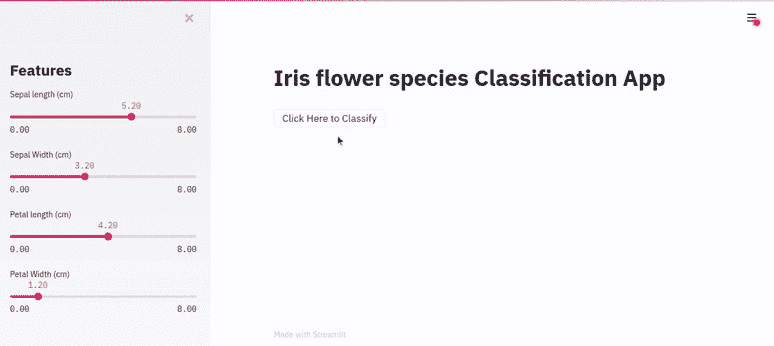
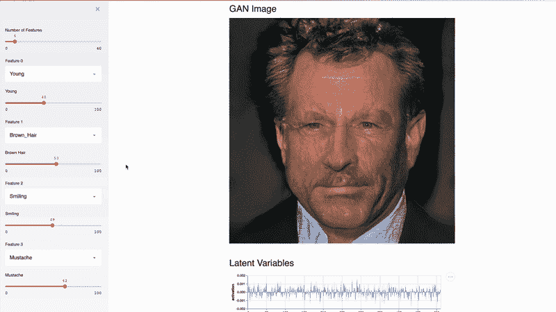
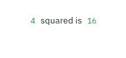
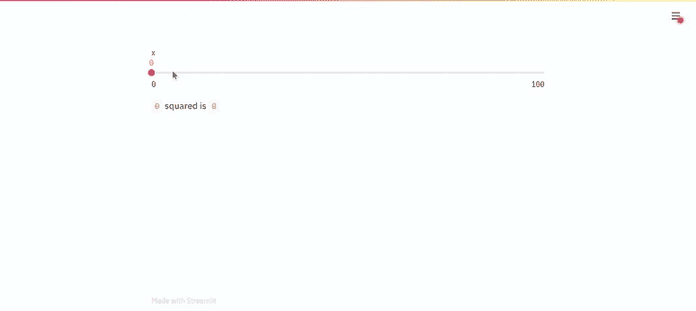
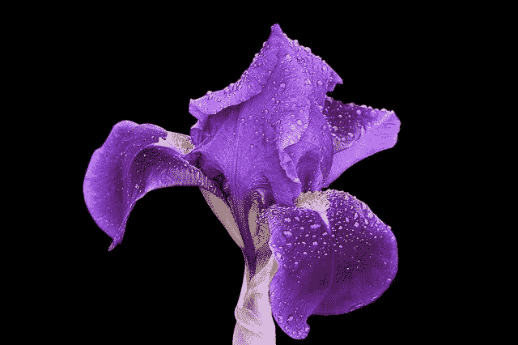
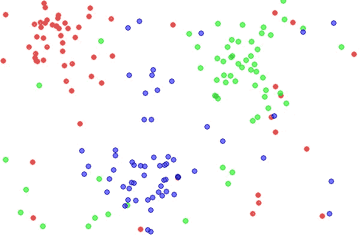
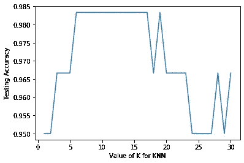
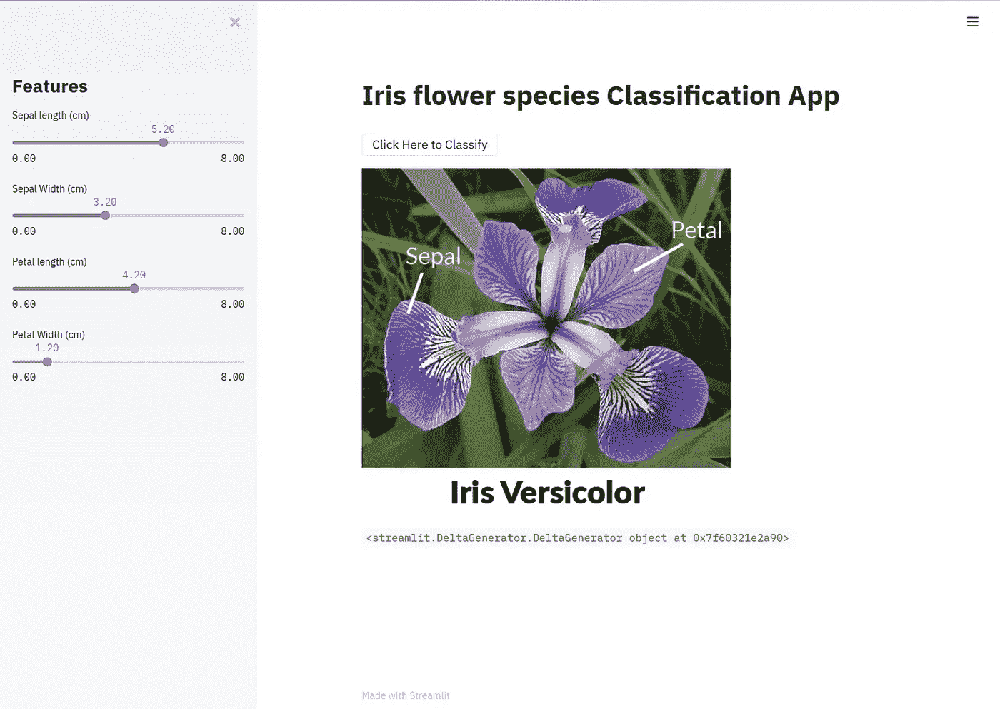
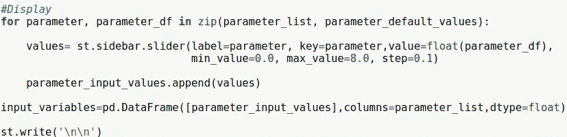
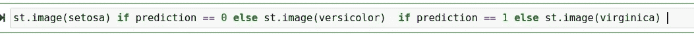

# 使用 Streamlit 制作交互式鸢尾花分类应用程序的初学者指南

> 原文：<https://towardsdatascience.com/beginners-guide-lets-make-an-interactive-iris-flower-classification-app-using-streamlit-42e1026d2167?source=collection_archive---------23----------------------->



使用 Streamlit 的虹膜分类应用程序

学习使用 Streamlit 制作互动、美观的机器学习应用程序:)

## 您将学到的内容:

1.  关于 Streamlit 的简介
2.  安装程序
3.  使用 Streamlit 的基本示例
4.  如何保存机器学习模型？
5.  鸢尾花分类 app
6.  分步代码讲解+视频演示:)

大家好:)

最近，我在当地社区参加了一个关于[**Streamlit**](https://www.streamlit.io/)**的网络研讨会，我想，让我们制作一个关于它的教程，并与开源社区分享:)**

**作为一个初学者，我相信我们都希望尽快使用机器学习来制作很酷的东西！**

**Streamlit 的开发者为我们创造了一个非常简单的方法:)**

**在浪费时间之前，让我们开始吧。**

****

**照片由 [Streamlit](https://www.streamlit.io/) 拍摄**

## **什么是 Streamlit？**

**Streamlit 是一个开源框架，用于创建一个交互式的、漂亮的可视化应用程序。全部用 python！**

**Streamlit 提供了许多有用的特性，对数据驱动项目的可视化非常有帮助。**

## **为什么我应该使用 Streamlit？**

*   **创建交互式用户界面的简单易行的方法**
*   **不需要开发经验**
*   **在数据驱动的项目中使用不同的功能很有趣:)**
*   **全面的文档**

## **使用 Streamlit 的 Face-GAN explorer**

****

**这个 Streamlit 应用程序使用关的 TL-GAN[6]演示了 NVIDIA 名人脸 GAN[5]模型。**

## **安装程序**

****针对 Linux 的****

**你只需要在你的终端写下下面的命令来安装 Streamlit**

```
pip install streamlit
```

**仅此而已:)**

****对于 Windows****

**您可以找到 windows 的安装说明:**

**[为 windows 安装 streamlit](https://docs.streamlit.io/en/latest/troubleshooting/clean-install.html#install-streamlit-on-windows)**

**现在让我们探索 Streamlit**

## **绘图内容**

**在下面几行代码中键入，并将其另存为。py 扩展**

```
**import** **streamlit** **as** **st** 
x = 4
st.write(x, 'squared is', x * x)
```

**以下是使用 Streamlit 运行 python 脚本的方式:**

**打开一个终端，并确保你是在同一个工作目录下保存文件。**

**键入以下命令，然后按 enter 键:**

```
streamlit run filename.py
```

**输出:**

****

**这是您将在默认 web 浏览器中看到的内容**

**好了，现在让我们通过在代码中包含 slider 小部件来增加它的交互性:**

```
x = st.slider('x')  # 👈 this is a widget
#st.write(x, 'squared is', x * x)
```

**输出:**

****

**在 Streamlit 中使用 Slider Widget**

****注意**:每当你**修改代码**的时候，你就可以在你的项目中看到**的快速变化**。**

**好了，现在让我们回到我们的主要目标！**

****

**图片由 [Pixabay](https://pixabay.com/) 上的[汉斯本](https://pixabay.com/users/hansbenn-194001/)拍摄**

## **虹膜分类应用程序**

**问题陈述:根据鸢尾花的特征对其进行分类。**

**虹膜特征:萼片，花瓣，长度和宽度**

**这个分类问题也被称为监督机器学习的 **Hello World** ！**

**首先，让我们探索虹膜数据集:**

```
from sklearn.datasets import load_irisiris= load_iris()# Store features matrix in X
X= iris.data#Store target vector in 
y= iris.target
```

****功能****

```
# Names of features/columns in iris dataset
print(iris.feature_names)Output : ['sepal length (cm)', 'sepal width (cm)', 'petal length (cm)', 'petal width (cm)']
```

****目标/虹膜种类****

```
# Names of target/output in iris dataset
print(iris.target_names)Output : ['setosa' 'versicolor' 'virginica']
```

****

**鸢尾花的种类**

****虹膜数据集的尺寸/大小****

```
# size of feature matrix
print(iris.data.shape)Output: (150, 4)# size of target vector
print(iris.target.shape)Output : (150,)
```

**因此，我们有 150 行/观察值和 4 列/特征。**

**下一步是研究机器学习算法:)**

**作为开始，我们将使用 K 最近邻。**

**KNN 就像是:**

**告诉我谁是你的朋友，我会告诉你你是什么人**

****

**照片由 CC BY-SA 3.0 授权的[agor 153](http://commons.wikimedia.org/wiki/File:Data3classes.png#/media/File:Data3classes.png)拍摄**

**以下是 KNN 的步骤:**

**给出新数据:**

1.  **计算**新数据**和数据集中每个**观察值/行**之间的距离**
2.  **获得与新数据**最接近的 **k** 个观察值****

**最近:最小距离的观测值(升序)**

**3.获取 **k** 个观察值的输出标签，并基于这些**最具代表性/最流行的**输出标签对**个新数据**进行分类**

**让我们使用 Scikit 学习库来应用 KNN 吧！**

**以下是使用 scikit learn 应用机器学习模型的 4 个基本步骤:**

****第一步**:导入机器学习模型**

```
#Import the classifier
from sklearn.neighbors import KNeighborsClassifier
```

****第二步:**实例化模型**

```
knn = KNeighborsClassifier()
```

****第三步:**用数据拟合模型**

```
knn.fit(X, y)Output : KNeighborsClassifier(algorithm='auto', leaf_size=30, metric='minkowski',metric_params=None, n_jobs=None, n_neighbors=5, p=2,weights='uniform')
```

**在这里，我们可以看到 KNN 分类器中许多不同类型的参数，但我们将使用 n_neighbors:)**

****第四步**:预测**

```
#Predicting output of new data
knn.predict([[3.2, 5.4, 4.1, 2.5]])// Random valuesOutput : array([1]) # 1 -> versicolor (Iris flower specie)
```

## **让我们改变 K 值并探究结果**

****对于 K = 1****

```
# instantiate the model 
knn = KNeighborsClassifier(n_neighbors=1)# fit the model with dataknn.fit(X, y)# predict the response for new observationsknn.predict([[3, 5, 4, 2]])Output : array([2]) 2 -> virginica (Iris flower specie)
```

****对于 K = 5****

```
# instantiate the model 
knn = KNeighborsClassifier(n_neighbors=5)# fit the model with dataknn.fit(X, y)# predict the response for new observationsknn.predict([[3, 5, 4, 2]])Output : array([1]) // 1 -> versicolor (Iris flower specie)
```

**当 k = 1 时，KNN 预言了**维吉尼亚**和 k = 5 时，KNN 预言了**云芝。****

**这就产生了一个问题:**

***如何估计* ***我的模型*** *在样本外数据上的可能表现？***

**答案在于评估程序！**

**首先，我们将使用培训/测试分割评估方法:**

**训练/测试分割**

*   **将数据集分成两块****训练集**和**测试集******
*   ****在**训练设备**上安装/训练模型****
*   ****在**测试装置**上测试模型****

******注:**思路是在训练集上训练/拟合模型，在没有训练模型的测试集上评估！****

```
**#  split X and y into training and testing sets
from sklearn.model_selection import train_test_splitX_train, X_test, y_train, y_test = train_test_split(X, y, test_size=0.4, random_state=4)**
```

****使用 train_test_split 我们可以实现这一点，在这里您可以看到一些参数。****

****x:数据集/特征矩阵****

****y:鸢尾物种标签/输出向量****

****test_size:你想给测试集多少比例的数据集这里 0.4 表示 40%给测试集，可能 60%给训练集****

****random_state:这里传递一个固定的值意味着每当你多次运行代码时，它将把相同的数据索引分成训练集和测试集。****

```
**# print the shapes of the new X objects
print(X_train.shape)
print(X_test.shape)Output : 
(90, 4)
(60, 4)# print the shapes of the new y objects
print(y_train.shape)
print(y_test.shape)Output :
(90,)
(60,)**
```

****我们得到了(60%)训练集的 90 个观察值和(40%)测试集的 40 个观察值。****

****如果你想知道我们为什么使用培训/测试分割，请查看下面的文章****

****[](https://medium.com/@jalalmansoori/how-to-evaluate-and-improve-knn-classifier-part-3-62d72fd17eec) [## 如何评价和改进 Knn 分类器第 3 部分

### 初学者指南，学习在 knn 分类器中评估和选择最佳参数

medium.com](https://medium.com/@jalalmansoori/how-to-evaluate-and-improve-knn-classifier-part-3-62d72fd17eec) 

让我们开始使用训练/测试分割来查看模型性能。

**对于 K=1**

```
knn = KNeighborsClassifier(n_neighbors=1)
knn.fit(X_train, y_train)
y_pred = knn.predict(X_test)
print(metrics.accuracy_score(y_test, y_pred))Output:
0.95
```

**对于 K=5**

```
knn = KNeighborsClassifier(n_neighbors=5)
knn.fit(X_train, y_train)
y_pred = knn.predict(X_test)
print(metrics.accuracy_score(y_test, y_pred))Output:
0.9666666666666667
```

因此，对于 k=1，我们得到(95%的测试精度)，对于 k=5，我们得到(大约 97%的测试精度)。

**注:** **检验精度**最好是对样本外数据进行估计。

有趣的部分来了，我们能进一步提高测试精度吗？


[图米苏](https://pixabay.com/users/Tumisu-148124/)在 [Pixabay](https://pixabay.com/) 上的照片

## 如何选择 knn 分类器中的最佳参数？

如上所述，我们将使用 n _ neighbour 参数:)

我们来玩吧:

```
# try K=1 through K=30 and record testing accuracy
k_range = list(range(1, 31))
scores = []
for k in k_range:
    knn = KNeighborsClassifier(n_neighbors=k)
    knn.fit(X_train, y_train)
    y_pred = knn.predict(X_test)
    scores.append(metrics.accuracy_score(y_test, y_pred))
```

在上面的代码中，我们实现了一种非常直观的方法，即为了提高测试精度，我们可以针对特定范围的 K 值运行 knn 分类器，并将测试精度结果存储在一个列表中，然后最终获得测试精度最高的 K 值。

下面是 matplotlib 库制作的可视化绘图

```
# import Matplotlib (scientific plotting library)
import matplotlib.pyplot as plt# allow plots to appear within the notebook
%matplotlib inline# plot the relationship between K and testing accuracy
plt.plot(k_range, scores)
plt.xlabel('Value of K for KNN')
plt.ylabel('Testing Accuracy')
```



K 值与测试精度的关系图

在这个图中，我们可以看到测试精度在(10–15)K 值之间相当好，所以让我们只选择 K=12 来完成 knn 分类器。

让我们完成并保存 Knn 分类器。

# 如何最终确定 Knn 分类器对新数据进行预测？

这就是[机器学习大师](https://machinelearningmastery.com/)的创始人杰森·布朗利所说的:

> 在进行预测之前，必须训练一个最终模型。
> 
> 您可能已经使用 k-fold 交叉验证或数据的训练/测试拆分来训练模型。这样做是为了让您对模型在样本外数据(如新数据)上的技巧有一个估计。
> 
> 这些模型已经达到了它们的目的，现在可以丢弃了。
> 
> 现在，您必须根据所有可用数据训练最终模型。

## 如何保存机器学习模型？

```
from sklearn.datasets import load_irisiris= load_iris()# Store features matrix in X
X= iris.data#Store target vector in yy= iris.target# Finalizing KNN Classifier after evaluation and choosing best 
# parameter#Importing KNN Classifier
from sklearn.neighbors import KNeighborsClassifier# instantiate the model with the best known parameters
knn = KNeighborsClassifier(n_neighbors=12)# train the model with X and y (not X_train and y_train)
knn_clf=knn.fit(X, y)# Saving knn_clfimport joblib# Save the model as a pickle in a file
joblib.dump(knn_clf, "Knn_Classifier.pkl")
```

因此，使用 joblib 我们保存了最终的训练模型，现在我们可以在我们的虹膜分类应用程序中使用它:)

## 使用 streamlit 的最终版本虹膜分类应用程序

这是我们要做的:



使用 Streamlit 的鸢尾花卉种类分类应用程序

## 第一步

```
import streamlit as st
import pandas as pd
import joblib
from PIL import Image#Loading Our final trained Knn model 
model= open("Knn_Classifier.pkl", "rb")
knn_clf=joblib.load(model)st.title("Iris flower species Classification App")#Loading imagessetosa= Image.open('setosa.png')
versicolor= Image.open('versicolor.png')
virginica = Image.open('virginica.png')
```

在上面的代码中:

*   我们导入了一些有用的库
*   加载我们的 Knn 分类器和虹膜花图像

**注意**:你可以访问本教程中使用的所有代码和下面源代码标题下的 Iris 图片！

## 第二步

```
st.sidebar.title("Features")#Intializing
parameter_list=['Sepal length (cm)','Sepal Width (cm)','Petal length (cm)','Petal Width (cm)']
parameter_input_values=[]
parameter_default_values=['5.2','3.2','4.2','1.2']values=[]
```

在上面的代码中，我们用随机值初始化了鸢尾花的特征，如萼片、花瓣、长度等

**显示特征**

```
#Display
for parameter, parameter_df in zip(parameter_list, parameter_default_values):

 values= st.sidebar.slider(label=parameter, key=parameter,value=float(parameter_df), min_value=0.0, max_value=8.0, step=0.1)
 parameter_input_values.append(values)

input_variables=pd.DataFrame([parameter_input_values],columns=parameter_list,dtype=float)
st.write('\n\n')
```



在 streamlit slider 小部件中显示 Iris Flower 特征的代码

这里我们使用了 for 循环来高效地显示鸢尾花的特征！

## 第三步

```
if st.button("Click Here to Classify"):
 prediction = knn_clf.predict(input_variables)st.image(setosa) if prediction == 0 else st.image(versicolor)  if prediction == 1 else st.image(virginica)
```



如果满足 3 个条件中的任何一个，则显示图像

最后，与其写文字，不如展示一张鸢尾花物种的图片:)

最后，在您的终端中键入以下命令

```
streamlit run iris_app.py
``` 

****恭喜你用 streamlit 制作了 hello world 的机器学习 app:)****

********

****由[拍摄的照片](https://pixabay.com/users/StartupStockPhotos-690514/)在 [Pixabay](https://pixabay.com/) 上****

## ****视频演示****

****使用 streamlit 演示的虹膜分类应用程序****

## ****源代码:****

****你可以找到所有的代码+模型+虹膜图像[在这里](https://github.com/jalalmansoori19/Classfiying-Iris-flower-species)****

****非常感谢您抽出时间****

****学习、创造、分享和重复，不要忘记学习是有趣的！****

## ****结论****

****在本教程中，您使用 streamlit 制作了第一个机器学习应用程序。祝你未来的项目好运:)****

## ****接触****

****Gmail-> jalalmansoori19@gmail.com****

****github->[https://github.com/jalalmansoori19](https://github.com/jalalmansoori19)****

## ****参考****

1.  ****[https://www.coursera.org/learn/machine-learning](https://www.coursera.org/learn/machine-learning)****
2.  ****[https://www.streamlit.io/](https://www.streamlit.io/)****
3.  ****[使用 scikit-learn 在 Python 中进行机器学习— YouTube](https://www.youtube.com/playlist?list=PL5-da3qGB5ICeMbQuqbbCOQWcS6OYBr5A)****
4.  ****[https://github.com/justmarkham/scikit-learn-videos](https://github.com/justmarkham/scikit-learn-videos)****
5.  ****T.Karras、T. Aila、S. Laine 和 J. Lehtinen，*为提高质量、稳定性和变化而逐步种植甘蔗* (2018)，ICLR。****
6.  ****南关，【使用新型 TL-GAN 模型控制图像合成和编辑】 (2018)，洞察数据科学博客。****