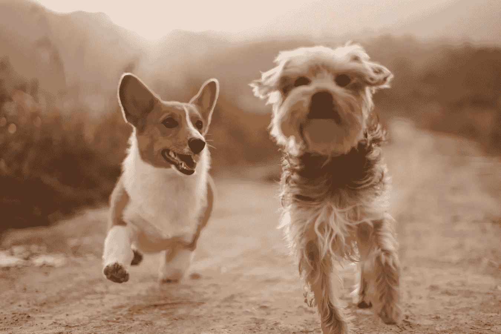
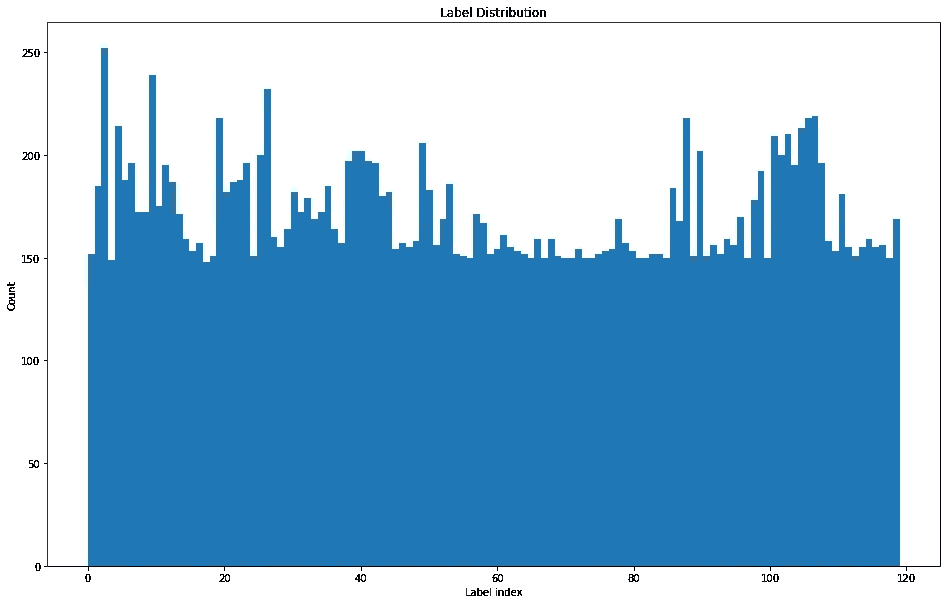
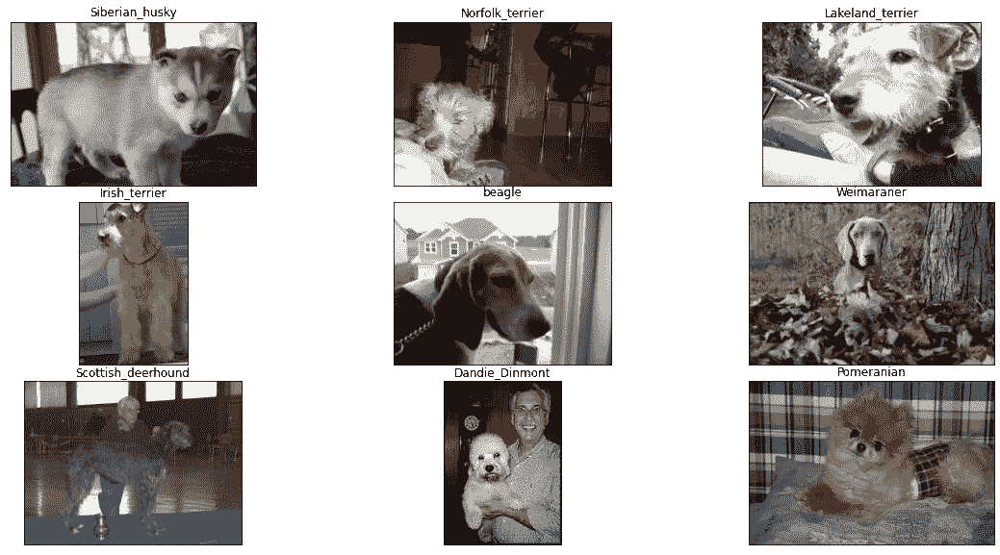
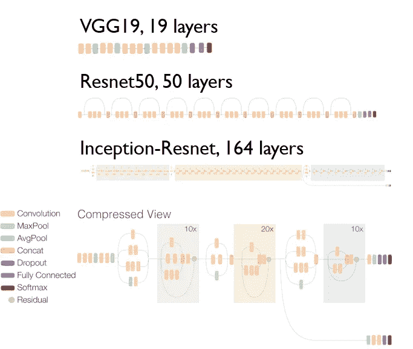
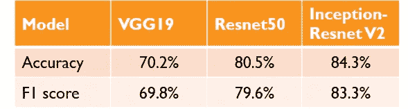
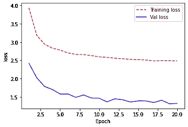
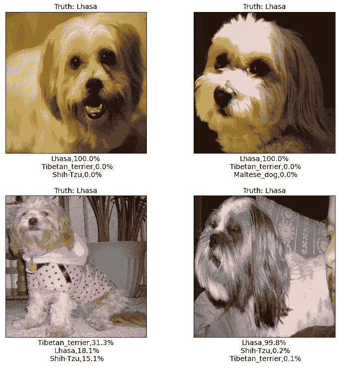
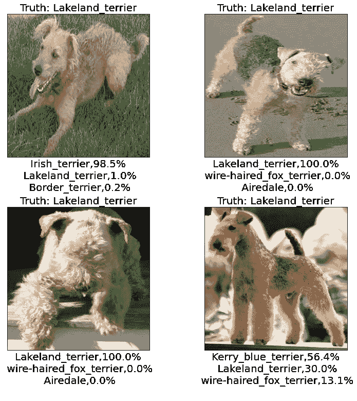
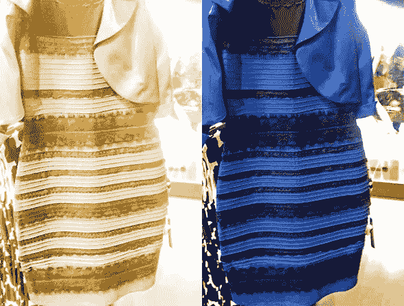

# 图像分类初学者指南:VGG-19、Resnet 50 和带 TensorFlow 的 InceptionResnet

> 原文：<https://towardsdatascience.com/beginners-guide-on-image-classification-vgg-19-resnet-50-and-inceptionresnetv2-with-tensorflow-4909c6478941?source=collection_archive---------20----------------------->

## 本文用迁移学习示例说明了一个图像分类任务，对 120 个狗品种的 20，000 多张照片进行了分类。

柯基和它的朋友。信用:[阿尔万需要](https://unsplash.com/@alvannee)

我还记得我第一次听说深度学习以及听到这个术语时的激动，认为它是一个神秘的黑盒子和全能的模型。

对于初学者来说，图像分类是一项简单而又有意义的任务，可以帮助他们了解深度学习，并习惯它的符号和概念。在这个项目中，我选择使用迁移学习，这是深度学习领域中最简单的方法。

这个项目使用的代码可以在我的 [GitHub 库](https://github.com/ZeeTsing/Dogs_breed_classification)中找到。

**#数据**

本项目使用的数据可在 [Kaggle](https://www.kaggle.com/jessicali9530/stanford-dogs-dataset) 获得，也可在[斯坦福](http://vision.stanford.edu/aditya86/ImageNetDogs/main.html)找到。你可以在提供的第二个链接中找到它的原始论文和基线结果。

所有 120 个品种的标签分布

该数据集由 120 种狗的 20 多万张照片组成。我们的目标类别是什么？它们在 120 个品种中分布均匀吗？左图显示，类别相当平衡，一些类别的图片略多，而大多数类别至少有 150 张照片。

我们还想看看数据集中的一些随机照片。

从数据集中随机选取狗的照片及其品种

我们观察到，尽管品种不同，有些狗有相似的特征。例如，第一排的梗看起来和我很像。我想知道这对于计算机来说是不是太难了。

**#数据预处理**

对于图像处理主题来说，数据预处理是一个很深的主题，但我们在这里不会深入探讨。该项目使用迁移学习模型的标准预处理，结合一些数据扩充，如旋转、水平翻转、放大等。

**#转移学习**

在深入研究项目所用的模型之前，我们想先谈谈迁移学习。简单地说，迁移学习就是利用他人预先训练好的模型来完成你的任务，它可以是不同的任务，但应该是相关的。文献已经证明，深度学习模型在一定程度上是可以移植的。

我探索了两种迁移学习的方法:简单地使用预训练的模型作为特征提取或重新训练(微调)模型的一部分。你们中的一些人可能会接触到第一种方法而没有意识到。比如在 NLP 任务中用 Word2Vec 做编码器，其实就是用迁移学习做特征提取的一种方式。通过保持模型的原始重量，可以容易且直接地应用它。相反，微调方法需要一些试错实验。如果任务非常不同，您可以考虑对模型进行至少 50%或更多的微调。如果您的任务非常相似，比方说最初模型用于对汽车进行分类，现在您希望对卡车进行分类，您可以考虑微调最后几层或原始模型的 30%。所需的微调量需要花费时间和精力，这取决于任务的性质。

对于计算机视觉任务，有许多已建立的模型，对于这个项目，我们用我们的例子回顾了其中的三个。

*   **VGG-19**

VGG-19 是我们探索的第一个型号，也是我们审查的型号中最老的一个。VGG-19 是 VGG-16 的改进型。它是一个 19 层的卷积神经网络模型。它是通过将卷积堆叠在一起而构建的，但是由于一个称为梯度递减的问题，该模型的深度受到限制。这个问题使得深度卷积网络难以训练。该模型在 ImageNet 上进行训练，用于对 1000 种类型的对象进行分类，其余被审查的模型也是如此。

我们探索了 VGG-19 的特征提取和微调。我们得到的最好结果是简单地使用 VGG-19 作为特征提取。在我们情况下，微调和重新训练对 VGG-19 并不奏效。

*   **Resnet50**

Resnet 模型是为解决梯度递减问题而提出的。其思想是跳过连接，将残差传递给下一层，这样模型就可以继续训练。有了 Resnet 模型，CNN 模型可以越来越深入。

Resnet 模型有许多变体，我们在这里选择 Resnet50 是因为它在 Kaggle 的教程中使用过，并且为我们所熟悉。通过 Resnet 50 获得的最佳结果是重新训练所有参数的近 40%。

*   **InceptionResnetV2**

InceptionResnet 是对 Resnet 的进一步改进，结合了称为 Inception 的技术。[点击此处](https://ai.googleblog.com/2016/08/improving-inception-and-image.html)阅读更多关于该车型的信息。

我还做了一个简单的例子来比较这三种不同的架构。彩色块代表模型的层。

视觉模型比较

人们会注意到，在这三个模型中，我们对其中的两个进行了微调和重新培训。当我们试图重新训练 30%的模型时，VGG-19 表现很差。原因可能是 VGG-19 作为深度学习网络相对“肤浅”。用少量数据输入一次重新训练太多参数会损害模型性能，因为模型没有足够的输入来学习。

**#结果和讨论**

我们的最佳模型实现的性能—验证数据

作为一个基准，你可以在这里阅读关于预训练的模特表演[。左边的表格显示了我们的模型在看不见的数据上实现的性能。我们可以看到，模型可以保留基准性能。对于那些我们已经重新训练和微调的，它比基线表现得更好，这并不奇怪，因为我们的任务在本质上比原来的任务更简单(类别更少)。](https://github.com/tensorflow/models/tree/master/research/slim)

我还想分享一些训练模型时的诊断图。

Resnet 损失 50

显示的损耗图来自 Resnet50 型号。我们观察到，在这里验证损失总是低于训练损失。它显示出惊人的概括预测的能力，这是迁移学习模型中一个非常独特的现象。这是由于模型中预先存储的知识。然而，这也表明该模型不能提高列车组的性能，因此很难进一步调整该模型。这是我开始考虑新模型而不是坚持 Resnet50 架构的地方。

来自 InceptionResnetV2 的损失

显示的第二个损失图使用来自我们的 InceptionResnet 模型的数据，在 20 个时期后进行训练。与培训损失相比，验证损失开始时较低。这是与上面的模型类似的行为。这里的验证损失相对稳定，培训损失继续下降。这表明我们在训练集中的改进倾向于过度拟合，不能推广到看不见的数据。为了进一步改进，我们可以探索在模型上添加更多的正则化。

真相:真实的品种；我的模型给出的三个预测

让我们来看看预测。我们的模型在第一次猜测时基本上是正确的，如果我们考虑前 2 个预测，它实际上是所有正确的分类。考虑到任务的难度，我认为这是相当不错的表现。

然而，当我们深入研究该模型造成的更多错误时，仍然有很大的改进空间，我们希望迅速讨论进一步改进的方法。

真相:真实的品种；我的模型给出的三个预测

作为分类模型，我们的模型缺乏辨别狗的大小的能力，例如，它是小型、中型还是大型狗。这是非常重要的，当试图了解狗的品种，因为有许多狗有相似的面部特征和体型，但只有大小不同。下图显示模型很难区分梗类。为了使我们的模型学习对象大小，人们可能想要实现对象识别模型，而不是简单的分类。

蓝黑还是白金？

最重要的是，该模型在正确识别颜色方面也存在问题。这就像一件蓝黑色的衣服在不同的环境光照下改变颜色的经典例子(如下所示)。因此，我们可能要考虑在预处理步骤中增加颜色失真增强，例如，随机化亮度、对比度、饱和度等。

最后，我们还观察到，模型与狗的细微差异，即不同的皮毛长度作斗争。模型可能需要更好的分辨率输入来更好地学习细节。如果我们能够获得更多的数据输入，这将有助于提高模型的性能。

**#结尾**

这是我们在 CNN 的第一个使用迁移学习的项目。接下来我会写关于使用 CNN 模型来预测图像掩蔽。

敬请关注，在家注意安全！:)