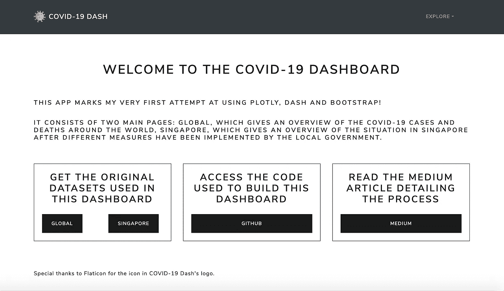
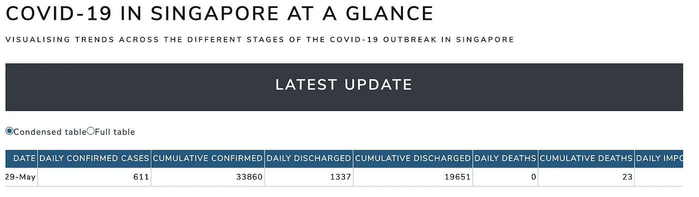

# 使用 Dash、Plotly 和 Bootstrap 构建多页面应用程序的初学者指南

> 原文：<https://towardsdatascience.com/beginners-guide-to-building-a-multi-page-dashboard-using-dash-5d06dbfc7599?source=collection_archive---------2----------------------->

## 我从一个完全初学者的角度，一步一步地介绍了使用新冠肺炎数据构建多页仪表板的过程。

***编者按:*** [*走向数据科学*](http://towardsdatascience.com/) *是一份以数据科学和机器学习研究为主的中型刊物。我们不是健康专家或流行病学家，本文的观点不应被解释为专业建议。想了解更多关于疫情冠状病毒的信息，可以点击* [*这里*](https://www.who.int/emergencies/diseases/novel-coronavirus-2019/situation-reports) *。*

当你因为你的国家处于部分封锁状态而整天被困在家里，并且你意识到你已经看不到节目和玩不到游戏的时候，你会做什么？没错，您从事的是像这样的热门项目，在这里您可以自学如何使用开源库构建仪表板。当然，我是开玩笑的，我很确定有很多事情比试图构建一个仪表板更有趣，也更少令人沮丧，但是如果你和我一样，这篇文章记录了我所学到的一切，希望可以作为任何想尝试使用 Python 构建仪表板的人的良好指南。

你可以在这里访问仪表板[(只需给它大约 30 秒的加载时间)，所有用于构建仪表板的文件都可以在](https://covid-19-dash-global-singapore.herokuapp.com) [GitHub](https://github.com/meredithwan/covid-dash-app) 上找到。

该应用使用了两个数据集，全球页面使用来自欧盟开放数据门户的新冠肺炎数据[，新加坡页面使用](https://data.europa.eu/euodp/en/data/dataset/covid-19-coronavirus-data/resource/55e8f966-d5c8-438e-85bc-c7a5a26f4863)[该数据集](https://data.world/hxchua/covid-19-singapore)。我稍微清理了一下这两个数据集，最终的数据文件是上传到我的 GitHub 存储库中的。

3 周(老实说，我都不记得花了多长时间)的血汗钱和眼泪的最终结果。但是，哇，最终产品肯定是非常令人满意的。

只是让你了解一下我的背景，在此之前，我从未使用过 Dash 或 Plotly，也不了解 HTML 和 CSS。我有使用 Pandas 的经验，但除此之外，我认为很明显，在使用 Python 进行 web 开发方面，我还是个初学者。听起来很难，对吧？但是，还是接受了# challengeaccepted

# Dash 到底是什么？

Dash 是一个开源库，它有助于使用 Python 构建交互式 web 应用程序。它包含 Plotly，可用于可视化数据。换句话说，不需要任何 JavaScript 知识，你所需要的只是 Python，这使得事情变得容易得多，也更加用户友好。顺便说一下， [Dash 文档和用户指南](https://dash.plotly.com/)是一个很好的学习起点。

你可以使用 [Bootstrap](https://dash-bootstrap-components.opensource.faculty.ai/) 来设计你的 Dash 应用，这是一个用于 web 开发的开源 CSS 框架。这意味着您的应用程序可能非常美观，而不必经历从头构建 CSS 样式表的麻烦。

# 让我们从小处着手——构建一个单页应用程序

直接进入多页面应用程序的想法听起来很复杂，令人望而生畏，所以让我们从构建组件开始，并将它们放入单页面应用程序中。我将以该应用的新加坡页面为例。

## 1.安装集成开发环境(IDE)

我以前只在数据分析项目中使用 Python，在这些项目中我总是求助于 Jupyter Notebook。对于 web 开发，您需要安装一个 IDE(或者从终端运行所有东西，老实说这不是一个好主意),在那里您可以编写和运行您的脚本。我最终选择了 [PyCharm](https://www.jetbrains.com/pycharm/) ，并从这个[视频](https://www.youtube.com/watch?v=Ldp3RmUxtOQ)中学会了如何设置。

这不是必须的，但是有人告诉我，为你的项目创建一个虚拟环境是一个好习惯，这样你就可以将所有的依赖项从主环境中分离出来。请注意，您必须在虚拟环境中安装所有需要的依赖项，即使您之前已经在主环境中安装了它们。

一般来说，你需要的包括:dash，plotly，pandas，dash-bootstrap-components(如果你使用 bootstrap 进行造型)。

## 2.了解仪表板特征

我想快速浏览一下 Dash 的三个特性。

**布局**

布局告诉 Dash 你希望你的页面是什么样子。我将使用我的新加坡页面代码中的一个例子来解释这些事情。

这是我的新加坡. py 文件，可以在应用程序文件夹中找到

这段代码表明我的页面结构如下。

第 1 行:文本行，“新加坡新冠肺炎一瞥”

第 2 行:文本行，“显示新加坡新冠肺炎疫情不同阶段的趋势”

第 3 行:另一行文本，“最新更新”

第 4 行:[单选按钮](https://dash.plotly.com/dash-core-components/radioitems)，让用户在选项“压缩表”和“全表”之间进行选择

第 5 行:一个[数据表](https://dash.plotly.com/datatable)

你在代码片段中看到的其他东西都是样式元素，比如字体、颜色和间距。最终产品看起来像这样:

这不太难吧？太好了，让我们进入下一个专题！

**组件**

组件是让你的应用程序具有交互性的东西。实际上，我在上一节提到过一个:单选按钮。我的单选按钮根据用户的偏好决定是显示精简的数据表(列数较少)还是完整的数据表(列数较多)。你可以在这里找到仪表板组件的完整列表。

**回调**

简单地说，回调赋予组件生命。回到单选按钮的例子，我必须编写一个回调函数，以便 Dash 知道是显示更少的列(精简表)还是更多的列(完整表)。

这个片段也来自我的 Singapore.py 文件，可以在 apps 文件夹中找到

这个回调更新两个输出:我的数据表的数据和列，这取决于来自用户选择的单选按钮的输入。

Dash 回调中一个更有趣的特性是，您可以在一个图形中使用 [hoverData](https://dash.plotly.com/interactive-graphing) (鼠标悬停的数据点)作为另一个图形的输入。

这是来自应用程序的新加坡页面

在这种情况下，我使用鼠标悬停在新加坡的新冠肺炎病例作为下两个条形图的输入，这两个条形图显示了本地和输入病例的细分，以及它们是否是来自外籍工人宿舍的病例。

## 3.设计 Dash 应用程序

当涉及到 Dash 应用程序的样式时，有几个选项。你可以使用外部样式表，如[这个](https://codepen.io/chriddyp/pen/bWLwgP)或者点击 Bootstrap。使用 Bootstrap 的一个好处是，他们有一个内置的导航栏功能，你可以使用！或者，您也可以构建自己的样式表(或者修改一个外部样式表)。你所要做的就是创建一个名为“assets”的文件夹，并将你的 CSS 文件保存到该文件夹中。哦，是的，如果你打算在你的应用程序中包含图片，也把它们保存到资产文件夹中。

## 4.组装单页应用程序

有了它，我们就可以组装一个单页应用程序，并在本地运行它，以确保一切正常运行。请注意，这里的代码与您在 singapore.py 文件中看到的略有不同，因为这是针对单页应用程序的。新加坡. py 文件中注释掉了这些差异。

我想指出的是，出于某种原因，我必须在代码的最后一行插入 host='127.0.0.1 '，以便让代码运行。否则，我最终只会得到一条错误消息(我花了几个小时搜索解决方案，但最终没有找到一个对我有用的)。

# 升级到多页面应用程序

既然我们已经完成了构建单页应用程序的基础工作，我们可以开始研究多页应用程序了——毕竟，多页应用程序只是一个包含多个单页应用程序的应用程序，但是有一些额外的调整。我想包括的附加页面是应用程序的全球页面和主页。有两种[方法来构建多页面应用](https://dash.plotly.com/urls)，我将采用将每个页面保存为单独文件的方法。

下面提供了我的可以在本地运行的多页应用程序的结构概述。在下一部分，我将介绍如何部署多页面应用程序。

让我们现在浏览一些文件。

## 1.应用程序文件夹

这是一个文件夹，您可以在其中包含应用程序每个页面的单独文件。请注意，如果您之前将文件作为单页应用程序运行，您将需要进行一些更改，否则您将会遇到一系列错误。我已经注释掉了每个文件中需要更改的部分。

您还需要创建一个名为 __init__ 的空文件。py 在这个文件夹里。

## 2.app.py 文件

app.py 文件应该如下所示:

## 3.index.py 文件

最重要的文件之一，因为这是链接所有单个页面的文件！我还在这个文件中为我的应用程序添加了一个导航栏，这样就可以很容易地在页面间导航。

请注意，上面的代码与我的存储库中的代码略有不同，因为此时我们仍在本地测试我们的应用程序。

# 在 Heroku 上部署多页面应用程序

现在，我们已经成功地构建了一个在本地运行良好的多页面应用程序，让我们尝试将其部署到网上，以便与他人共享！我会用 Heroku。

我很大程度上遵循了由 [Dash](https://dash.plotly.com/deployment) 和[这个视频](https://www.youtube.com/watch?v=j3VvVaNnDH4)提供的说明，但是做了一些改变，因为我之前已经为我的项目创建了一个文件夹和一个虚拟环境。这些是我采取的步骤，但是请注意，如果您之前没有为您的项目创建文件夹或虚拟环境，那么您的情况会有所不同。

## 1.创建一个 Heroku 帐户

前往 [Heroku](https://www.heroku.com/) ，创建一个免费帐户，并确保通过点击他们将发送到您电子邮件的链接来激活您的帐户。

## 2.在 PyCharm 中打开您的项目，并单击 Terminal 选项卡

我们首先需要初始化一个空的 git 存储库，然后我们需要再安装一个依赖项 gunicorn，以便部署我们的应用程序。

## 3.添加一个. gitignore 文件、Procfile 和 requirements.txt 文件

的。gitignore 文件应该如下所示

Procfile 应该如下所示

注意，index 指的是文件 index.py，server 指的是该文件中的变量 server。这就引出了我的下一个观点，您必须在 index.py 文件中添加以下代码行，以便在 Heroku 上成功部署应用程序。

requirements.txt 文件给出了您的应用程序需要的依赖项列表。它可以使用下面的代码自动创建。

## 4.安装 Heroku 命令行界面

如果您使用的是 Mac，您可以通过在“终端”中键入以下内容来使用 Homebrew 安装它(但要确保之前已经安装了 home brew ): brew tap heroku/brew & & brew install heroku

如果没有，你可以越过这里的[来安装它。](https://devcenter.heroku.com/categories/command-line)

## 5.部署到 Heroku

你完了！您可以在[https://dash-app.herokuapp.com](https://covid-19-dash-global-singapore.herokuapp.com)查看您的应用，其中 dash-app 是您为应用选择的名称。

简单说明一下，如果你想在 Heroku 默认的 Python 3.6 上运行你的应用程序，你可以删除 runtime.txt 文件。

## 6.更新你的应用

只要在 PyCharm 终端(您打开项目的地方)中输入上述代码，就可以对您的应用程序进行任何更改，无论是更新数据还是更改应用程序中的功能。

这标志着我第一次尝试用 Dash 构建仪表板的结束，这绝对是一次让我学到很多东西的旅程。希望这篇文章对对此感兴趣但不知从何下手的人有所帮助。

免责声明:我没有任何网页开发的背景，所以非常欢迎所有的建议和评论！