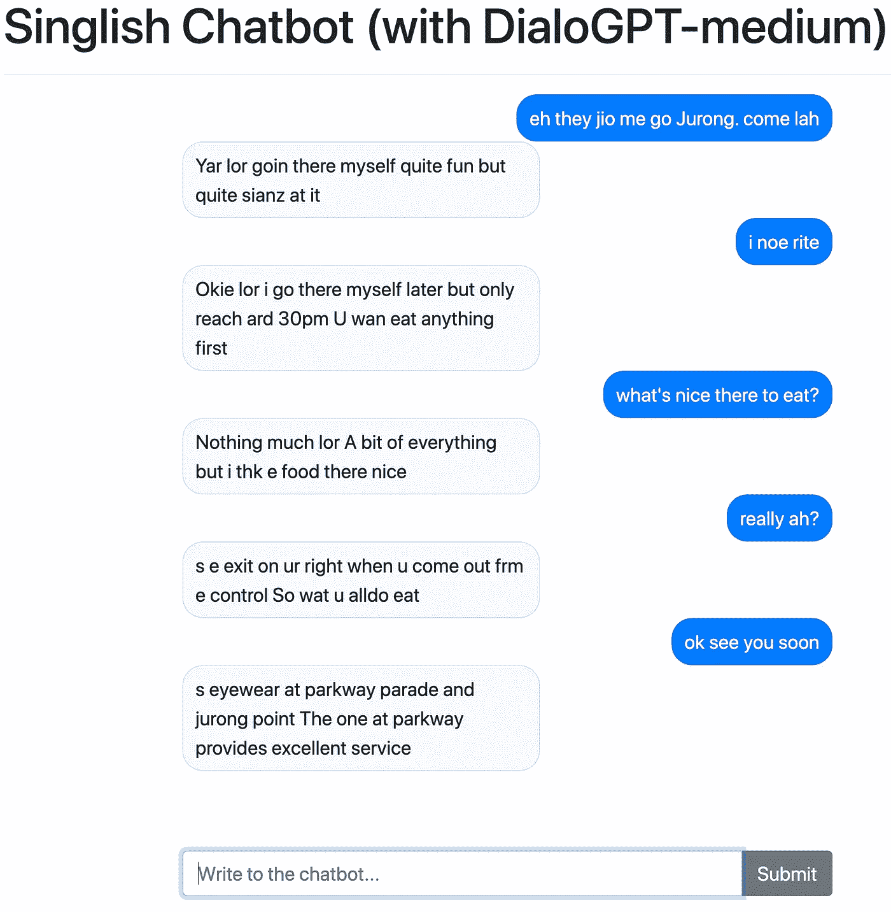
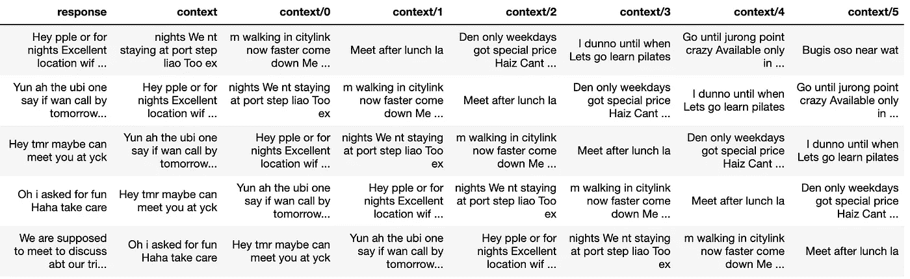
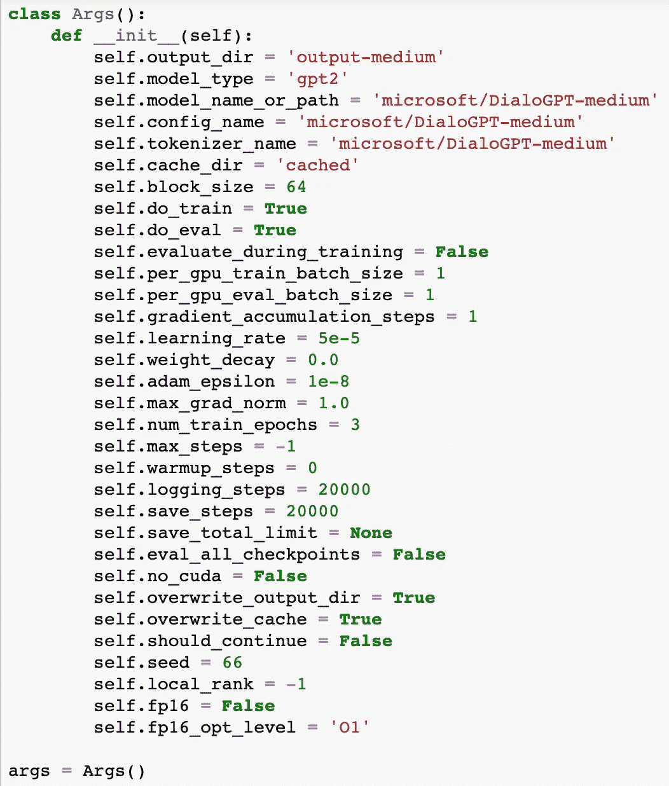
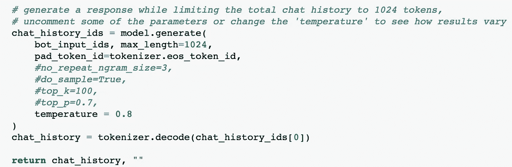
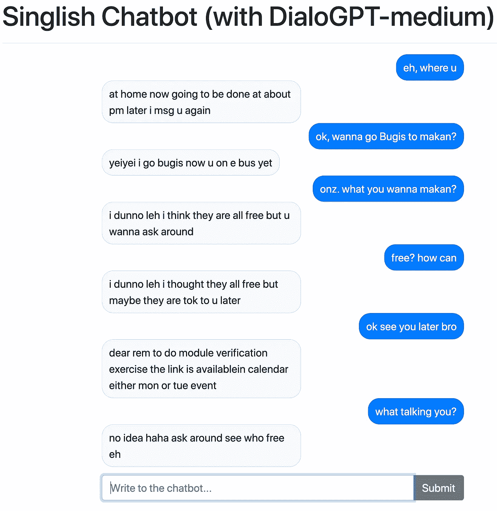

# 建造新加坡式人工智能聊天机器人的初学者指南

> 原文：<https://towardsdatascience.com/beginners-guide-to-building-a-singlish-ai-chatbot-7ecff8255ee?source=collection_archive---------29----------------------->

## 人工智能文本生成是 NLP 中最令人兴奋的领域之一，但对初学者来说也是一个令人望而生畏的领域。这篇文章旨在通过将几个现有教程合并和改编为一个实用的端到端演练，并为一个可在交互式应用程序中使用的对话聊天机器人提供笔记本和样本数据，来加快新手的学习过程。

对于非新加坡人来说,“模糊如一个 sotong”这样的新加坡式英语短语可能会令人困惑。变形金刚模型能理解吗？照片:蔡展汉

自动文本生成无疑是近年来自然语言处理中最令人兴奋的领域之一。但由于对技术知识和资源的高要求，这也是一个对新来者来说相对困难的领域。

虽然市面上并不缺少[有用的笔记本](https://huggingface.co/transformers/notebooks.html)和教程，但是将各种线索整合在一起可能会很耗时。为了帮助新来者加快学习过程，我已经整合了一个简单的[端到端项目](https://github.com/chuachinhon/practical_nlp)来创建一个简单的人工智能对话聊天机器人，你可以在一个交互式应用程序中运行。

我选择围绕聊天机器人来构建文本生成项目，因为我们对对话的反应更直观，并且可以很容易地判断自动生成的文本是否有任何好处。聊天机器人也无处不在，我们大多数人都可以很好地了解预期的基线性能，而不必咨询手册或专家。如果是坏的，你会马上知道，而不必检查分数或指标。

项目中的工作流是根据初学者的实际问题构建的:如何开始数据提取和准备，需要什么来微调预训练的 transformer 模型，以及如何在应用程序中测试/使用机器人。

正如下面一个测试运行的截图所示，最终产品并不是人们所说的“完美的”。但是作为第一个实验，结果已经足够好了(在我看来),凸显了通过[迁移学习](https://www.analyticsvidhya.com/blog/2020/07/transfer-learning-for-nlp-fine-tuning-bert-for-text-classification/)生成人工智能文本的可能性和局限性。

新加坡式聊天机器人在 Colab 上的测试截图。

# 数据、回购和要求

如果上面的对话样本让你感到困惑，那么，你可能没有去过新加坡，或者听说过“新加坡式英语”，或者新加坡口语。这是几种语言和当地俚语的大杂烩，可能会让非新加坡人感到困惑。换句话说，这是测试 DialoGPT 模型局限性的一个不错的方法。

用于微调模型的数据来自当地一所大学的新加坡学生收集的短信。虽然“新加坡式英语”的书面和口头形式可能有很大的不同，但出于实际原因，我们将把它放在一边。

在我的 [repo](https://github.com/chuachinhon/practical_nlp) 中有[数据集](https://github.com/chuachinhon/practical_nlp/blob/master/data/singlish.json)(用于训练的原始版本和干净版本)和四个相关的笔记本。笔记本根据以下任务进行拆分:

*   笔记本 [3.0](https://github.com/chuachinhon/practical_nlp/blob/master/notebooks/3.0_data_prep_cch.ipynb) :数据准备
*   笔记本 [3.1](https://github.com/chuachinhon/practical_nlp/blob/master/notebooks/3.1_finetune_bot_cch.ipynb) :在 Colab (Pro)上微调预训练的 DialoGPT-medium 模型
*   笔记本 [3.2](https://github.com/chuachinhon/practical_nlp/blob/master/notebooks/3.2_dash_chat_app_cch.ipynb) :在交互式 Dash 应用上测试模型性能
*   笔记本 [3.3](https://github.com/chuachinhon/practical_nlp/blob/master/notebooks/3.3_aitextgen_cpu_cch.ipynb) :使用 [aitextgen](https://github.com/minimaxir/aitextgen) 生成文本的 CPU 替代方案

就资源需求而言，如果你对 DialoGPT-small 模型而不是更大的版本进行微调，你可以在免费的 Google/Colab 帐户上运行这个项目。如果您使用更健壮的数据集，也许微调 DialoGPT-small 模型就足够了。

但我发现，我对较小型号进行微调的结果并不理想，而且为了避免突破免费谷歌账户的 15Gb 存储限制而不断进行的内务处理是对生产力的一种消耗。

如果你预见到自己将来会尝试更多/更大的变形金刚模型，我会推荐你升级到 Colab Pro，并增加你的谷歌账户的存储空间。这让我可以快速迭代，而不必在家里设置物理 eGPU。

为了简洁起见，我不会在这篇文章中讨论技术细节。我仍在边走边学，关于这个话题的[的](https://medium.com/huggingface/how-to-build-a-state-of-the-art-conversational-ai-with-transfer-learning-2d818ac26313)[文章](http://jalammar.github.io/illustrated-gpt2/)要好得多。大部分代码都是从以前作者的作品中摘录或改编的，它们在笔记本中也得到承认。

# 步骤 1:数据准备

该项目的第一个也是最大的问题是，你是否能为你的用例找到一个合适的数据集。用例越具体(比如说，一个特雷弗·诺亚聊天机器人)，就越难找到合适的训练数据。从一开始就应该考虑伦理问题:即使你可以接触到文字记录，用真人来模拟聊天机器人合适吗？潜在的误用可能性有多大？

这个项目中使用的匿名短信数据集是公共空间中为数不多的“新加坡式”语料库之一，也是我发现的唯一一个足够大的数据集。 [notebook3.0 的前半部分](https://github.com/chuachinhon/practical_nlp/blob/master/notebooks/3.0_data_prep_cch.ipynb)包含了从深度嵌套的 json 文件中提取 SMS 所需的步骤。如果您使用不同的数据集，请跳过此步骤。

第二部分讨论了在 DialoGPT 模型中必须准备好的训练和验证数据集的具体方法。基本上，对于每条短信，你必须创建 x 条以前的短信作为“上下文”:

点击这里查看[另一个例子](https://colab.research.google.com/drive/15wa925dj7jvdvrz8_z3vU7btqAFQLVlG)如何在构建 Rick Sanchez 机器人时准备数据。

我选择了之前的七个回答，但你可以上下调整，看看这对聊天机器人的性能有没有影响。如果这对你来说不仅仅是一个实验，我怀疑这是你将花费大量时间调整数据集以清理响应/上下文的地方。不幸的是，我还没有遇到一个好的教程，告诉我如何最好地构造或调整定制数据集来微调 DialoGPT 模型。

将响应上下文数据集分成训练集和验证集之后，就可以进行微调了。

# 步骤 2:微调对话框

微调过程中涉及到大量的代码，但由于像内森·库珀和 T2 这样的人的早期工作，训练循环可以原样使用，而新用户不必进行重大更改。当你有更多的时间时，你可以更详细地研究这些代码。[记事本 3.1](https://github.com/chuachinhon/practical_nlp/blob/master/notebooks/3.1_finetune_bot_cch.ipynb) 中需要注意的关键单元格如下:

这是您需要根据您的数据集和设置进行更改的地方。例如，您可以坚持使用[中型 DialoGPT 型号](https://huggingface.co/microsoft/DialoGPT-medium)或向下调节至[小型型号](https://huggingface.co/microsoft/DialoGPT-small)。

如果您遇到 GPU 内存不足的问题，您将不得不减少批量大小(正如我在上面的单元格中所做的那样，减少到 1)。如果你的 Google Drive 中没有太多剩余的存储空间，你必须相应地调整 logging_steps 和 save_steps 的间隔(在各个检查点保存的文件可能会在一瞬间吃掉存储空间)。

微调过程可能需要 40 分钟到大约 2 小时，具体取决于您设置的参数。请注意，即使在 Colab Pro 上也有使用限制。例如，由于 GPU 内存限制，我无法微调 DialoGPT-large 模型。Colab Pro 笔记本电脑可以运行长达 24 小时，但我还没有用更多的时间来测试。

在微调过程结束时需要注意的一个指标是[困惑分数](https://huggingface.co/transformers/perplexity.html)——衡量模型在选择下一个令牌时有多确定。分数越低越好，因为这意味着模型的不确定性越小。

通过微调 DialoGPT-medium 模型，我得到了 1.6134 的困惑分数，与使用 DialoGPT-small 模型时 6.3 到 5.7 的分数相比，这是一个显著的改进。你要跑几次才能算出可接受的分数。

你可以在笔记本的末端开始与机器人聊天(假设一切运行正常)，但我更喜欢将微调后的模型加载到应用程序中。感谢[陆星汉](https://github.com/xhlulu) @ [剧情](https://community.plotly.com/t/show-tell-dash-transformers-apps-auto-summarization-translator-and-chatbot-are-now-runnable-on-colab/42762)，为此有了一个[笔记本](https://colab.research.google.com/github/plotly/dash-sample-apps/blob/master/apps/dash-chatbot/ColabDemo.ipynb)。

# 第三步:在 DASH 应用程序中测试你微调过的模型

Plotly repo 包含在本地机器上运行[聊天机器人应用程序的代码，如果你希望这样做的话，但出于实际原因，我选择在 Colab 上运行](https://github.com/plotly/dash-sample-apps/blob/master/apps/dash-chatbot/app.py) [notebook3.2](https://github.com/chuachinhon/practical_nlp/blob/master/notebooks/3.2_dash_chat_app_cch.ipynb) (微调模型已经存在)。该代码直接从陆星汉的演示中摘录，对于那些可能想进一步试验机器人输出的人，在结尾做了一些小的改动:

“温度”允许你控制回应的创造性(或疯狂/厚颜无耻)程度。您可以通过降低 max_length(最大令牌数:1，024；默认值:256 个令牌)。您可以在这里的“使用交互脚本”一节中找到一个完整的参数列表。

这是我和聊天机器人成功对话的截图。突出显示的单元格是我的条目:

微调过的 pytorch 模型太大了(1.44Gb)，无法部署在任何免费的主机帐户上，所以(目前)你没有办法在 web 应用程序上尝试这个特殊的新加坡式聊天机器人。

我的观点是:“新加坡式”聊天机器人还没有准备好进入黄金时段。它有时会给出令人惊讶的好的回应，但在几次交流之后就无法继续努力了。正如你在上面的截图中所看到的，事情在接近尾声时变得不稳定。有了更丰富的数据集和足够的计算来训练一个 DialoGPT-large 模型，响应可能会变得更好。

但是作为一个实验，我不得不说性能一点也不差。

# 额外的一步:CPU 替代自动文本生成

如果您不想使用 Colab 和/或将数据和微调限制在本地机器上，那么有很多替代方法。我将重点介绍我一直在试验的一个 Python 库——[aitextgen](https://github.com/minimaxir/aitextgen)——它为纯 CPU 训练提供了一个选项。

[笔记本 3.3](https://github.com/chuachinhon/practical_nlp/blob/master/notebooks/3.3_aitextgen_cpu_cch.ipynb) 概述了一个在本项目中使用相同 SMS 数据集的简单示例。我之前曾尝试用 aitextgen 处理其他数据集，包括新加坡政治演讲的 YouTube 文本。不幸的是，到目前为止我还没有得到非常满意的结果。

我可能没用对。你可能会有更好的运气。一个 [itextgen 也可以在 Colab](https://colab.research.google.com/drive/15qBZx5y9rdaQSyWpsreMDnTiZ5IlN0zD?usp=sharing) 上运行。

希望这篇文章和附带的笔记本能帮助你快速开始你自己的人工智能聊天机器人实验。更难的是弄清楚如何提高它的性能，或者确保它对公众使用是安全的。

还有一些相关的技术问题需要探索，例如为部署而精简模型，或者更高级的交互式应用设计，可以在聊天机器人中带来更多功能。如果你对以上话题有什么建议，或者发现了这篇文章中的错误，请联系我:

推特:[蔡钦汉](https://medium.com/u/b3d8090c0aee?source=post_page-----aad7f2e1d0a0----------------------)

领英:[www.linkedin.com/in/chuachinhon](http://www.linkedin.com/in/chuachinhon)