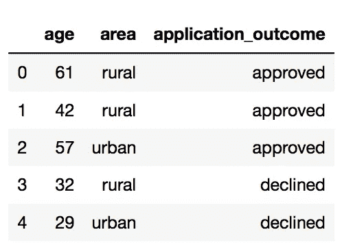
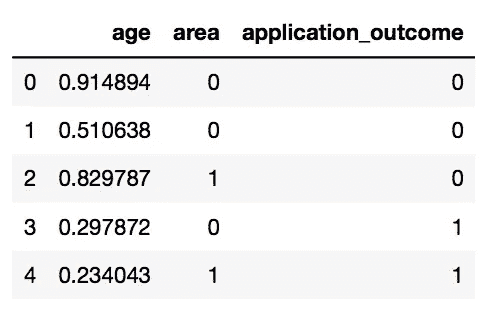
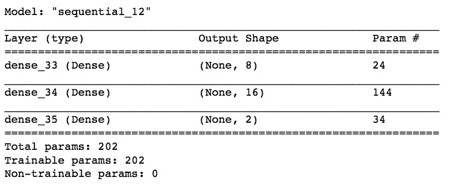
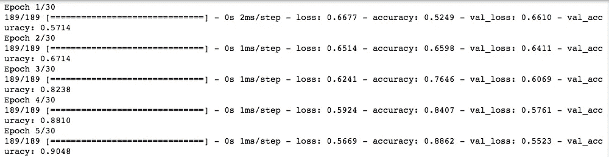
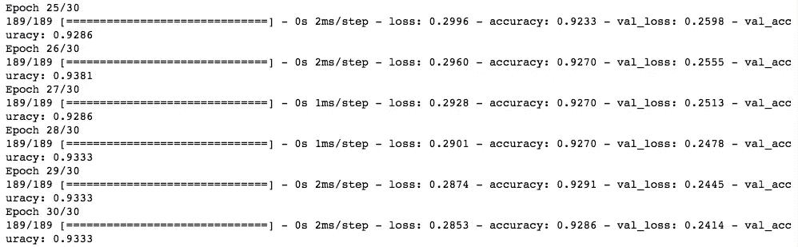
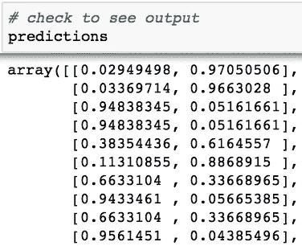
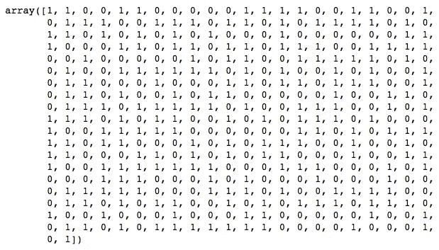

# 使用 Python 中的 Keras 构建人工神经网络的初学者指南

> 原文：<https://towardsdatascience.com/beginners-guide-to-building-artificial-neural-networks-using-keras-in-python-bdc4989dab00?source=collection_archive---------19----------------------->

## 初学者的深度学习

## 创建网络架构、训练、验证和保存模型并使用它进行推理的提示和技巧。


图片由 [Gerd Altmann](https://pixabay.com/users/geralt-9301/?utm_source=link-attribution&amp;utm_medium=referral&amp;utm_campaign=image&amp;utm_content=3537401) 从 [Pixabay](https://pixabay.com/?utm_source=link-attribution&amp;utm_medium=referral&amp;utm_campaign=image&amp;utm_content=3537401) 拍摄

# 为什么是 Keras，而不是 Tensorflow？

> 如果你在问“我应该用 keras 还是 tensorflow？”，你问错问题了。

当我第一次开始我的深度学习之旅时，我一直认为这两者是完全独立的实体。好吧，截至[2017 年年中](https://github.com/keras-team/keras/issues/5050)，他们不是！ **Keras，一个神经网络 API，现在已经完全集成在 TensorFlow** 中。那是什么意思？

这意味着您可以在使用高级 Keras API 或低级 TensorFlow API 之间进行选择。**高级**-**API**在一个命令中提供更多的功能，并且更易于使用(与低级 API 相比)，这使得它们甚至对于非技术人员也是可用的。**低级 API**允许高级程序员在非常精细的**级别**上操作模块内的功能，从而允许为新颖的解决方案定制实现。

*注意:出于本教程的目的，我们将只使用 Keras！*

# 让我们直接进入编码

我们首先在机器上安装 Keras。正如我之前所说，Keras 集成在 TensorFlow 中，因此您所要做的就是在您的终端(Mac OS)中`pip install tensorflow`访问 Jupyter 笔记本中的 Keras。

## 资料组

我们将使用贷款申请数据集。它有两个预测特征，一个连续变量- `age`和一个分类变量- `area`(农村与城市)，以及一个二元结果变量`application_outcome`，可以取值 0(批准)或 1(拒绝)。

```
import pandas as pddf = pd.read_csv('loan.csv')[['age', 'area', 'application_outcome']]
df.head()
```



我们数据集中的样本。

## 预处理数据

为了避免过度拟合，我们将使用`MinMaxScaler`在 0 和 1 之间缩放`age`，并使用`Sklearn`工具包中的`LabelEncoder`对`area`和`application_outcome`特征进行标签编码。我们这样做是为了将所有输入要素放在同一个比例上。

```
from sklearn.preprocessing import LabelEncoder, MinMaxScaler
from itertools import chain# Sacling the Age column
scaler = MinMaxScaler(feature_range = (0,1))a = scaler.fit_transform(df.age.values.reshape(-1, 1))
x1 = list(chain(*a))# Encoding the Area, Application Outcome columns
le = LabelEncoder()x2 = le.fit_transform(df.area.values)
y = le.fit_transform(df.application_outcome) # Updating the df
df.age = x1
df.area = x2
df.application_outcome = ydf.head()
```



来自我们的**缩放的**数据集的样本

如果您阅读了 [Keras 文档](https://www.tensorflow.org/api_docs/python/tf/keras/Sequential#fit)，它要求输入数据是 NumPy 数组类型。这就是我们现在要做的！

```
scaled_train_samples = df[['age', 'area']].values
train_labels = df.application_outcome.valuestype(scaled_train_samples) *# numpy.ndarray*
```

## 生成模型架构

建立 Keras 模型有两种方式:*顺序*(最基本的一种)和*泛函(复杂网络用*)。

我们将创建一个**序列模型**，它是一个线性层叠。也就是说，顺序 API 允许你逐层创建模型。在大多数情况下，它非常适合开发深度学习模型。

```
# Model architecturemodel_m = Sequential([
    Dense(units = 8, input_shape= (2,), activation = 'relu'),
    Dense(units = 16, activation = 'relu'),
    Dense(units = 2, activation = 'softmax') 
])
```

在这里，**第一密集层**实际上是第二层*整体*(因为实际的第一层将是我们从原始数据中输入的层)但是**第一“隐藏”层**。它有 8 个单元/神经元/节点，8 个是任意选择的！

`input_shape`参数是您必须根据您的数据集分配的。直观地说，就是网络应该期望的输入数据的形状。我喜欢把它想成— *“我正在馈入神经网络的一个* ***单个*** *行数据是什么形状？”。*

在我们的例子中，**输入**的一行看起来像`[0.914, 0]`。即它是一维的。因此，`input_shape`参数看起来像一个元组(2，)，其中 2 指的是数据集中的要素数量(`age`和`area`)。**因此，输入层需要一个包含 2 个输入元素的一维数组。它将产生 8 个输出作为回报。**

如果我们正在处理，比如说黑白 2×3 像素图像(我们将在下一篇关于卷积神经网络的教程中研究[，我们将会看到输入的一行(或**向量表示单个图像**)看起来像`[[0 , 1, 0] , [0 , 0, 1]`，其中 0 表示像素是亮的，1 表示像素是暗的。即，它是二维的。随后，`input_shape`参数将等于(2，3)。](/beginners-guide-to-building-convolutional-neural-networks-using-tensorflow-s-keras-api-in-python-6e8035e28238)

*注意:在我们的例子中，我们的输入形状只有一个维度，所以您不一定需要以元组的形式给出它。相反，你可以给* `*input_dim*` *作为标量数。因此，在我们的模型中，我们的输入层有两个元素，我们可以使用这两个中的任何一个:*

*   `*input_shape=(2,)*` *-当你只有一个维度时，逗号是必要的*
*   `*input_dim = 2*`

围绕输入形状参数的一个**普遍误解**是，它必须包括我们输入到神经网络的输入样本总数(在我们的例子中是 10，000)。

> 训练数据中的行数是网络输入形状的**而不是**部分，因为训练过程每批向网络提供一个样本(或者更准确地说，每批的 batch_size 样本)。

**第二个“隐藏”层**是另一个密集层，具有与第一个隐藏层相同的*激活功能*，即“relu”。激活函数确保传递的值位于可调的预期范围内。[整流线性单元](https://machinelearningmastery.com/rectified-linear-activation-function-for-deep-learning-neural-networks/)(或 relu)功能返回直接作为输入提供的值，如果输入为 0.0 或更小，则返回值 0.0。

你可能想知道为什么我们没有为这个层指定`input_shape`参数。毕竟，Keras 需要知道它们输入的形状，以便能够创建它们的权重。事实是，

> 无需为第二(或后续)隐藏层指定`input_shape`参数，因为它会根据架构(即每层的单元和特性)自动计算输入节点的最佳数量。

最后，我们的顺序模型中的第三个或最后一个隐藏层是另一个具有 softmax 激活功能的密集层。softmax 函数返回两个类的输出概率— `approved`(输出= 0)和`rejected`(输出= 1)。

模型摘要如下所示:

```
model_m.summary()
```



我们的顺序模型的总结

让我们看看如何计算每一层的参数总数，即`Param #`。请记住，在每一层中，我们还有一个[偏置神经元](https://stackoverflow.com/questions/2480650/what-is-the-role-of-the-bias-in-neural-networks)(除了在模型架构中预先指定的神经元之外)。因此，在第一个隐藏层中，我们有 3 个输入神经元(2 个来自输入数据特征的神经元+ 1 个偏置神经元)和 8 个输出神经元。因此，总共需要训练 8*3 = 24 个参数。类似地，在第二隐藏层中，我们现在有 9 个输入神经元(8 个来自第一隐藏层加上 1 个偏置神经元)和 16 个输出神经元，总共 16*9 = 144 个可训练参数。最后，最后一层将具有 17*2=34 个可训练参数。

## 为培训准备模型

```
model_m.compile(optimizer= Adam(learning_rate = 0.0001), 
              loss = 'sparse_categorical_crossentropy', 
              metrics = ['accuracy'] 
             )
```

在我们开始用实际数据训练我们的模型之前，我们必须用某些参数`compile`模型。在这里，我们将使用亚当`optimizer`。

> 优化器的可用选择包括 SGD、Adadelta、Adagrad 等。

`loss`参数指定应该在每次迭代中监控交叉熵损失。`metrics`参数表示我们希望根据精确度来判断我们的模型。

## 训练和验证模型

```
# training the model
model_m.fit(x = scaled_train_samples_mult, 
          y = train_labels, 
          batch_size= 10, 
          epochs = 30, 
          validation_split= 0.1, 
          shuffle = True,
          verbose = 2 
         )
```

`x`和`y`参数非常直观——分别是预测变量和结果变量的 NumPy 数组。`batch_size`指定一个批次中包含多少个样本。`epochs=30`表示模型将在*所有数据*上训练 30 次。`verbose = 2`表示它被设置为输出消息中最详细的级别。

我们正在使用 0.1 `validation_split`动态创建一个验证集，即在每个时期保留 10%的训练数据，并将其排除在训练之外。这有助于检查我们模型的可推广性，因为通过获取训练集的子集，模型仅在训练数据上学习*而在验证数据上进行测试。*

> 请记住，验证拆分发生在训练集被打乱之前，即在验证集被取出后，只有训练集被打乱。如果在数据集的末尾有所有被拒绝的贷款申请，这可能意味着您的验证集有对类的错误描述。所以你必须自己洗牌，而不是依靠 keras 来帮你！

这是**前五个纪元**的样子:



这是**最后五个纪元**的样子:



如您所见，在第一个时期，我们从验证集的高损失(0.66)和低准确度(0.57)开始。渐渐地，我们能够减少损失(0.24)并提高最后一个时期验证集的准确性(0.93)。

## 对测试集进行推理

我们以类似于训练集的方式对之前未见过的测试集进行预处理，并将其保存在`scaled_test_samples`中。相应的标签存储在`test_labels`中。

```
predictions = model.predict(x = scaled_test_samples, 
                            batch_size= 10,
                            verbose=0)
```

> 确保选择与培训过程中使用的`batch_size`完全相同的产品。

由于我们的最后一个隐藏层有一个 softmax 激活函数，`predictions`包括两个类的输出概率(左边是类 0 的概率(即批准的)，右边是类 1 的概率(即拒绝的)。



当最终层具有 softmax 激活时，来自 ANN 的预测。

从这里开始有几种方法。您可以选择一个任意的阈值，比如 0.7，并且只有当类别 0(即批准)的概率超过 0.7 时，您才应该选择批准贷款申请。或者，您可以选择概率最高的类作为最终预测。例如，根据上面的截图，该模型预测贷款将有 2%的概率被批准，但有 97%的概率被拒绝。因此，最后的推论应该是，此人的贷款被拒绝。我们将采取后者。

```
# get index of the prediction with the highest probrounded_pred = np.argmax(predictions, axis = 1)
rounded_pred
```



为测试集所做的预测

## 保存和加载 Keras 模型

为了**保存** **来自已训练模型的所有内容**:

```
model.save('models/LoanOutcome_model.h7')
```

我们基本上保存了我们训练模型
1 的所有内容。架构(神经元的层数等)
2。学习的重量
3。训练配置(optimizers，loss)
4。优化器的状态(便于重新训练)

要加载我们刚刚保存的模型:

```
from tensorflow.keras.models import load_model
new_model = load_model('models/LoanOutcome_model.h7')
```

为了**只保存** **的架构**:

```
json_string = model.to_json()
```

从先前存储的架构中重建新模型:

```
from tensorflow.keras.models import model_from_json
model_architecture = model_from_json(json_string)
```

只保存重量:

```
model.save_weights('weights/LoanOutcome_weights.h7')
```

要将权重用于其他模型架构:

```
model2 = Sequential([
    Dense(units=16, input_shape=(1,), activation='relu'),
    Dense(units=32, activation='relu'),
    Dense(units=2, activation='softmax')
])# retrieving the saved weights
model2.load_weights('weights/LoanOutcome_weights.h7')
```

现在我们有了。我们已经成功地建立了我们的第一个人工神经网络，并对其进行了训练、验证和测试，还成功地将其保存下来以备将来使用。在下一篇文章的[中，我们将通过卷积神经网络(CNN)来处理图像分类任务。](/beginners-guide-to-building-convolutional-neural-networks-using-tensorflow-s-keras-api-in-python-6e8035e28238)

在那之前:)

[](/beginners-guide-to-building-convolutional-neural-networks-using-tensorflow-s-keras-api-in-python-6e8035e28238) [## 使用 TensorFlow 的 Keras API 在 Python 中构建卷积神经网络的初学者指南

### 解释具有 MaxPool2D、Conv2D 和 Dense 图层的端到端二值图像分类模型。

towardsdatascience.com](/beginners-guide-to-building-convolutional-neural-networks-using-tensorflow-s-keras-api-in-python-6e8035e28238) [](/step-by-step-guide-to-explaining-your-ml-project-during-a-data-science-interview-81dfaaa408bf) [## 在数据科学面试中解释你的 ML 项目的逐步指南。

### 在结尾有一个额外的样本脚本，让你谨慎地展示你的技术技能！

towardsdatascience.com](/step-by-step-guide-to-explaining-your-ml-project-during-a-data-science-interview-81dfaaa408bf) [](/deploying-h2o-models-as-apis-using-flask-42065a4fa567) [## 使用 FLASK 将 H2o 模型部署为 API

### 模型训练、调优和创建简单 API 的端到端示例(没有技术术语)。

towardsdatascience.com](/deploying-h2o-models-as-apis-using-flask-42065a4fa567) [](/time-series-analysis-using-pandas-in-python-f726d87a97d8) [## 使用 Python 中的 Pandas 进行时间序列分析

### 对季节性、趋势、自相关等关键词的额外介绍。

towardsdatascience.com](/time-series-analysis-using-pandas-in-python-f726d87a97d8)