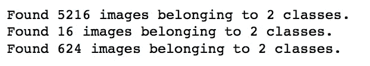
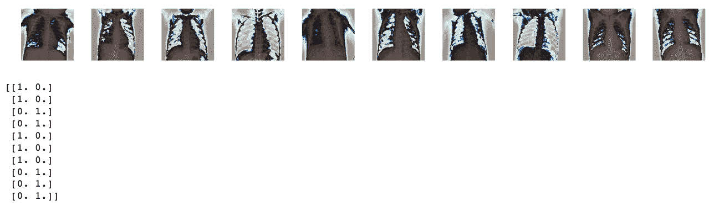
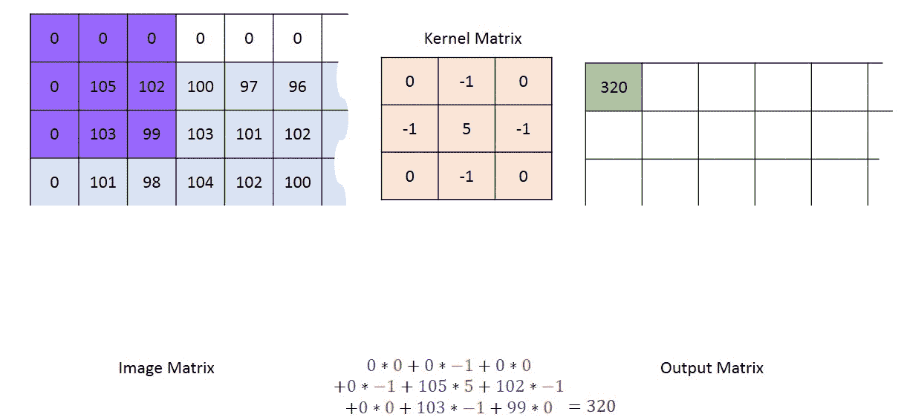
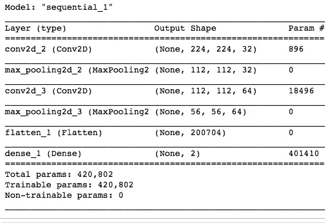
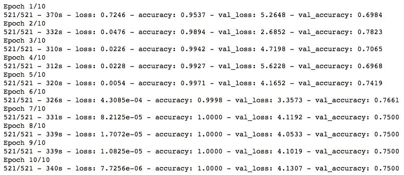
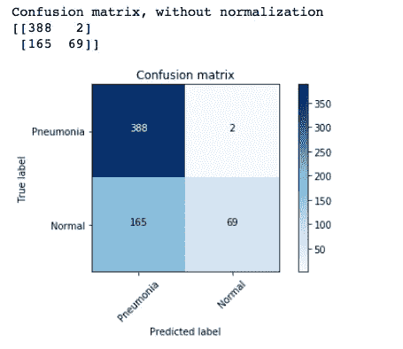

# 使用 TensorFlow 的 Keras API 在 Python 中构建卷积神经网络的初学者指南

> 原文：<https://towardsdatascience.com/beginners-guide-to-building-convolutional-neural-networks-using-tensorflow-s-keras-api-in-python-6e8035e28238?source=collection_archive---------12----------------------->

## 初学者的深度学习

## 解释具有 MaxPool2D、Conv2D 和 Dense 图层的端到端二值图像分类模型。


来自 [Pixabay](https://pixabay.com/?utm_source=link-attribution&amp;utm_medium=referral&amp;utm_campaign=image&amp;utm_content=3537401) 的[皮特·林弗斯](https://pixabay.com/users/thedigitalartist-202249/)的图片

欢迎来到神经网络系列的第 2 部分！在第 1 部分的[中，我们使用 Keras API 研究了一个人工神经网络(ann)。我们讨论了顺序网络架构、激活函数、隐藏层、神经元等。最后用一个端到端的例子来预测贷款申请是被批准还是被拒绝。](/beginners-guide-to-building-artificial-neural-networks-using-keras-in-python-bdc4989dab00)

在本教程中，我们将学习如何使用 Keras API 创建卷积神经网络(CNN)。为了让它更直观，我将解释这个网络的每一层是做什么的，并提供一些提示和技巧来简化你的深度学习之旅。我们在本教程中的目的是建立一个基本的 CNN，它可以对胸部 x 光图像进行分类，并确定它是正常的还是患有肺炎。鉴于新冠肺炎疫情，我认为这将成为一个有趣的项目，即使是你的数据科学采访！

我们开始吧！

# 什么时候应该使用卷积神经网络而不是人工神经网络？

> 当数据可以以空间方式表示时，比如说以 MxN 像素表示的图像，CNN 工作得最好。如果你的数据在把你的任何一个专栏互相洗牌后仍然有用，那么你就不能使用 CNN。

例如，如果您回忆一下第 1 部分中的贷款申请数据集，它有两列(或特性)，即`age`和`area`，如果我交换这两列(在将它提供给我的网络之前)，对我的数据集没有任何影响。因此，人工神经网络是这种数据集的首选。相反，如果我交换我的图像中的列(本质上是像素阵列)，我肯定会弄乱我的实际图像。因此，使用人工神经网络是一大禁忌，你必须使用 CNN。

# 让我们直接进入编码...

我们首先在机器上安装 Keras。正如我在第 1 部分中讨论的，Keras 集成在 TensorFlow 中，所以您所要做的就是在您的终端(Mac OS)中使用`pip install tensorflow`来访问 Jupyter 笔记本中的 Keras。要检查 Tensorflow 的版本，请使用`tf.__version__`。

# 导入库

```
import tensorflow as tf
from tensorflow import keras
from tensorflow.keras.models import Sequential
from tensorflow.keras.layers import Activation, Dense, Flatten, BatchNormalization, Conv2D, MaxPool2D
from tensorflow.keras.optimizers import Adam
from tensorflow.keras.metrics import categorical_crossentropy
from sklearn.metrics import confusion_matrix
from tensorflow.keras.preprocessing.image import ImageDataGeneratorimport numpy as np
import itertools
import os
import randomimport matplotlib.pyplot as plt
%matplotlib inline
```

# 资料组

我们将使用[胸部 x 光图像](https://www.kaggle.com/paultimothymooney/chest-xray-pneumonia) Kaggle 数据集。下载并解压缩后，您将看到**胸部 x 光文件夹**，其中包含整齐地组织到训练、有效和测试子文件夹中的图像。每个子文件夹包含两个子文件夹，一个用于`normal`胸部 x 射线，另一个用于指示`pneumonia`的 x 射线。

*注意:确保* ***chest_xray 文件夹*** *和你的 Python Jupyter 笔记本在同一个目录下。*

设置训练、验证和测试文件夹的路径:

```
train_path = "chest_xray/train"
test_path = "chest_xray/test"
valid_path = "chest_xray/val"
```

> 注意:如果您收集了自己的数据集&它没有整齐地组织到 train、valid 和 test 文件夹中，不必担心！只需确保(a)您已将所有图像(正常和肺炎)保存在一个名为“胸部 x 射线”的公共文件夹中，并且(b)图像名称包含两个词中的一个——正常或肺炎。在此基础上，使用下面的代码片段将图像组织成训练集、有效集和测试集。

```
# Organize data into train, valid, test directories
os.chdir('data/chest_xrays')
if os.path.isdir('train/normal') is False:
    os.makedirs('train/normal')
    os.makedirs('train/pneumonia')
    os.makedirs('valid/normal')
    os.makedirs('valid/pneumonia')
    os.makedirs('test/normal')
    os.makedirs('test/pneumonia')

    for i in random.sample(glob.glob('pneumonia*'), 500):
        shutil.move(i, 'train/pneumonia')      
    for i in random.sample(glob.glob('normal*'), 500):
        shutil.move(i, 'train/normal')
    for i in random.sample(glob.glob('pneumonia*'), 100):
        shutil.move(i, 'valid/pneumonia')        
    for i in random.sample(glob.glob('normal*'), 100):
        shutil.move(i, 'valid/normal')
    for i in random.sample(glob.glob('pneumonia*'), 50):
        shutil.move(i, 'test/pneumonia')      
    for i in random.sample(glob.glob('normal*'), 50):
        shutil.move(i, 'test/normal')

os.chdir('../../')
```

# 预处理图像数据

我们需要将数据转换成模型期望的格式。所以我们必须把我们的图像转换成 T2 的格式。简而言之，我们将使用`ImageGenerator`类中的`flow_from_directory()`函数从 train、test 和 valid 目录创建*批处理*。使用`fit`函数将这些批数据传递给顺序模型。(以前，在第 1 部分构建 ann 时，我们将 NumPy 数组传递给 fit 函数，但现在我们需要将批处理传递给 fit 函数)。

作为预处理的一部分(在创建批处理之前)，我们将应用`preprocessing_function = tf.keras.applications.vgg16.preprocess_input`。这将按照图像传递到 vgg16 模型(2014 年赢得 ImageNet 竞赛的 CNN 模型)时处理图像的相同方式来处理我们的图像。

```
*# Creating train, test and valid batches from the respective directories*train_batches = ImageDataGenerator(preprocessing_function=tf.keras.applications.vgg16.preprocess_input).flow_from_directory(directory=train_path, target_size=(224,224), classes=['pneumonia', 'normal'], batch_size=10)valid_batches = ImageDataGenerator(preprocessing_function=tf.keras.applications.vgg16.preprocess_input).flow_from_directory(directory=valid_path, target_size=(224,224), classes=['pneumonia', 'normal'], batch_size=10)test_batches = ImageDataGenerator(preprocessing_function=tf.keras.applications.vgg16.preprocess_input).flow_from_directory(directory=test_path, target_size=(224,224), classes=['pneumonia', 'normal'], batch_size=10, shuffle=False)
```

`target_size`指定我们希望图像调整到的高度和宽度。这很重要，因为我们的数据集中可能有不同大小的图像。

`batch_size`被设置为 10，并且 10 的选择是任意的。32 中使用的另一个常见批量值，但理想情况下，最佳值应该通过超参数调整找到(我们将在下一个教程中学习如何做到这一点)。

> 批量大小指定了在更新神经网络的权重之前 **一次应该将多少训练样本传递给神经网络。**

我们还为测试集只指定了`shuffle = False`**，因为稍后当我们测试我们的模型时，我们想要访问未混淆的标签来绘制我们的混淆矩阵。默认情况下，shuffle 设置为 True。**

****

***注意:如果你在运行上面的代码时看到* `*Found 0 images beloning to 2 classes*` *，很可能你指向了错误的目录！解决这个问题，它应该工作正常！***

# **可视化图像数据:**

**使用 TensorFlow 的[文档](https://www.tensorflow.org/tutorials/images/classification#visualize_the_data)中的绘图助手功能。**

```
*# plot images in the form of a 1 by 10 grid and resize img to 20x20*
def plotImages(images_arr):
    fig, axes = plt.subplots(1, 10, figsize=(20,20))
    axes = axes.flatten()
    for img, ax in zip( images_arr, axes):
        ax.imshow(img.astype(np.uint8))
        ax.axis('off')
    plt.tight_layout()
    plt.show()
```

**Newt，我们将使用 Python 函数`next()`从训练集中抓取一批图像和相应的标签。由于我们设置了`batch_size = 10`，我们将看到在`imgs`中有 10 个图像，在`labels`中有 10 个相应的标签。**

```
imgs, labels = next(train_batches)plotImages(imgs)
print(labels)
```

***注意:* `*imshow*` *期望输入在* `*[0, 1]*` *或* `*[0, 255]*` *的范围内，所以如果输入数组没有这个范围，它将削波输入。因此，我们在显示时显式地将图像转换为* `*np.int8*` *格式。***

****

***注意:图像可能看起来与你的目录中的有一点不同(可能有点失真)，但那是因为我们对它执行了一些 vgg16 预处理步骤。***

**标签是指示图像是肺炎还是正常的一次性编码向量。A `[1 0]`代表肺炎，而`[0 1]`代表正常 x 光。**

# **生成模型架构**

**回想一下，当我们在第 1 部分中构建一个用于预测贷款申请结果的人工神经网络时，我们介绍了一个**序列模型**。简而言之，顺序 API 允许你逐层创建模型。**

```
model = Sequential([
    Conv2D(filters=32, kernel_size=(3, 3), activation='relu', padding = 'same', input_shape=(224,224,3)),
    MaxPool2D(pool_size=(2, 2), strides=2),
    Conv2D(filters=64, kernel_size=(3, 3), activation='relu', padding = 'same'),
    MaxPool2D(pool_size=(2, 2), strides=2),
    Flatten(),
    Dense(units=2, activation='softmax')
])
```

****第一个隐藏层**是标准卷积层`Conv2D`，有 32 个滤波器，每个滤波器的核大小为 3x3。请记住，每个过滤器都专用于识别图像的某些方面，比如过滤器 1 检测胸腔的垂直边界，过滤器 2 检测胸腔的对角线边界，等等...随着时间的推移，随着我们深入网络的卷积层，过滤器编码的模式将变得复杂。**

***注:32 的选择是任意的！***

> **一个**内核**是一个由数字组成的小网格，你将它传递给你的整个图像，即你输入图像中的所有像素，并根据这些数字进行转换。**

**通过在内核中使用不同的数字，您可以执行不同类型的图像预处理(在图像识别期间)，如对比度、模糊、锐化或边缘检测。一般来说，内核比映像小，3x3 是相当常见的选择！**

****

**Gif 展示了一个 3x3 内核如何通过整个图像。来源:[https://www . machine learning uru . com//computer _ vision/basics/convolution/convolution _ layer . html](https://www.machinelearninguru.com//computer_vision/basics/convolution/convolution_layer.html)**

**当内核到达图像的边缘时，它必须决定在输入图像中没有像素的地方做什么。现在，我们继续用*零填充*边缘，使用`padding = 'same'`实现。零填充意味着在图像外部提供一个零缓冲(如上面的 gif 图像所示)。这有助于确保卷积操作后输入图像的[维度不会减少。](https://deeplizard.com/learn/video/qSTv_m-KFk0)**

***注意:根据内核大小和图像大小，你可能需要做两到三层厚的垫子。***

**从第 1 部分，您已经知道我们如何根据自己的数据集得出`input_shape`参数。基本上，它可以被认为是一个*单个*图像的形状，该图像被馈送到网络，在我们的例子中是 224x224x3(高度=宽度= 224，3 是颜色通道，更准确地说是 RGB 分量)。您可以通过使用给出元组`(224,224,3)`作为答案的`imgs[0].shape`检查`imgs`中随机元素(比如第一个元素)的形状来验证这是否正确。**

**最后，对于第一个隐藏层，我们有`relu`激活函数(在第一部分讨论过)。总的来说，激活函数确保传递的值在可调的预期范围内。[整流线性单元](https://machinelearningmastery.com/rectified-linear-activation-function-for-deep-learning-neural-networks/)(或 relu)函数返回直接作为输入提供的值，或者如果输入为 0.0 或更小，则返回值 0.0。**

****第二个隐藏层**是最大池层`MaxPool2D`，主要用于降低数据的维度。其方法是从过滤后的图像(来自卷积/RELU 层)中选择一个窗口大小(`pool_size = 2x2`)，然后用该窗口中的最高值替换其中的 4 个像素。接下来，向右(或向下或向上)移动两步`stride`，用最高值替换这 4 个像素。等等，直到整个图像被覆盖。**

****

**MaxPooling 的例子。[来源](https://www.google.com/url?sa=i&url=https%3A%2F%2Fcomputersciencewiki.org%2Findex.php%2FMax-pooling_%2F_Pooling&psig=AOvVaw2fEdtSyGyTeKglezNZfqnb&ust=1599290533375000&source=images&cd=vfe&ved=0CAMQjB1qFwoTCLifsdP7zusCFQAAAAAdAAAAABAD)**

****第三**和**第四隐藏层**又分别是`Conv2D`和`MaxPool2D`。**

***注意:第二个* `*Conv2D*` *图层有* `*filters = 64*` *，是第一个* `*Conv2D*` *图层滤镜数量的两倍(其中有 32 个滤镜)。当我们进入网络的较后的层时，这种功能的增加是一种常见的做法。***

**最后，我们`flatten`卷积层的输出，并通过`units = 2`(对应于输出类`pneumonia`和`normal`)和`softmax`激活将其传递给`Dense`层。softmax 函数返回两个类的输出概率。(关于 softmax 激活的详细描述，请在此处阅读)。**

**模型摘要如下所示:**

```
model.summary()
```

****

# **为培训准备模型**

```
model.compile(optimizer=Adam(learning_rate=0.0001), loss='categorical_crossentropy', metrics=['accuracy'])
```

**在我们开始用实际数据训练我们的模型之前，我们必须用某些参数`compile`模型。这里，我们将使用 Adam `optimizer`。`loss`参数指定在每次迭代中应该监控分类交叉熵损失。`metrics`参数表示我们希望根据精确度来判断我们的模型。**

# **训练和验证模型**

***注意:当下面的代码运行时，你可以很容易地去喝杯咖啡什么的。在 CPU 上，每个时期花费我大约 5 分钟，所以运行 10 个时期大约需要 50 分钟。***

```
*# recall that we set batch_size = 10 during preprocessing* batch_size = 10 

model.fit(
    x = train_batches, 
    steps_per_epoch=train_batches.samples // batch_size, 
    epochs=10, 
    validation_data=valid_batches, 
    validation_steps=valid_batches.samples // batch_size,
    verbose=2)
```

**如果你仔细观察，我们没有明确地为训练集声明标签(就像我们在第一部分中使用`y`参数为 ann 所做的那样)，原因是它们已经包含在`train_batches`迭代器中。**

**`steps_per_epoch`是根据你的训练数据计算出来的。例如，如果我们的训练集中的样本数是 1000，批量大小是 20，那么通过除以 1000/20 = 50 来计算`steps_per_epoch`。**

**更正式地说，**

> **steps_per_epoch **它通常应等于 **ceil(样本数/批量大小)**。****

**此外，既然我们正在通过`validation_data = valid_batches`，我们也需要通过`validation_steps`。它与`steps_per_epoch`参数完全一样，但主要是关于验证数据(而不是训练数据)。**

**这是模型训练的输出，根据输出消息将`verbose`设置为最高级别:**

****

**如您所见，由于训练集准确率为 100%,训练集损失几乎可以忽略不计，但验证集的准确率仅为 75%,因此肯定存在一些过度拟合。但是，嘿，即使有这样一个基本的模型架构和只有六个隐藏层，这一点也不差，首先！**

**如果你想达到更高的精度(~92%)，使用更深的模型架构，就像这里描述的。**

**减少过度拟合的另一个很棒的方法是使用退出和批量正则化，我们将在下一个教程中讨论。**

# ****对测试集进行推理****

```
*# making predictions* predictions = model.predict(x = test_batches, verbose=0)
```

**直接使用 [Scikit 学习文档](https://scikit-learn.org/stable/auto_examples/model_selection/plot_confusion_matrix.html#sphx-glr-auto-examples-model-selection-plot-confusion-matrix-py)中的绘图功能:**

```
def plot_confusion_matrix(cm, classes,
                          normalize=False,
                          title='Confusion matrix',
                          cmap=plt.cm.Blues):
    """
    This function prints and plots the confusion matrix.
    Normalization can be applied by setting `normalize=True`.
    """
    plt.imshow(cm, interpolation='nearest', cmap=cmap)
    plt.title(title)
    plt.colorbar()
    tick_marks = np.arange(len(classes))
    plt.xticks(tick_marks, classes, rotation=45)
    plt.yticks(tick_marks, classes)if normalize:
        cm = cm.astype('float') / cm.sum(axis=1)[:, np.newaxis]
        print("Normalized confusion matrix")
    else:
        print('Confusion matrix, without normalization')print(cm)thresh = cm.max() / 2.
    for i, j in itertools.product(range(cm.shape[0]), range(cm.shape[1])):
        plt.text(j, i, cm[i, j],
            horizontalalignment="center",
            color="white" if cm[i, j] > thresh else "black")plt.tight_layout()
    plt.ylabel('True label')
    plt.xlabel('Predicted label')
```

## **使用混淆矩阵可视化预测结果**

```
*# confusion matrix*
cm = confusion_matrix(y_true=test_batches.classes, y_pred=np.argmax(predictions, axis=-1))plot_confusion_matrix(cm, classes = ['Pneumonia', 'Normal'])
```

****

**这就是我们的第一个用于 Python 二进制图像分类的 CNN 模型。请参考第 1 部分，了解如何保存优化器的模型架构、权重和状态。在下一个教程中，我们将学习如何提高 CNN 和 ann 对测试数据的准确性。**

**在那之前:)**

**[](/beginners-guide-to-building-artificial-neural-networks-using-keras-in-python-bdc4989dab00) [## 使用 Python 中的 Keras 构建人工神经网络的初学者指南

### 创建网络架构、训练、验证和保存模型并使用它进行推理的提示和技巧。

towardsdatascience.com](/beginners-guide-to-building-artificial-neural-networks-using-keras-in-python-bdc4989dab00) [](/step-by-step-guide-to-explaining-your-ml-project-during-a-data-science-interview-81dfaaa408bf) [## 在数据科学面试中解释你的 ML 项目的逐步指南。

### 在结尾有一个额外的样本脚本，让你谨慎地展示你的技术技能！

towardsdatascience.com](/step-by-step-guide-to-explaining-your-ml-project-during-a-data-science-interview-81dfaaa408bf) [](/time-series-analysis-using-pandas-in-python-f726d87a97d8) [## 使用 Python 中的 Pandas 进行时间序列分析

### 对季节性、趋势、自相关等关键词的额外介绍。

towardsdatascience.com](/time-series-analysis-using-pandas-in-python-f726d87a97d8)**