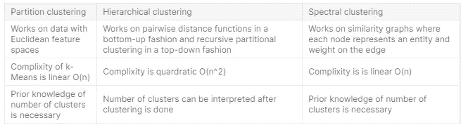

# 聚类技术完全指南

> 原文：<https://towardsdatascience.com/beginners-guide-to-clustering-techniques-164d6ad5dbb?source=collection_archive---------49----------------------->

照片由 [@plqml // felipe pelaquim](https://unsplash.com/@plqml?utm_source=medium&utm_medium=referral) 在 [Unsplash](https://unsplash.com?utm_source=medium&utm_medium=referral) 上拍摄

为了成为 Kaggle 上的大师，我从一个简单的数据挖掘算法开始发布笔记本。我要解释的第一个算法是聚类。

[**链接到 Kaggle 笔记本**](https://www.kaggle.com/gireeshs/complete-guide-to-clustering-techniques) **。如果你喜欢这个帖子，请给我的 kaggle 笔记本投票。**

# 介绍

聚类是一种无监督的学习技术，您可以获取整个数据集，并在数据集中找到“相似实体的组”。因此，数据集中没有标签。

这有助于将非常大的数据集组织成有意义的聚类，从而有助于采取行动。例如，将超过 100 万条记录的整个客户群划分为高价值客户、低价值客户等等。

**聚类通常倾向于回答什么问题？**

*   网络上有哪些类型的页面？
*   我的市场中有哪些类型的客户？
*   社交网络上有哪些类型的人？
*   我收件箱中的**电子邮件类型**？
*   **基因的种类**人类的基因组有哪些？

**从聚类到分类**

聚类是所有分类问题的基础。最初，假设我们在一个新的社交媒体平台上有大量未分组的用户。我们肯定知道，社交媒体中的用户数量不会等于群组数量，而且它将是合理有限的。尽管每个用户可能有细微的差别，但他们可以合理地分组。当我们知道这些用户属于哪个组时，这些分组的每一个聚类都成为类。

# 划分聚类

在开始聚类之前，如果我们假设数据将落入 x 个聚类中，然后将数据划分到这些数量的聚类中，这就称为分区聚类。在分区聚类中执行聚类之前，聚类的数量是已知的。k-Means 是一种流行的划分聚类技术，其中数据被划分为 k 个唯一的聚类。

**k-均值聚类**

*   设数据点 X = {x1，x2，x3，… xn}为需要聚类成 K 个簇的 N 个数据点。
*   K 介于 1 和 N 之间，其中 if:
    - K = 1 那么整个数据就是单个聚类，整个数据的均值就是我们要寻找的聚类中心。
    - K =N，那么每个数据单独代表一个单独的聚类。
    通常 K 介于 1 和 n 之间

**作为优化问题的公式**

设 M = {m1，m2，m3，… mk}为 K 个聚类的聚类均值。每一个 m 都代表我们正在寻找的单个集群。
目标函数是我们为每个聚类找到这样的表示，它最好地逼近数据并且逼近的误差最小。

我们试图最小化的目标函数是每个数据点与其代表点之间距离的平方和。

**使用 SKLearn 实现 k-Means**

但是 5 个集群足够好吗？

如上所述，在这种情况下，我们需要准确地指定我们要寻找多少个集群。群集的数量很难直观地猜测。只有对数据了如指掌，才能凭直觉猜测。

**集群数量的解决方案**

我们使用不同数量的聚类运行 k-Means 算法，并通过绘制来自 sklearn 的惯性参数来绘制拟合优度，该参数给出了样本到其最近聚类中心的平方距离之和。

**k 均值聚类的局限性**

k-Means 聚类只能分离线性聚类边界，这意味着它将无法识别复杂得多的决策边界。

这可以通过在 sklearn 上制作 moons 数据集来解释，如下所示:

这个问题的答案可以在了解层次聚类中找到。

# 分层聚类

自然界是由等级制度组成的，就像食物链、组织结构、物种的生物分类等等。自底向上的层次聚类也称为聚集聚类。

聚集聚类中的关键超参数称为连锁。这是两个集群之间的距离。它类似于用于 k-均值聚类的聚类均值 M。它可以用多种方式表示:

*   单链:两个簇之间最近的两个点之间的距离。
*   完全连锁:两个集群之间两个最远点之间的距离。
*   平均连锁:介于单一连锁和完全连锁之间。取所有点对之间的平均值。这对于噪声是鲁棒的。

**使用 SKLearn 实现聚集聚类**

对于同一个月球数据集，我们现在可以看到，通过聚集聚类，单个链接，我们可以得到很好的聚类。

# 谱聚类

处理相似度图，其中每个节点代表一个实体和边上的权重。考虑类似于一个图的结构，其中所有节点通过由权重构成的边连接到所有其他节点。如果我们想把它分成两个簇，显然我们想去掉权重最低的边。

**使用 SKLearn 实现谱聚类**

人造卫星将如下所示:

# 比较和对比不同的聚类技术

我对聚类技术的解释到此结束。我欢迎您的反馈和建议。

[如果你觉得这个帖子有用，请在 kaggle 上投票支持我的笔记本！](https://www.kaggle.com/gireeshs/complete-guide-to-clustering-techniques)

**参考文献:**

[https://sci kit-learn . org/stable/modules/generated/sk learn . cluster . k means . html # sk learn . cluster . k means](https://scikit-learn.org/stable/modules/generated/sklearn.cluster.KMeans.html#sklearn.cluster.KMeans)
[https://sci kit-learn . org/stable/auto _ examples/cluster/plot _ cluster _ iris . html # sphx-glr-auto-examples-cluster-plot-cluster-iris-py](https://scikit-learn.org/stable/auto_examples/cluster/plot_cluster_iris.html#sphx-glr-auto-examples-cluster-plot-cluster-iris-py)
[https://grey atom . com/programs/learn-data-science-online-with](https://greyatom.com/programs/learn-data-science-online-with-projects/learn)

**图片来自:**

[https://www . mygreatlearning . com/blog/clustering-algorithms-in-machine-learning/](https://www.mygreatlearning.com/blog/clustering-algorithms-in-machine-learning/)
https://commons . wikimedia . org/wiki/File:K-means _ convergence . gif
[https://www . solver . com/XL miner/help/hierarchical-clustering-intro](https://www.solver.com/xlminer/help/hierarchical-clustering-intro)
[https://towardsdatascience . com/spectral-clustering-ABA 2640 d5b](/spectral-clustering-aba2640c0d5b)