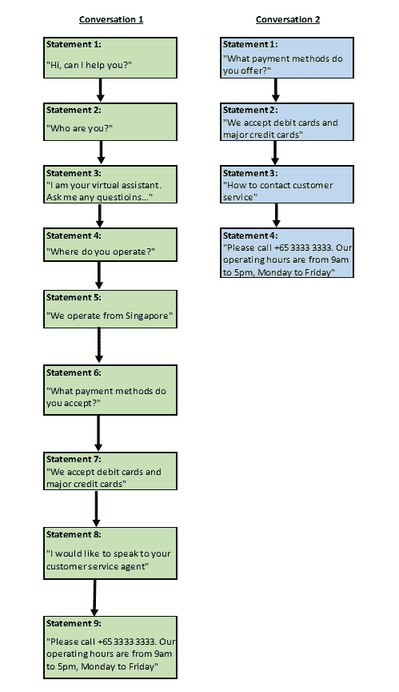
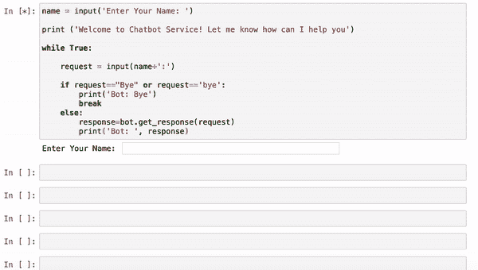
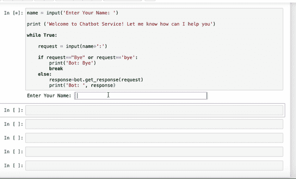
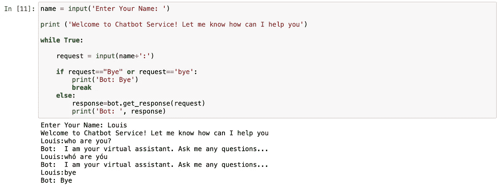
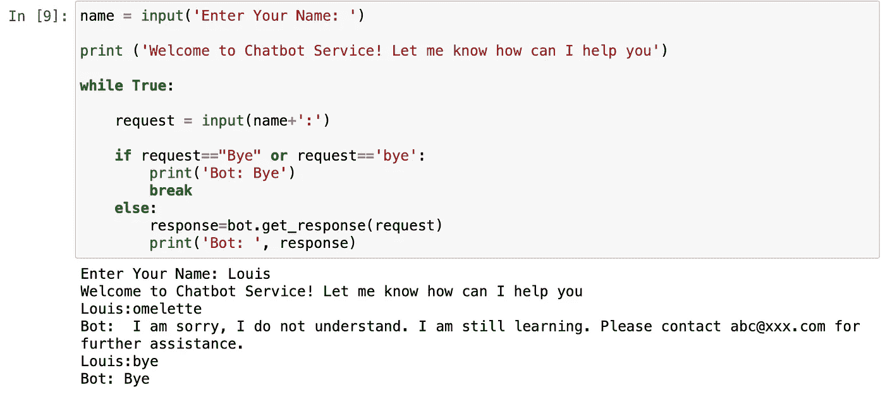
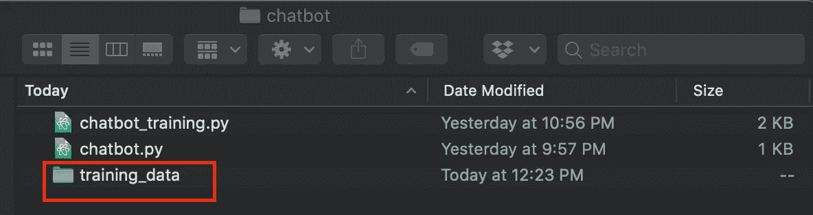
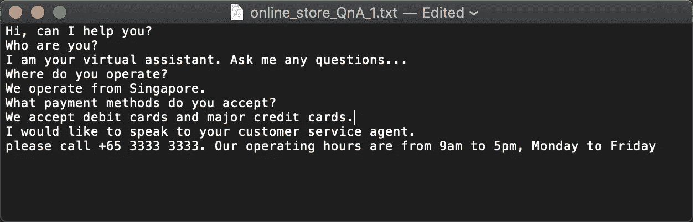
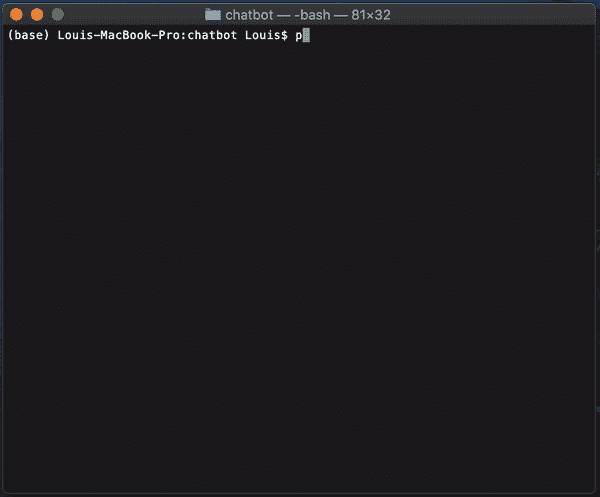
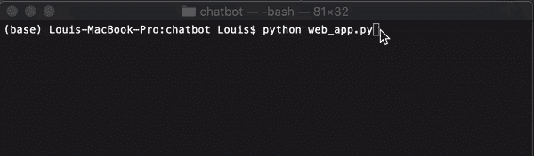
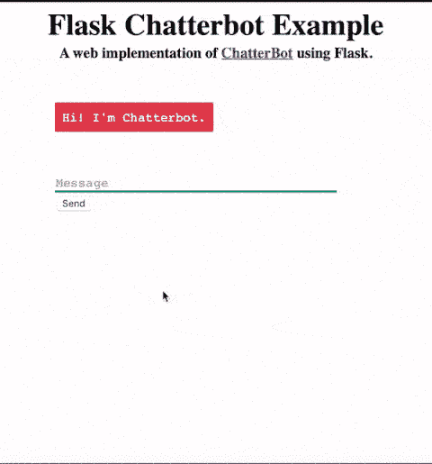

# 创建强大聊天机器人的初学者指南

> 原文：<https://towardsdatascience.com/beginners-guide-to-creating-a-powerful-chatbot-48fc6b073e55?source=collection_archive---------10----------------------->


安迪·凯利在 [Unsplash](https://unsplash.com?utm_source=medium&utm_medium=referral) 上的照片

## [实践教程](https://towardsdatascience.com/tagged/hands-on-tutorials)

## 有没有想过使用聊天机器人来帮助回答客户的标准问题？

您是否面临着太多来自客户的标准要求和问题，并且难以应对？您是否正在寻找一种方法来扩大您的客户服务，而不会产生太多的成本？

在我之前的[故事](/report-is-too-long-to-read-use-nlp-to-create-a-summary-6f5f7801d355)中，我分享了我如何通过创建一个个人文本摘要器来总结文档，从而解决数据过载的问题。

在这个故事中，我将向您展示如何轻松创建一个强大的聊天机器人来处理您不断增长的客户请求和询问。我还将向您展示如何使用 Flask 将您的聊天机器人部署到 web 应用程序。

# 首先，为什么聊天机器人在这种时候特别重要，它是什么

新冠肺炎疫情重创了世界。由于封锁/移动控制，许多企业遭受了重大损失。为了度过这段艰难时期，许多人被迫将业务转移到网上。

在线企业主面临的一个主要的、常见的问题是必须对来自客户的大量问题和请求做出回应。对于那些人力资源有限的人来说，不可能及时处理所有的请求。

为了解决这个问题，许多企业主转向使用聊天机器人为他们的客户服务。

***什么是聊天机器人:*** 聊天机器人是由人工智能驱动的智能软件，能够与人类对话，并执行类似人类的任务。聊天机器人存在于许多智能设备(例如 Siri (iOS)、谷歌助手(Android)、Cortana(微软)、Alexa(亚马逊))、网站和应用程序中。

***为什么使用聊天机器人:*** 根据 [HubSpot](https://www.hubspot.com/stories/chatbot-marketing-future) 进行的一项研究，71%的用户愿意使用快速响应的聊天应用程序来获得客户帮助，许多人这样做是因为他们希望他们的问题能够得到快速解决**(当然也是高效的)**。如果配置智能，聊天机器人确实可以通过允许人力资源专注于关键业务，同时保持相同水平的客户满意度，为企业释放巨大的价值。

# 如何创建聊天机器人？

我将把它分成三个主要部分，但是您可以直接进入您感兴趣的部分:

[(a)使用 Jupyter notebook 构建聊天机器人](#c03d)

[(b)在终端运行聊天机器人](#38b8)

[(c)使用 Flask 将聊天机器人部署为网络应用](#9bba)

# (a)使用 Jupyter notebook 构建聊天机器人

多亏了 Python 中的 ChatterBot 库，创建一个聊天机器人不再像过去那样是一项令人生畏的机器学习任务。

现在，让我们把手弄脏…

**(1)安装聊天机器人库**

我们将从安装 ChatterBot 库开始。终端的安装命令如下:

```
pip install chatterbot
```

ChatterBot 文本语料库(由大量结构化文本组成的语言资源)是在它自己的 Python 包中分发的，因此您需要单独安装它:

```
pip install chatterbot_corpus
```

如果您之前没有安装 **spaCy** (一个用于高级自然语言处理的开源库)，那么请现在安装它，因为 ChatterBot 库需要 spaCy 库才能工作:

```
pip install spacy
```

安装完 spaCy 库后安装 spaCy **英文** ('en') 型号:

```
python -m spacy download en
```

**(2)创建聊天机器人实例**

在我们将整个聊天机器人打包成 Python 脚本之前，我们将使用 **Jupyter Notebook** 开发我们的聊天机器人。让我们从导入我们需要的模块开始:

```
from chatterbot import ChatBot
```

我们将创建一个聊天机器人实例，将我们的机器人命名为 **Buddy** ，并将 **read_only** 参数指定为 **True** ，因为我们只想让我们的聊天机器人从我们的训练数据中学习。

通过创建一个聊天机器人实例，将为您创建一个名为 **db.sqlite3** 的聊天机器人数据库。

```
bot = ChatBot('Buddy', read_only = True)
```

**(3)训练聊天机器人**

是时候训练我们的聊天机器人了……(*什么，就这样？是的——这不是开玩笑！)*

这种训练仅仅意味着将对话输入聊天机器人数据库。请参见下面的示例:



对话源(图片由作者提供)

一旦聊天机器人被输入“对话 1”和“对话 2”，聊天机器人就会以正确的顺序将这些对话存储在其“知识图”数据库中。


存储在数据库中的知识图表(图片由作者提供)

之后，你可以用上面的任何一种说法开始对话。

例如，你可以用陈述 6 开始对话(“你接受什么付款方式？”)，聊天机器人将以声明 7(“我们接受借记卡和主要信用卡”)进行响应。

记住这个概念，让我们用“对话 1”和“对话 2”来训练我们的聊天机器人。

我们通过导入 **ListTrainer** 模块来实现，通过传递聊天机器人对象(**好友**)来实例化它，并调用 **train()** 方法来传递句子列表。

```
from chatterbot.trainers import ListTrainer
trainer = ListTrainer(bot)trainer.train([
    "Hi, can I help you",
    "Who are you?",
    "I am your virtual assistant. Ask me any questions...",
    "Where do you operate?",
    "We operate from Singapore",
    "What payment methods do you accept?",
    "We accept debit cards and major credit cards",
    "I would like to speak to your customer service agent",
    "please call +65 3333 3333\. Our operating hours are from 9am to 5pm, Monday to Friday"

])trainer.train([
    "What payment methods do you offer?",
    "We accept debit cards and major credit cards",
    "How to contact customer service agent",
    "please call +65 3333 3333\. Our operating hours are from 9am to 5pm, Monday to Friday"

])
```

***聊天机器人测试***

为了检查我们是否已经将我们的对话正确地输入到我们的聊天机器人中，让我们用一个简单的输入语句“支付方式”来测试一下。

```
response = bot.get_response ('payment method')
print(response)
```

聊天机器人给我们的回复是:


这种回应正是我们想要的。

我们将创建一个 **while 循环**到，使我们的聊天机器人能够连续响应我们的每个查询**。**当我们收到用户的‘拜拜’或‘拜拜’声明时，我们将结束循环并停止程序。

```
name = input('Enter Your Name: ')print ('Welcome to Chatbot Service! Let me know how can I help you')while True:

    request = input(name+':')

    if request=="Bye" or request=='bye':
        print('Bot: Bye')
        break
    else:
        response=bot.get_response(request)
        print('Bot: ', response)
```

让我们试一试…



Jupyter 笔记本中的聊天机器人演示(GIF 由作者提供)

恭喜你！您刚刚创建了您的第一个工作聊天机器人！

***语料数据训练***

当然，你会希望你的聊天机器人能够在我们刚刚输入的对话之外进行更多的对话。)—这样的话，我们需要进一步训练我们的聊天机器人。

幸运的是，这个任务对我们来说已经简化了。通过使用包中可用的英语语料库数据，我们可以快速训练我们的聊天机器人以更“像人类”和更智能的方式与我们交流。

***注:*** *如果您在运行语料库训练时遇到问题，请将此*[*chatterbot _ corpus*](https://github.com/gunthercox/chatterbot-corpus/tree/master/chatterbot_corpus)*文件夹复制到错误信息中指定的文件目录。*

只要运行下面的代码，你的聊天机器人就会被训练在以下范围内进行对话: *AI、botprofile、计算机、对话、情感、食物、八卦、问候、健康、历史、幽默、文学、金钱、电影、政治、心理、科学、体育&琐事。*

```
from chatterbot.trainers import ChatterBotCorpusTrainertrainer = ChatterBotCorpusTrainer(bot)trainer.train('chatterbot.corpus.english')
```

让我们测试一下我们的聊天机器人现在是否变得更聪明了…



语料库数据训练后的聊天机器人测试(GIF 作者)

是啊！它变得更聪明了——它现在可以给你讲笑话了…

***预处理输入***

ChatterBot 附带了几个内置的预处理器，允许我们在让 Bot 的逻辑适配器处理语句之前清理输入语句。

清理使得我们的输入语句更容易被聊天机器人阅读和分析。它从输入语句中删除了干扰文本分析的“干扰”——例如额外的空格、Unicode 字符和转义的 html 字符。

现在，我们将在 chatbot 实例中包含预处理程序，并使用下面的代码重新运行 chatbot 实例。

```
bot = ChatBot('Buddy',
             read_only = True,
             preprocessors=['chatterbot.preprocessors.clean_whitespace',                            'chatterbot.preprocessors.unescape_html',                          'chatterbot.preprocessors.convert_to_ascii'])
```

然后，重新运行聊天机器人，你可以看到我们对**你是谁**和**你是谁**得到了相同的回应。



***低信心应对***

除此之外，我们还可以配置我们的聊天机器人，如果用户不理解输入内容，它会给出默认响应:

对不起，我不明白。我还在学习。请联系[*abc@xxx.com*](mailto:abc@xxx.com)*寻求进一步帮助*

让我们将低置信度响应包含到我们的聊天机器人实例中，并重新运行聊天机器人实例。

```
bot = ChatBot('Buddy',
             logic_adapters = [
                 {
 **'import_path': 'chatterbot.logic.BestMatch',
                     'default_response': 'I am sorry, I do not understand. I am still learning. Please contact** [**abc@xxx.com**](mailto:abc@xxx.com) **for further assistance.',
                     'maximum_similarity_threshold': 0.90**
                 }
             ],
             read_only = True,
             preprocessors=['chatterbot.preprocessors.clean_whitespace',
'chatterbot.preprocessors.unescape_html',
'chatterbot.preprocessors.convert_to_ascii'])
```

然后，重新运行聊天机器人，让我们尝试从一个意外的输入中获得响应——当聊天机器人不理解一个语句时，它会用 **default_response** 进行回复。



聊天机器人响应意外输入(图片由作者提供)

恭喜你！您已经使用 Jupyter notebook 成功构建了一个聊天机器人。

**这里是** [**的链接，我的 Github**](https://github.com/louisteo9/Chatbot) **为 Jupyter 笔记本上的这个。**

# (b)在终端运行聊天机器人

***注:*** *如果您直接来到本节(跳过了* [*(a)使用 Jupyter notebook*](#c03d) *构建聊天机器人)，那么请确保您已经安装了该节中提到的所有必需的库和包，然后再继续在终端中运行聊天机器人。*

我们将使用上面的 Jupyter 笔记本编写脚本，运行上面的步骤，并根据用户指定的对话文件执行聊天机器人训练，然后查看我们的聊天机器人的运行情况...！

## **运行……的完整脚本和指令**

你可以在这里下载我的完整脚本，你可以马上用它来训练和运行你的聊天机器人！

1.  创建一个 **training_data** 文件夹，将你想要训练的所有对话保存在文本文件中。chatbot_training.py 脚本将读取 **training_data** 文件夹中的所有文本文件。



文本文件中的对话应该每行输入一句话:



2.运行**聊天机器人 _ 培训. py** 。你将被要求选择是否要用英语语料库数据训练聊天机器人——选择 **Y** 或 **N** 。

选择**Y**——你的聊天机器人将被训练在以下范围内进行对话: *AI、机器人简介、计算机、对话、情感、食物、八卦、问候、健康、历史、幽默、文学、金钱、电影、政治、心理学、科学、体育&琐事。*



3.然后，运行**聊天机器人. py** 到启动聊天机器人。输入一些对话，测试它是否正确响应。


Tadaa…这就对了！您已经完成了聊天机器人训练，并在终端中运行它。

# (c)使用 Flask 将聊天机器人部署为网络应用程序

***注意:*** *如果您直接进入本节(跳过了* [*(a)使用 Jupyter notebook*](#c03d) *构建聊天机器人)，那么请确保您已经安装了该节中提到的所有必需的库和包，然后再继续使用 Flask 将聊天机器人部署到 web 应用程序。*

我们将我们的聊天机器人部署到一个 web 应用程序，以便客户可以使用它。

要在 web 应用程序上运行我们的聊天机器人，我们需要为我们的应用程序找到一种接收输入数据和返回数据的方法。我们可以用任何我们想要的方式做到这一点——HTTP 请求、web 套接字等等。

在[聊天机器人常见问题页面](https://chatterbot.readthedocs.io/en/stable/faq.html)上有一些现有的例子告诉我们如何做。我将向您展示如何使用 Flask 部署 web 应用程序。

从 [my Github](https://github.com/louisteo9/chatbot) 下载示例代码，编辑**模板**文件夹中的*index.html*文件和**静态**文件夹中的 *style.css* 文件。如果您只是想在 web 应用程序上测试聊天机器人，请让文件保持原样。

之后，让我们运行 **web_app.py.**



这将我们的聊天机器人部署到位于 [http://127.0.0.1:5000/](http://127.0.0.1:5000/) 的本地服务器上

启动您的 web 浏览器，并转到上面的 URL 来启动您的聊天机器人。



# 结论、改进建议…接下来是什么？

(再次)祝贺你！您已经成功构建了第一个业务聊天机器人，并使用 Flask 将其部署到 web 应用程序中。我希望，聊天机器人在回答你训练过的一些标准商业问题方面做得很好。

为了进一步提高聊天机器人的性能，你可以做的一件事就是编辑一份你的客户到目前为止发布的常见问题列表，提供常见问题的答案，然后在你的聊天机器人上训练他们。

***为什么有些聊天机器人不争气？一些聊天机器人失败了，仅仅是因为对企业提出的标准问题和要求没有得到充分的分析，结果聊天机器人没有得到所需的培训。训练和提高你的聊天机器人是一个持续的过程，就像人类学习新技能和知识一样。一旦学会了这些技能，它们就内置在聊天机器人中，聊天机器人不需要重新培训，除非你的业务增长。***

接下来，您可以考虑将您的聊天机器人部署到您选择的平台即服务(PaaS)上，它可以完全从云中托管和运行您的 web 应用程序。你可以考虑的一个流行的免费 PaaS 是 [Heroku](https://www.heroku.com) 。

谢谢你读了这个故事！关注我的 [medium](https://louisteo9.medium.com/) 了解更多关于如何使用 DIY 机器学习来发展业务的技巧。