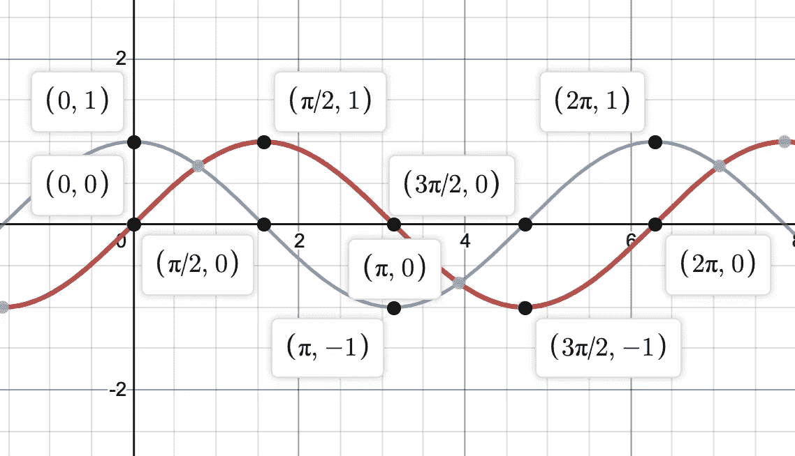
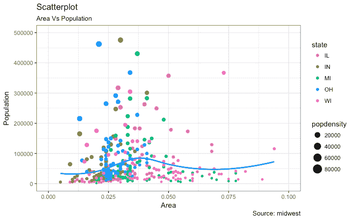
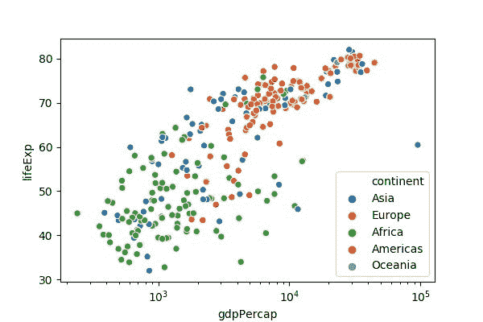
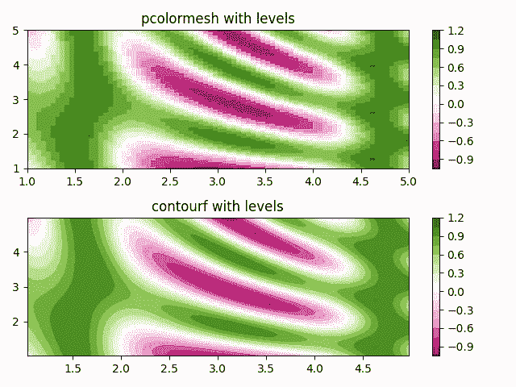

# Python 中数据科学库的初学者指南

> 原文：<https://towardsdatascience.com/beginners-guide-to-data-science-libraries-in-python-4b1a9326b712?source=collection_archive---------27----------------------->

## 一个开始数据科学爱好或职业生涯的地方。


卢卡斯·布拉塞克在 [Unsplash](https://unsplash.com/@goumbik?utm_source=unsplash&utm_medium=referral&utm_content=creditCopyText) 上的照片

数据是当今所有行业的驱动力。从分析和预测股市趋势的量化交易者，到预测新生儿流行病严重性和病毒传播的医疗保健专业人员，数据是一切事物共有的关键因素。使用计算器或 excel 电子表格很容易分析少量数据，但一旦计算变得复杂，数据量呈指数级增长，我们就需要更强大的工具。这就是软件分析和数据科学的用武之地。

虽然现在有很多可用的软件分析工具，比如 Matlab 和 R，但是我今天重点关注的是 Python。Python 在数据分析方面非常强大，因为许多人多年来已经构建了大量的库。尽管如果您想从事数据科学方面的职业，尽可能全面地学习这些库是很重要的，但是我将浏览一些人们通常开始使用的初学者库。

# NumPy

这是所有数据科学家需要学习的最基础的库。它提供了科学计算中的所有基本功能，能够快速处理大量数据。下面的代码是 NumPy 能做什么的一个简单例子。

使用 NumPy 进行科学计算的示例

上面的代码将产生以下输出:

```
Input:  [0, 1.5707963267948966, 3.141592653589793, 4.71238898038469, 6.283185307179586]Sine values:  [ 0.0000000e+00  1.0000000e+00  1.2246468e-16 -1.0000000e+00-2.4492936e-16]Cosine values:  [ 1.0000000e+00  6.1232340e-17 -1.0000000e+00 -1.8369702e-161.0000000e+00]Sine values:  [ 0\.  1\.  0\. -1\. -0.]Cosine values:  [ 1\.  0\. -1\. -0\.  1.]
```

从下图可以看出这是有道理的:



NumPy 还可以进行更复杂的计算，如下所示，它为自动驾驶汽车中的卡尔曼滤波器计算复杂的矩阵:

有一个用于各种科学计算的内置函数的巨大集合，如果你对这个感兴趣，NumPy 是你需要掌握的库。要了解更多信息，请访问 NumPy 的官方文档网站[。](https://numpy.org/)

# 熊猫

这是 Python 中最基本的数据分析和操作库。该库能够快速将大型原始数据文件读入 DataFrame 对象，通过自动索引和数据对齐执行各种数据清理和数据挖掘操作，对 DataFrame 表执行所有可能的 SQL 查询，如连接和合并，然后将数据输出到另一个数据文件，甚至直接输出到可视化中。

在 Python 环境中使用 pandas 的真正好处是，Python 是一种脚本语言，这意味着代码可以在不编译的情况下执行。因此，数据科学家可以通过打开 Python 终端执行快速分析，如下所示:


使用 pandas，数据科学家可以通过查询其 clientId 轻松搜索与某个客户相关的数据，并将其与其他原始数据集相结合，就像工程师通常使用数据库但现在使用原始数据文件一样。此外，数据科学家可以使用如下一行代码轻松生成各种可视化效果:

```
df = pd.DataFrame('some data...')df.plot(x='label1', y='label2', kind='scatter', ...)
```



面积与人口的样本散点图[ [来源](https://github.com/pandas-dev/pandas/issues/16827)

总而言之，pandas 提供了一种简单的方法来读/写数据，并使得对原始数据文件执行分析变得非常简单和快速，并且是任何数据科学家的武器库中的一个重要工具。要了解更多关于熊猫的信息，请访问官方文档网站[。](https://pandas.pydata.org/docs/)

# SciPy

SciPy 库是 NumPy 和其余的 [SciPy 栈](https://www.scipy.org/)之上的抽象层。该库包括许多数值例程，如数值积分、插值、优化、线性代数、统计、特殊函数、FFT、信号和图像处理、ODE 求解器以及科学和工程中常见的其他任务。因此，这个库更适合于数学函数，从学术的角度来看，它是为科学家和工程师所做的计算而定制的。要了解更多信息，请访问官方文档网站。

# sci kit-学习

Scikit-Learn 库是在 SciPy 基础上进一步抽象的，更加实用和注重应用。该库包括更多关注机器学习应用的函数，如回归、分类、聚类等。热衷于机器学习的人肯定会想了解更多关于这个库提供的功能。例如，通过运行以下代码，您可以轻松地对一组原始数据运行 RANSAC 线性回归:

```
*# generate random data with a small set of outliers*
np.random.seed(0)
X[:n_outliers] = 3 + 0.5 * np.random.normal(size=(n_outliers, 1))
y[:n_outliers] = -3 + 10 * np.random.normal(size=n_outliers)

*# Fit line using all data*
lr = [linear_model.LinearRegression](https://scikit-learn.org/stable/modules/generated/sklearn.linear_model.LinearRegression.html#sklearn.linear_model.LinearRegression)()
lr.fit(X, y)

*# Robustly fit linear model with RANSAC algorithm*
ransac = [linear_model.RANSACRegressor](https://scikit-learn.org/stable/modules/generated/sklearn.linear_model.RANSACRegressor.html#sklearn.linear_model.RANSACRegressor)()
ransac.fit(X, y)
inlier_mask = ransac.inlier_mask_
outlier_mask = [np.logical_not](https://docs.scipy.org/doc/numpy/reference/generated/numpy.logical_not.html#numpy.logical_not)(inlier_mask)

*# Predict data of estimated models*
line_X = [np.arange](https://docs.scipy.org/doc/numpy/reference/generated/numpy.arange.html#numpy.arange)(X.min(), X.max())[:, [np.newaxis](https://docs.scipy.org/doc/numpy/reference/constants.html#numpy.newaxis)]
line_y = lr.predict(line_X)
line_y_ransac = ransac.predict(line_X)
```


原始数据散点图和数据的线性回归与 RANSAC 回归[ [来源](https://scikit-learn.org/stable/modules/generated/sklearn.linear_model.RANSACRegressor.html)

Scikit-Learn 还包括一个非常有用的包，叫做预处理，非常适合数据挖掘和清理/整理原始数据。这个软件包包含的功能有归一化、将数据缩放到某个范围、缩放稀疏数据，甚至执行非线性转换，如将数据映射到均匀分布。此外，它还有一个随机分割数据以用于模型的功能:

```
sklearn.model_selection.**train_test_split**(**arrays*, ***options*)[[source]](https://github.com/scikit-learn/scikit-learn/blob/95d4f0841/sklearn/model_selection/_split.py#L2020)
```

使用 Scikit-Learn，数据科学家只需几行代码就可以创建机器学习模型。要了解更多关于 Scikit-Learn 的信息，请访问官方文档网站。

# matplotlib.pyplot

这个库虽然与数据科学的分析部分无关，但也是一个值得学习和使用的关键库。这个库是 Matlab 绘图功能的 Python 改编版。这个库能够生成任何东西，从简单的散点图、直方图、线图到复杂的热图、3D 图、日蚀图、流图等等。这些图的一些例子如下:



带颜色编码的样本散点图[ [来源](https://cmdlinetips.com/2019/04/how-to-specify-colors-to-scatter-plots-in-python/)


3D 绘图示例[ [来源](https://matplotlib.org/3.2.1/tutorials/introductory/sample_plots.html)



2D 阵列的可视化示例[ [来源](https://matplotlib.org/3.2.1/tutorials/introductory/sample_plots.html)

数据可视化是数据科学的一个重要组成部分，因为如果没有一种以可理解的方式传达结果的方法，所有的分析都是无用的。数据可视化肯定有更好的选择，但大多数是付费的或需要订阅的。Matplotlib 提供了一种可视化数据的 Python 原生方式，这绝对是一个有抱负的分析师应该学习的东西。

# 结论

还有很多 Python 库我没有介绍。有很多针对生物信息学、深度学习和人工智能、自动驾驶等的图书馆。然而，这里概述的库在数据科学中被广泛使用，并且是许多高级 Python 库的构建块。我相信熟悉这些库将为想要探索数据科学领域的初学者打下坚实的基础。如果你认为还有其他有用的 Python 库，请在下面的评论中分享。