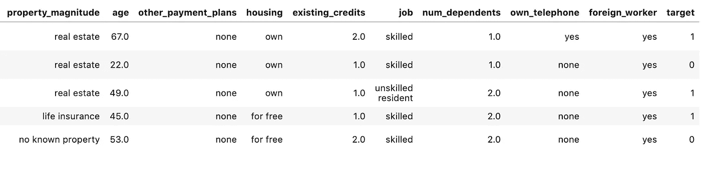
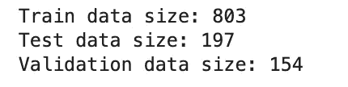
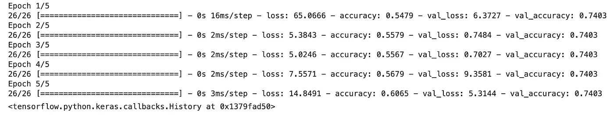

# TensorFlow 深度学习初学者指南

> 原文：<https://towardsdatascience.com/beginners-guide-to-deep-learning-with-tensorflow-ca85969b2f2?source=collection_archive---------44----------------------->

## 使用 TensorFlow 启动并运行您的第一个神经网络

[迈克·刘易斯 HeadSmart 媒体](https://unsplash.com/@mikeanywhere?utm_source=unsplash&utm_medium=referral&utm_content=creditCopyText)在 [Unsplash](https://unsplash.com/s/photos/flow?utm_source=unsplash&utm_medium=referral&utm_content=creditCopyText) 上拍摄的照片

[由谷歌大脑团队于 2015 年开发的 Tensorflow](https://www.tensorflow.org/) ，是最受欢迎的深度学习框架。这很大程度上是由于它对多种语言的支持，Tensorflow 是用 C++编写的，但你可以通过 Python，Javascript，Go 和 r 与它进行交互，除了它灵活的架构和可扩展性(模型可以在 GPU 和 CPU 上训练，并通过 web 服务，桌面应用程序或移动设备进行部署)。

本文是该工具的完整初学者指南。它不是一个深入的介绍，而是旨在让您开始开发您的第一个深度学习模型。

在我看来，很难找到不包含大量复杂性和繁重数学的深度学习教程。我个人学习得最好的方法是获取足够的知识来建立一个有效的模型，然后在我使用这种方法解决更复杂的问题时学习更多的复杂性。

本教程旨在通过一个不太简单的数据集演示 TensorFlow 的基本用法(演示在现实世界的机器学习问题中遇到的一些复杂性)，并提供足够的理论，以便能够自己构建一些东西，然后通过更复杂的文章和课程进一步发展这些知识。

# 神经网络

在我们开始使用 TensorFlow 构建模型之前，我将简要介绍基于神经网络的算法的概念，因为首先对这个概念有一个基本的了解是一个好主意。

TensorFlow 主要用于开发高度可扩展的基于神经网络的模型。神经网络，通常称为人工神经网络(ANN ),是机器学习(称为深度学习)的子集，大致基于生物信息处理和通信节点的工作方式。

深度神经网络(DNN)是人工神经网络的一种特定形式，在 Tensorflow 中使用，由输入(特征)和输出(目标或预测)之间的若干层组成。当模型被训练时，通过每一层执行数学计算，计算特征代表特定输出或标签的概率。

# 数据准备

在本文的剩余部分，我们将通过一个例子来使用 TensorFlow 进行分类任务。我们将使用来自 openml.org 网站的数据集，名为**‘credit-g’**。这包括银行公司客户的一些特征和一个类别，该类别表示发现客户的信用风险是好还是坏。

我们可以使用另一个机器学习库 Scikit-learn 将数据集直接导入到 Python 开发环境中。我在用 Jupyter 实验室。在下面的代码中，我们还将标记为“class”的列重命名为“target ”,以便与 TensorFlow 命名约定更加一致，并将其转换为数值数据，因为 TensorFlow 无法处理目标变量的字符串数据。

数据集中的行和列的样本

来自 Openml.org 的数据集倾向于使用 Pandas 特有的数据类型“category”作为分类列。由于 TensorFlow 无法识别此数据类型，我们需要执行一个额外的步骤，将数据类型为“类别”的列转换为“对象”。

接下来，我们将数据分为训练集、测试集和验证集。

TensorFlow 不能直接获取熊猫数据帧。相反，我们需要将数据帧中的列映射到可用于训练模型的特征。TensorFlow 有一个名为`[tf.data](https://www.tensorflow.org/guide/data)`的方法，用于为不同的数据类型构建输入管道。

在 TensorFlow 中，您将经常使用批处理，这是要处理的相对较小的数据样本。下面的代码创建了一个函数，将 dataframe 批量映射到 tf.data 对象(摘自 [TensorFlow 文档](https://www.tensorflow.org/tutorials/structured_data/feature_columns))。

# 创建要素图层

我们正在处理的数据集包含许多不同的要素类型，它们需要不同的变换。例如，我们有一些分类特征，如“personal_status”列和一些数字列。

在 TensorFlow 中，我们可以应用必要的转换，并将它们编码为 feature_columns，这些列被提供给一个特征层，该特征层将成为我们神经网络的第一层。作为网络的第一步，该层将把该训练数据的每个例子转换成单个**张量**。

要在 Tensorflow 模型中使用列作为特征，我们需要使用 feature_columns 方法。有许多不同的 feature_column 方法可以执行不同的转换，并将转换后的要素提供给模型。

对于我们的数据集，我们将使用三种不同的转换。

下面的代码首先创建一个名为 feature_columns 的空列表，我们将向其中追加不同的特性列类型。第一个转换使用 one-hot-encoding 通过`[feature_column.categorical_column_with_vocabulary_list](https://www.tensorflow.org/api_docs/python/tf/feature_column/categorical_column_with_vocabulary_list)`方法来转换分类特征。

然后，我们使用`[feature_column.bucketized_column](https://www.tensorflow.org/api_docs/python/tf/feature_column/bucketized_column)`方法将“age”列转换为分时段组。

最后，我们使用`[feature_column.numeric_column](https://www.tensorflow.org/api_docs/python/tf/feature_column/numeric_column)`为剩余的数字数据创建特征列。

现在，我们可以使用 feature_columns 来创建要在神经网络中使用的要素图层。

# 训练模型

我们现在可以构建神经网络，并用特征层中的数据训练和评估模型。在下面的代码中，我们正在构建一种最常见的模型，称为序列模型。这是从要素图层开始的一系列图层。

第二层和第三层被称为活化层。在基本层面上，每个激活层从特征层获取输入，并将其乘以每个节点中的权重。最常用的激活功能被称为[整流线性激活单元](https://deepai.org/machine-learning-glossary-and-terms/relu) (ReLU)，在下面的代码中的每个激活层中都有规定。

在`model.compile`代码中，我们指定算法类型为' [adam](https://stanford.edu/~boyd/admm.html) '，其他可用的优化器可以在[这里](https://keras.io/api/optimizers/)找到。

训练模型的性能输出如下所示。

网络中的层数和每层中的节点数(上述模型中两个激活层中的数字 128)都会影响模型的性能。因此，提高性能的一种方法是对这些元素尝试不同的数量。此外，与其他机器学习算法一样，其他优化包括超参数调整、特征选择和增强的特征变换。

本文给出了使用 TensorFlow 解决分类任务的基本介绍。如果你想探索一些讨论过的概念， [fastai 课程实用深度学习课程](https://course.fast.ai/)对于程序员来说是非常好的免费课程。

本教程的完整笔记本可以在[这里](https://github.com/rebecca-vickery/machine-learning-tutorials/blob/master/tensorflow/beginners_guide_classification.ipynb)找到。

感谢阅读！

[**我每月发一份简讯，如果你想加入请通过这个链接注册。期待成为您学习旅程的一部分！**](https://mailchi.mp/ce8ccd91d6d5/datacademy-signup)