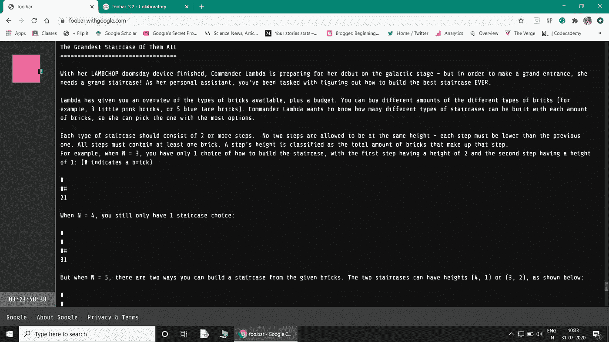

# 动态编程初学者指南

> 原文：<https://towardsdatascience.com/beginners-guide-to-dynamic-programming-8eff07195667?source=collection_archive---------3----------------------->


(照片由[克里斯里德](https://unsplash.com/@cdr6934?utm_source=unsplash&utm_medium=referral&utm_content=creditCopyText)在 [Unsplash](https://unsplash.com/s/photos/code?utm_source=unsplash&utm_medium=referral&utm_content=creditCopyText) 上拍摄)

## 编程教程

## 使用一些简单的技术优化你的代码

> **动态编程是一门艺术，你解决的问题越多，就越容易。**

有时当你写代码时，可能需要一些时间来执行，或者即使你的逻辑是好的，它也可能永远不会运行。在解决 Google Foobar 挑战问题时，我也遇到了同样的问题，我意识到这个解决方案并没有优化，而是使用了所有可用的 RAM(对于大值)。

需要一种完全不同的方法来解决此类问题，即通过遵循**动态编程的概念来“优化代码”。**

# 什么是动态编程？

动态规划是一种非常好的方法，可以应用于一类问题，以获得有效和最优的解决方案。

简而言之，动态编程背后的概念是将问题分解为子问题，并将结果保存起来以备将来使用，这样我们就不必再次计算同样的问题。优化整体解决方案的子问题的进一步优化被称为最优子结构性质。

可以应用动态编程的两种方式:

## 自上而下:

在这种方法中，问题被分解，如果问题已经解决，则返回保存的值，否则，函数值被记忆，即它将被第一次计算；每隔一段时间，存储的值将被回调。对于计算量大的程序来说，记忆化是一个很好的方法。不要混淆记忆和记忆。

> 记忆！=记忆

## 自下而上:

这是一种通过降低递归增加的时间复杂度(即，由于重新计算相同的值而导致的内存开销)来避免递归的有效方法。在这里，对小问题的解决方案进行计算，从而建立对整体问题的解决方案。(通过本文后面解释的例子，您会对此有更清晰的了解)。

# 了解在哪里使用这种技术

如上所述，如果您注意到问题可以被分解为子问题，这些子问题可以被分解为更小的子问题，并且其中一些子问题有重叠(即需要计算之前计算的值)。主要目标是通过存储子问题的结果来减少值的重复，从而优化代码。

> 动态规划可以应用于任何需要重新计算某些值以达到最终解决方案的问题。

# 递归和动态编程

记住，动态编程不应该与递归混淆。

**递归**是一种通过直接或间接用一个函数的其他值来表示该函数的值来求解的方法，这种函数称为递归函数。它遵循自上而下的方法。

**动态编程**只不过是带记忆的递归，即计算和存储值，这些值可以在以后被访问以解决再次出现的子问题，从而使你的代码更快并降低时间复杂度(计算 CPU 周期减少)。

这里的基本思想是通过有效利用空间来节省时间。递归需要时间，但不需要空间，而动态编程使用空间来存储子问题的解决方案以供将来参考，从而节省时间。

# 通过示例了解动态编程

> 让我们从斐波那契数列的一个基本例子开始。

**斐波那契数列**是一个数列，从 0 和 1 开始，每个数字都是前两个数字的和。

> F(n) = F(n-1) + F(n-2)

*   **递归方法**:

```
def r_fibo(n):
   if n <= 1:
       return n
   else:
       return(r_fibo(n-1) + r_fibo(n-2))
```

在这里，程序会一次又一次地调用自己来计算进一步的值。基于递归的方法的时间复杂度的计算大约为 O(2 ^N).这种方法的空间复杂度是 O(N ),因为递归可以达到最大值 N。

**举个例子——**

F(4)= F(3)+F(2)=((F(2)+F(1))+F(2)=((F(1)+F(0))+F(1)+(F(1)+F(0))

在这个方法中，像 F(2)这样的值被计算两次，对 F(1)和 F(0)的调用被多次进行。想象一下重复的次数如果非要计算的话 F(100)。该方法**对大值无效。**

*   **自上而下法**

```
def fibo(n, memo):
  if memo[n] != null:
    return memo[n]
  if n <= 1:
    return n
  else:
    res = fibo(n-1) + fibo(n+1)
    memo[n] = res
    return res
```

这里，计算时间大大减少，因为每次递归后产生的输出都存储在一个列表中，以后可以重用。这个方法比前一个效率高得多。

*   **底部向下**

```
def fib(n):
  if n<=1:
    return n
  list_ = [0]*(n+1)
  list_[0] = 0
  list_[1] = 1 
  for i in range(2, n+1):
    list_[i] = list_[i-1] + list[i-2]
  return list_[n]
```

这段代码根本没有使用递归。这里，我们创建一个长度为(n+1)的空列表，并在索引位置 0 和 1 处设置 F(0)和 F(1)的基本情况。创建此列表是为了使用索引值 2 到 n 的 for 循环存储相应的计算值。

与递归方法不同，该代码的时间复杂度是线性的，并且计算解所需的时间要少得多，因为循环从 2 运行到 n，即，它在 *O* ( *n* )中运行。这种方法是**编写程序的最有效方式。**

> **时间复杂度:O(n) <<< O(2​^N)**

> **Now, let’s see another example (this is an intermediate level problem):**

****

**(Photo by [作者](https://medium.com/@beginningofthefuture) ) **Google Foobar 挑战问题****

****问题陈述:** *你要以这样的方式建造一个楼梯，每种类型的楼梯都应该由 2 个或更多的台阶组成。不允许两个台阶在同一高度，每个台阶都必须低于前一个台阶。所有步骤必须至少包含一块砖。一个台阶的高度被归类为组成该台阶的砖的总量。
例如，当 N = 3 时，你只有 1 个如何建造楼梯的选择，第一级台阶的高度为 2，第二级台阶的高度为 1 即(2，1)。但是当 N = 5 时，有两种方法可以用给定的砖块建造楼梯。这两个楼梯的高度可以是(4，1)或(3，2)。***

***编写一个名为 solution(n)的函数，它取一个正整数 n，并返回恰好可以用 n 块砖建造的不同楼梯的数量。n 永远至少是 3(所以你完全可以有一个楼梯)，但不超过 200。***

**这是我在 [**Google Foobar 挑战赛**](https://foobar.withgoogle.com/) **的**第三关**必须解决的问题。我建议你在阅读解决方案之前先自己尝试一下这个问题，它会帮助你更好地理解这个概念。****

****解决这个问题的直观方法:****

*   **我的第一个直观方法是创建一个到`n`的整数列表`l`。**
*   **然后将列表`l`中所有可能的整数组合追加到一个新列表`sol`中。**
*   **并且，在最后一步，我使用了一个 for 循环来检查列表`sol`中每个元素的总和是否等于所需的值。如果条件为真，则该元素被附加到另一个新列表`final`。并且返回`final`的长度作为问题的最终解。**

```
from itertools import combinationsdef solution(n):
  l = []
  for i in range(1,n):
    l.append(i)
  sol = []
  for k in range(2,len(l)+1):
    for m in combinations(l,k):
      sol.append(m)
  final = []
  for z in (sol):
    if sum(z) == n :
      final.append(z)
  steps = len(final)
  return (steps)
solution(100)
```

**这个代码结果是**非常无效**并且**对于大值无效**因为同样的原因，即高时间复杂度和某些值的重复计算。为大值(如 100)运行这段代码将会使用所有可用的 RAM，代码最终会崩溃。**

****同一个问题的自底向上方法:****

```
def solution(n):
  a = [1]+[0]* n
  for i in range(1, n+1): 
    for k in reversed(range(i, n+1)):
      a[k] = a[k-i] + a[k]
  return a[n] - 1
```

*   **在第一步，启动一个空列表‘a’来存储来自进一步循环的所有值。**
*   **在外部循环的每一次迭代之后，a[j]是你可以建造的高度最多为`i`的楼梯的数量，其中`j`是使用的砖的数量。**
*   **列表`a`初始化为`[1,0,0,...]`,因为只能有一级楼梯的块数和高度为 0。**
*   **在内循环的每一次迭代中，列表`a`从表示最大高度`i-1`转换为表示最大高度`i`，这是通过在任何较短的楼梯上增加一个高度台阶`i`的可能性来实现的，这样可以给你留下至少`i`个街区。**
*   **在最后一步中，该函数返回恰好由`n`砖块建造的不同楼梯的数量(最后减去 1，以排除高度为`n`的单个楼梯的情况)。**

**这种方法对于大值也是有效的，因为这里时间复杂度是以空间为代价的。**

**这种方法也可以应用于其他问题，你只需要识别它们并应用动态编程的基础知识，你就能有效地解决问题。**

# **结论**

**动态编程是一种非常有效的代码优化技术。这项技术非常简单易学，但是需要一些练习才能掌握。**

> **“不记得过去的人注定要重蹈覆辙。”**
> 
> ****-乔治·桑塔亚纳****

****动态编程****

****看看这个:**[**https://www.fiverr.com/share/LDDp34**](https://www.fiverr.com/share/LDDp34)**

```
Bibliography:
[https://www.educative.io/edpresso/learn-dynamic-programming-in-10-minutes](https://www.educative.io/edpresso/learn-dynamic-programming-in-10-minutes)
[https://www.geeksforgeeks.org/dynamic-programming/](https://www.geeksforgeeks.org/dynamic-programming/)
[https://www.hackerearth.com/practice/algorithms/dynamic-programming/introduction-to-dynamic-programming-1/tutorial/](https://www.hackerearth.com/practice/algorithms/dynamic-programming/introduction-to-dynamic-programming-1/tutorial/)
[https://www.programiz.com/dsa/dynamic-programming](https://www.programiz.com/dsa/dynamic-programming)
```