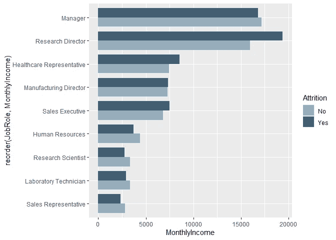

# 增强 R 中可视化效果的初学者指南

> 原文：<https://towardsdatascience.com/beginners-guide-to-enhancing-visualizations-in-r-9fa5a00927c9?source=collection_archive---------38----------------------->

## 通过这个实用的循序渐进的教程，开发您在 R 语言中的可视化技能。


在 [Unsplash](https://unsplash.com/?utm_source=medium&utm_medium=referral) 上由 [Carlos Muza](https://unsplash.com/@kmuza?utm_source=medium&utm_medium=referral) 拍摄的照片

学习用 R 构建完整的可视化就像任何其他数据科学技能一样，是一个旅程。RStudio 的 ggplot2 是一个讲述数据故事的有用包，所以如果你是 ggplot2 的新手，并且想发展你的可视化技能，你很幸运。我开发了一个非常快速且实用的指南来帮助初学者加深对 ggplot2 的理解，并设计一些精美的、具有商业洞察力的图表。因为视觉化的早期成功会非常激励人！

本教程假设你已经完成了至少一个关于 ggplot2、[的介绍，就像这个](https://r4ds.had.co.nz/data-visualisation.html)。如果你还没有，我鼓励你先把一些基本的东西记下来。

本教程结束时，您将:

*   加深您对增强 ggplot2 中可视化效果的理解
*   熟悉导航 ggplot2 备忘单(有用的工具)
*   通过一个简单的，一步一步的格式，建立两个原始的，完美的视觉效果，如下所示


可视化#2

在我们开始之前，这里有几个工具可以支持你的学习。首先是‘R Studio 数据可视化用 [ggplot2 备忘单](https://rstudio.com/wp-content/uploads/2015/03/ggplot2-cheatsheet.pdf)’(以下简称‘备忘单’)。我们将从头到尾引用它，以帮助您在将来使用它。

第二个是我做的一个 **'** [**ggplot2 快速指南**](https://github.com/jlbrosnahan/Visualization-Tutorial-ggplot2/blob/master/ggplot2%20Quick%20Guide.pdf) **'** 帮助我自己更快的建立 ggplot。虽然不全面，但可能会帮助你更快的了解 ggplot2 的全貌。

# 我们走吧！

在本教程中，我们将使用 **IBM HR 员工流失数据集**，[此处可用](https://www.kaggle.com/pavansubhasht/ibm-hr-analytics-attrition-dataset)。这些数据提供了(虚构的)业务洞察力，不需要预处理。太棒了。

让我们安装库并导入数据。

```
# install libraries
library(ggplot2)
library(scales)
install.packages("ggthemes") 
library(ggthemes)# import data
data <- read.csv(file.path('C:YourFilePath’, 'data.csv'), stringsAsFactors = TRUE)
```

然后检查数据和结构。

```
# view first 5 rows
head(attrition)# check structure
str(attrition)
```

这样做后，您将看到有 1470 个观察值，35 个员工变量。让我们开始视觉#1。

# 视觉#1

HR 想知道**月收入**与**工作角色**的**员工流失率**之间的关系。

# 第一步。数据、美学、几何

对于这个问题，‘job role’是我们的 X 变量(离散型)，而‘monthly income’是我们的 Y 变量(连续型)。“流失”(是/否)是我们的 z 变量。

检查[备忘单](https://rstudio.com/wp-content/uploads/2015/03/ggplot2-cheatsheet.pdf)的第一面，在“两个变量:离散 X，连续 Y”下，注意各种图表。我们将使用 geom_bar()。在备忘单上，它被列为 geom_bar(stat = 'identity ')。这将给出所有员工的总月收入。相反，我们想要平均，所以我们插入(stat = 'summary '，fun = mean)。

```
# essential layers
ggplot(data, aes(x = JobRole, y = MonthlyIncome, fill=Attrition)) +
  geom_bar(stat = 'summary', fun = mean) #Gives mean monthly income
```


我们显然看不清这些名字，这就导致了第二步…

# 第二步。坐标和位置调整

当名称太长时，翻转 x 和 y 轴通常会有所帮助。为此，我们将添加 coord_flip()作为层，如下所示。我们还将通过在代码中的 geom_bar()内添加 position = 'dodge '来拆分条形，以便更好地比较损耗。参考 ggplot2 备忘单第 2 面，“坐标系”和“位置调整”以查看两者的位置。

```
# unstack bars and flipping axis
ggplot(data, aes(x = JobRole, y = MonthlyIncome, fill=Attrition)) +
  geom_bar(stat = ‘summary’, fun = mean, position = ‘dodge’) +
  coord_flip()
```


# 第三步。从最高到最低重新排列条形

现在，让我们从最高月收入到最低月收入重新排列条形，以帮助我们更好地按工作角色进行分析。将下面的重新排序代码添加到美学行中。

```
# reordering job role
ggplot(data, aes(x = reorder(JobRole, MonthlyIncome), y = MonthlyIncome, fill = Attrition)) +
  geom_bar(stat = 'summary', fun = mean, position = 'dodge') +
  coord_flip()
```

# 第四步。更改条形图的颜色和宽度

让我们将条形颜色改为“与公司品牌相匹配”这必须手动完成，所以在备忘单的第二面“Scales”下找到 scale_fill_manual()它列出了以 r 为基础的颜色。你可以尝试一些，但它们不是“公司颜色”我从[color-hex.com](https://www.color-hex.com/)那里得到了下面的颜色。

此外，我们将通过在 geom_bar()中添加“width=.8”来缩小条形宽度，以增加视觉上吸引人的空间。

```
ggplot(data, aes(x = reorder(JobRole, MonthlyIncome), y = MonthlyIncome, fill = Attrition)) +
  geom_bar(stat='summary', fun=mean, width=.8, position='dodge') +
  coord_flip() +
  scale_fill_manual(values = c('#96adbd', '#425e72'))
```



# 第五步。标题和轴标签

现在让我们添加标题和标签。我们不需要 x 标签，因为职位本身就说明了一切。查看我们如何处理的代码。此外，请查看备忘单第二面的“标签”。

```
ggplot(data, aes(x = reorder(JobRole, MonthlyIncome), y = MonthlyIncome, fill = Attrition)) +
  geom_bar(stat='summary', fun=mean, width=.8, position='dodge') +
  coord_flip() +
  scale_fill_manual(values = c('#96adbd', '#425e72')) +
  xlab(' ') +  #Removing x label
  ylab('Monthly Income in USD') +
  ggtitle('Employee Attrition by Job Role & Income')
```

# 第六步。添加主题

一个主题会让它更上一层楼。我们将在代码末尾添加一个主题层，如下所示。当你开始在 R 中输入“主题”时，它会显示选项。对于这个图，我选择了 theme_clean()

```
#Adding theme after title
ggtitle('Employee Attrition by Job Role & Income') +
  theme_clean()
```


# 第七步。降低图形高度并使轮廓不可见

只是两个简单的调整。首先，我们将删除图形和图例轮廓。第二，图形看起来很高，所以让我们通过主题()中的 aspect.ratio 来降低高度。这是最终图形的完整代码。

```
ggplot(data, aes(x = reorder(JobRole, MonthlyIncome), y = MonthlyIncome, fill = Attrition)) +
  geom_bar(stat='summary', fun=mean, width=.8, position='dodge') +
  coord_flip() +
  scale_fill_manual(values = c('#96adbd', '#425e72')) +
  xlab(' ') +
  ylab('Monthly Income in USD') +
  ggtitle('Employee Attrition by Job Role & Income') +
  theme_clean() +
  theme(aspect.ratio = .65,
    plot.background = element_rect(color = 'white'),
    legend.background = element_rect(color = 'white'))
```


很好。我们发现，月收入更多的研究主管更有可能离开公司。其他工作角色则相反。

你已经完成了很多。准备好再试一次了吗？视觉 2 走查将是小菜一碟。

# 视觉#2

对于第二个视觉，我们想知道**员工流失**是否与**月收入**、**自上次晋升以来的年数**以及**工作生活平衡有任何关系。**另一个多变量分析。

# 第一步。数据、美学、几何

对于这个问题，“MonthlyIncome”是我们的 X 变量，“YearsSinceLastPromotion”是我们的 Y 变量。两者都是连续的，所以在“两个变量:连续 X，连续 y”下检查备忘单的第一面。对于可视化上下文，我们将使用 geom_smooth()，这是一条经常添加到散点图以揭示模式的回归线。“损耗”将再次通过颜色来区分。

```
ggplot(data, aes(x=MonthlyIncome, y=YearsSinceLastPromotion, color=Attrition)) +
  geom_smooth(se = FALSE) #se = False removes confidence shading
```


我们可以看到，离职的员工晋升的频率更低。让我们更深入地研究，通过工作生活平衡来比较。对于第四个变量，我们需要使用“分面”来查看工作生活平衡水平的支线剧情。

# 第二步。在画布上添加支线剧情

查看备忘单第二面的“刻面”。我们将对矩形布局使用 facet_wrap()。

```
ggplot(data, aes(x = MonthlyIncome, y = YearsSinceLastPromotion, color=Attrition)) +
  geom_smooth(se = FALSE) +
  facet_wrap(WorkLifeBalance~.)
```


小平面网格看起来不错，但是数字是什么意思呢？数据描述解释了“工作生活平衡”的代码:1 =“差”，2 =“好”，3 =“更好”，4 =“最好”。在步骤 3 中添加它们。

# 第三步。给分面支线剧情添加标签

要添加子情节标签，我们需要首先用一个字符向量定义名称，然后在 facet_wrap 中使用“labeller”函数。

```
# define WorkLifeBalance values
wlb.labs <- c('1' = 'Bad Balance', '2' = 'Good Balance', '3' = 'Better Balance', '4' = 'Best Balance')#Add values to facet_wrap()
ggplot(data, aes(x = MonthlyIncome, y = YearsSinceLastPromotion, color=Attrition)) +
  geom_smooth(se = FALSE) +
  facet_wrap(WorkLifeBalance~., 
    labeller = labeller(WorkLifeBalance = wlb.labs))
```

# 第四步。标签和标题

在代码末尾添加标签和标题。

```
facet_wrap(WorkLifeBalance~.,
    labeller = labeller(WorkLifeBalance = wlb.labs)) +
xlab('Monthly Income') +
ylab('Years Since Last Promotion') +
ggtitle('Employee Attrition by Workplace Factors')
```


# 第五步。在标签和刻度线之间添加空格

当我看图表时，x 和 y 标签似乎离刻度线太近了。一个简单的技巧是在标签名中插入换行符(\n)。

```
xlab('\nMonthly Income') +  #Adds space above label
ylab('Years Since Last Promotion\n')  #Adds space below label
```

# 第六步。主题

当你安装了 library('ggthemes ')，它给了你更多的选择。为了现代感，我选择了 theme_fivethirtyeight()。简单的加在最后。

```
ggtitle('Employee Attrition by Workplace Factors') +
  theme_fivethirtyeight()
```


# 第七步。覆盖主题默认值

我们的 x 和 y 标签怎么了？嗯，默认的 theme_fivethirtyeight()没有标签。但是我们可以很容易地在代码末尾用第二个 theme()层覆盖它，如下所示。

```
theme_fivethirtyeight() +
theme(axis.title = element_text())
```


还不错。但是……人们可能无法马上判断“更好的平衡”和“最好的平衡”是针对顶部还是底部网格。让我们在第 8 步中也改变我们的图例位置。

# 第八步。添加网格间距并更改图例位置

在顶部和底部网格之间添加空间以及更改图例位置都发生在第二个主题()行中。参见备忘单第 2 面“图例”部分

```
theme_fivethirtyeight() +
theme(axis.title = element_text(),
  legend.position = 'top',
  legend.justification = 'left',
  panel.spacing = unit(1.5, 'lines'))
```

# 第九步。更改线条颜色

如果能改变线条颜色来增加视觉冲击力，那就太棒了。标准的 R 色不太符合我们的需求。我们将手动更改，就像我们对 Visual #1 所做的那样。我从[color-hex.com](https://www.color-hex.com/)那里获得了颜色#s，它已经成为我们的有用工具。

这是第二个视频的完整代码。

```
ggplot(data, aes(x = MonthlyIncome, y = YearsSinceLastPromotion, color=Attrition)) +
  geom_smooth(se = FALSE) +
  facet_wrap(WorkLifeBalance~., 
    labeller = labeller(WorkLifeBalance = wlb.labs)) +
  xlab('\nMonthly Income') +  
  ylab('Years Since Last Promotion\n') +
  theme_ggtitle('Employee Attrition by Workplace Factors') +
  theme_fivethirtyeight() +
  theme(axis.title = element_text(),
    legend.position = 'top',
    legend.justification = 'left',
    panel.spacing = unit(1.5, 'lines')) +
  scale_color_manual(values = c('#999999','#ffb500'))
```


又一项出色的工作。我们发现，如果晋升更频繁，工作与生活缺乏平衡的员工似乎会留下来。在良好或较高的工作生活平衡水平上，损耗的差异不太明显。

在本教程中，我们获得了 ggplot2 视觉增强所需的技能，更加熟悉了 [R Studio ggplot2 备忘单](https://rstudio.com/wp-content/uploads/2015/03/ggplot2-cheatsheet.pdf)，并构建了两个漂亮的视觉效果。我希望逐步的解释和备忘单参考对您有所帮助，并增强您使用 ggplot2 的信心。

在我提高数据科学和机器学习技能时，许多人都在帮助我，所以我的目标是以同样的方式帮助和支持他人。