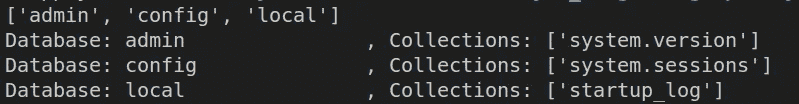

# 使用 Spotify Top50 2019 歌曲的 pymongo 初学者指南

> 原文：<https://towardsdatascience.com/beginners-guide-to-pymongo-using-spotify-top50-2019-songs-6c0eaa80b1af?source=collection_archive---------37----------------------->

## 如何使用 pymongo 编程

这篇文章旨在解释如何使用 pymongo 与 mongoDB 接口来执行 CRUD 操作。为了完成这篇文章，如果你对 mongoDB 及其内容有基本的工作知识，这是推荐的，但不是强制的。本帖涵盖的主题如下

*   [简介](#1902)
*   [在 pymongo 中配置客户端](#5162)
*   [创建数据库、收藏、文档](#b9ba)
*   [从集合中查询单据](#45ea)
*   [更新集合中的文档](#ce1b)
*   [从收藏中删除文档](#8aee)
*   [从 mongo 服务器删除数据库、集合](#a969)
*   [参考文献](#81ce)

如果您只对特定部分感兴趣，请点击上面的主题直接导航到相应的部分。


照片由[阿克谢·肖汉](https://unsplash.com/@akshayspaceship?utm_source=medium&utm_medium=referral)在 [Unsplash](https://unsplash.com?utm_source=medium&utm_medium=referral) 上拍摄

# 介绍

MongoDB 是一个 NoSQL(不仅仅是 SQL)数据库，是使用最广泛的数据库之一。它是用 C++原生编写的，这使得它在执行 CRUD 应用程序时非常快速有效。

具体来说，MongoDB 是一个文档数据库，其中的记录或条目以键值格式存储为文档，与 json 或 python 字典非常相似；从而允许使用对象符号从数据库中检索数据。

使用 mongoDB 的一个好处是，作为一个 NoSQL 数据库，只要遵循键值对，就不会受到数据库中可以存储的数据类型的限制。在 SQL 中，有一个非常严格的模式，每个记录都必须遵守，这使得它非常严格，而 MongoDB 在这方面允许完全的灵活性。在一些应用程序中，我们事先不知道会有什么&多少数据到来，但是需要将它存储到数据库中；mongoDB 是解决这种用例的方法。

对 mongoDB 和 SQL 中涉及的术语进行比较分析，可以更好地理解用于存储数据的 mongoDB 服务；内容如下:

*   数据库是存储在服务器上的一组数据；它在 mongoDB 和 SQL 中都被称为数据库。
*   数据库是由一些更小的组组成的，在 mongoDB 中称为集合，在 SQL 中称为表。
*   SQL 中的行由保存某些数据类型的数据的记录或行组成，在 mongoDB 中也称为文档。
*   SQL 中的列由可以保存特定数据类型的数据的特征组成；这在 mongoDB 中被称为字段。关键的区别在于，在 mongoDB 中，文档之间的字段可以不同，而对于 SQL 表，所有行的列必须相同。

特别是为了更熟悉 mongoDB，我建议你查看一下这个 GitHub 库，它解释了如何开始使用它。

pymongo 是 python 中的一个包，它帮助我们配置 mongoDB 数据库并从中检索文档。因为对于任何与数据相关的工作，python 都支持处理、建模、争论任何类型的数据，所以将数据存储在像 mongoDB 这样的数据库中并使用 python 按需检索是有意义的，pymongo 非常容易地简化了这个用例。要在您的系统上安装 pymongo，您需要在系统上本地安装 python 和 pip 你可以按照[这个教程](https://realpython.com/installing-python/)来获取相同的。一旦你安装了它们，只要在你的终端或命令提示符下运行下面的命令，你就可以很好地完成这篇文章的其余部分了。

```
pip install pymongo
```

我们在这里使用的数据包括 2019 年 spotify 排名前 50 的歌曲；数据集中的预览如下:


图片由 Vinayak 提供

数据集包括曲目名称和某些相关字段，如谁演唱了它，它是什么类型，以及其他量化参数，如它有多流行，歌曲有多长等。要深入了解数据集，请访问 kaggle 了解其他参数，可以使用该数据集执行哪些任务等等。我们将使用这个数据集创建一个简单的场景来演示 mongoDB 中的 CRUD(创建、读取、更新和删除)功能。

# 在 pymongo 中配置客户端

一旦在系统上安装了 python、pymongo 和 mongoDB，就可以打开 python 脚本并开始编码了。

您需要做的第一件事是创建一个到 mongoDB 服务器的连接。安装 mongoDB 后，大多数系统在本地主机上使用端口 27017 来托管 mongoDB 服务器，如果您/您的组织有专用的服务器，请确保获得到您的服务器的链接并创建如下连接。

一旦你有了这个连接，你就可以使用客户端对象来执行任何 CRUD 操作，我们将在下面的章节中看到。

# 创建数据库、集合、文档

使用上面的集合对象，我们查看现有的数据库、集合和其中包含的文档，并创建新的数据库。让我们首先来看看如何查看现有的数据库和集合。



图片由 Vinayak 提供

如果您最近才安装 mongoDB，默认情况下会创建这三个数据库，因为我们还没有创建其他数据库，所以没有其他数据库。让我们创建一个名为 spotifyData 的数据库，其中有一个名为 Top50 的集合。我们可以这样做

现在，这里有一个陷阱。请注意，数据库和集合是在 MongoDB 中延迟创建的。就像在集合和数据库中一样，只有在第一个文档被插入时才会被创建。到目前为止，我们已经有了指向数据库和集合对象的指针，但是它们还没有被创建。让我们将 Spotify 2019 年前 50 首歌曲数据集的文档插入到前 50 名集合中。

在 mongoDB 集合中创建文档有两种主要方法。

当您有一个文档时，可以使用 insert_one 方法在集合中创建一个文档。当一系列文档都出现在一个列表中时，可以使用 insert_many 方法在集合中创建所有这些文档。

这些文档基本上是 python 中的字典，以字段作为键，以值作为数据。此示例中的样本文档如下:


图片由 Vinayak 提供

对于 mongoDB 来说，id 字段是一个重要的字段。可以认为它类似于 SQL 中的主键。它是每个文档的唯一标识符。任何集合都不能有两个具有相同 id 的文档。如果不显式提供 _id 字段，mongoDB 将自己生成一个，它是一个随机的字符串对象，不匹配任何其他对象的 _id。

# 从集合中查询文档

接下来是从 mongoDB 集合中读取或查询。一旦我们创建了一个数据库和一个集合来保存我们的前 50 首歌曲，我们就可以使用它来查找任何记录，方法是对不同的字段施加约束，使我们能够只从我们的集合中过滤所需的数据。

假设我们希望看到所有进入 2019 年前 50 名的泰勒·斯威夫特的歌曲，我们可以如下执行我们的查询。


图片由 Vinayak 提供

我们可以看到，泰勒·斯威夫特只有一首歌进入了 2019 年的前 50 名，那就是《你需要冷静》。

请注意，上面的代码片段中显示的 find 方法没有任何约束，将查找并返回集合中所有可用的文档。只有当我们指定一些约束时，它才会返回过滤后的数据。

假设我们想找出所有流行度在 90 或以上的歌曲。我们可以用下面的查询来完成。


图片由 Vinayak 提供

假设我们想找出哪些歌曲来自流行音乐流派，并对所有歌曲进行查询。现在，在文件中，我们有许多不同的流行歌曲，用形容词来描述这些子流派。所以我们将使用一个正则表达式来过滤文档，如下所示。


图片由 Vinayak 提供

因此，在本节中，我们看到了如何使用 pymongo 的 find 函数从 mongoDB 中查询数据。正如我们在上面的例子中所看到的，它提供了一些很好的工具来基于数字和字符串相关的约束提取数据。让我们看看如何使用 pymongo 更新 mongo 集合中文档的数据。

# 更新集合中的文档

假设我们的集合中有一些数据，我们想要更新一个或多个文档中的一个或多个字段。在 pymongo 中使用 update_one 和 update_many 函数可以做到这一点。我们将研究 update_many 函数，因为前者是后者的一个特例。

在大多数评论/反馈中，我们看到事物被分为 1 到 5 级。然而，在这里，我们看到的是受欢迎程度是按百分比进行评估的。假设我们想更新它，使受欢迎程度限制在 1-5 之间。这可以通过将每个文档的流行度字段除以 20(即乘以 0.05)来完成。下面是我们如何使用 pymongo 来实现它。

因为我们想要更新所有的文档，所以我们传递了一个空的过滤标准，否则如果我们只想更新一组特定的文档，我们也可以这样做。比方说，我们想把所有艾德·希兰的歌曲都换成泰迪这个名字(他的昵称)。这可以通过添加这样的过滤标准来实现。


图片由 Vinayak 提供

我们可以看到，艾德·希兰在 2019 年有 4 首歌，老实说，这对一个歌手来说已经很多了；但所有这些都被修改，以反映艺术家的名字泰迪。upsert 的观点很有趣。如果过滤条件与任何文档都不匹配，它基本上会创建一个文档，如果 upsert 设置为 True，它会将艺术家姓名设置为 teddy。

# 从集合中删除文档

假设我们想删除德雷克演唱的 2019 年前 50 名歌曲中的歌曲(不是针对他，只是为了演示)，我们可以使用 delete_one 或 delete_many 方法。由于我们想要删除所有歌曲，我们可以使用 delete_many 命令，如下所示。


图片由 Vinayak 提供

看起来德雷克只有一首歌进入了前 50 名，所以在这种情况下，delete_one 和 delete_many 会有相同的最终结果。

让我们尝试删除所有受欢迎度为 80 或以下(即在新的分级系统中为 4 或以下)的文档。


图片由 Vinayak 提供

有三首歌的流行度低于 80 或 4(在新的范围内)。

# 从 mongo 服务器删除数据库、集合

假设我们不需要 mongoDB 数据库中的某个特定集合，我们想删除它。它可能在任何时间点发生，因为任何人都不再需要访问数据，数据已经过时，没有任何用途或任何其他原因。因为我们的数据库中只有一个集合，所以现在删除它没有意义，只是为了演示，下面是我们如何做的。

类似地，如果我们想要删除一个数据库，我们可以使用客户端变量来保存到 mongo 服务器的连接并删除数据库。

为了与 mongodb 服务器交互，显式关闭已经建立的连接总是一个好的做法。您可以简单地通过使用命令来完成

```
client.close()
```

这就把我们带到了这篇文章的结尾。我希望您已经有了使用 pymongo 通过脚本与 mongoDB 进行编程交互的良好起点。如果你想在一个地方看这篇文章的所有代码，或者更深入地研究，或者更喜欢教程的视频媒体，请查看下面的参考资料部分。

# **参考文献**

*   [Spotify 2019 年数据集前 50 名歌曲](https://www.kaggle.com/leonardopena/top50spotify2019)
*   [py mongo 上的 Datacamp 文章](https://www.datacamp.com/community/tutorials/introduction-mongodb-python)
*   [帖子中代码的 Github 回购链接](https://github.com/ElisonSherton/pymongo-basics)
*   [视频:pymongo 基础知识，techwithtim 制作](https://www.youtube.com/watch?v=rE_bJl2GAY8)