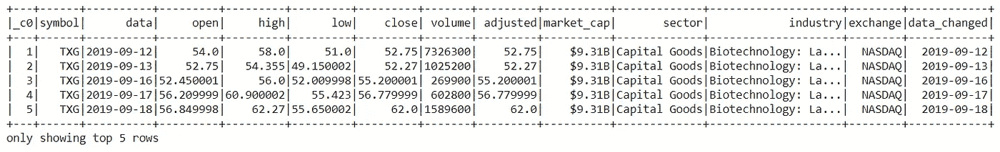

# PySpark 初学者指南

> 原文：<https://towardsdatascience.com/beginners-guide-to-pyspark-bbe3b553b79f?source=collection_archive---------1----------------------->

## PySpark 教程

## 第 1 章:使用美国股票价格数据介绍 PySpark

卢克·切瑟在 [Unsplash](https://unsplash.com?utm_source=medium&utm_medium=referral) 上的照片

**PySpark** 是 **Apache Spark** 的 API，Apache Spark 是一个开源的分布式处理系统，用于大数据处理，最初是在加州大学伯克利分校用 Scala 编程语言开发的。Spark 拥有 Scala、Java、Python 和 R 的开发 API，并支持跨多种工作负载的代码重用——批处理、交互式查询、实时分析、机器学习和图形处理。它利用内存缓存和优化的查询执行，针对任何大小的数据进行快速分析查询。它没有自己的文件系统，如 Hadoop HDFS，它支持大多数流行的文件系统，如 Hadoop 分布式文件系统(HDFS)，HBase，Cassandra，亚马逊 S3，亚马逊红移，Couchbase，等等

使用 Apache Spark 的优势:

*   它在内存中运行程序比 Hadoop MapReduce 快 100 倍，在磁盘上快 10 倍。它声明是因为它在 worker 节点的主存中进行处理，防止不必要的 I/O 操作。
*   它是用户友好的，因为它有用流行语言编写的 API，这使你的开发人员很容易，因为他们将分布式处理的复杂性隐藏在简单的高级操作符后面，大大降低了所需的代码量。
*   它可以通过 Mesos、Hadoop via Yarn 或 Spark 自己的集群管理器进行部署。
*   实时计算和低延迟，因为内存计算。

在这篇文章中我们看到

1.  **在 Google Colab 中设置环境**
2.  **星火会**
3.  **读取数据**
4.  **使用 Spark 模式构建数据**
5.  **检查数据的不同方法**
6.  **列操纵**
7.  **处理缺失值**
8.  **查询数据**
9.  **数据可视化**
10.  **将数据写入/保存到文件**
11.  **结论**和
12.  **参考文献**

让我们开始吧，✨

由[弗兰基·查马基](https://unsplash.com/@franki?utm_source=medium&utm_medium=referral)在 [Unsplash](https://unsplash.com?utm_source=medium&utm_medium=referral) 上拍摄的照片

# 在 Google Colab 中设置环境

为了在本地机器上运行 pyspark，我们需要 Java 和其他软件。因此，我们不用繁重的安装程序，而是使用 Google Colaboratory，它有更好的硬件规格，还带有广泛的数据科学和机器学习库。我们需要安装 **pyspark** 和 **Py4J** 包。Py4J 使运行在 python 解释器中的 Python 程序能够动态访问 Java 虚拟机中的 Java 对象。安装上述软件包的命令是

# 火花会议

**SparkSession** 已经成为 PySpark 的一个入口点，因为在 2.0 版本之前 **SparkContext** 被用作一个入口点。 **SparkSession** 是底层 PySpark 功能的入口点，用于以编程方式创建 PySpark RDD、数据帧和数据集。它可以在 replace with SQLContext、HiveContext 和 2.0 之前定义的其他上下文中使用。您还应该知道，SparkSession 在内部使用 SparkSession 提供的配置创建 SparkConfig 和 SparkContext。可以使用`SparkSession.builder`构建器模式创建 SparkSession。

## 创建 SparkSession

要创建 SparkSession，您需要使用构建器模式方法`builder()`

*   `getOrCreate()` —该方法返回一个已经存在的 SparkSession 如果不存在，它将创建一个新的 SparkSession。
*   `master()`–如果您在集群上运行它，您需要使用您的主名称作为参数。通常，它可能是`[yarn](https://sparkbyexamples.com/hadoop/how-yarn-works/)` 或`mesos`，这取决于您的集群设置，并且在独立模式下运行时也使用`local[X]`。`X`应该是一个大于 0 的整数值，表示使用 RDD、数据帧和数据集时应该创建多少个分区。理想情况下，值`X`应该是 CPU 内核的数量。
*   `appName()`该方法用于设置你的应用程序的名称。
*   `getOrCreate()`该方法返回一个现有的 SparkSession，如果它存在，否则它创建一个新的 SparkSession。

创建 **SparkSession** 的示例

# 读取数据

pyspark 可以读取各种文件格式的数据，如逗号分隔值(CSV)、JavaScript 对象符号(JSON)、Parquet 等。以下是从不同文件格式读取数据的示例:

# 使用 Spark 模式构建数据

让我们来看看 Kaggle 数据集中 2019 年 1 月至 2020 年 7 月的美国股票价格数据。

 [## 美国股票价格

### 2019 年 1 月至 2020 年 7 月的标准普尔 500 指数数据

www.kaggle.com](https://www.kaggle.com/dinnymathew/usstockprices) 

读取 CSV 文件格式数据的代码。

让我们使用`PrintSchema`方法来查看数据的模式。

数据的模式

**Spark schema** 是 DataFrame 或 Dataset 的结构，我们可以使用 **StructType** 类来定义它，该类是定义列名(字符串)、列类型(数据类型)、可空列(布尔)和元数据(元数据)的 **StructField** 的集合。spark 从数据中推断模式，但是有时推断的数据类型可能不正确，或者我们可能需要定义自己的列名和数据类型，特别是在处理非结构化和半结构化数据时。

让我们看看如何使用它来组织我们的数据:

上面的代码显示了如何使用`StructType`和`StructField`创建结构。然后将创建的结构传递给模式参数，同时使用`spark.read.csv()`读取数据。让我们看看结构化数据的模式:

结构化后的数据模式—按作者分类的图像

# 检查数据的不同方法

有各种方法用于检查数据。它们是 schema、dtypes、show、head、first、take、description、columns、count、distinct、printSchema。我们用一个例子来看看他们方法的解释。

*   **schema()** :这个方法返回数据的模式(dataframe)。以下示例显示了 w.r.t 美国股票价格数据。

*   **dtypes** :返回包含列名及其数据类型的元组列表。

*   **head(n)** :返回 **n** 行列表。这里有一个例子:

*   **show()** :默认显示前 20 行，并以数字为参数显示数据的行数。下面是一个例子:show(5)。

美国股票价格数据的前五行—作者图片

*   **first()** :返回数据的第一行。

*   **take(n)** :返回数据的前 **n** 行。
*   **describe()** :计算数据类型为数值的列的汇总统计数据。

*   **列**:返回包含数据列名的列表。

*   **count()** :返回数据中行数的计数。

*   **distinct()** :返回数据中不同的行数。
*   **printSchema()** :显示数据的模式。

# 列操作

让我们看看用于添加、更新、删除数据列的不同方法。

1.  **添加列**:使用`withColumn`该方法采用两个参数列名和数据向现有数据添加新列。请参见下面的示例:

添加列后的数据—按作者分类的图像

2.**更新列**:使用`withColumnRenamed`来重命名现有的列，T1 带有参数现有的列名和新的列名。请参见下面的示例:

更新后的数据-按作者分类的图像

3.**删除列**:使用`drop`获取列名并返回数据的方法。

删除列后的数据-按作者分类的图像

# 处理缺失值

在处理实时数据时，我们经常会遇到缺失值。这些缺失值被编码为 **NaN** 、空格和占位符。有各种处理缺失值的技术，其中一些比较流行的是:

*   **删除**:删除任意一列中缺失值的行。
*   **用平均值/中值估算**:用相应列的平均值/中值替换缺失值。它简单、快速，并且适用于小型数值数据集。
*   **使用最频繁值估算**:顾名思义，使用该列中最频繁的值来替换该列中缺失的值。这适用于分类特征，但也可能会在数据中引入偏差。
*   **使用 KNN 估算**:*K*-最近邻是一种分类算法，它使用不同的距离度量来使用特征相似性，例如欧几里德距离、马哈拉诺比斯距离、曼哈顿距离、闵可夫斯基距离和汉明距离，用于任何新的数据点。与上述根据数据集估算缺失值的方法相比，这种方法非常有效，而且计算量大，对异常值敏感。

让我们看看如何使用 PySpark 来处理缺失值:

# 查询数据

PySpark 和 PySpark SQL 提供了广泛的方法和函数来轻松查询数据。以下是几种最常用的方法:

*   **选择**
*   **过滤器**
*   **与**之间
*   **当**
*   **喜欢**
*   **分组依据**
*   **聚合**

## 挑选

它用于使用列名选择单个或多个列。这里有一个简单的例子:

选择提取单列或多列数据的操作-按作者排序的图像

## 过滤器

根据给定的条件筛选数据，也可以使用 AND(&)、OR(|)和 NOT(~)运算符给出多个条件。下面是获取 2020 年 1 月股票价格数据的示例。

使用过滤器获取 2020 年 1 月的股票价格数据—图片由作者提供

## 在...之间

如果 between 方法中传递的值。让我们看一个获取数据的例子，其中调整后的值在 100 和 500 之间。

使用 Between 获取数据—按作者分类的图像

## 当...的时候

根据给定的条件，它返回 0 或 1，下面的例子显示了当调整后的价格大于等于 200 时，如何选择股票的开盘价和收盘价。

使用何时获取数据-按作者分类的图像

## 喜欢

它类似于 SQL 中的 like 操作符，下面的例子显示了使用“rlike”提取以 M 或 C 开头的扇区名。

输出—按作者分类的图像

## 古尔比

该名称本身说明了它根据给定的列名对数据进行分组，并且可以执行不同的操作，如 sum、mean、min、max 等。下面的示例说明了如何获得与行业相关的平均开盘、收盘和调整后的股票价格。

按示例分组—按作者分组的图像

## 聚合

PySpark 在 DataFrame API 中提供了内置的标准聚合函数定义，当我们需要对数据列进行聚合操作时，这些函数就派上了用场。聚合函数对一组行进行操作，并为每个组计算一个返回值。以下示例显示了如何显示最小值、最大值和平均值；从 2019 年 1 月到 2020 年 1 月与行业相关的开盘、收盘和调整后的股价。

聚合示例—按作者分类的图像

# 数据可视化

我们将利用 matplotlib 和 pandas 来可视化数据，toPandas()方法用于将数据转换为 pandas dataframe。使用 dataframe，我们利用 plot()方法来可视化数据。下面的代码显示了如何显示该板块的平均开盘价、收盘价和调整后股价的条形图。

平均开盘价、收盘价和调整后的股票价格(相对于行业)——图片由作者提供

类似地，让我们来看看各行业的平均开盘价、收盘价和调整后价格。

行业的平均开盘价、收盘价和调整后股价-图片由作者提供

让我们来看看科技股平均开盘、收盘和调整后股价的时序图。

技术行业的时间序列图—作者图片

# 将数据写入/保存到文件

“write.save()”方法用于以不同的格式保存数据，如 CSV、JSVON、Parquet、e.t.c。让我们看看如何以不同的文件格式保存数据。我们可以使用' select()'方法保存整个数据和选定的数据。

# 结论

PySpark 是数据科学家学习的好语言，因为它支持可扩展分析和 ML 管道。如果您已经熟悉 Python、SQL 和 Pandas，那么 PySpark 是一个很好的起点。

本文展示了如何使用 PySpark 执行各种各样的操作，从读取文件到将细节写入文件。它还涵盖了使用 matplotlib 可视化洞察的基本可视化技术。此外，谷歌协作笔记本是开始学习 PySpark 的好方法，无需安装必要的软件。查看有助于更轻松、更快速地学习 PySpark 的参考资料。

> 通过使用下面的 colab notebook 和 GitHub，您可以随意访问/使用我在文章中写的代码。
> 
> 快乐学习✨

 [## PySpark 初学者指南

### 第 1 章:使用美国股票价格数据介绍 PySpark

colab.research.google.com](https://colab.research.google.com/drive/1Iwn8bmZjzjzO5_Li2ZFF_zf_b1td44Eg?usp=sharing)  [## syamkakarla 98/初学者指南

### 第 1 章:使用股票价格数据介绍 PySpark

github.com](https://github.com/syamkakarla98/Beginners_Guide_to_PySpark) 

# 参考

 [## 使用 PySpark 掌握大数据分析

### 使用 PySpark 的强大功能有效地将高级分析应用于大数据集关于此视频解决您的大数据…

www.oreilly.com](https://www.oreilly.com/library/view/mastering-big-data/9781838640583/)  [## 欢迎使用 Spark Python API 文档！— PySpark 3.0.1 文档

### Spark 功能的主要入口点。弹性分布式数据集(RDD)，Spark 中的基本抽象。主…

spark.apache.org](https://spark.apache.org/docs/latest/api/python/index.html)  [## pyspark.sql 模块— PySpark 2.4.0 文档

### Spark SQL 和 DataFrames 的重要类别:在…中使用结构化数据(行和列)的入口点

spark.apache.org](https://spark.apache.org/docs/2.4.0/api/python/pyspark.sql.html)