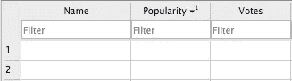
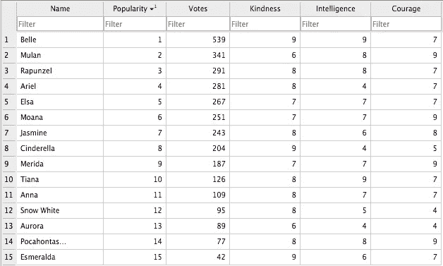
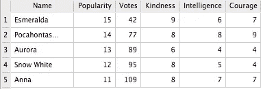
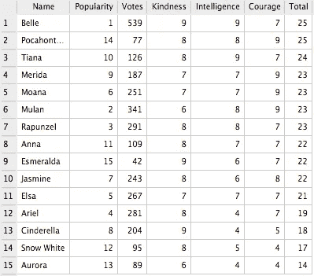

# SQL 初学者指南:迪士尼公主版

> 原文：<https://towardsdatascience.com/beginners-guide-to-sql-disney-princess-edition-bf830f75529e?source=collection_archive---------59----------------------->

我最近在 Coursera 上完成了一门 SQL 课程，正在寻找项目思路时，我看到了 [Amanda 的帖子](https://medium.com/swlh/basic-sql-ranking-best-cities-for-avocado-lovers-f4813e2f012?source=---------7------------------)。我联系了她，她建议我阅读奥科·安妮塔关于[基础 SQL](/basic-sql-decides-my-most-preferred-marvel-character-e393fb044397) 的帖子，她就是从那里受到启发的。毫无疑问，我也受到了她的启发，她用一个非常有趣的数据集描述了简单的查询，使其易于理解。

想要尝试类似的东西，我放下头发，开始在互联网上寻找迪士尼公主数据集，在这个数据集里我可以执行我在课程中学到的一些查询。遗憾的是，我找不到公主们特有的东西，所以我决定用 SQLite 创建自己的数据集。


[潘晓珍](https://unsplash.com/@zhenhappy?utm_source=medium&utm_medium=referral)在 [Unsplash](https://unsplash.com?utm_source=medium&utm_medium=referral) 上拍照

## 1)收集数据

利用本网站给出的民意调查评分，我收集了每位公主的排名以及电影名称、投票数和投票百分比。我决定只用**名字**、**人气**和**票数。**

## 2)创建表格

```
CREATE TABLE "Disney" ( "Name" Varchar(10) NOT NULL UNIQUE,
                        "Popularity" Int NOT NULL,
                        "Votes" Int NOT NULL,
                        PRIMARY KEY("Name")
);
```



注意:

*   当创建模式(它只是表的结构)时，为属性(列条目)定义某些“规则”是很重要的。
*   VARCHAR 定义值是字符串(即字母/单词),括号内的数字设置字符总数的限制。
*   INT 用于指定这些值是数字。
*   NOT NULL 是一个子句，用于声明列中的值不能为空。
*   主键是唯一的属性，可用于标识记录。我选择这个作为公主们的名字，因为我发现没有重复的名字，这是识别她们最有效的方法。

## 3)添加附加属性

接下来，我想增加几个栏目。我使用了**修改表格**功能:

```
ALTER TABLE Disney
ADD "Kindness" INT NOT NULL,
    "Intelligence" INT NOT NULL,
    "Courage" INT NOT NULL
);
```


## 4)插入值

下一步是使用收集的数据填写表格。名字、受欢迎程度和投票的数值直接取自上面提到的网站，而其余的是基于我的观点(请不要评判！).

这个过程是使用插件完成的

```
INSERT INTO Disney VALUES("Belle", 1, 539, 9, 9, 7);
INSERT INTO Disney VALUES("Mulan", 2, 341, 6, 8, 9);
INSERT INTO Disney VALUES("Rapunzel", 3, 291, 8, 8, 7);
INSERT INTO Disney VALUES("Ariel", 4, 281, 8, 4, 7);
INSERT INTO Disney VALUES("Elsa", 5, 267, 7, 7, 7);
INSERT INTO Disney VALUES("Moana", 6, 251, 7, 7, 9);
INSERT INTO Disney VALUES("Jasmine", 7, 243, 8, 6, 8);
INSERT INTO Disney VALUES("Cinderella",8, 204, 9, 4, 5);
INSERT INTO Disney VALUES("Merida", 9, 187, 7, 7, 9);
INSERT INTO Disney VALUES("Tiana", 10, 126, 8, 9, 7);
INSERT INTO Disney VALUES("Anna", 11, 109, 8, 7, 7);
INSERT INTO Disney VALUES("Snow White",12, 95, 8, 5, 4);
INSERT INTO Disney VALUES("Aurora",13, 89, 6, 4, 4);
INSERT INTO Disney VALUES("Pocahontas",14, 77, 8, 8, 9);
INSERT INTO Disney VALUES("Esmeralda",15, 43, 9, 6, 7);
```

## 5)查看整个表格

```
SELECR *
FROM Disney;
```



## 6)订购数据

虽然只有 15 个值，并且可以同时查看，但是我想练习使用 ORDER BY 函数。

```
SELECT * 
FROM Disney
ORDER BY Popularity DESC
LIMIT 5;
```



## 7)找出“总分”

现在是最后一步，我想练习使用算术函数，所以我决定计算每个公主的善良、智慧和勇气的总和。

```
SELECT *, SUM(Kindness+Intelligence+Courage) AS "Total"
FROM Disney
GROUP BY Name
ORDER BY Total DESC;
```



## 8)结论

就总分而言，粉丝们一直最喜欢的贝儿和波卡洪塔斯打成平手，尽管其他公主也紧随其后。

虽然它是一个小数据集，但这个项目开始起来非常有趣~我开始回忆我的童年，因为我在练习我在课程中学到的技能时，我在网页上搜寻数据。

我希望得到任何反馈！

现在，如果你不介意的话，我要去看一些经典的迪斯尼电影了