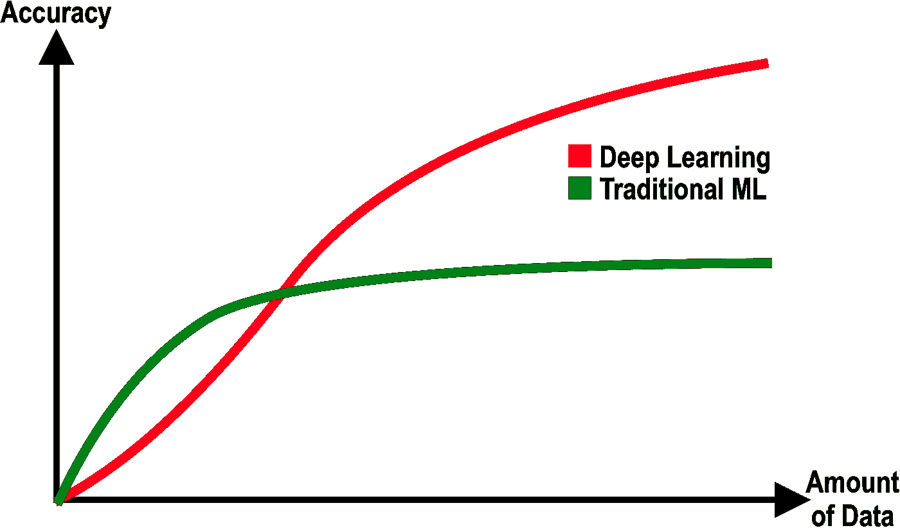
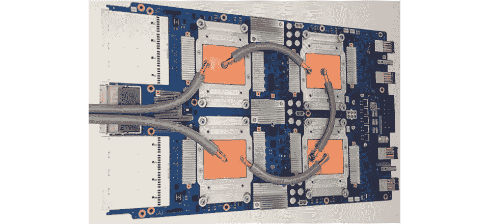
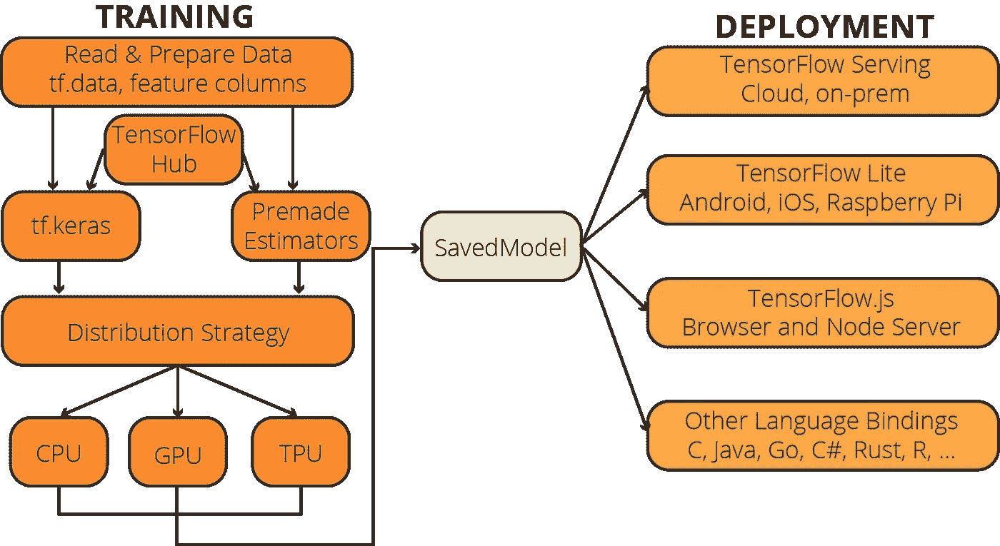
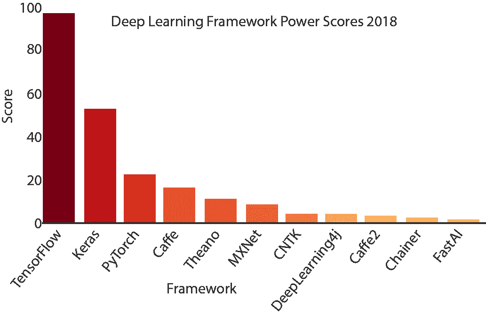

# 深度学习应用 TensorFlow 2.x 初学者指南

> 原文：<https://towardsdatascience.com/beginners-guide-to-tensorflow-2-x-for-deep-learning-applications-c7ebd0dcfbee?source=collection_archive---------17----------------------->

## 深度学习用 tensor flow 2 . x—Part 1 |[Part 2→](/mastering-tensorflow-tensors-in-5-easy-steps-35f21998bb86)|[Part 3→](/mastering-tensorflow-variables-in-5-easy-step-5ba8062a1756)|[Part 4→→→](/eager-execution-vs-graph-execution-which-is-better-38162ea4dbf6)

## 了解 TensorFlow 平台以及它能为机器学习专家提供什么

如果你正在阅读这篇文章，我确信我们有着相似的兴趣，并且正在/将要从事相似的行业。那么我们就通过[*Linkedin*](https://linkedin.com/in/orhangaziyalcin/)*来连线吧！请不要犹豫发送联系请求！*[*Orhan g . Yal n—Linkedin*](https://linkedin.com/in/orhangaziyalcin/)

如果你最近开始学习机器学习，你可能已经意识到与传统机器学习相比，人工神经网络和深度学习的力量。与其他模型相比，人工神经网络需要一套额外的技术技能和概念知识。



图一。深度学习和传统机器学习方法的比较(作者提供图片)

这些技术技能中最重要的是使用深度学习框架的能力。一个好的深度学习框架可以加速开发过程，并提供高效的数据处理、可视化和部署工具。当谈到选择深度学习框架时，截至 2020 年，你只有两个可行的选择:


图二。 [PyTorch](http://pytorch.org) by [脸书](https://about.fb.com/) |图 3。[张量流](http://tensorflow.org)由[谷歌](https://about.google/)

嗯，我们可以连续几天比较 TensorFlow 和 PyTorch，但这篇文章不是关于框架基准测试的。这篇文章是关于你可以用 TensorFlow 实现什么。

# 什么是张量流？

TensorFlow 是一个端到端的框架和平台，旨在构建和训练机器学习模型，尤其是深度学习模型。它由谷歌开发，于 2015 年作为开源平台发布。

具有稳定和官方 TensorFlow APIs 的两种编程语言是 Python 和 C。此外，C++、Java、JavaScript、Go 和 Swift 是开发人员可能会发现有限到广泛 TensorFlow 兼容性的其他编程语言。大多数开发人员最终都使用 Python，因为 Python 有令人信服的数据库，如 NumPy、pandas 和 Matplotlib。

# 为什么要用 TensorFlow？

使用强大的深度学习框架有几个优势，下面的非穷举列表指出了其中的一些优势:

*   减少构建和训练模型的时间；
*   有用的数据处理工具；
*   与其他流行的数据库如 NumPy、matplotlib 和 pandas 的兼容性；
*   TF Hub 的预训练模型的丰富目录；
*   跨 iOS、Android、Windows、macOS、Web 等不同设备部署训练好的模型的工具；
*   巨大的社区支持；
*   这是科技公司需要的技能。

# 张量流简史

目前在用的是 TensorFlow 的第二个主要版本: *TensorFlow 2.x* 。达到这种成熟水平花了将近九年的时间。然而，我可以说，我们仍然处于最终深度学习平台的开始阶段，因为当前的趋势表明，深度学习过程在未来将更加简化。一些人声称，基于 API 的实践将成为使用深度学习和人工神经网络的标准方式。但是，我们不要急于求成，先来看看 TensorFlow 平台的历史:

```
The TensorFlow team deliberately uses the term *platform* since its deep learning library is just a part of the whole technology.
```

## 2011–2016:婴儿期和初步发展

I**——**2011 年，Google Brain 开发了一个专有的机器学习库，供 Google 内部使用，名为 DistBelief。DistBelief 主要用于谷歌的核心业务，如谷歌搜索和谷歌广告。

I**—**2015 年，为了加快人工智能的进步，谷歌决定发布 TensorFlow 作为开源库。Tensorflow Beta 发布。

我**——**2016 年，Google 公布了张量处理单元(TPUs)。张量是 TensorFlow 应用的积木，顾名思义，TPU 是专门为深度学习操作设计的 ASICs。



图 4。[维基百科上的谷歌张量处理单元](https://en.wikipedia.org/wiki/Tensor_Processing_Unit#/media/File:Tensor_Processing_Unit_3.0.jpg)

```
ASIC stands for application-specific integrated circuit. ASICs are customized for a particular use such as deep learning or cryptocurrency mining, rather than general-purpose use.
```

## 2017–2019:第一个主要版本和跨平台技术的进步

**2017 年的发展:**

I**—**2 月，TensorFlow 1.0 发布，树立里程碑。2017 年 2 月之前，TensorFlow 还在 0.x.x 版本，最初的开发流程。`In general, version 1.0.0 defines the public API with a stable production capability.`因此，2017 年 2 月对于 TensorFlow 来说确实是一个很大的里程碑。

I**——**看到移动技术的快速进步，TensorFlow 团队于 2017 年 5 月宣布了 [TensorFlow Lite](https://www.tensorflow.org/lite) ，这是一个用于移动设备中机器学习开发的库。

 我**——**终于在 2017 年 12 月，谷歌推出了 [KubeFlow](https://www.kubeflow.org/) 。Kubeflow 是一个开源平台，允许在 Kubernetes 上运行和部署 TensorFlow 模型。换句话说，“[*Kubernetes 的机器学习工具包*](https://www.kubeflow.org/)*”*

**2018 年的发展:**

I**——**3 月，谷歌宣布 TensorFlow.js 1.0，该版本使开发者能够使用 JavaScript 实现和服务机器学习模型。

我**——**2018 年 7 月，谷歌公布了 [Edge TPU](https://cloud.google.com/edge-tpu) 。Edge TPU 是谷歌专门构建的 ASIC，旨在智能手机上运行 TensorFlow Lite 机器学习(ML)模型。

**2019 年的动态:**

I**—**2019 年 1 月，TensorFlow 团队宣布 TensorFlow 2.0.0 正式发布日期:*2019 年 9 月*。

I**—**2019 年 5 月， [TensorFlow Graphics](http://tensorflow.org/graphics/) 宣布着手解决图形渲染和三维建模相关问题。

## 2019–2020:2019 年 9 月起:TensorFlow 2.0+

I**——**2019 年 9 月，TensorFlow 团队发布了 TensorFlow 2.0，目前的主要版本，精简了构建神经网络的诸多不便。

随着 2.0 版本的发布，TensorFlow 最终将 Keras 作为官方主要的高级 API 来构建、训练和评估神经网络。

I**—**tensor flow 2.0 精简了数据加载和处理工具，并提供了新增功能。

I—急切执行成为默认选项，取代图形执行。之所以采用这种策略，是因为 PyTorch 以热切的执行力吸引了很多研究人员。

```
With Eager execution, TensorFlow calculates the values of tensors as they occur in your code.
```

如你所见，TensorFlow 不仅仅是 Python 的深度学习库。这是一个端到端的平台，你可以处理你的数据，建立和训练机器学习模型，在不同设备上使用不同的编程语言为训练好的模型服务。下面你可以看到 TensorFlow 平台的当前示意图:



图 5。TensorFlow 平台的当前图(图由作者提供)

# TensorFlow 到底有多受欢迎？

截至 2020 年，真正的竞争正在 TensorFlow 和 PyTorch 之间展开。由于其成熟性、对多种编程语言的广泛支持、在就业市场中的受欢迎程度、广泛的社区支持和支持技术，TensorFlow 目前占据上风。



图 6。深度学习框架 Power Score 2018(基于[杰夫·黑尔的作品](https://medium.com/r?url=https%3A%2F%2Ftowardsdatascience.com%2Fdeep-learning-framework-power-scores-2018-23607ddf297a))(图由作者提供)

2018 年，杰夫·黑尔为市场上的深度学习框架开发了一个[权力排名](/deep-learning-framework-power-scores-2018-23607ddf297a)。他权衡了在网上工作列表、相关文章和博客帖子以及 GitHub 上发现的提及。2018 年以来，PyTorch 取得了上升的势头，我相信到现在它一定有更高的分数。但是，我相信 TensorFlow 仍然比 PyTorch 有优势，因为它很成熟。

# 我深信不疑！下一步是什么？

你已经到了这一步，我希望你已经理解了什么是张量流，以及你如何从中受益。如果你确信要学习 TensorFlow，在接下来的文章中，我将用实际的代码示例解释下面的主题:

*   张量流的基础:张量、变量和急切执行；和
*   TensorFlow 2.x 覆盖整个深度学习管道运营的五大能力。

第二个帖子已经发布:

[](/mastering-tensorflow-tensors-in-5-easy-steps-35f21998bb86) [## 通过 5 个简单的步骤掌握 TensorFlow 张量

### 探索 TensorFlow 的构建模块如何在较低的级别工作，并学习如何充分利用张量…

towardsdatascience.com](/mastering-tensorflow-tensors-in-5-easy-steps-35f21998bb86) 

第三个是:

[](/mastering-tensorflow-variables-in-5-easy-step-5ba8062a1756) [## 用 5 个简单的步骤掌握 TensorFlow“变量”

### 了解如何使用张量流变量，它们与普通张量对象的区别，以及它们何时优于…

towardsdatascience.com](/mastering-tensorflow-variables-in-5-easy-step-5ba8062a1756) 

您可以关注[我的账户](http://medium.com/@oyalcin)并订阅我的简讯:

> [现在就订阅](http://eepurl.com/hd6Xfv)

# 最终注释

多年来，TensorFlow 变成了一个大平台，从头到脚覆盖了机器学习专家的每一个需求。还有很长的路要走，但与十年前相比，我们已经遥遥领先。加入这项新技术的崛起，并在 TensorFlow 的帮助下学习实现自己的深度学习模型。不要错过…

最后，如果你对应用深度学习教程感兴趣，可以看看我的一些文章:

[](/image-classification-in-10-minutes-with-mnist-dataset-54c35b77a38d) [## 使用 MNIST 数据集在 10 分钟内完成图像分类

### 利用 TensorFlow 和 Keras |监督深度学习使用卷积神经网络来分类手写数字

towardsdatascience.com](/image-classification-in-10-minutes-with-mnist-dataset-54c35b77a38d) [](/image-generation-in-10-minutes-with-generative-adversarial-networks-c2afc56bfa3b) [## 利用生成性对抗网络在 10 分钟内生成图像

### 使用无监督深度学习生成手写数字与深度卷积甘斯使用张量流和…

towardsdatascience.com](/image-generation-in-10-minutes-with-generative-adversarial-networks-c2afc56bfa3b) [](/image-noise-reduction-in-10-minutes-with-convolutional-autoencoders-d16219d2956a) [## 使用卷积自动编码器在 10 分钟内降低图像噪声

### 在时尚 MNIST 的帮助下，使用深度卷积自动编码器清洁(或去噪)有噪声的图像

towardsdatascience.com](/image-noise-reduction-in-10-minutes-with-convolutional-autoencoders-d16219d2956a) [](/using-recurrent-neural-networks-to-predict-bitcoin-btc-prices-c4ff70f9f3e4) [## 使用递归神经网络预测比特币(BTC)价格

### 如果你能以某种方式预测明天的比特币(BTC)价格，这不是很棒吗？加密货币市场已经…

towardsdatascience.com](/using-recurrent-neural-networks-to-predict-bitcoin-btc-prices-c4ff70f9f3e4)