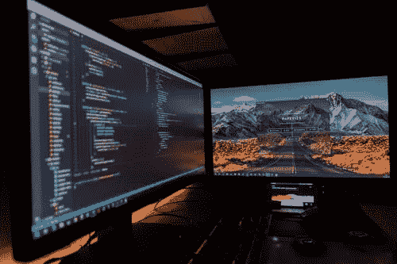
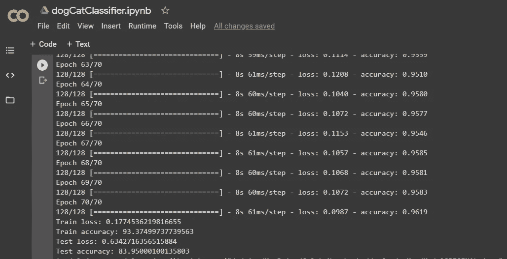
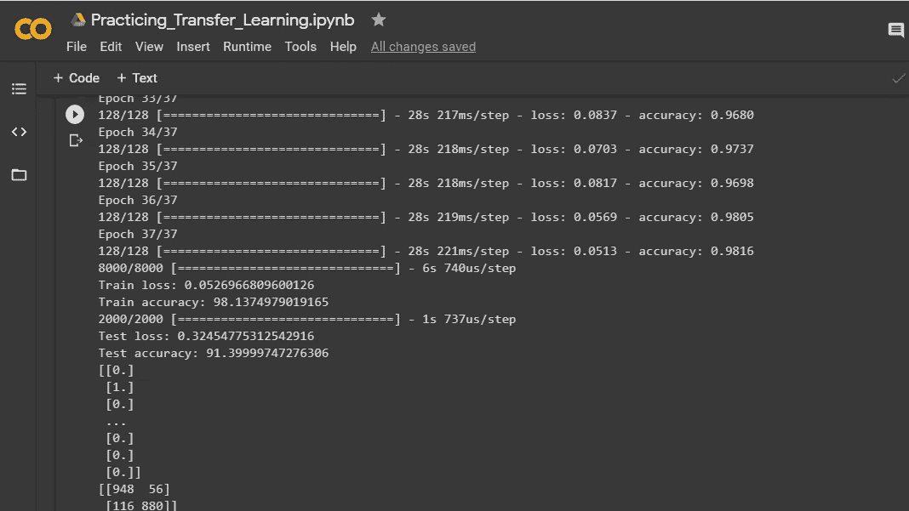

# 在 Google Colab 上转移学习的初学者指南

> 原文：<https://towardsdatascience.com/beginners-guide-to-transfer-learning-on-google-colab-92bb97122801?source=collection_archive---------25----------------------->

## 了解如何利用深度神经网络的力量来构建和训练最先进的模型



照片来自 Unsplash

海量的原始数据是当前最有价值的资源之一，这是巨大收入的潜在来源，这要归功于深度学习和相关硬件的进步，这些硬件是加速无数矩阵乘法所需的。如果我们没有很多数据，并且获取更多数据不可行，那该怎么办？还是我们缺少训练深度网络所必需的昂贵硬件？这两个问题都可以通过使用迁移学习的概念来解决，我们很快就会发现这是我们无意识熟悉的东西。

**迁移学习**是一种监督学习方法，使用先前构建和微调模型的预训练权重来帮助构建新模型。回想一下你生活中的那些情况，你不得不做出一个决定，但是缺乏相应的领域知识。一种做法是接近你的家人、教授、朋友和同龄人；倾听他们对问题的理解，运用自己的直觉，最终做出明智的决定。这正是迁移学习中发生的事情。迁移学习有几种不同的应用方式

*   **按原样使用预先训练好的模型:**从我们的类比来看，这相当于听取他人的建议，并将其不加修改地应用于手头的问题。
*   **作为特征提取器**:我们利用模型已经学习的特征，并进一步扩展模型，以便它也可以有效地学习我们数据集特有的新特征，这些新特征可能与预训练模型已经训练的数据集不同。这类似于根据自己的智慧加上他人的建议形成一种观点。
*   **微调模型**:在这种情况下，我们训练整个模型，添加一些我们自己的层以获得最佳性能。而在特征提取中，我们冻结预训练层以确保学习的特征在反向传播过程中不会更新，我们在这种方法中解冻所有层，因为我们希望这种方式可以更好地为当前数据集泛化模型。

**我们通过迁移学习达到了什么目的？**

*   当我们需要用小规模数据集构建高性能模型，而又缺乏时间、金钱和资源来获得更大的、无偏见的数据集时，这是最佳选择之一。
*   缺乏训练深度网络所需的大量时间。
*   缺少必要的硬件

简而言之，你不必从头开始，但是强烈建议你在迁移到迁移学习之前，训练一些可行的小网络来很好地理解基础知识。

缺乏昂贵的 GPU 可以通过使用像**谷歌的合作实验室**这样的平台来弥补，这是一个谷歌的研究项目，使所有人都可以访问机器学习，无论硬件要求如何，拥有 Jupyter 笔记本环境，GPU 或 TPU 支持，所有这些都通过云带给你。要了解更多关于规格的信息，请查看他们的笔记本示例，链接于此[https://colab . research . Google . com/drive/1 _ x 67 fw9 y 5 abw 72 A8 agepfllkpvklpnbl](https://colab.research.google.com/drive/1_x67fw9y5aBW72a8aGePFLlkPvKLpnBl)

我们将把这种技术应用于一个简单的二值图像分类问题，猫和狗图像的区分。我们的数据集非常简单，总共有 1000 张狗和猫的图像，分别用标签 0 和 1 编码。对于图像分类，在使用预训练的网络体系结构之前，有许多已建立的网络体系结构可供我们从头开始推导我们的模型。LeNet-5 是第一个用于手写数字分类的方法。随着 ImageNet 大规模视觉识别挑战赛的到来，AlexNet 诞生了，还有其他像 VGG-16，VGG-19，ResNet50，Inception，Xception，MobileNet 和最终的 NASNet，这是一个神经网络模型，它可以找出自己的神经网络架构。基于 AlexNet 的简单模型得到了 93%的训练准确率和 83%的测试准确率。理论上，用于这种类型图像分类的模型可以产生的最小误差应该与人类水平的误差相似。人类擅长对狗和猫的图像进行分类，所以我们的模型应该表现出 95%以上的准确率。



从头开始制作模型的结果

**让我们用 VGG-16** 来试试迁移学习

```
from keras.applications.vgg16 import VGG16
from keras.models import Model
from keras.layers import Dense
from keras.layers import Flatten
from keras.layers import Dropout
import numpy as np
from keras.preprocessing.image import ImageDataGenerator
from tensorflow.keras import regularizersvgg_model=VGG16(include_top=False, input_shape=(64,64,3))
for layer in vgg_model.layers:
        layer.trainable=False
```

在 keras.applications 提供的许多预训练模型中，我们选择了 VGG-16，因为它的架构与我们已经使用的架构相似。为了将模型用作特征提取器，我们设置 include_top=False，这样我们可以将我们的自定义 ANN 或 CNN 添加到现有模型中。为了进一步确保预训练的权重在反向传播期间不被调整，我们设置 layer.trainable = False。然而，后来发现这个设置的准确性没有超过 78%,所以它将被注释掉以执行微调。

```
x = vgg_model.output
#add flatten layer so we can add the fully connected layer later
#This is using the Keras functional API but Sequential API works #just as well
x = Flatten()(x)
x = Dense(64, activation='relu')(x)
x = Dropout(0.2)(x)
x = Dense(1, activation='sigmoid')(x)#create the new model
model = Model(input=vgg_model.input, output=x)
print(model.summary())
```

接下来，自定义模型，这里添加了一个简单的人工神经网络。然后构建最终模型。应用图像数据扩充来补偿数据集的大小。在一些超参数调整之后，仅 37 个时期就获得了 98%和 91%的训练和测试准确度，而我们需要 70 个时期才能在从头开始的一个时期上获得 83%的准确度。同样的方法也适用于 **ResNet50** ，其训练和测试精度分别为 92%和 87%。然而，这些都不是完美的，随着更多的调整，将获得更高的精度。


ResNet50 的结果

最后，迁移学习中出现的一些事情

*   所有预先训练的模型都期望 RGB 彩色图像。
*   所有模型都有一个不能任意改变的最小图像尺寸，否则在一系列卷积之后，后面的层将被期望执行不兼容尺寸的阵列的矩阵乘法。
*   小批量< 128 aren’t helpful for the current problem.
*   ResNet50, MobileNet and similar architectures have a BatchNormalization layer. During training, these layers aren’t updated, so the normalization is done with pre-computed values from the dataset on which this has been trained previously. If these values are widely different from the current dataset, low accuracy will be obtained. Unfreezing the layers yielded better results. (Frankly this is what I understood from this discussion here [https://github . com/keras-team/keras/issues/9214 # issue comment-397916155](https://github.com/keras-team/keras/issues/9214#issuecomment-397916155)随时指出错误并添加您的观点)
*   训练后，狗和猫的图像如预期的那样被正确识别。它也开始把狮子归类为猫，把狼归类为狗。它也对狗和猫的卡通图像进行分类。



来自 VGG-16 的结果

这里是我谦卑的尝试，试图揭开控制迁移学习的一些基本概念的神秘面纱，并希望减轻程序员们向深度学习领域的过渡。我自己也是一个初学者，涉足这些，因为我觉得它非常有趣和酷，努力成为一个自学成才的数据科学家。如果你也处于同样的情况，我希望你很快就能得到你现在正在为之奋斗的模型精度。感谢你读到这里，欢迎你指出错误，分享你的想法和快乐学习！