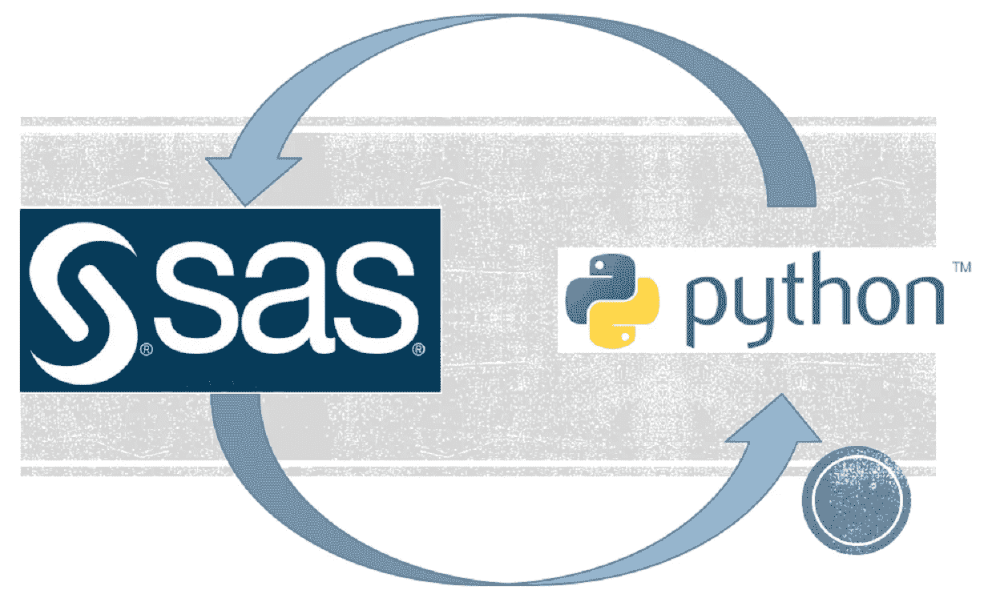
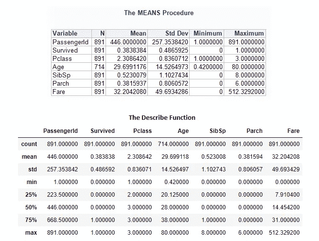

# 从 SAS 过渡到 Python 的初学者指南

> 原文：<https://towardsdatascience.com/beginners-guide-to-transition-from-sas-to-python-fcd17438a7a6?source=collection_archive---------7----------------------->

## 10 个常见的数据分析任务以及如何在 SAS 和 Python 中完成这些任务



# 介绍

SAS 是一种专门的数据分析编程语言，自 1976 年以来一直存在。这比 Python 在 1990 年首次作为通用编程语言出现早了 14 年，比 Pandas 在 2008 年首次发布并将 Python 转变为开源数据分析工具早了 32 年。虽然 SAS 由于其效率和支持可用性而仍然受到广泛尊重并在各公司中使用，但 Python 由于其开放源代码的性质以及机器学习和人工智能库的快速发展而日益成为首选语言。我广泛地使用这两种语言，经常被问到是否有简单的指导，让了解 SAS 的人能够容易地过渡到 Python。我写这篇文章的目的就是开发这样一个指南。

我们将看看 10 个最常见的数据分析任务，以及如何在 SAS 和 Python 中完成它们。我将使用的过程和功能比我将要介绍的功能强大得多。然而，我在这里的目的并不是深入研究某个特定的过程或函数，而是让大家感受一下在两种语言中如何完成相同的任务。

我将使用 Kaggle 著名的泰坦尼克号训练数据集。你可以在这里下载并找到关于这个数据[的细节。您将需要 SAS 和 Python 来跟进。Python 是开源的，因此可以免费安装。SAS 是专有软件，但为学术和非商业用途提供免费的大学版。这对于本教程来说应该足够了。一旦你可以使用 SAS 和 Python，你需要做的最后一件事就是为 Python 安装 pandas。这可以通过使用“pip”并运行下面的命令来完成。](https://www.kaggle.com/c/titanic)

```
pip install pandas
```

一旦成功安装了 pandas，就需要将其导入到 Python 工作会话中。您可以通过运行下面的代码来做到这一点。注意，我喜欢在和熊猫一起工作的时候用一个别名——PD。

```
import pandas as pd
```

让我们从 10 个常见的数据分析任务以及如何在 SAS 和 Python 中完成这些任务开始。

# 1.从平面文件读取数据

导入数据通常是任何数据分析项目中最常见的第一步。分隔的平面文件通常用于移动数据。SAS 提供了一个强大的过程来做到这一点。以下代码显示了如何将 titanic_train.csv 逗号分隔文件导入名为“titanic”的 SAS 数据集。

```
proc import
datafile = "&path.titanic_train.csv"
out = titanic
dbms = csv;
run;
```

Pandas 提供了`read_csv()`函数来完成这项工作。在这里，我通过使用 read_csv()导入 titanic_train 文件来创建一个 Pandas DataFrame 对象。数据帧相当于 SAS 数据集。

```
titanic=pd.read_csv('titanic_train.csv')
```

# 2.查看汇总统计数据

导入数据后的首要任务之一通常是查看数值字段的汇总统计数据。`PROC MEANS`是一个很棒的工具，它为 SAS 用户提供了一种生成这些信息的简单方法。

```
PROC MEANS DATA=titanic;
VAR _numeric_;
OUTPUT OUT=stats;
RUN;
```

Pandas 提供了一个名为`describe()`的等效功能。

```
titanic.describe()
```

下面是来自 SAS 和 Python 的结果以及它们如何比较的快照。



SAS 和 Python 的汇总统计输出

# 3.按组汇总统计数据

很多时候，我们希望查看组级别的汇总统计数据。例如，我们可能希望根据性别对 Titanic 数据进行分组，并查看男性和女性之间的统计数据如何进行比较。在 SAS 中，我们可以添加 CLASS 或 BY 语句来做到这一点。

```
PROC MEANS DATA=titanic;
CLASS Sex;
VAR _numeric_;
OUTPUT OUT=stats;
RUN;
```

在 Python 中，Pandas 提供了一个`groupby()`函数，该函数可以使用点符号与`describe()`函数链接，以获得组级别的摘要。

```
titanic.groupby('Sex').describe()
```

# 4.更改列名

SAS 提供了一个强大的数据步骤来操作 SAS 数据集的行和列。您可以在数据步骤中使用`rename statement`来更改列名。

```
data titanic2;
set titanic;
rename Pclass=passengerclass;
run;
```

在 Python 中，您可以使用`rename()`函数来重命名列名。如果希望更新多个列的名称，可以在字典中传递多个元素。

```
titanic2=titanic.rename(columns={'Pclass':'passengerclass'})
```

# 5.删除并保留列

只保留需要使用的列并删除不需要的列总是一个好主意。虽然这在 SAS 中可能没有太大关系，但在 Python 中工作时可能会有性能影响。原因是 Pandas 数据帧驻留在内存中，不像 SAS 数据集驻留在磁盘上。我经常在 SAS 数据步骤中使用`DROP`和`KEEP`语句来删除和保留数据集中的某些列。

```
data titanic2;
set titanic;
drop pclass;
run;data titanic2;
set titanic;
keep pclass;
run;
```

Pandas 提供了`drop()`函数来删除列。我们可以将想要删除的列的列表传递给`drop()`函数的 columns 参数。为了保留某些列，我们可以将想要保留的列的列表传递给`slicing operator`或方括号[]。列列表类似于`PROC PRINT`中的`VAR`语句。还要注意，在 Python 中，列名(以及几乎所有内容)是区分大小写的。在 SAS 中，列名不区分大小写。

```
titanic2=titanic.drop(columns=['Pclass'])titanic2=titanic[['Pclass']]
```

# 6.添加新列

在数据分析项目中，几乎总是需要根据现有字段添加新列。SAS 数据步骤使它非常容易做到。然而，在某些情况下，使用数据步骤可能有点棘手。例如，我在这里添加了一个新列“fare_deviation”，它是通过从每一行(乘客)的票价中减去总平均票价来计算的。谢天谢地，SAS 提供了`PROC SQL`来轻松做到这一点。我喜欢 PROC SQL，因为它提供了一种方法来利用 SQL 的强大功能，以便与其他 SAS 过程一起进行分析。

```
proc sql noprint;
create table titanic2 as
select *,fare-mean(fare) as fare_deviation from titanic;
quit;
```

这在 Python 中很容易做到，事实上，只用一行代码就可以做到。在下面的代码中，我使用了`mean()`函数来计算‘Fare’列的平均值，并将其从‘Fare’序列中减去。组成 DataFrame 的每个单独的列都可以被认为是 Pandas 系列对象。一个新的系列可以被添加为一个数据帧列，就像我创建新的数据帧列' Fare_deviation '一样。

```
titanic['Fare_deviation']=titanic['Fare']-titanic['Fare'].mean()
```

# 7.子集数据

在 SAS 中，我们可以在数据步骤中使用 IF 或 WHERE 语句对行进行子集划分，对列进行保留和删除。

```
data titanic2;
set titanic;
if sex='male';
keep Name Sex Pclass pclass;
run;
```

在 Python 中，我们可以使用`loc[]`方法对数据进行子集化。在这里，我为“男性”乘客选择行，只保留“姓名”、“性别”和“Pclass”列。

```
titanic2=titanic.loc[titanic['Sex']=='male',['Name','Sex','Pclass']]
```

# 8.排序数据

`PROC SORT`提供了一种在 SAS 中对数据集进行排序的理想方法。默认行为是按升序排序。对于降序排序，需要在 BY 语句后添加“descending”。

```
proc sort data=titanic;
by descending passengerid;
run;
```

在 Python 中，我们可以使用`sort_values()`函数对数据帧进行排序。inplace 参数告诉 python 应用操作并更新调用该函数的同一数据帧。

```
titanic.sort_values(by=['PassengerId'],ascending=False,inplace=True)
```

# 9.内部、外部和左侧连接

在我演示如何执行连接之前，让我们首先从我们庞大的数据中创建两个子集。我正在为乘客编号为 887，888，889，890，891 的乘客创建一个包含“乘客编号”、“姓名”和“性别”列的“titanic_a”数据集。' titanic_b '数据集包含 passengerid 为 887，888，889，890，891 乘客' passengerid '，'年龄'和'幸存'列。

```
data titanic_a(keep=passengerid name sex) titanic_b(keep=passengerid age survived);
set titanic;
if (passengerid in (887,888,889,890,891)) then output titanic_a;
if (passengerid in (884,885,886,887,888)) then output titanic_b;
run;
```

下面，我正在创建两个熊猫数据框，就像我上面在 SAS 中创建的一样。

```
titanic_a=titanic.loc[titanic['PassengerId'].isin([887,888,889,890,891]),['PassengerId','Name','Sex']]
titanic_b=titanic.loc[titanic['PassengerId'].isin([884,885,886,887,888]),['PassengerId','Age','Survived']]
```

现在我们有了两个数据集，我们准备好查看连接。我经常喜欢在 SAS 中使用`PROC SQL`来执行连接，因为我发现使用 SQL 很直观。`MERGE`的说法同样受欢迎。在下面的代码中，我们创建了三个数据集— titanic inner(由 titanic_a 和 titanic_b 之间的 passengerid 上的内部联接产生)、titanic_outer(由 titanic_a 和 titanic_b 之间的 passengerid 上的外部联接产生)和 titanic_left_a(由 titanic_a 和 titanic_b 之间的 passengerid 上的左联接产生)。

```
data titanic_inner titanic_left_a titanic_outer;
merge titanic_a (in = a)titanic_b (in = b);
by descending passengerid;
if a and b then output titanic_inner;
if a then output titanic_left_a;
if a or b then output titanic_outer;
run;
```

使用 pandas 提供的 merge()函数可以获得类似的结果。

```
titanic_inner=titanic_a.merge(titanic_b,how='inner',on='PassengerId')
titanic_left_a=titanic_a.merge(titanic_b,how='left',on='PassengerId')
titanic_outer=titanic_a.merge(titanic_b,how='outer',on='PassengerId')
```

# 10.导出数据

最后一个例子是将数据导出为平面文件。在 SAS 中，这可以使用`PROC EXPORT`来完成。

```
PROC EXPORT
DATA=titanic_outer
DBMS=csv
OUTFILE="&path.titanic_outer.csv";
run;
```

在 Python 中，您可以使用`to_csv()`函数写出一个平面文件。

```
titanic_outer.to_csv('titanic_outer.csv')
```

# 结论

我希望本指南为 SAS 程序员提供一个良好的起点，让他们尝试使用 Python 进行数据分析，并让 Python 程序员使用 SAS。