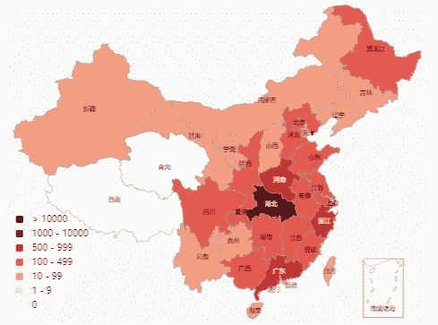
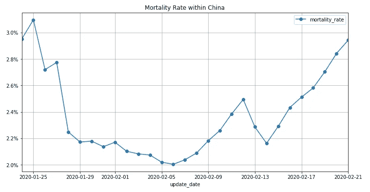
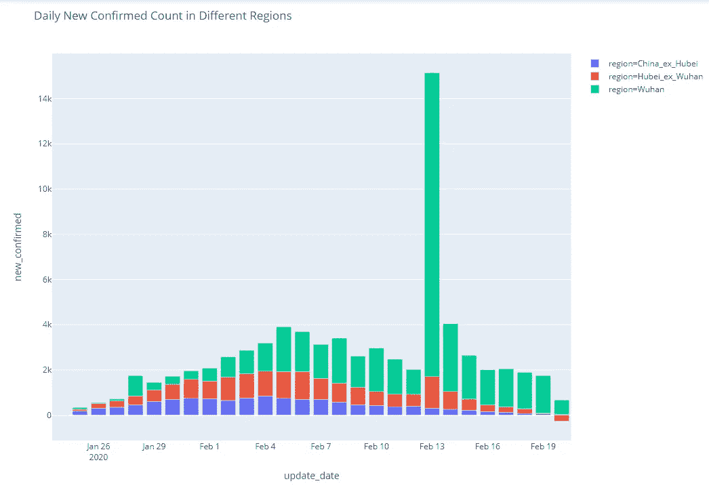
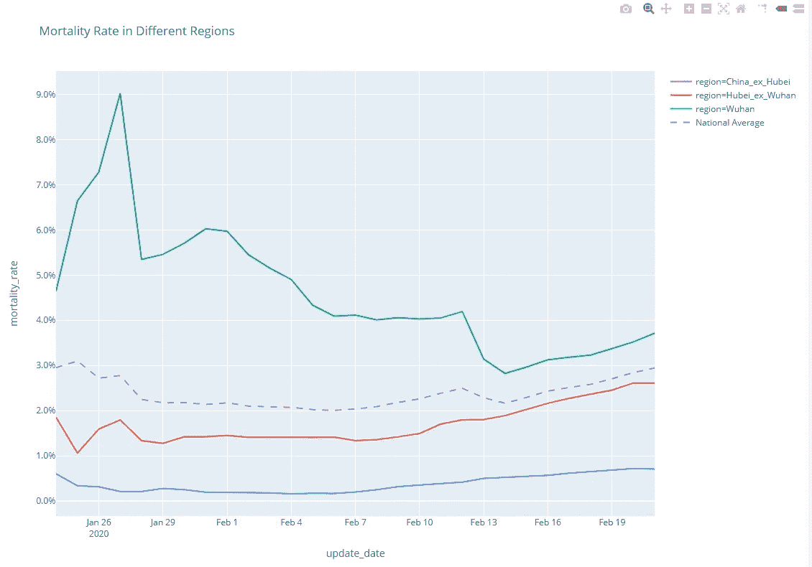
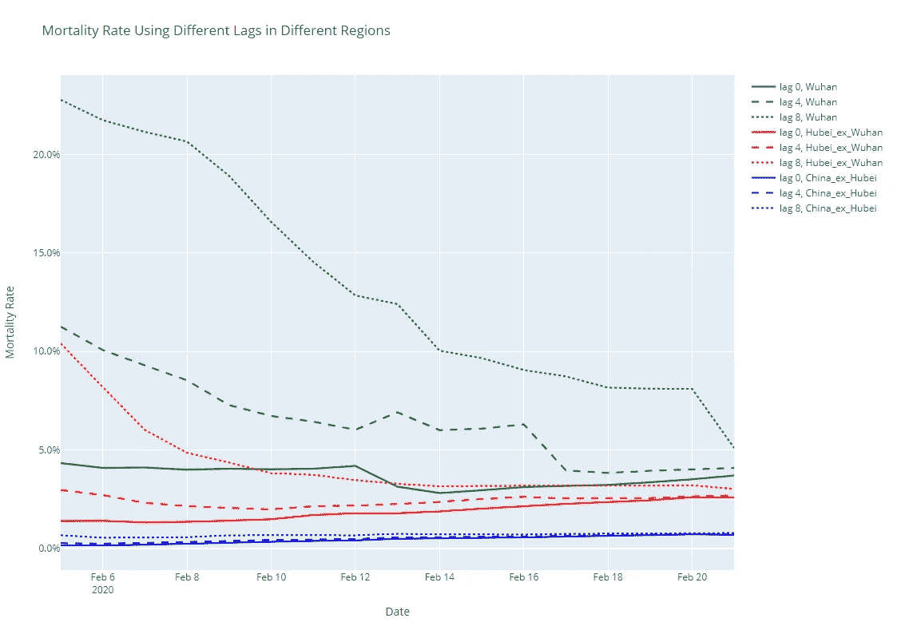

# 冠状病毒死亡率的背后

> 原文：<https://towardsdatascience.com/behind-the-coronavirus-mortality-rate-4501ef3c0724?source=collection_archive---------9----------------------->

## 对死亡率的进一步观察。它告诉我们什么？

2020 年 2 月 21 日[丁香元](https://ncov.dxy.cn/ncovh5/view/pneumonia)冠状病毒确诊病例图

在之前的[文章](/understanding-the-coronavirus-epidemic-data-44d2fb356ecb)中，我介绍了一个 Python 工具箱来收集和分析冠状病毒流行数据。在本文中，我将使用 Python 工具箱深入研究流行病的一个衡量指标——死亡率。我将重点讨论以下几个问题:

1.  死亡率的地区差异是什么？
2.  目前的死亡率可能是低估还是高估？

现在我们开始吧。

## 健全性检查

就像任何数据分析任务一样，我们应该总是在实际工作之前执行健全性检查。所以让我们独立验证一下世界卫生组织对 2020 年 1 月 29 日~2%死亡率的估计:

我们可以看到，死亡率大多在 2%~3%以内，与世卫组织官方的估计完全一致。

## 1.调查死亡率的地区差异

为简单起见，我们将“死亡率”(MR)定义如下:

MR(T)= T 日累计死亡人数/T 日累计确诊人数

这个计算有点“幼稚”，但是对于区域可变性的讨论来说，这是一个很好的代理。我们将在本文后面重新讨论这个计算。

由于疫情是从武汉市开始的，而大部分病例都集中在湖北省，我们自然要把数据拆分成三个地区:

*   武汉市
*   湖北省除武汉市、
*   中国除了湖北省。

以下是这三个地区每日新确认的人数。它证实了这是一个合理的分割。Plot.ly 是一个很棒的工具，可以用来建立互动的情节。所以我将使用它而不是更传统的 Matplotlib，这样读者可以自己深入研究数据。

2020 年 2 月 13 日，新增确诊病例激增。这是因为湖北省在那一天放宽了“确诊”的定义，以便与其他省份的报告保持一致。新的定义在标准中增加了临床诊断，因此包括了许多以前被遗漏的患者。

在下图中，我们可以很容易地比较三个地区的死亡率以及全国平均水平:

很明显，武汉的死亡率远高于湖北省的其他地区，而湖北省的死亡率又远高于中国的其他地区。这一结果与中国国家卫生委员会的报告一致。而据[约翰霍普金斯 CSSE](https://gisanddata.maps.arcgis.com/apps/opsdashboard/index.html#/bda7594740fd40299423467b48e9ecf6) 统计，截至 2020 年 2 月 20 日，中国境外确诊病例 634 例，死亡 3 例，所以除了湖北省外，国际死亡率与中国大致持平。因此，取决于你在哪里，死亡率差异可能是 10 倍或更多。

在撰写本文时(2020 年 2 月 21 日)，没有证据表明该病毒发生了变异。那为什么不同地区的死亡率差别这么大呢？一种解释是，这种病毒传染性很强，如果不加控制，可以在短时间内感染大量人群。因此，武汉和湖北省的医院很快饱和，许多病人因资源不足而死亡。相反，病毒传播到其他省份的时间相对较晚，当时国家已经采取了严格的控制措施。因此，考虑到与医疗资源相比，患者的增长要慢得多，其他省份的死亡率要低得多。

我们必须认识到，中国是一个独特的国家，它能够迅速动员大量资源，采取前所未有的措施来遏制疾病的传播。但是，如果这种病毒蔓延到其他没有能力控制这种病毒的国家，结果可能会更加灾难性，导致更高的死亡率。

## 2.死亡率估计

现在让我们回到死亡率的值。其当前价值 2~3%可能是低估还是高估？

正如前面指出的，死亡率的简单公式略有缺陷。这个公式只有在疫情结束时才是准确的。在疫情期间， *T* 时间的死亡人数只是几天前 *T-t.* 确诊病例的结果，更准确地说，取决于患者的生存概率分布，这在疫情期间很难估计。

然而，可以肯定的是，我们“天真”公式中的分母太大了。因此，我们可以得出结论，目前对死亡率的估计很可能是低估了。

为了了解低估的程度，我们可以用不同的滞后时间绘制死亡率图。根据一些早期的研究，从确诊到死亡的平均时间大约是 7 days⁴.因此，我们绘制了无滞后、4 天滞后和 8 天滞后的死亡率。

计算非常简单:

但是策划有点复杂:

正如你所看到的，滞后死亡率比预期的要高，但不会高很多。而最近的趋同表明疫情趋于稳定或降温。因此，如果没有进一步的爆发，我们可以合理地估计，武汉的死亡率将在 3%~6%的范围内，湖北省其他地区在 2.5%~3%的范围内，中国其他地区在 0.6%~0.9%的范围内。

**更新(2020 年 3 月 8 日):**

这三个地区的死亡率稳定在:

*   武汉:4.8%
*   除武汉外的湖北省:3.5%
*   除湖北省外的中国其他地区:0.7%

这些数字大致符合我对 2020 年 2 月 21 日的预测。

## 最后的话

本文中的大部分情节都是互动的，读者可以放大阅读精确的数字。对于那些想自己玩数据的人来说，重现所有这些情节的 [Python 笔记本](https://colab.research.google.com/github/jianxu305/DXY-2019-nCoV-Data/blob/master/death_rate_colab.ipynb)在 [GitHub repo](https://github.com/jianxu305/DXY-2019-nCoV-Data) 里，可以在 Google Colab 上运行。

(2020 年 2 月 24 日更新:我的 plot.ly 账号每天只允许 1000 次浏览。为了避免“404 错误”，我已经把所有的互动图表都换成了静态图片。但是 plot.ly 代码仍然有效。你仍然可以在谷歌实验室或你自己的机器上探索交互式图表。)

## 承认

我要感谢我的朋友 David Tian，他是一名机器学习工程师，对 Google Colab 的设置提供了慷慨的帮助，并对本文提出了宝贵的建议。看看他有趣的自驾* [DeepPiCar](/deeppicar-part-1-102e03c83f2c) *博客。

## 参考资料:

[1] [关于新型冠状病毒的最新情况](https://www.who.int/docs/default-source/coronaviruse/transcripts/who-audio-script-ncov-rresser-unog-29jan2020.pdf?sfvrsn=a7158807_4)[文字记录] —世界卫生组织(世卫组织)，2020 年 1 月 29 日

[2][湖北新冠肺炎确诊人数激增的原因](http://cn.chinausfocus.com/energy-environment/20200218/41753.html), 《中美聚焦》Feb 18, 2020.

[3] [2020 年 2 月 4 日新闻发布会文字实录](http://www.nhc.gov.cn/xcs/xwbd/202002/35990d56cfcb43f4a70d7f9703b113c0.shtml), National Health Commission (NHC) of China press conference on Feb 4, 2020.

[4] [中国武汉 2019 新型冠状病毒感染肺炎住院患者 138 例临床特征](https://jamanetwork.com/journals/jama/fullarticle/2761044?guestAccessKey=f61bd430-07d8-4b86-a749-bec05bfffb65) —王等。铝，牙买加，2020 年 2 月 7 日