# 幕后——流媒体服务如何知道我们接下来想看什么？

> 原文：<https://towardsdatascience.com/behind-the-scenes-how-does-a-streaming-service-know-what-we-want-to-watch-next-52d5f53731a1?source=collection_archive---------43----------------------->

## 推荐系统综述

网飞公司成立于 1997 年，最初是一家通过邮件租赁 DVD 的公司，在十年内发展成为一家视频流媒体服务公司，现在已经成为我们生活中不可分割的一部分。通过后端的推荐引擎，它可以发现一个又一个值得狂欢的标题，从而确保客户粘性。事实上，主页上的“网飞流行”并不是全球流行图书的权威排名，而是基于浏览历史的相似用户中流行图书的代表。推荐系统是网飞收入的一个重要贡献者，为该平台上约 80%的时间提供了动力。


照片由 [Unsplash](/s/photos/streaming-service?utm_source=unsplash&utm_medium=referral&utm_content=creditCopyText) 上的[延斯·克罗伊特](https://unsplash.com/@jenskreuter?utm_source=unsplash&utm_medium=referral&utm_content=creditCopyText)拍摄

该平台分析观众如何点击、搜索、观看、播放和暂停，以生成**隐性评分**，从而对出现在主页上的标题进行个性化设置。这是一种比依赖用户的**明确评级**更具可扩展性的方法(例如——星星的数量，如按钮等)。

为了更好地识别用户的偏好，内容被分为成千上万个微观类型，具体如“备受好评的情感失败者电影”或“20 世纪 70 年代的中国动作和冒险”然后，网飞将流派标签与用户的观看历史配对。数据点被组合以创建具有相同内容偏好的人的聚类。

网飞已经确定了 2000 多个味觉社区。一组订阅了《纸牌屋》(T8)的用户还订阅了《费城永远阳光灿烂》(T9)。那些看《黑镜》的人往往会被同样愤世嫉俗和尖锐的纪录片所吸引。

在这篇文章中，我们将研究推荐引擎背后的算法。参考数据集是 [MovieLens 1M 数据](https://grouplens.org/datasets/movielens/)。这些数据包括用户、电影和收视率数据。

电影数据有 3883 个条目，并包含以下各列:

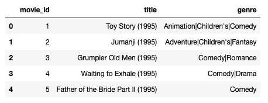

收视率数据有一百万个条目，每行对应一个用户电影收视率。该数据包含以下各列:

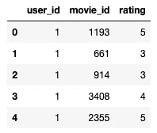

首先，我们将看一个基于内容的推荐系统。会根据以往的观看历史推荐类似的电影。电影之间的相似性可以基于几个因素来确定，例如演员、电影发行年份、导演等。在这种情况下，由于我们没有任何其他信息，相似性将根据流派进行计算。

为了分析流派，我们将流派分成一个数组，如下所示:

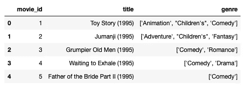

此后， [TfidVectorizer](https://scikit-learn.org/stable/modules/generated/sklearn.feature_extraction.text.TfidfVectorizer.html) 被应用于流派列，以识别每部电影的区别特征。对于每部电影来说，具有最高 Tfidf 分数的类型是表征该电影的类型。

```
tf = TfidfVectorizer(analyzer='word',ngram_range=(1, 2),min_df=0, stop_words='english')
tfidf_matrix = tf.fit_transform(movies['genre'])
tfidf_matrix.shapeOutput: (3883, 127)
```

基于 Tfidf 分数，使用[余弦](https://scikit-learn.org/stable/modules/generated/sklearn.metrics.pairwise.cosine_similarity.html)计算电影之间的相似度。

```
cosine_sim = cosine_similarity(tfidf_matrix)
np.fill_diagonal(cosine_sim, 0 )
cosine_sim.shapeOutput: (3883, 3883)
```

矩阵 cosine_sim 的每一行都给了我们每部电影和其他 3882 部电影之间的相似性得分。以下函数计算与特定标题最相似的电影。

```
titles = movies['title']
indices = pd.Series(movies.index, index=movies['title'])def genre_recommendation(title):
    idx=indices[title]
    ranked = np.argsort(cosine_sim[idx])
    largest_indices = ranked[::-1]
    return titles.iloc[largest_indices]
```

在为《玩具总动员》运行这个函数时，我们得到了前十部类似的电影:

```
genre_recommendation("Toy Story (1995)").head(10)
```

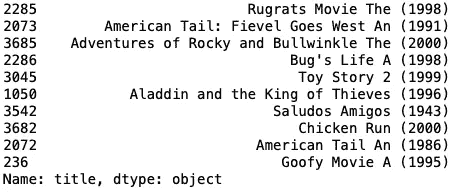

然而，基于内容的推荐受到过于领域特定和同质的困扰。例如，如果用户过去观看过喜剧，则未来的推荐也将围绕喜剧，而不考虑用户也可能喜欢其他类型。

因此，一种**协同过滤**方法被更多地使用。该方法分析用户之间的关系和产品之间的相互依赖性，以识别新的用户-项目关联。该方法中使用的两种主要技术是— **邻域模型**和**潜在因素模型。**

***邻里模型***


在 [Unsplash](/s/photos/neighbours-buying-the-same-thing?utm_source=unsplash&utm_medium=referral&utm_content=creditCopyText) 上由[bùI Thanh TM](https://unsplash.com/@tamtit24?utm_source=unsplash&utm_medium=referral&utm_content=creditCopyText)拍摄的照片

用户邻居是那些以类似方式评价电影的人。项目邻居是被同一用户相似地评级的电影。因此，通过找到用户的邻居，我们可以根据某个用户的邻居看过的电影，向她推荐一部未看过的电影。相反，我们会查看一部电影的最近邻居，以预测特定用户对这部电影的评价。

在这篇文章中，我们将研究用户-用户协同过滤。首先，计算每个用户的平均等级。

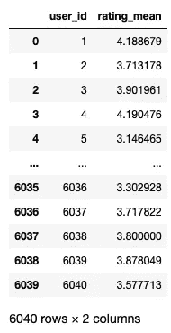

目标是获得一个评级矩阵，其中用户 id 作为行索引，电影 id 作为列索引，评级作为值。

然而，用户通常在他们的评级中有偏见。有些人可能倾向于总是评价低，而有些人可能总是评价高。为了使数值标准化，我们将从每个个人评分中减去平均评分。

标准化后，低评分变成负数，高评分变成正数。如果我们然后取余弦距离，我们发现对他们共同观看的电影具有相反视图的用户将具有几乎相反方向的向量，并且可以被认为尽可能远。但是，对共同评分的电影有相似意见的用户，他们之间的角度会相对较小。

减去每个用户的平均评级后，最终评级矩阵如下:

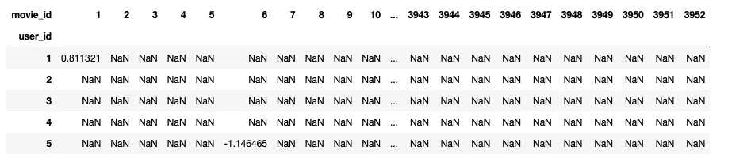

Nan 值仅仅是用户没有看过的电影。我们需要预测这些未看过的电影的收视率，以便能够确定用户是否愿意观看这些电影。在计算用户之间的相似性之前，我们将用行平均值填充 Nan 值。

```
rating_final_user = rating_final.apply(lambda row:row.fillna(row.mean()), axis=1)
```

评级矩阵现在看起来像这样:

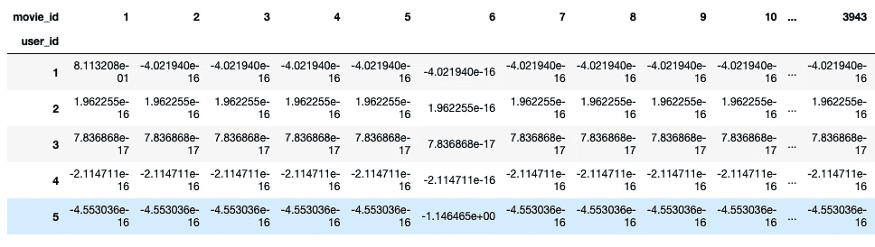

最后，计算用户之间的相似性:

```
cosine = cosine_similarity(rating_final_user)
np.fill_diagonal(cosine, 0 )
user_similarity = pd.DataFrame(cosine,index=rating_final_user.index)
user_similarity.columns=rating_final_user.index
user_similarity.head()
```

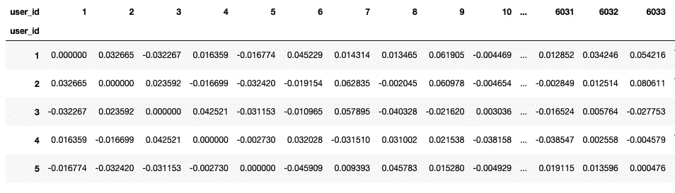

计算每个用户的前 30 个邻居:

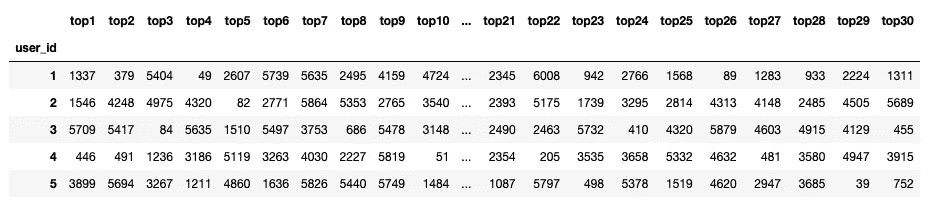

最后，我们通过以下步骤预测特定用户对电影的评价:

I)我们找到我们想要预测其评级的用户的前 30 个邻居。

ii)接下来，我们找到这些邻居对所讨论的电影给出的评级值。没有对该特定电影进行评级的邻居被忽略。

iii)我们现在有两个数据点——邻居用户对特定电影给出的评级以及他们相对于我们想要预测其评级的用户的相似性值。通过将评级和相似性值的总和除以相似性值来计算加权分数。

iv)然后将其添加到我们想要预测的用户的平均评级中，以得出最终数字。

v)根据这个值，我们可以最终决定是否要向用户推荐这部电影。

借助下图，可以直观地理解该过程:

这个评分矩阵显示了 12 个用户对 6 部电影的评分。列“avg”是每个用户的平均等级,“sim”是每个用户相对于用户 1 的相似性值。

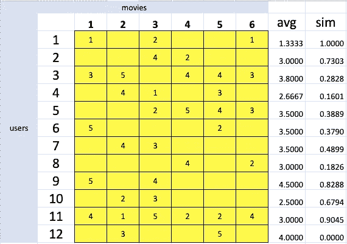

*从每个值中减去平均评分后，计算标准化矩阵。*

*假设，我们想预测用户 1 会给电影 2 打多少分。*

*与 1 最相似的用户是用户 10、11 和 2。然而，用户 2 没有看过电影 2，因此我们可以忽略该行。因此，用户 1 对电影 2 的预测评级是用户 10 和 11 的评级的加权平均值。这种情况下的权重是相似性值。最后，我们得到用户 1 给出的电影 2 的值-1.3。这意味着用户 1 对电影的评价比他的平均值低 1.3 分。十有八九我们不应该向用户 1 推荐这部电影。*

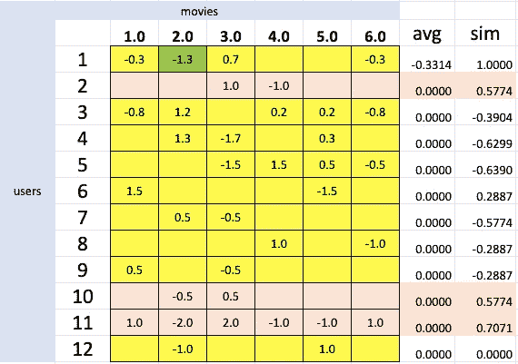

通过转置评级矩阵并重复这些步骤来寻找相似的项目而不是相似的用户，可以为项目-项目协同过滤重复该过程。

通常用户数量远远超过任何平台上的项目数量。因此，项目-项目协同过滤给了我们一个更好的结果，因为它更容易分组相似的项目，而不是相似的用户。

***潜在因素模型***


照片由[布鲁斯·马斯](https://unsplash.com/@brucemars?utm_source=unsplash&utm_medium=referral&utm_content=creditCopyText)在 [Unsplash](/s/photos/person-with-headphone?utm_source=unsplash&utm_medium=referral&utm_content=creditCopyText) 上拍摄

我们有多少次在不知道自己喜欢这首歌的确切原因的情况下循环播放了这首歌？

潜在因素模型试图发现那些不容易被发现的隐藏特征。他们根据这些特征来描述用户和物品的特征。

***矩阵分解***

这是通过称为 ***矩阵分解*** *，*的方法来完成的，该方法将用户(n) x 项目(m)矩阵分解成两个矩阵:用户(n) x 特征(f) *特征(f) x 项目(m)

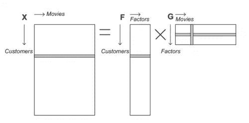

电影推荐的矩阵分解。资料来源:Alpaydin，2016 年。

直观上，这意味着用户对第一矩阵中的特定电影给出的评级是该电影所具有的特征的函数。这类似于创建用户配置文件和电影配置文件。特征值被随机初始化，以通过将两个矩阵相乘来产生某个额定值。目标是在训练期间找到一个尽可能接近原始评级矩阵的值，这是通过梯度下降实现的。一旦我们有了分解的矩阵，我们就可以根据特征值将用户与电影匹配起来。例如，如果特征的数量是 2，一个用户可能具有两个特征的对应值[4，3]。如果特定电影的这两个特征的值是[3.8，2.7]，我们可以断定用户和电影简档匹配。值越接近，用户对电影的评价越高，因此我们应该推荐相同的值。

除了寻找潜在的特征，这种方法还帮助我们将一个大矩阵转化为两个小矩阵。假设有 5000 个用户，1000 部电影。因此，第一个矩阵将有 5000 x 1000 = 500 万个占位符。

现在，假设我们有 20 个功能，等式右侧的第一个矩阵将有 5000 个用户 20 个功能= 100k 个占位符。类似地，第二个矩阵将有 20 个特征 x 1000 个电影= 20k 个占位符。这一共是 120k，比 500 万减少了一大截。

***【奇异向量分解】***

矩阵分解技术发展成更复杂的 SVD 技术，将评级矩阵分解成 3 个矩阵，而不是 2 个。

给定一个 m × n 矩阵 A，秩为 k，奇异值分解 SV D(A)定义为 SVD(A) = U(m，k)× S(k，k) × V (k，n)。

*V 是电影(n) x 特征(k)矩阵的转置。

矩阵 S 是只有 k 个非零元素的对角矩阵。S 的对角元(s1，s2，…，sk)具有 si > 0 且 s1 ≥ s2 ≥ … ≥ sk 的性质。因此，S 矩阵是一个特征矩阵，它以降序给出了特征的相对重要性。通过丢弃 **r** 其他不重要的条目，可以只保留 **k-r** 奇异值。还通过分别从 U 中移除 **r** 列和从 V 中移除 r 行来缩减矩阵 U 和 V。通过将三者相乘得到的简化矩阵是原始矩阵的良好近似。

Python 通过[惊喜包](http://surpriselib.com/)方便了 SVD 的应用。

关于这里涉及的所有主题的详细代码，请参考 github [**链接**](https://github.com/pritha21/Concepts/tree/master/Recommender_Systems) 。

协同过滤存在冷启动问题和流行偏见。网飞试图通过要求新用户列出一些初始偏好来管理冷启动问题，以便未来的推荐可以基于相同的偏好。有不同的方法来防止流行偏见，但是这超出了本文的范围。网飞在向用户推荐书目时会考虑几个参数，比如新鲜度和多样性，从而避免流行偏见。

本文旨在提供一个推荐系统如何工作的简要框架。在现实生活场景中，大量的计算和数据挖掘用于创建用户简档、电影简档，并且通常使用几种算法的组合来最终得出可以向用户推出的推荐。

我希望我已经能够开始了解推荐引擎背后的直觉！一如既往，欢迎反馈！

# **参考文献:**

[](https://www.buzzfeednews.com/article/nicolenguyen/netflix-recommendation-algorithm-explained-binge-watching) [## 网飞有一个改变你放松方式的计划

### 现在是周四晚上，你在电视机前。为了省钱，你把有线电视套餐换成了 10.99 美元…

www.buzzfeednews.com](https://www.buzzfeednews.com/article/nicolenguyen/netflix-recommendation-algorithm-explained-binge-watching) [](https://www.newamerica.org/oti/reports/why-am-i-seeing-this/case-study-netflix/#:~:text=Netflix%27s%20recommendation%20system%20is%20an,targeted%20advertisements%20to%20its%20users.) [## 为什么我会看到这个？

### 视频和电商平台如何利用算法驱动对用户的推荐。

www.newamerica.org](https://www.newamerica.org/oti/reports/why-am-i-seeing-this/case-study-netflix/#:~:text=Netflix%27s%20recommendation%20system%20is%20an,targeted%20advertisements%20to%20its%20users.) [](https://netflixtechblog.com/netflix-recommendations-beyond-the-5-stars-part-2-d9b96aa399f5) [## 网飞推荐:超越五星(下)

### 更深入地了解我们更广泛的个性化技术。

netflixtechblog.com](https://netflixtechblog.com/netflix-recommendations-beyond-the-5-stars-part-2-d9b96aa399f5) 

[https://blogs . commons . George town . edu/cctp-607-spring 2019/2019/05/06/music-to-my-ears-de-black box-spotifys-recommendation-algorithm/](https://blogs.commons.georgetown.edu/cctp-607-spring2019/2019/05/06/music-to-my-ears-de-blackboxing-spotifys-recommendation-algorithm/)

用于高度可扩展推荐系统的增量奇异值分解算法(Badrul Sarwar、George Karypis、Joseph Konstan 和 John Riedl { Sarwar、Karypis、Konstan、riedl}@cs.umn.edu Group lens Research Group/美国明尼苏达州明尼阿波利斯市明尼苏达大学计算机科学与工程系陆军 HPC 研究中心，邮编:55455)

【http://www.mmds.org/】T2(第九章)

[推荐系统的矩阵分解技术](https://datajobs.com/data-science-repo/Recommender-Systems-[Netflix].pdf)