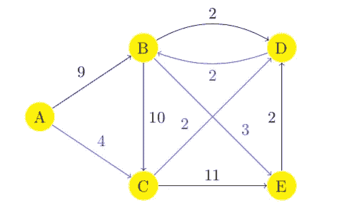
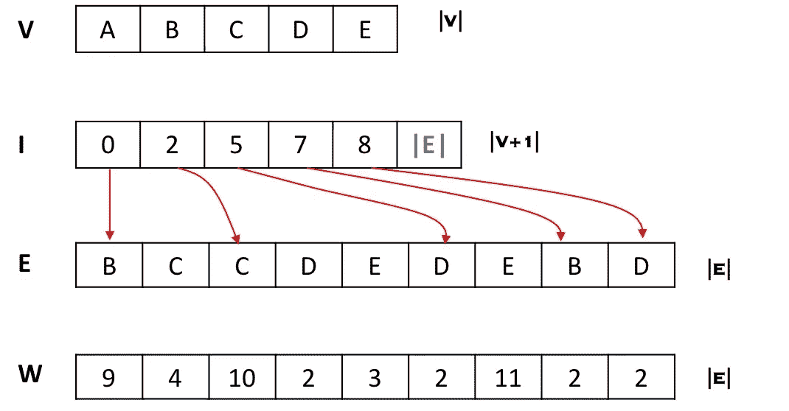
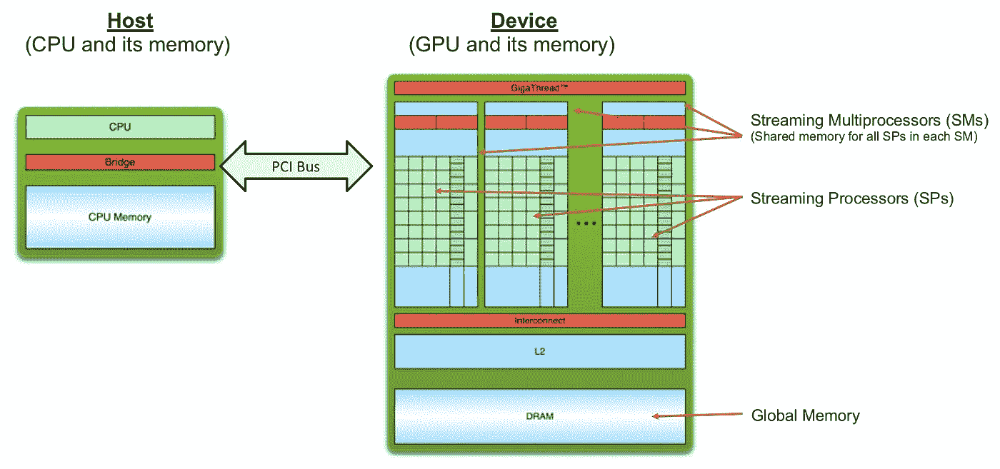
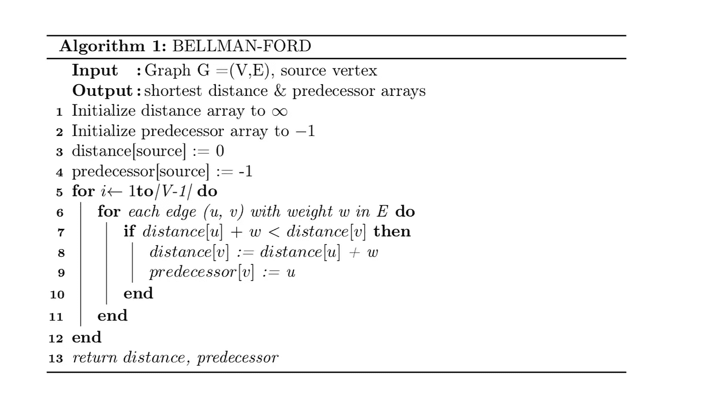
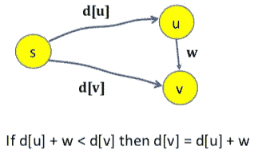
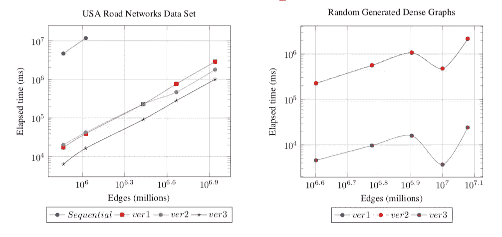
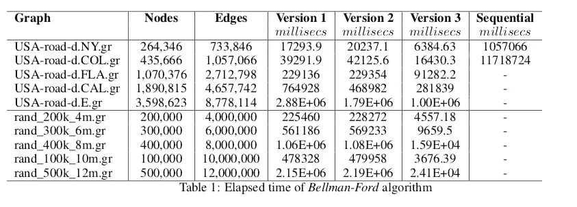

# 基于 CUDA 的 GPU 上 Bellman-Ford 单源最短路径算法

> 原文：<https://towardsdatascience.com/bellman-ford-single-source-shortest-path-algorithm-on-gpu-using-cuda-a358da20144b?source=collection_archive---------27----------------------->

## 计算连通图中从一个源顶点到所有其它顶点最短距离的并行算法

蒂莫·沃尔茨在 [Unsplash](https://unsplash.com?utm_source=medium&utm_medium=referral) 上的照片

# 概观

遍历大型图来计算不同的信息在现实世界中有各种用例，如社交媒体网络、通信网络、搜索引擎索引和页面排名、VLSI 设计和生物网络分析。贝尔曼-福特、迪杰斯特拉和德尔塔步进是广泛使用的单源最短路径算法(SSSP)算法。Dijkstra 的算法提供了一种高效的实现方式，而 Bellman-Ford 则提供了一种简单的并行实现方式。增量步进算法在两者之间引入了一种折衷。本文介绍了在图形处理器(GPGPU)上使用统一计算设备架构(CUDA)加速贝尔曼-福特 SSSP 算法的三种并行实现技术。我们还在大型图上比较了所有三种变体的性能。我们观察到，对于具有 40 万个顶点和 100 万条边的稀疏图，使用优化的 CUDA 实现，顺序实现的运行时间可以减少 99.4%。

# 什么是单源最短路径(SSSP)？

图 G = (V，E ),其中 V 是顶点集，E 是边集。边(u，v，w)是从节点 u 到 v 的路径，其权重为 w。如果我们将节点视为城市，则边是城市之间的路线，权重是城市之间的距离。

在下面显示的示例图中，V = {A，B，C，D，E}和 E = {(A，B，9)，(A，C，4)，(B，C，10)，(B，D，2)，(B，E，3)，(C，D，2)，(C，E，11)，(D，B，2)，(E，D，2)}。单源最短路径是从源顶点(例如“A ”)到所有其他顶点的最短距离。

直接加权图

在上面的示例图中，从源顶点“A”到所有其他顶点的 SSSP 由蓝色箭头给出。即 A → C → D → B → E

# 数据集

我们使用了两种不同类型的大型图表。美国道路网络图数据集来自 DIMACS 最短路径实施挑战([离散数学和理论计算机科学中心)。第 9 届 DIMACS 实施挑战](http://users.diag.uniroma1.it/challenge9/download.shtml))和 Cherkassky、Goldberg 和 Radzik 使用 SPRAND 工具随机生成的图形(参考文献[1])

# 图表示

图 G(V，E)通常通过邻接矩阵或邻接表来表示。对于像道路网络这样的稀疏图，邻接表是首选的表示方法，因为它占用的空间更少。**压缩稀疏行** (CSR)表示是邻接表的另一种形式，其中顶点列表被打包成一个大数组。我们发现这种表示适合 CUDA 实现(参考文献[2]、[3])。如下图所示，四个数组用于表示图形；存储所有顶点的顶点数组 **V** ，存储每个**V【I】**的边的邻接表的起始位置的索引数组 **I** ，存储每个边的权重的边数组 **E** ，以及存储每个边的权重的权重数组 **W** 。**I[I+1]—I[I]**提供 **V[i]** 的边数

图的压缩稀疏行表示

# GPU 和 CUDA

图形处理单元(GPGPU)上通用计算使用的增加为我们提供了大规模并行计算能力。GPGPU 基于单指令多线程(SIMT)执行模型，其中每个线程执行相同的代码。[计算统一设备架构 CUDA(Compute Unified Device Architecture)是 Nvidia](https://developer.nvidia.com/cuda-zone) 打造的并行计算平台和 API。它为通用计算提供了 GPU 并行性，并保留了性能。它是基于行业标准 C++开发的。CUDA 由一小组扩展组成，支持异构编程。

基本图片:CUDA C/C++基础，超级计算 2011 教程，Cyril Zeller，NVIDIA 公司

GPGPU 由几个流多处理器(SMs)组成。每个 SM 由几个流处理器(sp)组成。每个 SM 都有自己的内存，称为共享内存，由 SM 中的所有 sp 共享。从开发人员的角度来看，GPU 可以被视为网格，SMs 可以被视为块，sp 可以被视为线程。内核是由线程执行的一段代码。每个线程都有自己的 ID，它在决定线程要访问输入数据的哪一部分时起着至关重要的作用。

# 贝尔曼-福特顺序算法

贝尔曼-福特算法是一种使用边缘松弛技术的简单算法。它将所有边缘放松| V | 1 次。其中| V |是图中顶点的数量。如果没有负边循环，它也可以在具有负权重边的图上工作。在这项研究中，只考虑了边权重为正的图。

顺序贝尔曼-福特算法

## 什么是边缘松弛？

这是一种用正确的距离来修正近似距离的技术。在下图中，d[u]是从源“s”到“u”的距离，d[v]是从源“s”到“v”的距离。“u”和“v”之间有一条边，权重为“w”。如果 v 的距离大于(u，v)的 u +权重的距离，则用(u，v)的 u +权重的距离更新 v 的距离。

贝尔曼-福特松弛法

# 贝尔曼-福特并行 CUDA 实现

## 版本 1 —单片内核

在我们的第一种方法中，我们引入了一个单片 CUDA 内核，其中图形的每个顶点都被分配给一个单独的线程。每个线程放松由线程 ID 标识的顶点的所有输出边。在这种方法中，GPU 块数是在运行时根据输入图形中的顶点数计算的。这种类型的内核假设我们有足够的线程来覆盖输入图的所有顶点。

版本 1 —单片内核

## 版本 2 —具有网格步长循环的内核

在加速并行实现的第二项技术中，我们在 CUDA 内核中使用了 grid stride。使用 blockDim.x * gridDim.x 计算跨距，它等于网格中的线程总数。例如，如果网格中有 1024 个线程，线程 0 将处理索引为 0、1024、2048 等的顶点。这种网格步长循环方法提供了可伸缩性和线程重用。它还确保没有线程空闲，并且每个线程都做等量的工作

版本 2 —具有网格步长循环的内核

## 版本 3 —内核具有网格步长循环，仅在需要时放松边缘

为了进一步优化性能，我们引入了大小为|V|的布尔数组 F。对于图形的所有顶点，该数组在开始时被初始化为 false。源设置为真。作为松弛的一部分，当一个顶点用离源更短的距离更新时，它在 F 数组中的对应标志被设置为真。这表明在下一次迭代中，该顶点的所有输出边都需要进一步松弛。松弛内核使用该信息，并且仅当对应顶点的标志设置为真时才松弛。这种方法与 grid-stride 循环相结合，减少了每个线程所做的不必要的工作，从而确保了整体执行速度的进一步提高。

版本 3 —内核具有网格步长循环，仅在需要时放松边缘

# 测试环境

我们使用[德克萨斯高级计算中心(TACC)的 Maverick2 超级计算机](https://portal.tacc.utexas.edu/user-guides/maverick2)系统在大型图上分析我们所有实现的性能。Maverick2 拥有 Nividia GeForce GTX 1080 Ti GPU 设备，每个 SM 有 28 个 SMs 和 128 个 sp，以及 11GB 的全局内存。每个 SM 大约有 49 KB 的共享内存。

# 技术性能分析

贝尔曼-福特实现的运行时间比较

我们的分析表明，版本 3 的实现性能最好。与稀疏的真实世界道路网络图相比，随机生成的密集图的性能甚至更好。首先，我们记录了基本的顺序实现花费了 3.25 个小时来对具有 400，000 多个顶点和超过一百万条边的稀疏的纽约道路网络图执行 SSSP 计算。相比之下，CUDA 版本 1 用了 39 秒，版本 2 用了 42 秒，版本 3 用了 16 秒。我们还观察到，版本 2，即网格步长循环内核，对于具有超过 100 万个顶点和 400 万条边的较大图形表现得更好。对于随机生成的密集图，性能甚至更好。这表明启动新线程块的开销随着网格步长循环的引入而减少，这确保了块大小不会随着输入的增加而增加，从而允许每个线程处理更多的工作。下表显示了我们的 Bellman-Ford 实现对于各种大型图形所用的运行时间。

# 结论

我们提出了 Bellman-Ford 单源最短路径算法在 GPU 上使用 CUDA 并行实现的三种变体。具有网格步长循环的内核和仅在需要时放松边的逻辑，对于具有 1-1000 万条边的较大图形表现更好。我们在实现中使用了 CSR 表示。对于密集图形，这种方法需要更多的空间。可以做进一步的研究，使用密集图形的替代格式(如邻接矩阵),并使用 CUDA 块内的共享内存来研究性能。

这篇博文基于我和我的合作伙伴 Stephan Garland 提交给 2020 年夏天在奥斯汀的德克萨斯大学并行算法课程的学期论文。非常感谢[Vijay Garg](http://www.ece.utexas.edu/people/faculty/vijay-garg)博士精心组织和精彩讲授的并行算法课程。

Github 链接:【https://github.com/sengorajkumar/gpu_graph_algorithms 

# 参考

[1]Boris cherkasky、Andrew V. Goldberg 和 Tomasz Radzik。最短路径算法:理论和实验评估。数学编程，第 129-174 页。1993.

[2]潘卡利·阿加瓦尔和弥勒佛·杜塔。基于计算机统一设计架构(CUDA)的 Bellman-Ford 算法在 GPU 上的新方法。国际计算机应用杂志(0975–8887，110 — №13.2015。

[3]Pawan Harish 和 P. J. Narayanan。使用 CUDA 在 GPU 上加速大型图形算法。印度海德拉巴国际信息技术研究所视觉信息技术中心。

[4]马克·哈里斯。CUDA Pro 提示:用 Grid-Stride Loops 编写灵活的内核 https://developer . NVIDIA . com/blog/CUDA-Pro-Tip-Write-Flexible-Kernels-Grid-Stride-loops/，2013 年 4 月 22 日。

[5]马克·哈里斯。CUDA C/C++内核如何高效访问全局内存. https://developer . NVIDIA . com/blog/how-Access-Global-Memory-efficient-CUDA-C-kernels/，2013 年 1 月 7 日。

[6]Cyril Zeller，NVIDIA 公司，CUDA C/C++基础，超级计算 2011 年教程