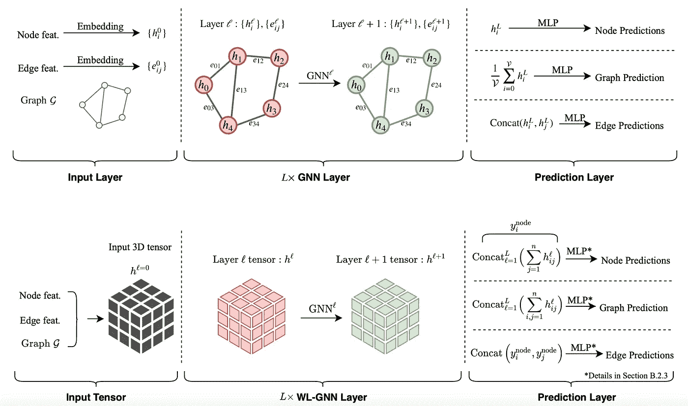
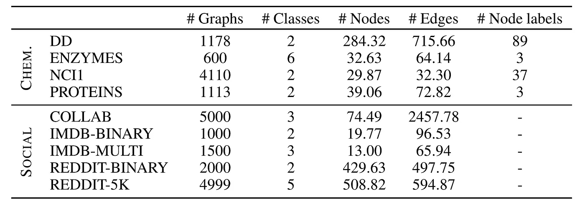
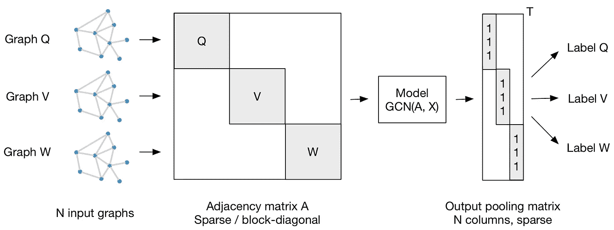

# 基准图神经网络

> 原文：<https://towardsdatascience.com/benchmarking-graph-neural-networks-d644e0bf54d5?source=collection_archive---------38----------------------->

## 这是一篇论文[基准图神经网络](https://arxiv.org/abs/2003.00982)的介绍性博客，该论文是与[柴坦尼亚·k·乔希](https://chaitjo.github.io/)、[托马斯·洛朗](http://thomaslaurent.lmu.build/homepage.html)、[约舒阿·本吉奥](https://mila.quebec/en/person/bengio-yoshua/)和[泽维尔·布列松](https://www.ntu.edu.sg/home/xbresson/)合作的。



图 0:在稀疏秩 2 张量上运行的 GCNs(上)和在密集秩 2 张量上运行的 WL-GNNs(下)的标准实验管道。

如今，图形神经网络(GNNs)广泛应用于社会科学、知识图、化学、物理、神经科学等领域。，相应地，对文献的兴趣和论文数量也有了很大的增长。

然而，在缺乏标准且被广泛采用的基准测试的情况下，衡量新模型的有效性和验证普遍适用于更大和更复杂数据集的新想法变得越来越困难。

**为了解决**图学习研究中存在的这一最重要的问题，我们开发了一个开源、易于使用且可重复的[基准测试框架](https://github.com/graphdeeplearning/benchmarking-gnns)，该框架具有严格的实验协议，代表了 GNNs 的分类进步。

> 这篇文章概述了[GNN](https://arxiv.org/abs/1905.04579)文献中的[问题](https://arxiv.org/abs/1912.09893) [提出了基准测试的需求，在](https://arxiv.org/abs/1905.09550)[论文](https://arxiv.org/abs/2003.00982)中提出的框架，广泛使用的强大 GNN 基准测试的主要类别，以及从大量实验中获得的见解。

# 为什么要进行基准测试？

在[深度学习](https://www.nature.com/articles/nature14539)的任何核心研究或应用领域，基准有助于识别和量化哪些类型的[架构](https://arxiv.org/abs/1409.4842)、[原则](https://arxiv.org/abs/1512.03385)或[机制](https://arxiv.org/abs/1502.03167)是通用的，可推广到现实世界的任务和大型数据集。特别是，这个人工智能领域最近的革命*通常被认为*可能在很大程度上是由大规模基准图像数据集 [ImageNet](http://www.image-net.org/) 触发的。(显然，其他驱动因素包括研究量的增加、更多数据集、计算、广泛采用等。)


图 1:来自[paperswithcode.com](https://paperswithcode.com/)的 ImageNet 分类排行榜

标杆管理已经被证明有利于**推动进步**，识别**基本思想**，解决[许多](https://genomebiology.biomedcentral.com/articles/10.1186/s13059-019-1738-8)科学子领域中的领域相关问题。这个项目就是基于这一基本动机而构思的。

# GNNs 需要一个基准框架

## a.数据集:

GNN 文献中许多被广泛引用的论文都包含了在**小型图数据集**上评估的实验，这些数据集只有几百(或几千)个图。



图 2:广泛使用的 TU 数据集的统计数据。资料来源 [Errica 等人，2020 年](https://openreview.net/forum?id=HygDF6NFPB)

**以**为例，酶数据集，它几乎出现在用于分类任务的 GNN 的所有工作中。如果使用随机 10 折交叉验证(在大多数论文中)，测试集将有 60 个图(即 600 个总图的 10%)。这意味着正确的分类(或者错误的分类)将改变 1.67%的测试准确度分数。**几个样本可以确定 3.33%的性能测量差异**，这通常是在文献中验证一个新想法时的一个重要增益分数。你看，样本的数量不可靠，无法具体地确认进步。

我们的实验也表明，在这样的数据集上，性能的标准偏差很大，这使得很难对一个研究想法做出实质性的结论。此外，大多数 gnn 在这些数据集上的统计性能是相同的。这些数据集的**质量**也让人怀疑你是否应该在验证 GNNs 上的想法时使用它们。在其中几个数据集上，[更简单的模型](https://openreview.net/forum?id=HygDF6NFPB)，有时，[表现得和](https://openreview.net/forum?id=rJlUhhVYvS)一样好，甚至胜过 GNNs。

因此，**区分[复杂](https://arxiv.org/abs/1905.09550)、[简单](https://arxiv.org/abs/1905.04579)和[图机器学习的图不可知](https://openreview.net/forum?id=HygDF6NFPB)架构变得很困难。**

## b.一致的实验方案:

GNN 文献中的几篇论文在统一和稳健的实验设置上没有达成共识，这导致[讨论](https://arxiv.org/abs/1811.05868)不一致之处和[重新评估](https://openreview.net/forum?id=HygDF6NFPB)几篇论文的实验。

为了在此强调几个例子， [Ying 等人，2018](https://papers.nips.cc/paper/7729-hierarchical-graph-representation-learning-with-differentiable-pooling) 对固定数目的时期的 10 倍分裂数据进行训练，并报告具有*“在任何时期跨越分裂的最高平均验证准确度”*的时期的性能，而 [Lee 等人，2019](http://proceedings.mlr.press/v97/lee19c.html) 通过监控时期式验证损失使用*“早期停止标准”*，并报告 10 个时期的*“最后时期的平均测试准确度”*

现在，如果我们将这两篇论文的结果放在同一个表中，并声称具有最高性能分数的模型是所有模型中最有希望的，**我们能确信**这种比较是公平的吗？

> *还有其他与超参数选择、可训练参数的不公平预算比较、不同训练验证测试分割的使用等相关的问题。*

这些问题的存在促使我们开发了一个 GNN 基准框架，该框架使 GNN 研究标准化，并帮助研究人员取得更有意义的进展。

# 建立 GNN 基准的挑战

缺乏基准一直是 GNN 文献中的一个主要问题，因为上述**要求没有得到严格执行**。

设计基准测试极具挑战性，因为我们必须为编码框架、实验设置和适当的数据集做出稳健的决策。基准还应该全面，涵盖大多数基本任务，表明研究可以应用的应用领域。例如，图形学习问题包括预测节点级、边级和图形级的属性。基准应该试图涵盖其中的许多方面，如果不是全部的话。

同样，收集真实且有代表性的大规模数据集也具有挑战性。由于缺乏理论工具来定义数据集的质量或验证其在给定任务中的统计代表性，因此很难对数据集做出决定。此外，由于大多数流行的图形学习框架不能*【非常有效】*地适应大型图形，因此需要对图形的节点和边的特征以及图形大小的比例进行任意选择。

> *最近有一个很有前途的努力，* [*【开放图基准(OGB)*](https://ogb.stanford.edu/) *，收集有意义的中大规模数据集，以指导图学习研究。该倡议是对该项目的目标的补充。*

# 提议的基准框架:

我们为图形神经网络提出了一个基准框架，具有以下关键特征:

1.  我们开发了一个模块化的编码基础设施，可以用来加速新思想的发展
2.  我们的框架采用了严格而公平的实验协议，
3.  我们提出了适当的中等规模的数据集，可以作为后续研究的插件。
4.  涵盖了图机器学习中的四个基本任务，即图分类、图回归、节点分类和边分类。

## a.编码基础设施:

我们的基准代码基础设施基于 [Pytorch](http://pytorch.org/) / [DGL](http://dgl.ai/) 。

**从高层次来看**，我们的框架统一了以下独立组件:I)数据管道，ii) GNN 层和模型，iii)培训和评估功能，iv)网络和超参数配置，以及 v)用于再现性的单一执行脚本。


图 3:我们在 [GitHub](https://github.com/graphdeeplearning/benchmarking-gnns) 上开源的模块化编码框架的快照

关于使用这些组件的详细用户说明在 [GitHub 自述文件](https://github.com/graphdeeplearning/benchmarking-gnns)中有所描述。

## b.数据集:

我们包括来自化学、数学建模、计算机视觉、组合优化和社交网络等不同领域的 8 个数据集。


图 4:建议的基准中包含的数据集的统计摘要

本文描述了数据集准备的步骤及其与基准图神经网络的相关性。

> *值得一提的是，我们纳入了来自 OGB 的*[*-COLLAB*](https://ogb.stanford.edu/docs/linkprop/#ogbl-collab)*，这表明我们可以* ***灵活地纳入来自 OGB 倡议的*** *任何当前和未来数据集。*

## c.实验方案:

我们为基准图神经网络模型定义了一个严格和公平的实验协议。

**数据集分割:**鉴于文献对不同的模型使用不同的训练值测试分割存在问题，我们确保我们的数据管道为每个比较的 GNN 模型提供相同的训练、验证和测试分割。我们遵循可用数据集的标准分割。对于没有标准分割的合成数据集，我们确保分割中的类分布或合成属性是相同的。更多细节请参考论文。

**培训:**我们对所有实验使用相同的培训设置和报告方案。我们使用 Adam 优化器以基于确认损失的学习率衰减策略来训练 GNNs。我们对每个实验进行未指定次数的训练，在此期间，模型停止以没有显著学习的最小学习速率进行训练。

*重要的是，这种策略使得用户很容易不理解选择多少个纪元来训练他们的模型。*

每个实验在 4 个不同的种子上运行，最多 12 小时的训练时间，并且报告 4 个实验的最后时期分数的汇总统计。

**参数预算:**我们决定使用两个可训练的参数预算:(I)所有任务的每个 gnn 的 100k 参数，以及(ii)gnn 的 500k 参数，我们研究将模型缩放到更大的参数和更深的层。相应地选择隐藏层和隐藏维度的数量以匹配这些预算。

为了公平比较，我们选择了相似的参数预算，因为否则很难严格评估不同的模型。在 GNN 文献中，经常可以看到一个新的模型与现有的文献相比，没有任何参数数量的细节，或任何具有相同大小的模型的尝试。话虽如此，我们的目标并不是为每个模型找到最优的超参数集，这是一项计算密集型任务。

## d.图形神经网络:

我们对两大类 gnn 进行了基准测试，它们代表了最近文献中所见证的图形神经网络架构的分类进步。为了命名，我们将这两类称为 **GCNs(图卷积网络)**和**WL-GNNs(Weisfeiler-Lehman GNNs)**。

> *gcn 是指流行的基于消息传递的 gnn，其利用稀疏张量计算，WL-gnn 是基于 WL 测试的理论上有表达力的 gnn，用于区分需要在每层进行密集张量计算的非同构图形。*

因此，我们的实验管道显示在图 5 的 GCNs 和图 6 的 WL-GNNs。


图 5:我们在稀疏的秩为 2 的张量上运行的 gcn 的标准实验流水线。


图 6:我们在*稠密*秩 2 张量上运行的 WL-gnn 的标准实验流水线。

我们将读者引向我们的论文和相应的著作，以获得关于 GNNs 的数学公式的更多细节。对于感兴趣的读者，我们还在论文中包括了每个 GNN 基准测试的层更新的**框图。**

> 在这一阶段，我们简单回顾了一下，我们讨论了基准测试的**需求**，构建这样一个框架的**挑战**，以及我们提议的基准测试框架的**细节。我们现在深入研究实验。**

我们对基于消息传递的 gcn 和 WL-gnn 进行了原则性的调查，以揭示重要的见解，并强调在构建强大的 GNN 模型中的关键潜在挑战。

# 在建议的数据集上对 GNNs 进行基准测试。

我们使用当前包含在我们的基准框架中的每个 GNN 模型，在所有数据集上执行全面的实验。这些实验帮助我们获得了许多真知灼见，这里只讨论其中的一部分。我们建议阅读这篇论文，了解实验结果的细节。

> *我们评测的 GNNs 有:* [香草*图卷积网络(GCN)*](https://arxiv.org/abs/1609.02907) *，*[*Graph sage*](https://cs.stanford.edu/people/jure/pubs/graphsage-nips17.pdf)*，* [*图注意力网络(GAT)*](https://arxiv.org/abs/1710.10903) *，* [*高斯混合模型(MoNet)*](https://arxiv.org/abs/1611.08402) *，*

**1。图形不可知的神经网络在建议的数据集上表现不佳**:我们将所有的神经网络与一个简单的 MLP 进行比较，后者独立于彼此更新每个节点的特征，即忽略图形结构。

> *ℓ层的 MLP 节点更新方程为:*


MLP 在每个数据集上的评估得分一直很低，这表明有必要考虑这些任务的图形结构。这一结果也表明了这些数据集对 GNN 研究有多合适，因为它们在统计上区分了模型性能。

**2。在建议的数据集上，GCNs 优于 WL-GNNs**:虽然 WL-GNNs 在图形同构和表达能力方面可以证明是强大的，但是我们考虑的 WL-GNN 模型不能优于 GCNs。与利用稀疏张量的 gcn 相比，这些模型的空间/时间复杂度低，因此在扩展到更大的数据集时受到限制。

> *gcn 可以方便地扩展到 16 层，并在所有数据集上提供最佳结果，而 WL-gnn 在尝试构建更深层次的网络时面临丢失发散和/或内存不足的错误。*

**3。各向异性机制改善消息传递 GCNs 架构**:在消息传递 GCNs 中的模型中，我们可以将其分为**各向同性**和**各向异性**。

其节点更新方程平等对待每个边缘方向的 GCN 模型被认为是各向同性的；并且其节点更新方程不同地对待每个边缘方向的 GCN 模型被认为是各向异性的。

> *各向同性层更新方程:*


> *各向异性层更新方程:*


根据上述方程，GCN、GraphSage 和 GIN 是各向同性的 GCN，而 GAT、MoNet 和 GatedGCN 是各向异性的 gcn。

我们的基准实验表明，**各向异性机制是 GCNs 中的一个架构改进**，它始终给出令人印象深刻的结果。注意，稀疏和密集注意机制(分别在 GAT 和 GatedGCN 中)是 GNN 中各向异性成分的例子。

**4。训练理论上强大的 WL-GNNs** 存在潜在的挑战:我们观察到 WL-GNNs 的表现分数有很高的标准差。(回想一下，我们报告了使用不同种子的 4 次运行的每次性能)。这就暴露了**训练**这些模特的问题。

像批量训练和批量归一化这样的通用训练过程没有在 WL-GNNs 中使用，因为它们在稠密的秩 2 张量上操作。

为了清楚地描述这一点，在稀疏秩 2 张量上操作的领先图机器学习库中的 gcn 的批处理方法涉及为一批图准备一个**稀疏块对角邻接矩阵**。



图 7:用一个稀疏块对角矩阵表示的小批量图。[来源](https://github.com/tkipf/gcn#graph-classification)

在稠密秩 2 张量上操作的 WL-gnn 具有计算稠密张量中每个位置处/来自每个位置的信息的组件。因此，相同的方法(图 7)是不适用的，因为它将使整个块对角矩阵密集，并将破坏稀疏性。

gcn 利用批量训练和批量标准化来实现稳定快速的训练。此外，目前设计的 WL-高斯神经网络不适用于单一的大图，如 OGBL-科拉布图。我们未能在 GPU 和 CPU 内存上容纳如此大尺寸的稠密张量。

因此，我们的基准表明，需要重新思考更好的 WL-广义神经网络设计方法，可以利用稀疏性，批处理，规范化方案等。已经成为深度学习的普遍成分。

# 更多阅读

有了这个 GNN 基准框架的介绍和有用性，我们结束这篇博客，但是如果你对这个工作感兴趣，还有更多阅读。

**特别是**，我们在本文中更详细地研究了链接预测的各向异性和边缘表示，并提出了一种改进低结构表达 GCNs 的新方法。*我们将在以后的博客文章中单独讨论这些，以便清楚地理解*。

如果这个基准框架在你的研究中使用，请在你的工作中使用下面的 bibtex。如需讨论，请向我们咨询 [GitHub 问题](https://github.com/graphdeeplearning/benchmarking-gnns/issues)。我们很乐意讨论和改进基准，以指导图形神经网络中更有意义的研究。

```
@article{dwivedi2020benchmarkgnns,
  title={Benchmarking Graph Neural Networks},
  author={Dwivedi, Vijay Prakash **and** Joshi, Chaitanya K **and** Laurent, Thomas **and** Bengio, Yoshua **and** Bresson, Xavier},
  journal={arXiv preprint arXiv:2003.00982},
  year={2020}
}
```

**脚注:**

1.  *这样说，我们并不意味着这些想法没有用，或者作者的工作没有意义。每一项努力都同样有助于这一领域的发展。*
2.  *举个例子，你可以参考* [*到*](https://arxiv.org/pdf/2006.07846.pdf) [*这些*](https://github.com/lukecavabarrett/pna) [*的作品*](https://github.com/AITRICS/mol_reliable_gnn) *，利用我们的框架来方便地研究他们的研究思路。它表明了拥有这样一个框架的有效性。*
3.  请注意，我们的目标不是开发一个软件库，而是提出一个编码框架，其中每个组件都是简单的，并且对尽可能多的用户是透明的。

*本帖原载于* [*NTU 图深度学习网站*](https://graphdeeplearning.github.io/post/benchmarking-gnns/) *。*