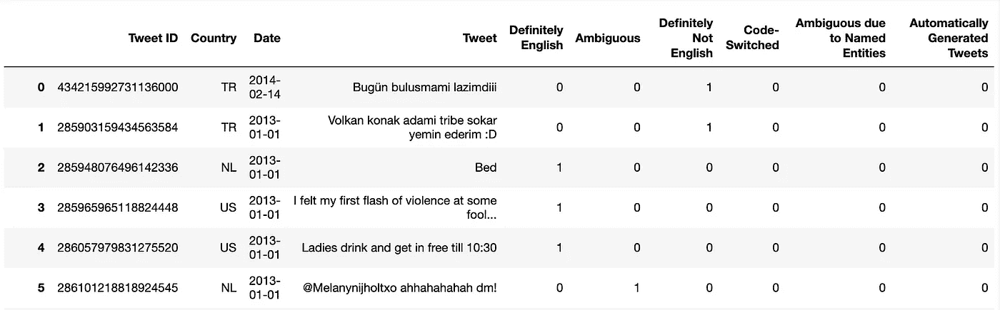
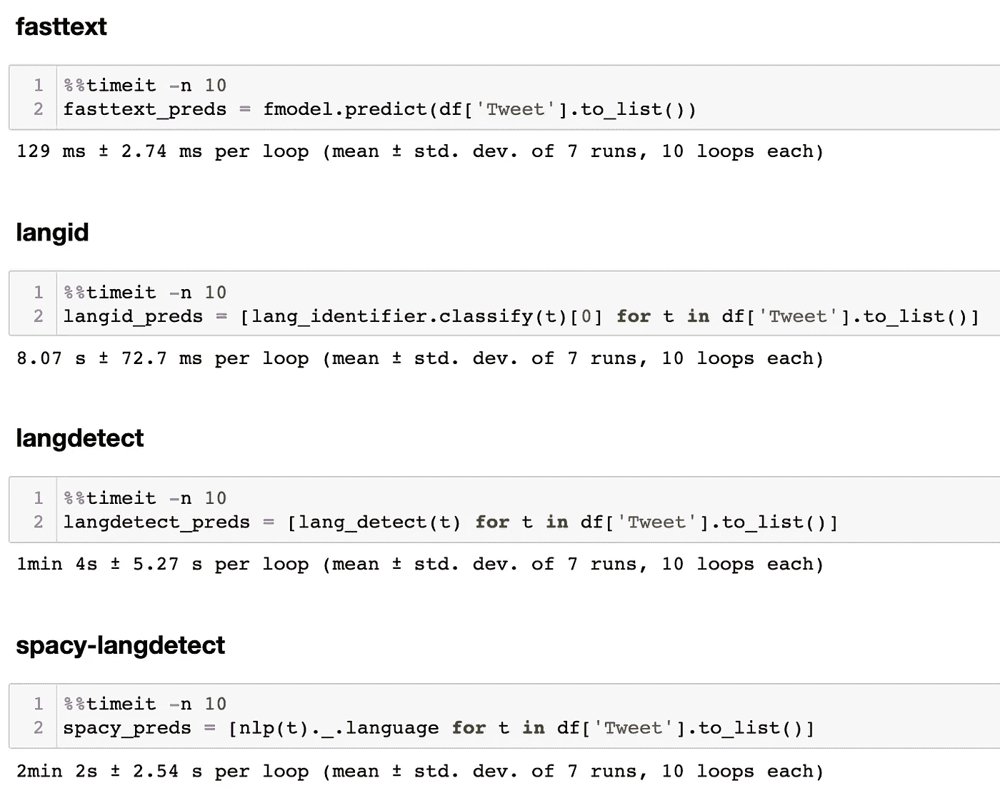
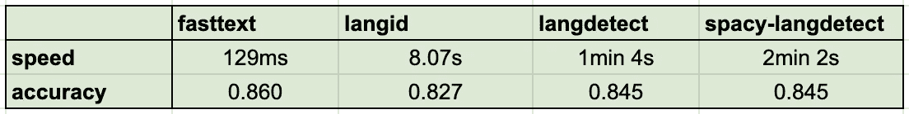

# 自然语言处理的基准语言检测

> 原文：<https://towardsdatascience.com/benchmarking-language-detection-for-nlp-8250ea8b67c?source=collection_archive---------6----------------------->

## [入门](https://towardsdatascience.com/tagged/getting-started)

## 用于识别文本语言的四个 Python 工具，以及速度和准确性测试


杰奎琳·布兰德韦恩在 [Unsplash](https://unsplash.com/s/photos/languages?utm_source=unsplash&utm_medium=referral&utm_content=creditCopyText) 上的照片

大多数 NLP 应用程序往往是特定于语言的，因此需要单语数据。为了用目标语言构建应用程序，您可能需要应用一种预处理技术，过滤掉用非目标语言编写的文本。这需要正确识别每个输入示例的语言。下面我列出了一些工具，您可以使用它们作为 Python 模块来满足这个预处理需求，并提供了一个性能基准来评估每一个工具的速度和准确性。

# 1)语言检测

[](https://pypi.org/project/langdetect/) [## langdetect

### Nakatani Shuyo 的语言检测库(版本从 03/03/2014)到 Python 的移植。$ pip 安装语言检测…

pypi.org](https://pypi.org/project/langdetect/) 

`langdetect`是 Google 的[语言检测](https://github.com/shuyo/language-detection)库从 Java 到 Python 的重新实现。只需将您的文本传递给导入的`detect`函数，它将输出模型给出最高置信度得分的语言的两个字母的 ISO 693 代码。(参见[本页](https://en.wikipedia.org/wiki/List_of_ISO_639-1_codes)了解 693 个代码及其各自语言的完整列表。)如果你使用`detect_langs`来代替，它将输出一个列表，列出模型已经预测到的顶级语言，以及它们的概率。

```
from langdetect import DetectorFactory, detect, detect_langstext = "My lubimy mleko i chleb."detect(text) #  'cs'
detect_langs(text)  # [cs:0.7142840957132709, pl:0.14285810606233737, sk:0.14285779665739756]
```

几个点缀点:

1.  库制作者建议您将`DetectorFactory`种子设置为某个数字。这是因为 langdetect 的算法是不确定的，这意味着如果你试图在太短或太模糊的文本上运行它，你可能每次运行它都会得到不同的结果。设定种子在开发/评估期间强制执行一致的结果。
2.  您可能还想在 try/except 块中用`LanguageDetectException`包围`detect`调用，否则您可能会得到一个[“文本中没有特性”错误](https://github.com/Mimino666/langdetect/issues/44)，当给定输入的语言不能被评估时，例如当它包含 URL、数字、公式等字符串时，就会出现这个错误。

```
from langdetect import DetectorFactory, detect
from langdetect.lang_detect_exception import LangDetectExceptionDetectorFactory.seed = 0def is_english(text):
    try:
        if detect(text) != "en":
            return False
    except LangDetectException:
        return False
    return True
```

# 2)空间语言检测器

[](https://spacy.io/universe/project/spacy-langdetect) [## 空间探测空间宇宙

### 一个完全可定制的语言检测管道，用于空间安装

空间. io](https://spacy.io/universe/project/spacy-langdetect) 

如果您使用 spaCy 来满足您的 NLP 需求，您可以向您现有的 spaCy 管道添加一个定制的语言检测组件，这将使您能够在`Doc`对象上设置一个名为`.language`的扩展属性。然后可以通过`Doc._.language`访问该属性，它将返回预测的语言及其概率。

```
import spacy
from spacy_langdetect import LanguageDetectortext2 = 'In 1793, Alexander Hamilton recruited Webster to move to New York City and become an editor for a Federalist Party newspaper.'nlp = spacy.load('en_core_web_sm')
nlp.add_pipe(LanguageDetector(), name='language_detector', last=True)doc = nlp(text)
doc._.language  # {'language': 'en', 'score': 0.9999978351575265}
```

# 3) langid

langid 特别吹嘘它的速度(下面会详细介绍)。它的工作方式类似于上面的工具，但是它还可以通过运行`python langid.py`作为命令行工具使用。查看他们的回购协议，了解更多细节和其他选择。

[](https://github.com/saffsd/langid.py) [## saffsd/langid.py

### py 是一个独立的语言识别(langid)工具。设计原则如下:快速预训练…

github.com](https://github.com/saffsd/langid.py) 

要将 langid 用作 Python 库，请使用`classify`函数:

```
import langidlangid.classify(text2)  # ('en', -127.75649309158325)
```

您可以将最初在对数概率空间中计算的概率预测校准为可以解释为 0 到 1 范围内的置信度得分:

```
from langid.langid import LanguageIdentifier, modellang_identifier = LanguageIdentifier.from_modelstring(model, norm_probs=True)
lang_identifier.classify(text2) # ('en', 0.999999999999998)
```

# 4)快速文本

fasttext 指出，其预训练的语言识别模型占用的内存不到 1MB，但每秒钟能够分类数千份文件。

下载您选择的型号:

*   [lid.176.bin](https://dl.fbaipublicfiles.com/fasttext/supervised-models/lid.176.bin) :速度更快，精度略高(文件大小=126MB)。
*   [lid.176.ftz](https://dl.fbaipublicfiles.com/fasttext/supervised-models/lid.176.ftz) :模型的压缩版本(文件大小=917kB)。

```
import fasttext

path_to_pretrained_model = '/tmp/lid.176.bin'
fmodel = fasttext.load_model(path_to_pretrained_model)
fmodel.predict([text2])  # ([['__label__en']], [array([0.9331119], dtype=float32)]
```

# 速度🚅

如果您计划在生产中使用需要语言识别的应用程序，速度可能是一个重要的考虑因素。下面是上述四种工具的快速基准测试。

我从 Kaggle 下载了一个包含 10，502 条推文的数据集，这些推文是从来自 130 个不同国家的公开发布的带地理标记的 Twitter 消息中随机抽取的。除了其他特征之外，它们还被标注为英语或非英语。

数据来源:[https://www . ka ggle . com/rtatman/the-umass-global-English-on-Twitter-dataset](https://www.kaggle.com/rtatman/the-umass-global-english-on-twitter-dataset)。

```
import pandas as pddf = pd.read_csv('all_annotated.tsv', sep='\t')
```



Kaggle 数据集前六行

速度测试的结果！



速度测试结果

fasttext 只用了 129 毫秒就对 10，000 多个数据点进行了预测。兰吉德名列第二，其他竞争者慢了许多数量级。

# 准确(性)🔬

```
from sklearn.metrics import accuracy_scoreytrue = df['Definitely English'].to_list()
tweets = df['Tweet'].to_list()# get the predictions of each detectorlangdetect_preds = [lang_detect(t) for t in tweets]
spacy_preds = [nlp(t)._.language['language'] for t in tweets]
langid_preds = [lang_identifier.classify(text)[0] for t in tweets]
fasttext_preds = [p[0].replace('__label__', '') for p in fmodel.predict(tweets)[0]]# binarize the labelslangdetect_preds_binary = [1 if p == 'en' else 0 for p in langdetect_preds]
spacy_preds_binary = [1 if p == 'en' else 0 for p in spacy_preds]
langid_preds_binary = [1 if p == 'en' else 0 for p in langid_preds]
fasttext_preds_binary = [1 if p == 'en' else 0 for p in fasttext_preds]# evaluate accuracy against the true labels (1 for English, 0 otherwise)accuracy_score(ytrue, langdetect_preds_binary)  # 0.8448866882498571 
accuracy_score(ytrue, spacy_preds_binary)  # 0.8448866882498571
accuracy_score(ytrue, langid_preds_binary)  # 0.8268901161683488
accuracy_score(ytrue, fasttext_preds_binary)  # **0.8598362216720624**
```

fasttext 的准确率最高，其次是 langdetect 和 spacy-langdetect。直觉告诉我 spacy-langdetect 只是引擎盖下的 langdetect。；)(它们有完全相同的准确率……这也解释了相似的库名。)

为了更好地衡量，这里是每个模型的精确度、召回率和 f1 值。

```
from sklearn.metrics import classification_reportprint(classification_report(ytrue, langdetect_preds_binary))
print(classification_report(ytrue, spacy_preds_binary))
print(classification_report(ytrue, langid_preds_binary))
print(classification_report(ytrue, fasttext_preds_binary))# langdetect
              precision    recall  f1-score   support

           0       0.80      0.94      0.86      5416
           1       0.92      0.75      0.82      5086

    accuracy                           0.84     10502
   macro avg       0.86      0.84      0.84     10502
weighted avg       0.86      0.84      0.84     10502# spacy-langdetect
              precision    recall  f1-score   support

           0       0.80      0.94      0.86      5416
           1       0.92      0.75      0.82      5086

    accuracy                           0.84     10502
   macro avg       0.86      0.84      0.84     10502
weighted avg       0.86      0.84      0.84     10502 # langid
              precision    recall  f1-score   support

           0       0.79      0.90      0.84      5416
           1       0.88      0.74      0.81      5086

    accuracy                           0.83     10502
   macro avg       0.83      0.82      0.82     10502
weighted avg       0.83      0.83      0.83     10502# fasttext
              precision    recall  f1-score   support

           0       0.91      0.80      0.86      5416
           1       0.82      0.92      0.86      5086

    accuracy                           0.86     10502
   macro avg       0.86      0.86      0.86     10502
weighted avg       0.87      0.86      0.86     10502
```

# 外卖食品

如果你要处理一个非常大的数据集，我会选择 fasttext。

