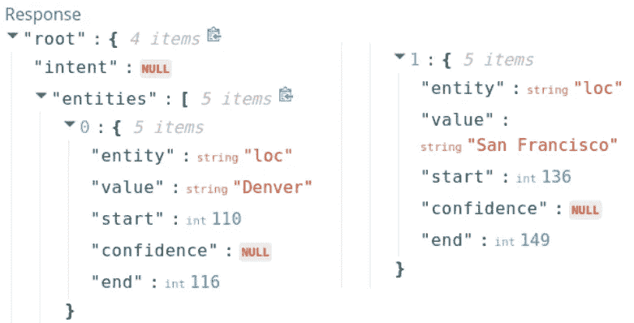
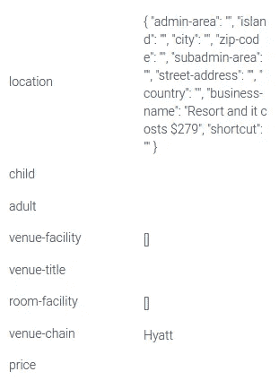
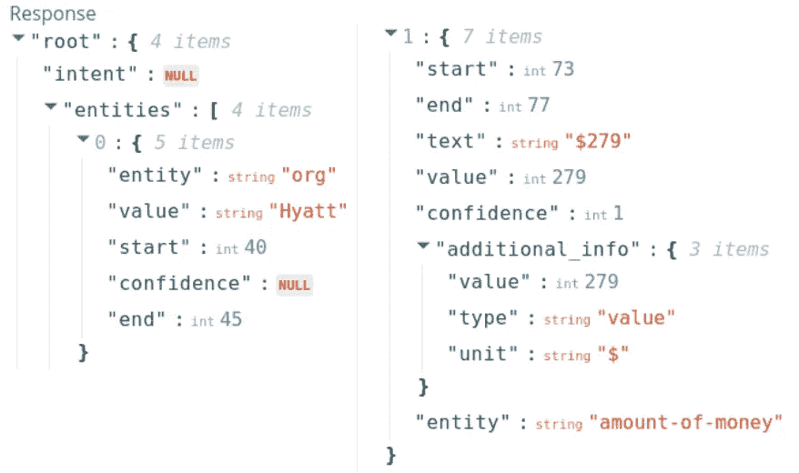
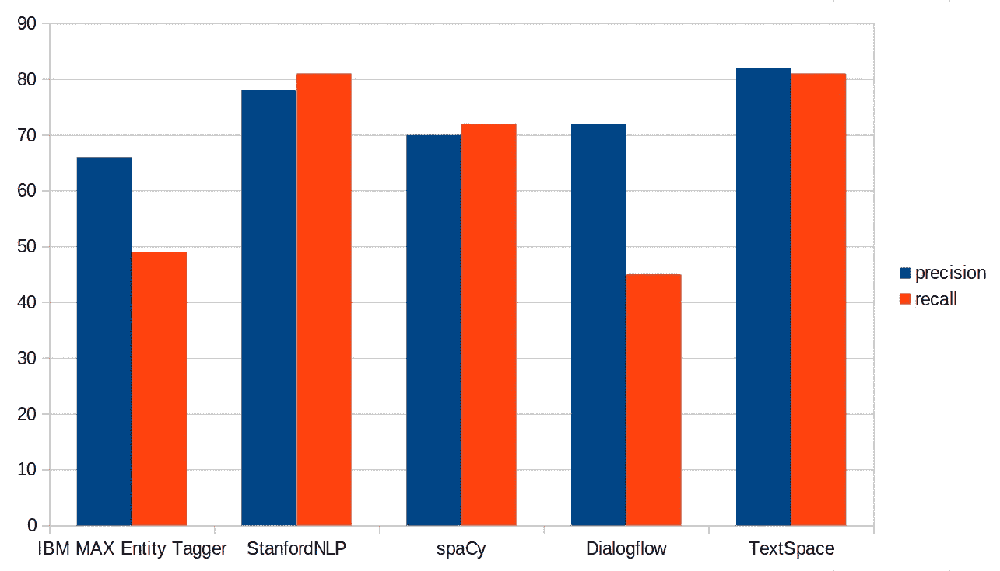

# 命名实体识别基准:StanfordNLP、IBM、spaCy、Dialogflow 和 TextSpace

> 原文：<https://towardsdatascience.com/benchmarking-named-entity-recognition-stanfordnlp-ibm-spacy-dialogflow-and-textspace-af6615eb7930?source=collection_archive---------39----------------------->

## 在这篇文章中，我们比较了 [TextSpace](https://neuralspace.ai/textspace.html) 的命名实体识别(NER)与 [StanfordNLP](https://nlp.stanford.edu/software/CRF-NER.html) 、 [IBM](https://developer.ibm.com/exchanges/models/all/max-named-entity-tagger/) 、 [spaCy](https://spacy.io/usage/linguistic-features#named-entities) 和谷歌 [Dialogflow](https://dialogflow.com/) 提供的最先进的解决方案的表现。

> NER 是信息提取的一个子任务，其寻求定位非结构化文本中的命名实体提及并将其分类为预定义的类别，例如**人名、组织、位置、医疗代码、时间表达式、数量、货币值、百分比**等。

NER 是[文本空间](https://neuralspace.ai/textspaceusecases.html)的特征之一。要了解它在特征意图分类中的比较，请阅读[这篇文章](https://chatbotslife.com/know-your-intent-sota-results-in-intent-classification-8e1ca47f364c)。

我们已经创建了自己的小型测试数据集，其中 11 个例子取自谷歌的[模仿大师 2](https://github.com/google-research-datasets/Taskmaster/tree/master/TM-2-2020) 数据集，该数据集刚刚于 2020 年 2 月发布。我们将该数据集视为 NER 解决方案未来研究和产品的基准数据集，因此我们非常兴奋地探索 TextSpace 与上述产品的对比情况。

这个数据集中的短语在长度和包含的信息方面可能有所不同，但我们选择了其中有很多实体的短语，因此我们可以从最先进的 NER 解决方案中分离出小麦和谷壳。我们测试集中的短语来自不同的领域，因为我们想看看我们在这篇文章中比较的解决方案有多灵活。注意，在这些例子中使用了 Dialogflow 的预定义代理，因此我们期望 Dialogflow 在这些例子中表现得近乎完美。

我们将首先详细讨论两个例子，但最后会有一个总结我们所有发现的表格。

# 机票预订

让我们从一个想要预订航班的用户的示例短语开始:

> “哦，我想今晚某个时候乘飞机出去，4 天后晚上飞回来。从，我想去丹佛。我要飞离旧金山。”

IBM 的 MAX 命名实体 Tagger 错误地将“I”分类为事件。

IBM 的 MAX 命名实体 Tagger 表现不佳，仅返回哪些单词属于时间和地点类别。不幸的是，它甚至将“我”这个词错误地归类为第二句开头的事件。

相比之下，**斯坦福大学** NER 模型表现更好。找到所有可能的实体，甚至返回正确的日期。然而，一个小小的错误发生了，那就是没有认识到“四天之夜”是属于彼此的。它把“晚上”归类为今天的晚上，而不是四天后的晚上。

**spaCy** NER 模型与 IBM 的表现相当，并且只返回属于时间、日期或地点类别的单词。它没有像 StanfordNLP 那样显示确切的日期。

我们的解决方案 **TextSpace** 在这个例子中表现很好，提取了所有可能的具有确切日期的实体，类似于 StanfordNLP。但是，TextSpace 也返回不太具体的时间段的间隔，例如“晚上”或“今晚”。首先是位置:

和时间:

不幸的是，TextSpace 也不承认“傍晚”和“4 天内”属于同一个词，它返回写作当天的傍晚，这与 StanfordNLP 完全一样。

使用 Dialogflow 预建的机票预订代理，我们得到以下平庸的结果。它能正确识别日期和时间、出发和到达城市，但完全漏掉了“4 天内”。令人失望的是，我们使用谷歌数据集和 Dialogflow 的特定领域代理来预订机票。

# 酒店预订

接下来，我们在下面的句子中比较这四种解决方案:

> “我想在柏悦 Aviara 度假村预订一个房间，每晚 279 美元。它被评为 4.8 星。它提供一个 18 洞高尔夫球场、一个室外游泳池和网球场，外加一个水疗中心和高级餐厅。”

IBM 的 MAX Entity Tagger 整体表现令人失望。

我们从 IBM 的 MAX Entity Tagger**开始。我们想要入住的酒店被识别为一个地点，而“&”被错误地识别为一个组织。例如，价格“279 美元”完全被忽略了。与我们之前的航班预订示例一样，性能相当差。**

**StanfordNLP** 做得更好，发现“$279”是钱，是停留的时间和星星的数量。不幸的是，我们的酒店也被归类为一个位置，而不是一个组织——这可能会在一些应用程序中发挥作用，但当用户希望自动转到酒店的网站时，这可能就行不通了。它也不承认$279 的价格属于“每晚”,它返回“晚上”作为日期。

我们使用 **Dialogflow** 的经过预先培训的酒店预订代理，这让我们自然地期望它的结果应该至少与 StanfordNLP 的结果一样好。不幸的是，事实并非如此，甚至找不到“279 美元”的价格。它正确地将“凯悦”归类为场馆连锁，但错误地将其业务名称归类为“度假村，费用为 279 美元”。日期也完全漏掉了。

**spaCy** 做的和前面的例子一样差。我们的酒店“Park Hyatt Aviara Resort”被归类为设施( [FAC](https://spacy.io/api/annotation#named-entities) )，这不太正确，但“279”被正确归类为货币价值。不幸的是，“spa & fine”被错误地视为一个组织。

在所有五个解决方案中，TextSpace 做得最好。它发现“Hyatt”是一个组织，货币值为“$279”，跳过“night ”,因为它知道$279 是每晚的价格，并找到所有数字。

将“Hyatt”和“$279”分别正确分类为组织和金额。

两个号码都找到了。

# 总体结果

正如承诺的那样，我们现在比较所有这五个解决方案在我们的测试集中的所有 11 个示例中的表现。衡量这一点的方法很简单:我们知道解决方案预先训练了哪些类别，并衡量在示例短语中找到的所有可能类别的百分比。例如，在句子“所以，我想今晚某个时候飞出去，4 天后晚上飞回来。从，我想去丹佛。我要飞离旧金山。”如果一个解决方案将“今晚”和“4 天后的晚上”分类为带有时间范围的正确日期，将“丹佛”和“旧金山”分类为地点或城市，则该解决方案将实现 100% *的精确度和召回率*。换句话说，所有潜在的实体都被找到，并且都被正确分类。只要漏掉其中一个，比如说“4 天内的晚上”，四个中只有三个是正确的，这样给出的召回率是 75%。如果另外一个词被错误分类，比如说“我”是一个组织，准确率会下降到 4/5，或者 80%。如果找到了日期，但只返回“时间”或“日期”而没有精确的日期或时间，我们将减去 0.5。

与其他四个解决方案相比，TextSpace 的 NER 表现最佳，紧随其后的是 StanfordNLP。IBM 的 MAX Entity Tagger 整体令人失望。

这是这些条形图的数字:

## 重现我们的结果

如果你想重现这些结果，下面是我们使用的 11 个短语:
-航班预订 1:“所以，我想今晚某个时候飞出去，4 天后晚上飞回来。从，我想去丹佛。我要飞离旧金山。”
-机票预订 2:“好的，你得到了，所以看起来联合航空公司在晚上 9 点 20 分离开。这是直达航班，飞行时间为 2 小时 28 分钟，价格为 337 美元。”
-航班预订 3:“我找到了一个航班，周一早上 7:35 离开西雅图，下午 4:10 到达坦帕。”
-酒店预订 1:“柏悦阿维亚拉度假村高尔夫俱乐部和水疗中心，每晚 279 美元。它被评为 4.8 星。度假村提供 18 洞高尔夫球场、室外游泳池&网球场和水疗中心&高级餐厅。
-酒店预订 2:“stay bridge Suites Carlsbad，每晚 145 美元。它被评为 4.5 星。舒适的酒店内设有厨房的温馨套房，配有室外游泳池、健身房&和烧烤区。
-电影院 1:“木乃伊今天下午 4:30 在富豪戴维斯 5 号体育场上映。”
-电影院 2:“晚上 9:50 我有筹码在玩。晚上 10:15 我出去玩了。并在晚上 10:25 开始播放音乐 1:“这是一首由蕾哈娜原创，由一个声音儿童合唱团翻唱的歌曲《钻石》。”
-餐厅 1:“嗨，我现在在加州宜家。我在找餐馆吃晚饭。”
-餐厅 2:“我在厨房里发现了一家评级很高的餐厅，名为二楼，它是 4.3 星(满分 5 分)，它被描述为精致环境中的新美国品尝菜单。听起来如何？”
-体育 1:“上周六，9 月 9 日，洛杉矶道奇队对阵纽约红牛队，比分是 1 比 1。”

查看我们的 [GitHub 库](https://github.com/kumar-shridhar/NER-Benchmarks)了解更多关于实现的细节。