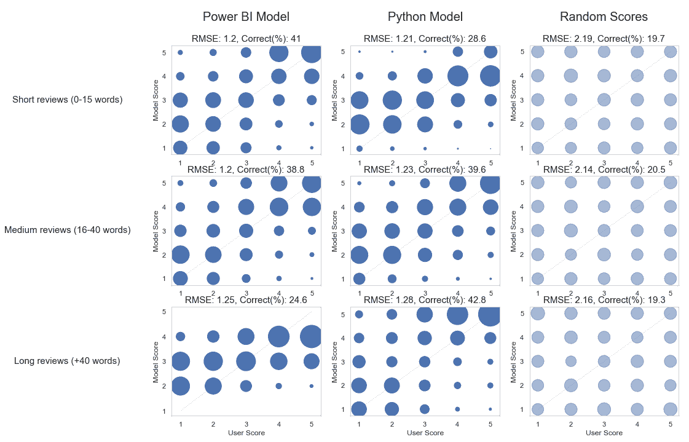
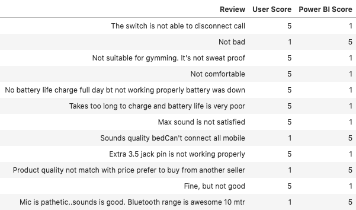

# 基准现成的情绪分析

> 原文：<https://towardsdatascience.com/benchmarking-off-the-shelf-sentiment-analysis-c797c732836c?source=collection_archive---------30----------------------->


来源:https://pixabay.com/

# 介绍

Power BI 正在越来越多地增加和促进人工智能能力；文本分析领域的功能之一是情感评分。对于不熟悉的人来说，这个想法很简单。你给预训练的模型输入一些文本，它会给出一个从 0 到 1 的分数，0 表示高度负面，1 表示正面。换句话说，像“多么了不起的产品”这样的文本应该返回一个高值(接近 1)，而像“糟糕的体验”这样的文本应该返回一个接近 0 的值。

以前，除了熟悉 NLP 的基础知识之外，您还必须具备一些编码技能，而今天，更多的平台正在提供“现成的”解决方案，您所要做的就是点击几个按钮。

Power BI 就是这些解决方案之一。使用本教程，在有 Power BI Premium 容量的情况下，可以自己尝试一下。


来源:[https://docs . Microsoft . com/en-us/power-bi/desktop-ai-insights](https://docs.microsoft.com/en-us/power-bi/desktop-ai-insights)

# 实验

## 设置

由于我对 Power BI 的情感分析的性能很好奇，所以我想出了一个非常基本的实验来测试它，就是将来自评论的情感分析与作者给出的实际评级进行比较。我去寻找一个产品评论的数据集，其中既有字符串形式的评论，也有数字形式的评分。

这个想法是让 Power BI 对作者写的评论进行评分，并与用户给出的实际分数进行比较。我的假设是，用户的分数反映了他或她所写评论的真实情绪。

## 方法学

有很多方法可以评估 AI 模型的性能。这些方法在你想要获得的数据和解释的类型上有很大的不同。对于这个测试，我选择了均方根误差或简单的 RMSE。


RMSE 通常用于测试定量预测的性能。它基本上归结为一个模型，分析每个观察的误差。通过求差值的平方，较大的误差将受到较大的惩罚。就解释而言，较低的 RMSE 表明模型的性能较好。

## 额外角度

为了获得更完整的图片，我决定使用 Python 添加另一个基准。Python VADER 库就像 Power BI 特性一样，是一个现成的情感分析。所谓现成的，我的意思是它不需要任何配置和培训。VADER 库非常简单，只需要几行代码:

```
from vaderSentiment.vaderSentiment import SentimentIntensityAnalyzeranalyser = SentimentIntensityAnalyzer()def print_sentiment_scores(sentence):
    snt = analyser.polarity_scores(sentence)
    return (snt[‘compound’])
```

该库接受一个字符串作为输入，并返回 4 个数值；

*   负分
*   中性分数
*   正面得分
*   复合分数

对于这个测试，我只使用了复合分数，因为它最接近于 Power BI 分数。

除了 Python 模型之外，我还向数据中添加了一个额外的列来生成随机分数。它只是一个随机数生成器，将随机选取 0 到 5 之间的一个值。添加随机数可以简化对 RMSE 等指标的解释。

# 数据

尽管有很棒的搜索引擎，如[谷歌数据集搜索](https://datasetsearch.research.google.com)，我仍然主要使用 [Kaggle](https://www.kaggle.com) 来寻找符合我项目需求的数据集。对于这个项目，我需要一个数据集，既包含书面评论(英文)以及数字分数。简单搜索关键词“产品评论”，我得到了一个[数据集](https://www.kaggle.com/shitalkat/amazonearphonesreviews)，上面有亚马逊对耳机的评论。

数据看起来像这样:


形状:(14337，4)

我将文件导入 Power BI 并运行情感分析。如果你想自己运行情绪分析，你可以在这里找到指南。在让 Power BI 添加了情绪得分栏之后，我运行了一个 Jupyter 笔记本来做性能测试。

然而，在执行测试之前，我运行了以下步骤来清理/准备数据:

*   移除不需要的列
*   重命名的列
*   移除没有审核分数的行
*   删除了没有审阅文本的行
*   将所有分数标准化为 1-5 分
*   添加了包含评论长度的列
*   增加了一列随机分数(随机数生成器)
*   为每个源添加了一个“正确”列，如果预测分数与实际分数匹配，则返回 True。

在应用 Power BI 情感分析和 Python 脚本后，数据现在看起来像这样:


形状:(13394，10)

# 结果呢

现在我们有了清晰格式的数据和来自三个不同来源的情感分数:

*   实际用户分数
*   功率 BI 生成的分数
*   Python (VADER)评分

是时候评价他们的表现了。正如方法论中所解释的，我将使用 RMSE 或均方根误差。

## 模型性能

在我们查看结果的准确性之前，让我们先来比较不同来源的评分分布。使用内核密度图，我们可以得到所有三个来源的概述。


如果我们要处理完美的模型，所有的线都会重叠。正如你所看到的，在现实中，实际的用户分数和模型之间有相当大的差异。作为参考，您可以看到由随机分数组成的绿色虚线。从第一次探索来看，似乎模型在极端得分和中间挣扎时表现更好。

让我们再深入一点，看看下面的值:

*   均方根误差
*   正确得分的百分比
*   每个实际用户得分的模型得分分布


每个图表代表一个模型。在 x 轴上，您可以看到实际的用户分数，而 y 轴代表模型分数。每条竖线的点代表相应用户得分的模型得分分布。在理想情况下，红色指导线上应该只有点，这意味着模型只有与用户分数匹配的值。在一个好的模型中，最大的点(预测的较大部分)应该尽可能靠近红线。

RMSE 和正确得分百分比都表明 Power BI 模型是最好的。尽管该模型似乎不是一个完美的预测器，但我们可以肯定地说，它可以作为评论情绪的指标。对比随机打分，我们可以清楚地看到一个规律。此外，就像在内核密度图中一样，很明显，两个模型在极端得分下表现更好。

## 长度作为一个因素

尽管 NLP 在过去的几年里取得了巨大的进步，但仍然有很长的路要走。我们的机器人朋友仍然在与我们人类产生的所有非结构化语言作斗争。我们经常看到，情感分析更容易对较短的字符串进行评级，而不是对可能包含冲突信息的较长字符串进行评级。在某种意义上，这也适用于我们人类的理解。从评论*“伟大的产品”*中把握正面情绪是非常直接的，而像*这样较长的评论“我喜欢该产品，但电池不好，不如声音更好的竞争对手”*则需要更深入的分析。

根据这一理论，比较不同评论长度的模型表现似乎是明智的。在我开始将数据划分为评论长度之前，让我们用一个简单的箱线图来看看分布长度。


由于数据包含大量异常值，我将 x 轴从 0 重新调整到 100 个单词:


由于大多数评论都在 10 到 30 个单词左右，我将使用以下临界值来划分数据:

*   简短评论:0 到 15 个单词(n=6226)
*   中等评论:16 到 40 个单词(n=5021)
*   长评论:+40 字(n=2147)

现在让我们来看看新的结果:



结果非常有趣，很明显，当美联储的简短评论(RMSE 1，2)时，Power BI 模型表现明显更好，Python 模型似乎相反。然而，重要的是要补充的是，长评论的数据部分比短评论的数据部分要小得多。对于这两个模型，中等长度的评论似乎仍然优于使用完整数据集的模型。

## 极端值

最后，作为一名负责任的数据专家，我们应该始终从查看和理解数据开始和结束。下面你可以找到一些完全错误的评论。换句话说，它们是用户分数为 1 而模型分数为 5 的评论或者是*反之亦然*。让我们检查一下可能出了什么问题。



模型分数差的评论样本。

从这个随机样本可以看出，很容易理解为什么模型给出了错误的分数。审查包含以下内容:

*   错别字:"*音质 bed 无法连接所有手机"*
*   矛盾信息:*“好，但不好”*
*   评分不一致:*“还不错”*(用户评分:1)

# 结论

## 现成的模型性能

RMSE 为 1.2，我们可以说现成的模型当然可以作为情绪的指标。随着进一步的清理和 NLP 建模，分数可能会进一步提高，因为许多糟糕的分数是由打字错误和不一致的用户评级造成的。

尽管自我训练的模型最有可能胜过这些现成的解决方案，但理解简单性/性能之间的权衡还是很重要的。Power BI 情绪分析非常容易应用，只需几次点击，您就可以在几秒钟内获得数千条评论的评级。

其次，我们目前仍处于开箱即用人工智能的非常早期的阶段，尽管我个人更喜欢亲自动手编写代码，但我必须承认这些解决方案的未来似乎很有希望。

最后，重要的是要明白这只是一个个人实验，而不是一篇同行评议的论文。与任何研究项目一样，有一些考虑因素，如了解我如何标准化和四舍五入分数，这可能会有影响。

## 进一步研究

现在我们已经得出了一些结论，我们可以进行进一步的实验了。我认为以下方法可能会很有趣:

*   用更多不同的数据集重新进行实验
*   使用更多指标进行评估
*   使用不同于用户评分的另一个基准(通常是有偏差的)
*   比较比 Power BI 和 Python 库更多的工具
*   随着时间的推移，重新运行实验，因为预先训练的模型可能会改善

如果你要在上面提到的步骤中做一些研究，我会非常有兴趣阅读它，所以请标记/发送给我。

*关于我:我叫 Bruno，是一名数据科学家，目前专攻 Power BI。可以通过我的网站与我联系:*[https://www . zhongtron . me](https://www.zhongtron.me)