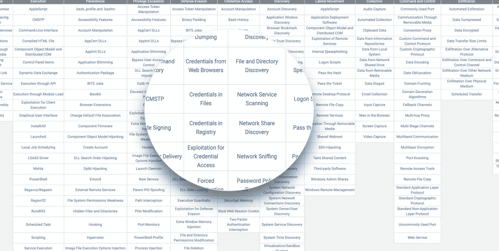
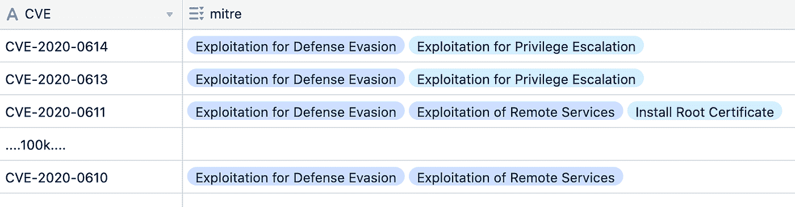
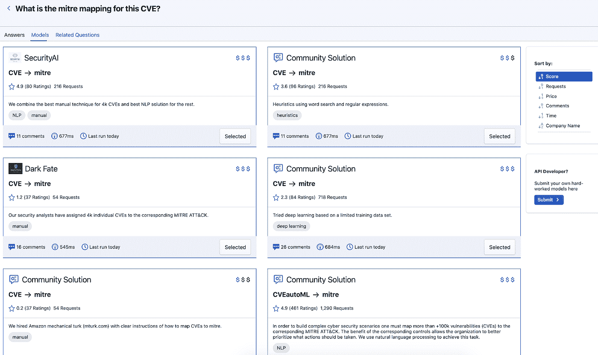

# 有一个明显的赢家？

> 原文：<https://towardsdatascience.com/benchmarking-with-one-clear-winner-279691cbd11d?source=collection_archive---------44----------------------->

## 网络安全机器学习:CVE/米特 ATT 和 CK 制图

像 [Kaggle](https://www.kaggle.com/) 这样的机器学习竞赛通常只有一个明确的赢家。然而，当涉及到生产部署时，许多因素起作用:成本、性能、可解释性、偏差、速度。在这里，我们研究了应用于网络安全的机器学习部署中的实际权衡。

# 介绍

目前网络安全领域最大的机遇之一是将脆弱性(CVEs)全面映射到米特 ATT&CK 框架中。下面，我们解释什么是米特 ATT 和 CK/CVE，商业机会的大小，并对当前竞争对手的简历与米特 ATT 和 CK 进行比较。我们将使用一个简单的入室抢劫的类比来使文章更容易理解。

**类比**:举个例子，大多数入室抢劫都是从侧窗进入，而不是从房门进入。有了这些信息，并意识到我在家里留了 3 扇开着的窗户，这有助于我优先考虑我的防御策略。首先，我应该关上窗户。

*来源:Mitre，via*[*attack . Mitre*](https://attack.mitre.org/)*(CC0)*

# 什么是米特 ATT 和 CK？

> "[米特 ATT & CK](https://attack.mitre.org/) 是一个基于真实世界观察的全球可访问的对手战术和技术知识库。ATT & CK 知识库被用作私营部门、政府以及网络安全产品和服务社区开发特定威胁模型和方法的基础。”—[attack.mitre.org](https://attack.mitre.org/)

**类比**:换句话说，米特里·ATT&CK 将会是强盗抢劫一所房子的剧本。(识别无人居住的房屋。确定窗口的访问路径。找到贵重物品等。)

# 什么是 CVEs(网络安全漏洞和暴露)？

> “CVE 是一本字典，为公开披露的网络安全漏洞和暴露提供定义。CVE 的目标是通过这些定义使跨独立漏洞功能(工具、数据库和服务)共享数据变得更加容易。CVE 条目由识别号、描述和至少一个公共参考组成—[cve.mitre.org](https://cve.mitre.org/about/faqs.html#what_is_cve)

**类比**:在我们的入室抢劫类比中，漏洞是你房子安全中的弱点:没锁的门，坏了的摄像头，你的生日作为安全密码

**为什么会将** [**CVEs 映射到 MITRE ATT & CK**](https://kindlyanswer.me/results/what-is-the-mitre-mapping-for-this-cve?q=CVE-2020-0609) **？**

当你有多个漏洞时，你应该如何分配你的时间和资源？通过结合对您的情况的了解(CVE)和对最常见的犯罪行为的理解(MITRE)，您可以分配一个风险因素并采取相应的行动。然而，目前只有 4%的 CVE 被手动映射到米特 ATT 和 CKs，因此安全专业人员无法根据他们在攻击链中的角色来确定 CVE 的优先级。由于各种 APT(黑客)在 ATT&CK 框架中使用不同的途径，一些控制措施可能会产生不相称的影响，给定当前系统中的漏洞(CVE)。

**类比**:知道你的房子有一个坏掉的摄像头和开着的窗户，允许你优先关闭窗户，因为大多数攻击者会利用它们破门而入。然而，如果您的情况(CVE)和攻击者协议(MITRE)之间的关系偏离了 5%，您可能会优先考虑不太可能阻止抢劫的安全措施。

*来源:好心，via*[*kindlyanswer . me*](http://kindlyanswer.me/)*(CC0)*

# 如何实现这种映射？

以下是基于价格、速度和质量的 6 种有竞争力的方法。

*   大多数供应商已经开始考虑这一点，并手动将最常见的简历映射到相应的米特 ATT 和 CK。
*   一些供应商已经构建了复杂的试探法来映射所有当前存在的 CVE。
*   一些供应商开始使用复杂的机器学习技术，包括深度学习和 NLP。

*来源:好心，via*[*kindlyanswer . me*](http://kindlyanswer.me/)*(CC0)*

# 哪个最好？

**总结**:没有一个好的厂商。手动绘制在野外看到的攻击给出了一个大约 4000 个 CVE 的小列表，具有很高的准确性。启发式算法可扩展到所有 10 万个 CVE，具有很强的模型可解释性。机器学习技术的一个优点是，它们对于新出现的、以前未被启发式算法发现的 CVE 表现良好。

**详情**:

*   最昂贵的解决方案并不总是最好的。其中一个手动映射对完整服务收取$$$的费用，尽管它只适用于 4k CVEs。最好的机器学习解决方案用同样的钱映射+100k CVEs $ $。
*   **供应商之间的差异非常大**。这两种手动映射的质量差别很大，这取决于是合格的安全分析师还是 Amazon Turk 执行这项工作。由于有限的数据集大小，自然语言处理的准确性几乎是深度学习技术的两倍。
*   **对于某些解决方案，效果会随着时间而改善。**虽然试探法在现有的 CVE 上表现良好，但是新出现的 CVE 可以通过自然语言技术更好地映射，这可以指示试探法的过度拟合。

结论:选择最好的取决于 1)你的具体情况，以及 2)随着新 CVE 的发布而变化。我们的元 API 满足了这两种需求。我们会在第一时间找到你最适合的，并随着新 API 的发布继续重新评估(所有这些都不需要你的共同努力)。

# 下一步？

如果您有自己的解决方案来绘制 CVE/米特 ATT 和 CK 的地图，请联系我们，以便加入持续基准测试，或者与 [hi@kindlyanswer.me](mailto:model@kindlyanswer.me) 分享您自己的模型 API。你将获得我们从中获得的收入的 90%,你保留你的知识产权，因为我们不需要代码提交。如果您是在其产品中显示 CVE 的供应商，请查看这些 API 以提高您的产品和映射准确性，并联系 [hi@kindlyanswer.me](mailto:sales@kindlyanswer.me) 以了解更多详细信息。(从其中一个供应商处购买模型代码，购买数据转储，接收您的 API 密钥或无限制请求的登录凭证)附录

# 开放源码

为了提高我们工作的透明度，我们在我们的 [GitHub](https://github.com/KindlyAnswerMe/validation-data) 中共享了我们验证数据的子集。您可以随时通过推送请求为其做出贡献。为了避免供应商的欺诈，我们使用精心策划的维持数据集进行实际的基准测试。