# 本福特定律——一个简单的解释

> 原文：<https://towardsdatascience.com/benfords-law-a-simple-explanation-341e17abbe75?source=collection_archive---------2----------------------->

## 拉蒂夫·纳塞尔在他的网飞节目中没有告诉我们的“第一位数法则”是什么，连线。


尼克·希利尔在 [Unsplash](https://unsplash.com?utm_source=medium&utm_medium=referral) 上的照片

如果你还没有看过，看看网飞系列，*连接。*很好看的节目。主持人拉蒂夫·纳赛尔讨论了流行科学中的各种主题。网飞将其吹捧为一个系列“调查我们与彼此、世界和宇宙之间令人惊讶和错综复杂的联系方式”[1]

在第四集的*数字*中，拉蒂夫探索了本福德定律(BL)，也称为第一位数定律。据观察，许多数据集，无论是人工的还是自然的，包含的以数字 1 开头的数字比其他任何数字都多，约占所有数字的 30%。并且随后的前导数字的频率下降，直到数字 9，其在数据集中仅约 5%的数字中作为第一个数字出现。这是令人惊讶的，因为你会期望数字的九个可能的前导数字平均分布在 11%左右。

该节目着眼于商业智能的历史，并显示出各种各样的数据集，如火山的大小，古典音乐中音符的组合长度，以及公司的财务报表似乎都遵循商业智能。

有一个问题被提出，但从未真正得到回答——为什么许多数据集遵循 BL？该节目暗示 BL 的存在揭示了宇宙的某种深层宇宙计划。

这里有一个简单的解释，纳赛尔和他采访的任何人都没有提到过:

> 由多个独立因素的乘积组成的数据集将遵循本福特定律。

这个解释已经为人所知一段时间了[2][3][4]，但并没有在节目中出现。本福德定律不是我们宇宙的神秘属性。这只是基本的数学。

# 概观

在本文中，我将简要介绍 BL 的背景，解释两个关键概念:正态分布和对数，展示掷骰子练习如何导致 BL，最后看看一些真实的数据集，看看这个解释是否成立。

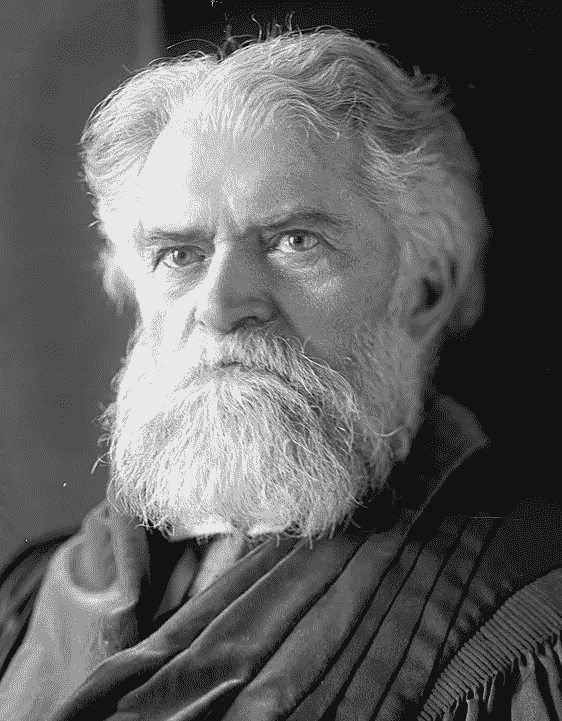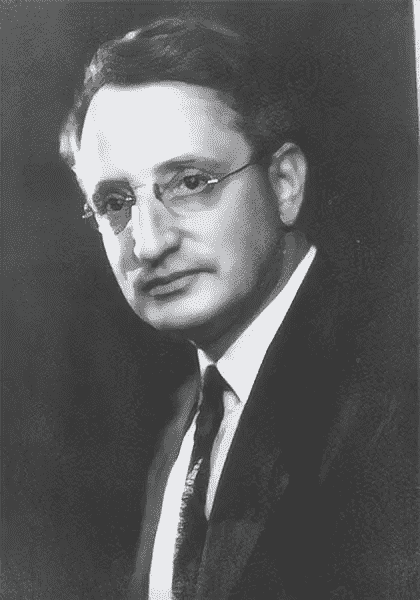

**西蒙·纽康**图片来自[维基媒体](https://commons.wikimedia.org/wiki/File:Simon_Newcomb_01.jpg)，公共领域**弗兰克·本福特**作者根据公共领域[Nigrini.com](http://www.nigrini.com/benfords-law/)的一张图片所作的图片说明

# 背景

本福德定律是以美国物理学家弗兰克·本福德的名字命名的，他在 1938 年发表了一篇名为“异常数字定律”的论文，描述了在数据集[5]中观察到的数字的第一个数字的频率。请注意，这种现象之前已经被加拿大天文学家西蒙·纽康在 1881 年观察到并发表过[6]。

(简短的旁注:事实上，事物经常以不是第一个发现它的人的名字命名是很常见的。事实上，对此有一个名称，斯蒂格勒的借代法则。它是由美国统计学教授斯蒂芬·斯蒂格勒在 1980 年提出的，当时他写道，没有一项科学发现是以其最初发现者的名字命名的。具有讽刺意味的是，斯蒂格勒承认，美国社会学家罗伯特·默顿之前已经发现了“斯蒂格勒定律”。)

回到本福特。他在论文中观察到，许多不同的数据集都紧密遵循以下第一位数字的分布，在下图中显示为百分比。

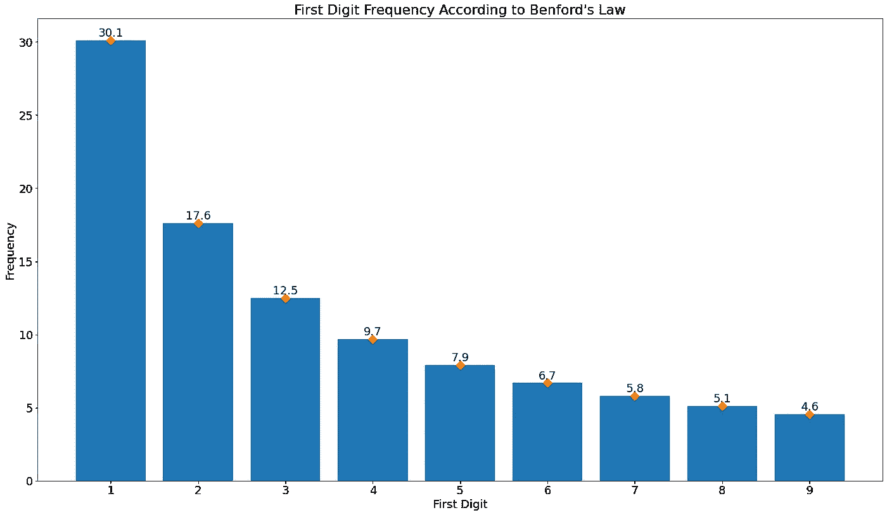

作者图片

本福德查看的数据集包括各种各样的东西，如城市人口、化合物的原子量、财务支出，甚至是他在某份报纸上能找到的所有数字。这是他论文的摘录。

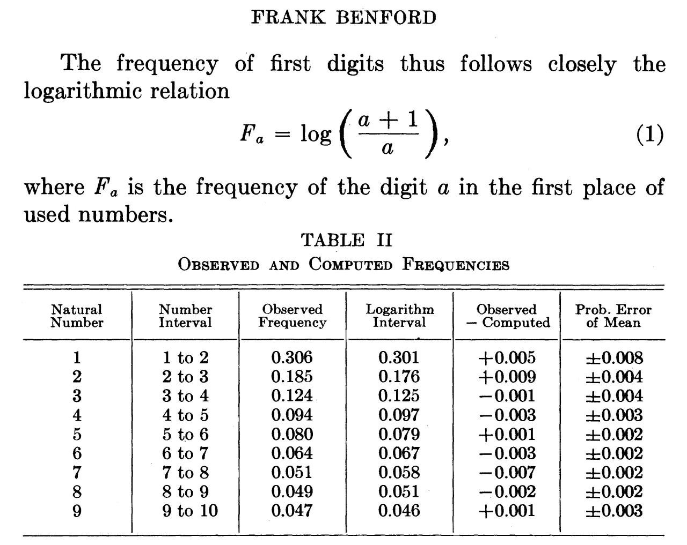

**摘自弗兰克·本福特的论文《反常数定律》，1938 年**，公共领域

他继续用数学术语解释他观察到的第一个数字频率的定律，但他并没有真正提出原因。他写道，该定律“显然比我们的数字系统能够独立解释的更深入原始原因的根源。”[5]

接下来，我们将通过观察公路交通速度来了解正态分布。


来自 [Pixabay](https://pixabay.com/?utm_source=link-attribution&utm_medium=referral&utm_campaign=image&utm_content=3396909) 的[克里斯汀·斯蓬基亚](https://pixabay.com/users/Sponchia-443272/?utm_source=link-attribution&utm_medium=referral&utm_campaign=image&utm_content=3396909)的图片

## 正态分布

你可能已经看到了正态分布的样子。这是概率论中著名的“钟形曲线”。正态分布，也称为高斯分布，是一种变量的连续概率分布。

例如，假设一个城市的规划者想要检查高速公路上特定地点的平均速度。他们在路上放下一对传感器条，开始记录过往车辆的速度。看看下面直方图中的样本数据。

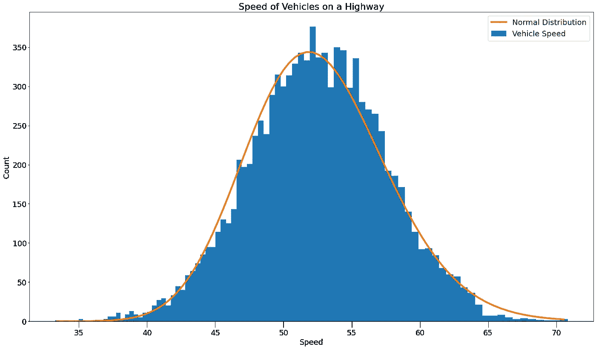

*作者图片*

车辆的平均速度大约是每小时 52 英里，大多数旅行者的速度在每小时 45 到 60 英里之间。有几个例外。至少有一辆车以每小时 35 英里的速度行驶，另一辆车以每小时 70 多英里的速度超速行驶。

## 对数

第二个关键概念是理解对数是如何工作的。对数是指数运算的反函数。对于这次讨论，我们将坚持以 10 为基数的对数，尽管也存在其他对数。例如，如果我们取 10 的 5 次方，我们得到 100，000(一个有五个零的前导 1)。所以 100，000 的对数等于 5。10，000 的对数是 4。你明白了。

对数在查看接近零的值聚集在一起的数据时非常有用，但是较高的值更分散。考虑下面的两个图表。

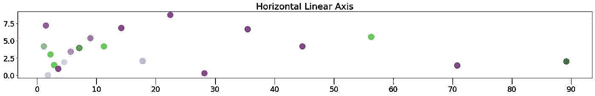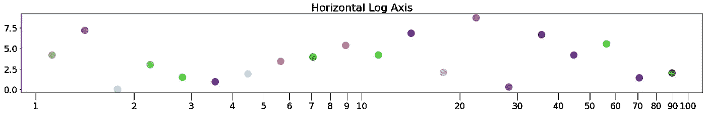

*作者提供的图片*

这两个图表在不同的水平刻度上显示相同的数据。上图显示了线性轴上的数据点，下图显示了对数轴上的数据点。请注意对数刻度上的数据点是如何更加均匀地分布的。同样在底部的图中，请注意前导数字为 1 的数字之间的间隔比其他数字之间的间隔大得多。在下一节中，我将告诉您更多关于这些间隔的信息。

在下一部分，我们将进行三次掷骰子的模拟。


照片由 [Riho Kroll](https://unsplash.com/@rihok?utm_source=medium&utm_medium=referral) 在 [Unsplash](https://unsplash.com?utm_source=medium&utm_medium=referral) 上拍摄

# 掷骰子

为了更好地理解分布如何遵循 BL，我们来看三个使用掷骰子的模拟。

想象一下，你正在上一堂网上统计课。这是一个大班级。有一万名学生。老师要求每个学生掷出一个六面骰子，并将结果输入到电子表格中。这是结果的直方图。

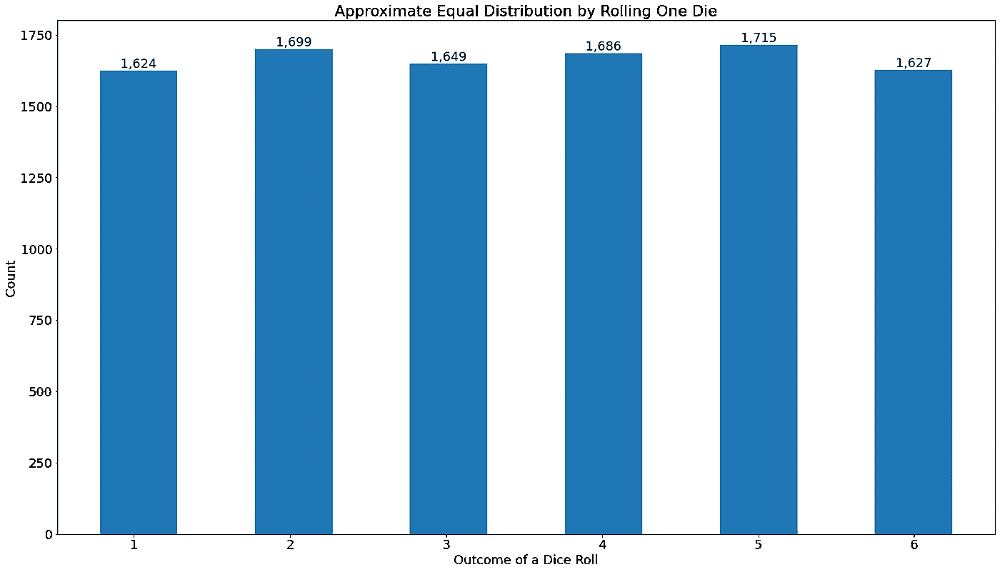

*作者图片*

有 10，000 卷，每卷有六种可能的结果，预期结果是每种结果大约 1，666 卷。上面的结果与此接近，从数字 1 的 1，624 到数字 5 的 1，714。这是一个均匀分布的近似值。

## 总结掷骰子

在下一个练习中，老师要求每个学生掷骰子 100 次，然后将它们相加。每个学生的总数大约是 350 英镑。这是因为 3.5 是 1 和 6 的中间值，他们各表演了 100 个翻滚。你可以在下面的柱状图中看到结果。

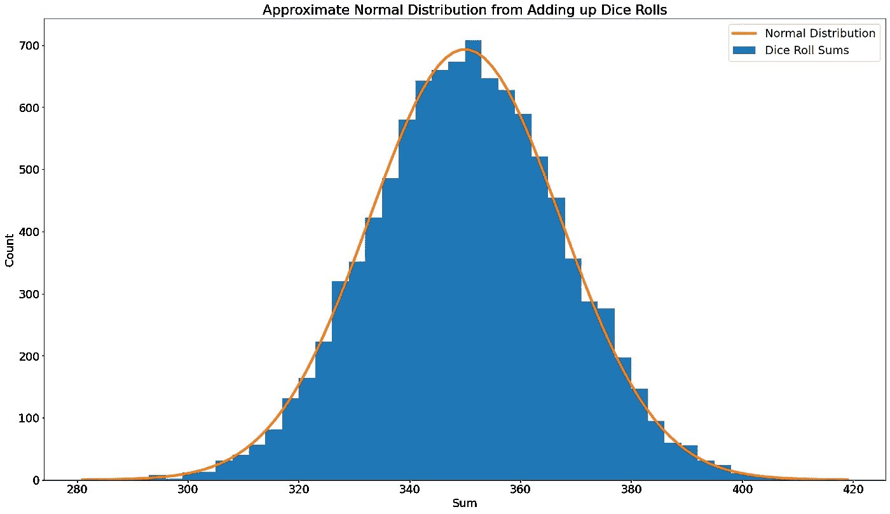

*作者图片*

这又是我们的正态分布。有的同学考了 300 以下的低分，有的考了 400 以上的高分，但大部分都在 330 到 370 的范围内。

为什么我们会得到一个钟形曲线呢？概率论中的中心极限定理(CLT)指出，独立随机变量相加将趋于正态分布[4]。

## 乘法骰子滚动

在第三个也是最后一个练习中，老师要求每个学生再掷一次骰子，但只能掷 15 次，然后将每个数字相乘。产品变得相当大。平均约为 760 亿。直方图显示了下面的结果，但这次水平轴使用的是对数刻度。

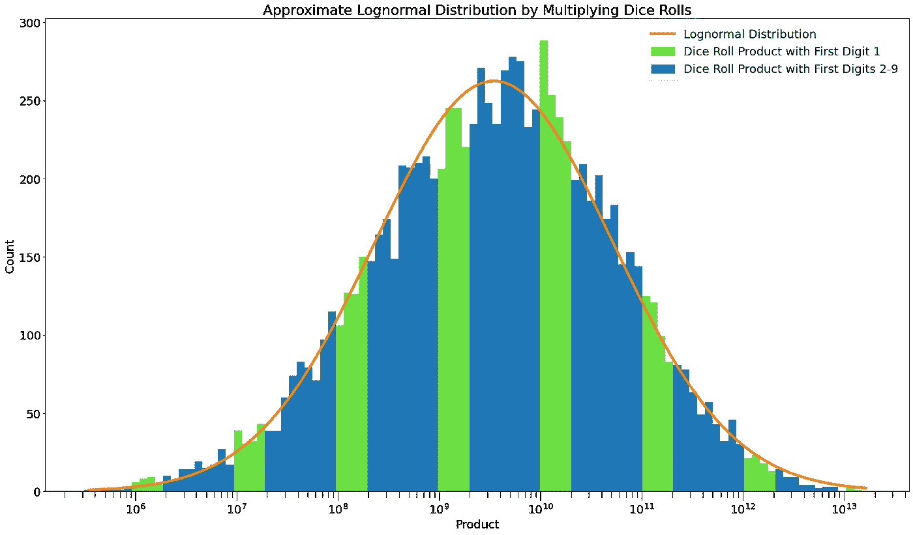

*作者图片*

我们再一次看到我们的正态分布。但是因为 x 轴是对数标度，所以该分布称为对数正态分布。为什么我们会得到这样的分布？乘法中心极限定理(MCLT)指出，相乘的独立随机变量将趋于对数正态分布[4]。

请注意，上面直方图的 x 轴使用 10 的幂作为刻度线。结果从一百万(10⁶)到十万亿(10)不等。让我们仔细看看 x 轴上 10⁹和 10 ⁰.之间的间隔

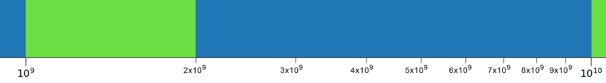

*作者图片*

您可以看到大的绿色条纹跨越了大约 30%的数据段，刻度线之间的 8 个间隔从左到右逐渐变小，直到下一个绿色条纹开始。事实上，跨度正好是 BL 定义的区间的大小。

```
Number Interval 1-2  2-3  3-4  4-5  5-6  6-7  7-8  8-9  9-10
Log Interval   .301 .176 .125 .097 .079 .067 .058 .051 .046
```

因为直方图中的分布有些连续(大致沿着一条平滑的线)，并且它跨越许多数量级(具有七个条纹)，所以可以得出这个例子中的数字将符合 B1。这些数字落入本福特大小的桶中。

这一观察在 R. M. Fewster 的论文《本福特定律的简单解释》中有所涉及。他把它和一顶有条纹的帽子联系起来。在他的类比中，帽子代表数字的对数正态分布，边缘代表 x 轴，条纹代表 30.1%的数字以 1 开头的区域。如果条纹覆盖了帽沿的一部分，那么如果条纹足够多的话，它们将覆盖整个帽子的大致相同的部分。

让我们来看看第三次掷骰子练习中前导数字的频率。

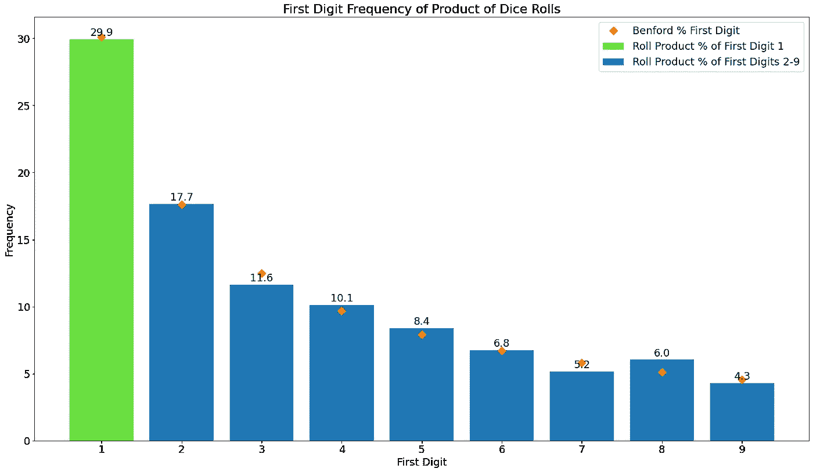

*作者图片*

果不其然，前导数字的频率与本福特的预测(橙色菱形)相当吻合。如果我们用更多的产品和/或更多的学生进行模拟，结果会更接近。

注意，并非所有对数正态分布的数据集都符合 BL。埃塞克斯大学的 Paul D. Scott 和 Maria Fasli 在论文“本福德定律:一个实证调查和一个新颖的解释”中阐述了这些警告。

> “其分布符合对数正态分布且[标准偏差]超过 1.2 的数据应产生满足[本福特]定律的前导数字分布。可能满足这个标准的数据将:(1)只有正值。(2)具有其模态值不为零的单峰分布。(3)具有正偏态分布，其中中位数不超过平均数的一半。”保罗·斯科特和玛丽亚·法斯利

相反，并不是所有符合 BL 的数据集都具有对数正态分布。这个事实被 Anro Berger 和 Ted Hill 在他们的书“本福德定律的基本理论”[3]中涵盖。例如，他们提到组合独立的数据集将导致符合 BL。

接下来，我们将看看现实世界中的一些数据集。


本·欧布罗在 [Unsplash](https://unsplash.com?utm_source=medium&utm_medium=referral) 上的照片

# 城镇人口

紧随 BL 的“海报儿童”数据集之一是城镇人口。不管你看的是城市、县、州还是国家。只要你有跨越几个数量级的数百个数据点，这些数据似乎与 BL 很好地吻合。

下面是来自 2010 年美国人口普查的美国城镇数据集[9]。从只有一个人的城镇，如印第安纳州的切斯特菲尔德，到拥有 370 万人口的大城市，如洛杉矶。

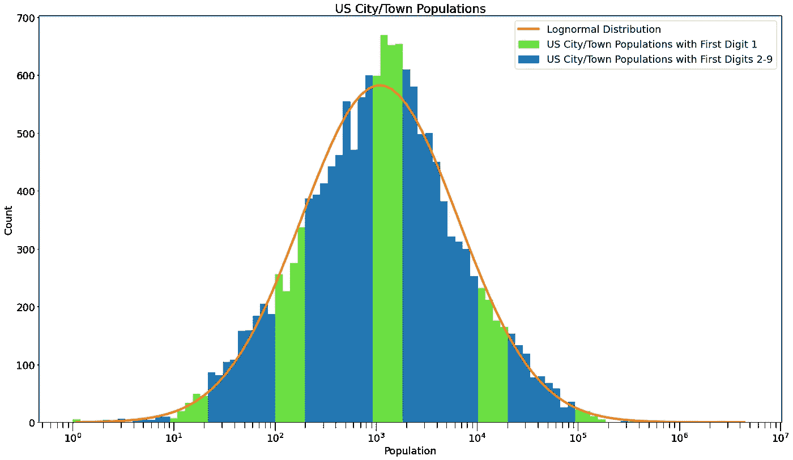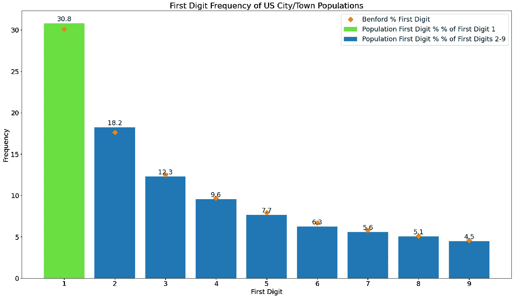

*作者图片*

该分布显然是对数正态的，并且第一个数字紧跟 BL。

为什么城市/城镇人口具有对数正态分布？我的第一个想法是，这里可能有多个独立的因素在起作用。例如，城市有不同的面积、住房单元密度和每个住房单元的居民人数。将这些因素以及其他因素相乘，可能会得出对数正态分布。

研究了城市人口的分布。例如，有一篇 Ethan Decker 等人的论文，题为“城市规模分布的全球模式及其基本驱动因素”[10]。

> “在这里，我们表明国家、地区和大陆城市的规模分布，无论是基于人口普查数据还是从遥感夜间灯光的聚集区推断，实际上都是对数正态分布通过大多数城市…为了探索生成过程，我们使用了一个简单的模型，该模型仅包含**两个基本的人类动力学，即迁移和繁殖**…”Ethan Decker 等人。

好吧，好像是成长的事情。接下来，我们来看看财务。


照片由[钢网](https://unsplash.com/@stellrweb?utm_source=medium&utm_medium=referral)在 [Unsplash](https://unsplash.com?utm_source=medium&utm_medium=referral) 上拍摄

# 资产

金融界的许多数据集似乎都遵循 BL。会计师可以利用这一事实来帮助发现欺诈和其他违规行为。

> 人们发现恩福德定律适用于许多组财务数据，包括所得税或股票交易数据、公司支出和销售数据、人口统计数据和科学数据[11] —马克·尼格里尼

下图显示了俄克拉荷马州在 2019 年支付的所有费用[12]。

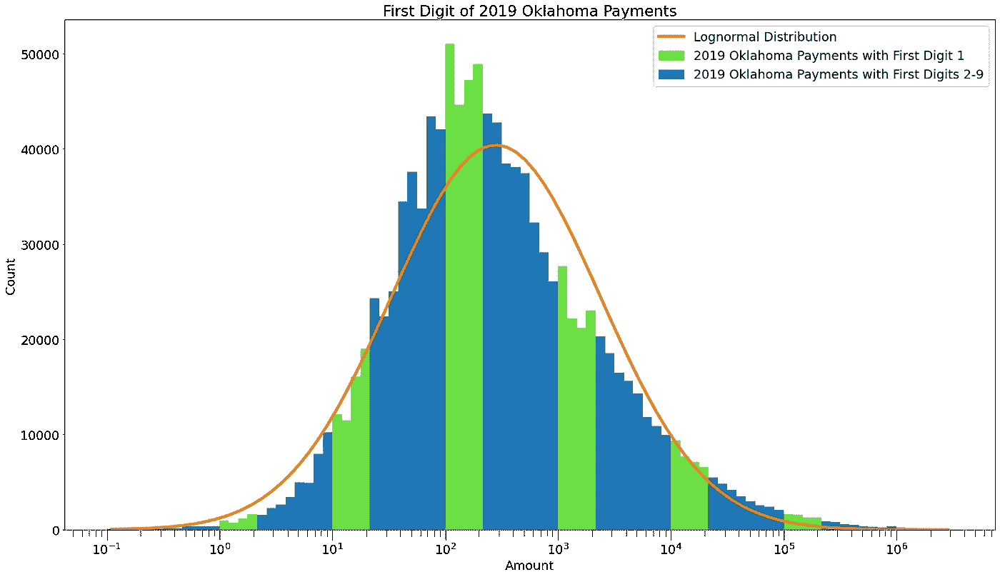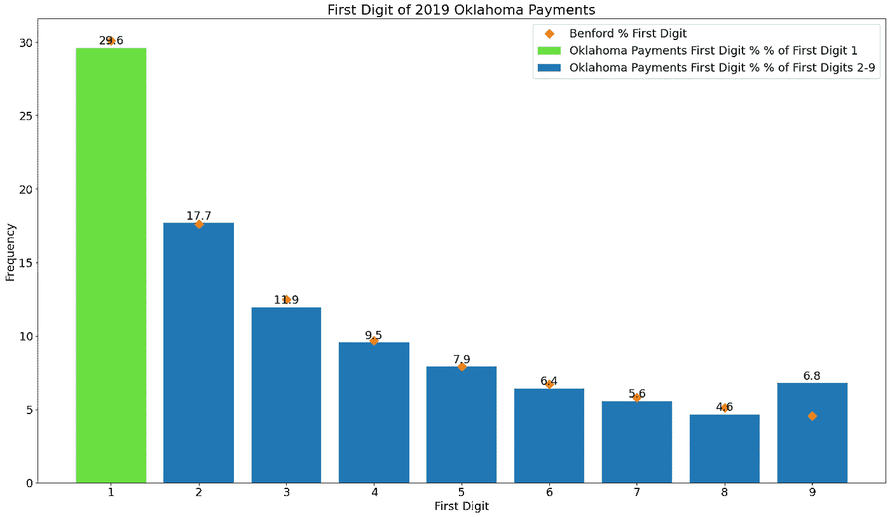

*作者图片*

您可以看到有一个对数正态分布，但它有点向左倾斜。此外，第一个数字与 BL 有一点偏差。例如，以数字 9 开头的数字似乎不合规。目前还不清楚这一分析是否表明账簿存在问题。我将把它留给审计人员来仔细检查。

辛迪·杜奇(Cindy Durtschi)等人有一篇关于这个主题的很好的论文，叫做“有效利用本福特定律来协助检测会计数据中的欺诈”[12]。该文件有一个表格，显示哪些类型的财务数据预计将遵循基本原则。

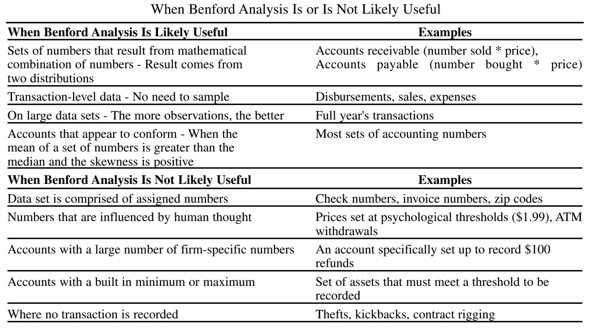

**C . Durtschi，W . hill ison，C . Pacini——法务会计杂志，2004 年**

注意，本福特分析可能有用的前两个例子是**卖出数量*价格**和**买入数量*价格。**这些值是独立因素的产物。这些类型的值的其他倍增因素可能包括税和百分比费用。如果值跨越几个数量级，这可能会使该帐户数据遵循对数正态分布。

接下来让我们来看看来自大自然的东西:河流的长度。


照片由[丹·罗泽尔](https://unsplash.com/@danny159?utm_source=medium&utm_medium=referral)在 [Unsplash](https://unsplash.com?utm_source=medium&utm_medium=referral) 上拍摄

在前面的例子中，我们看到了具有对数正态分布并遵循 BL 的数据集，这些数据集由人类确定的事物组成:城市/城镇人口和金融行项目。但这些类型的数据集也可以在自然界中找到，很少或没有人类的参与。例如，我们将根据 data.ny.gov 的数据来看看纽约州的河流长度。

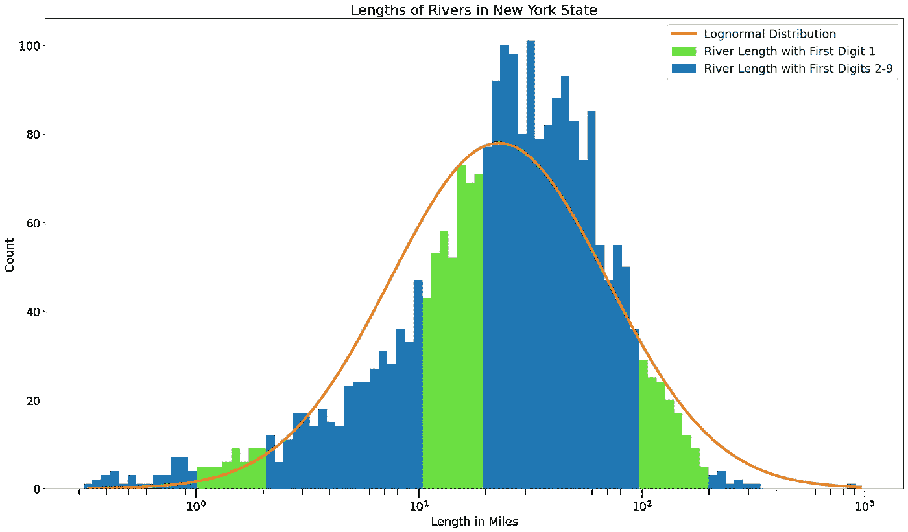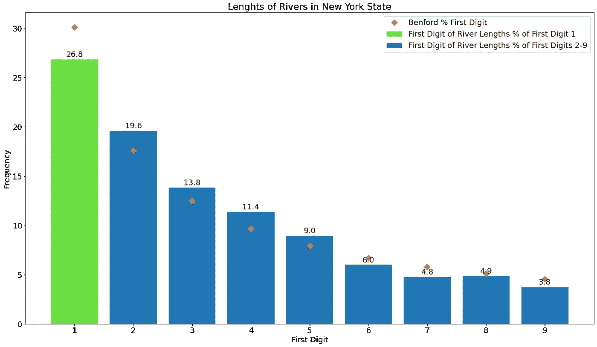

*作者提供的图片*

这一次，分布向右侧倾斜。我们还可以看到，前导数字为 1 的数字低于 BL 预测。后者可能是由于动态范围(最大值和最小值之间的比率)不是很大。分布直方图只有三条绿色条纹，没有一条抓住曲线的峰值。而在上面的人口和支付示例中，我们分别看到五条和六条绿色条纹。

为什么河流长度遵循对数正态分布？亚历克斯·科索夫斯基有一个合理的解释。他说…

> “……河流的长度和宽度取决于平均降雨量(作为参数)，而降雨量又取决于太阳黑子、盛行风和地理位置，所有这些都是降雨量的参数。”亚历克斯·科索夫斯基

等等，什么？太阳黑子影响降雨？根据美国国家航空航天局的说法，显然是这样的。所以看起来河流的长度是由多个独立的因素决定的。

自然界中还有其他地方可以找到对数正态分布的数据集。例如，Malcolm Sambridge 等人在他们的论文“自然科学中的本福德定律”[17]中探索了许多物理数据集。这是他们论文中的一个表格。

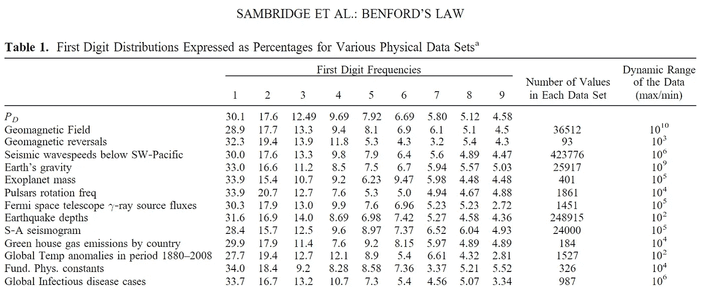

**摘自 Sambridge S .、Tkalč ić H 和 Jackson A .，“自然科学中的本福德定律”**

你可以看到这些数据集非常接近 BL。至于为什么会这样，Alex Kossovsky 总结得相当好[4]。

> “对于本福德定律在自然科学中的流行，一个看似合理的解释是，该定律的这种物理表现是通过少数或许多乘法随机因素的累积效应获得的，所有这些因素导致对数正态分布成为最终分布……”—亚历克斯·科索夫斯基

# 摘要

在这篇文章中，我给出了本福德定律的概述，包括一些背景和历史。为了理解对数正态分布，我解释了正态分布和对数。通过一些理论上的掷骰子练习，我展示了多个独立变量如何导致正态分布(加法)和对数正态分布(乘法)。然后我展示了一些对数正态分布的数据集是如何符合 BL 的。最后，我浏览了三个真实数据集的示例(城市/城镇人口、应付账款和河流长度),以展示具有对数正态分布的数据集将如何遵循 BL。

# 未来的工作

未来的工作可能包括探索两种类型的分析，即遵守对数正态分布和遵守本福特定律，在数据集与理想值不紧密匹配时可能如何相关。这些工具一起可以帮助确定数据中任何差异的潜在原因。

# 感谢

我要感谢詹尼弗·林和马修·康罗伊对这个项目的帮助和反馈。

# 源代码

创建本文图表的所有数据和源代码都可以在 [GitHub](https://github.com/robgon-art/benford) 上获得。这些源代码在 [CC BY-NC-SA 许可](https://creativecommons.org/licenses/by-nc-sa/4.0/)下发布。


**归属-分享相似**

# 参考

[1]https://www.netflix.com/title/81031737，连线，20200，[网飞](https://www.netflix.com/title/81031737)

[2] Scott，p .和 Fasli，m .，“CSM-349 —本福特定律:一个实证调查和一个新颖的解释”，2001 年，【http://repository.essex.ac.uk/8664/1/CSM-349.pdf】T2

[3] Berger，A .，Hill，T.P .，《本福德定律的一个基本理论》，*概率调查*，2011 年，[https://project Euclid . org/download/pdf view _ 1/Euclid . PS/1311860830](https://projecteuclid.org/download/pdfview_1/euclid.ps/1311860830)

[4]科索夫斯基(Kossovsky A. E .)，《战争的算术牵引与本福特定律》，2014 年，[https://arxiv.org/ftp/arxiv/papers/1410/1410.2174.pdf](https://arxiv.org/ftp/arxiv/papers/1410/1410.2174.pdf)

[5]本福特，f .【反常数定律】，*美国哲学会论文集*，78，551–572，1938，[https://MD porter . github . io/sys 6018/other/(本福特)反常 Numbers.pdf 定律](https://mdporter.github.io/SYS6018/other/(Benford)%20The%20Law%20of%20Anomalous%20Numbers.pdf)

[6] Newcomb，s .，“关于自然数中不同数字使用频率的注记”，《美国数学杂志》。4, 39–40, 1881

[7]施蒂格勒 s .，《施蒂格勒的借代法则》，1980 年，[https://archive . org/details/science social str 0039 unse/page/147/mode/2up](https://archive.org/details/sciencesocialstr0039unse/page/147/mode/2up)

[8] Fewster，R.M .，《本福特定律的简单解释》，*美国统计学家*，第 63 卷，2009 年第 1 期，[https://www . stat . Auckland . AC . NZ/~ few ster/rfe wster _ Ben Ford . pdf](https://www.stat.auckland.ac.nz/~fewster/RFewster_Benford.pdf)

[9]美国人口普查数据，2010 年，[https://www2.census.gov](https://www2.census.gov/)

[10]e . h .德克尔、A. J .克霍夫和 M. E .摩西(2007 年)。城市规模分布的全球模式及其基本驱动力。 *PloS 一*，*二* (9)，e934。[https://doi.org/10.1371/journal.pone.0000934](https://doi.org/10.1371/journal.pone.0000934)

[11]m . j .尼格里尼，“我有你的号码”，*会计杂志*，1999 年，[https://www . Journal of Accountancy . com/issues/1999/may/Nigrini . html](https://www.journalofaccountancy.com/issues/1999/may/nigrini.html)

[12]俄克拉荷马州，《俄克拉荷马州公开数据》，[https://data.ok.gov](https://data.ok.gov/dataset/ca132f48-b1fc-4eb4-ba7d-f6715a69c5fa/resource/d4cc70f7-3d2f-4bd3-9291-fa205cdbb75e/download/state-of-oklahoma-vendor-payments-fy2019-q4.csv)，2019

[13] Durtschi，c .，Hillison，W. Pacini C .，“有效利用本福特定律协助检测会计数据中的舞弊”，*法务会计杂志*，2004 年，[http://www . agacgfm . org/AGA/fraud toolkit/documents/benfordslaw . pdf](http://www.agacgfm.org/AGA/FraudToolkit/documents/BenfordsLaw.pdf)

[14]纽约州，水体分类，2019 年，[https://data . ny . gov/Energy-Environment/water body-Classifications/8xz 8-5u5u](https://data.ny.gov/Energy-Environment/Waterbody-Classifications/8xz8-5u5u)

[15] Kossovsky A. E .，“对前导数字现象的更好理解”，2006 年，[https://arxiv.org/ftp/math/papers/0612/0612627.pdf](https://arxiv.org/ftp/math/papers/0612/0612627.pdf)

[16]林德博士，“太阳周期的变化会影响我们的气候系统吗？”*科学简报*，美国国家航空航天局戈达德太空研究所，2009 年，[https://www.giss.nasa.gov/research/briefs/rind_03/](https://www.giss.nasa.gov/research/briefs/rind_03/)

[17] Sambridge S .、Tkalč ić H 和 Jackson A .，“自然科学中的本福特定律”，*地球物理研究通讯*，第 37 卷，L22301，2010 年[https://agu pubs . online library . Wiley . com/doi/epdf/10.1029/2010 GL 044830](https://agupubs.onlinelibrary.wiley.com/doi/epdf/10.1029/2010GL044830)

为了无限制地访问 Medium 上的所有文章，[成为会员](https://robgon.medium.com/membership)，每月支付 5 美元。非会员每月只能看三个锁定的故事。