# 第一部分:孟加拉语。人工智能手写字形分类

> 原文：<https://towardsdatascience.com/bengali-ai-handwritten-grapheme-classification-adaa73762754?source=collection_archive---------22----------------------->

*工作主持人:* [*大卫·柯布迪*](https://medium.com/u/abe8cf70429?source=post_page-----adaa73762754--------------------------------)*[*杰森·卡茨*](https://medium.com/u/da8692cb0f64?source=post_page-----adaa73762754--------------------------------)*[*迈克尔·哈德*](https://medium.com/u/8c20c2ac3641?source=post_page-----adaa73762754--------------------------------)*[*奈娜·沃顿*](https://medium.com/u/29b5f12bdec0?source=post_page-----adaa73762754--------------------------------)***

**[**基线模型笔记本**](https://www.kaggle.com/dkebudi/basic-nn?scriptVersionId=28973636)**

****查看** [**系列**第二部分](/part-ii-bengali-ai-handwritten-grapheme-classification-model-enhancements-20961b0805f) **和** [**第三部分**](https://medium.com/@michael_harder/part-iii-bengali-ai-handwritten-grapheme-classification-final-model-725daee16102)**

****作为世界上第五大通用语言，孟加拉语也是最复杂的语言之一。孟加拉语的字母表由 11 个元音、7 个辅音和 168 个字母词根组成。这导致了大约 13，000 种不同的字符变化；相比英语的 250 个字符的变化。****

****这个博客是为了记录我们团队在孟加拉卡格尔[比赛中的努力而制作的。AI 手写字形分类](https://www.kaggle.com/c/bengaliai-cv19)比赛。在这个项目中，我们使用卷积神经网络(CNN)来建立一个模型，该模型可以根据元音、辅音和石墨烯的根来正确识别任何给定石墨烯的属性。虽然这个任务并不容易，但 Kaggle 给了我们很多工作。****

****数据以包的形式出现，然后与包含基于图像 id 的目标变量的测试/训练数据合并。而比赛的训练数据直到比赛当天才公布；提供的数据集很大，将用于 CV。****

****在上面提供的链接中，你可以找到我们自己的端到端的 MVM(最小可行模型)。我们使用了一些 Kaggle 笔记本，这些笔记本为如何预处理数据、合并数据集和解决问题树立了榜样。通过引导它们，我们能够生产出无缝工作的产品，交付相对成功的结果。下面的图 1 显示了目标类:****

****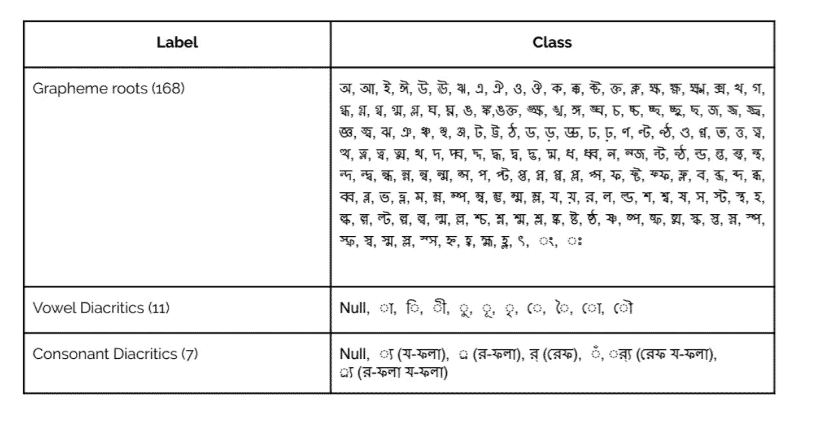****

****图一([https://www.kaggle.com/c/bengaliai-cv19/discussion/122421](https://www.kaggle.com/c/bengaliai-cv19/discussion/122421))****

****在查看了一些在公共 Kaggle 竞赛中执行的 EDA 之后，我们决定通过分析图素内类值的分布来进行探索性数据分析。EDA 的一个重要组成部分是可视化字形图像，以更好地理解字形的广泛变化。****

****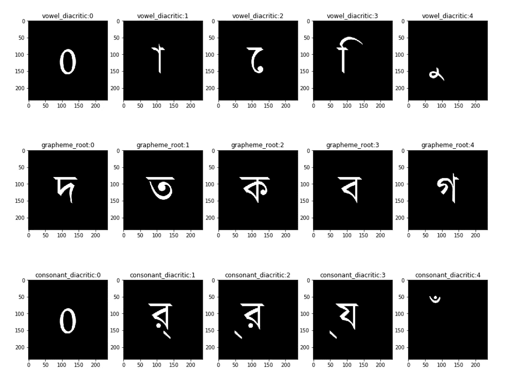****

****图 2([https://www . ka ggle . com/kaushal 2896/Bengali-graphemes-starter-EDA-multi-output-CNN](https://www.kaggle.com/kaushal2896/bengali-graphemes-starter-eda-multi-output-cnn))****

****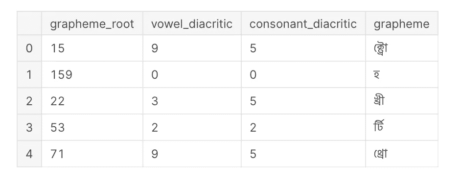****

****图 3****

****一个特别有趣的可视化(见图 4)是按数字和计数的字形根和辅音音调符号的热图。这个图表特别具有启发性，因为它向我们展示了最常见的元音-辅音发音符号是 0–115、0–133 和 0–113。一般来说，最常见的辅音发音符号是 0 辅音。****

****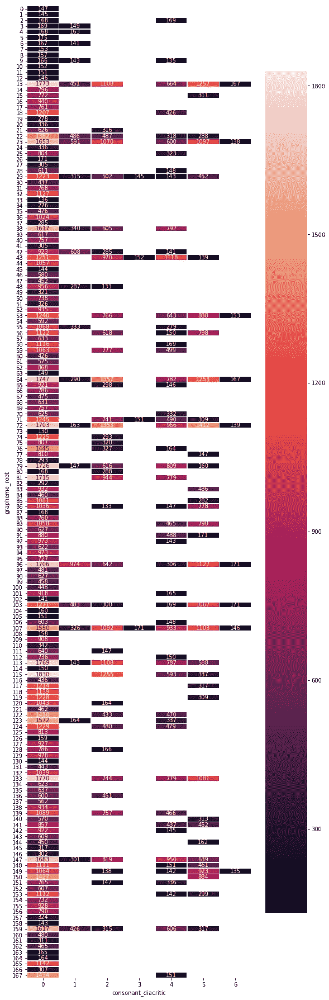****

****图 4([https://www . ka ggle . com/gp reda/Bengali-ai-handled-grapheme-getting-started](https://www.kaggle.com/gpreda/bengali-ai-handwritten-grapheme-getting-started))****

****引用下面图 5 中的代码块和图 6 中的模式；初始模型首先使用带有 ReLU 激活和填充的卷积层。随后是批量标准化和最大池层。然后，具有 ReLU 激活和填充的另外两个卷积层被应用到最大池层中。再次应用两个卷积层进入最大池的序列。在使用具有 ReLU 激活和丢弃的两个密集层之前，网络具有平坦层。最后，网络分成三个分支。根据网络的分类，输入图像是字素 _ 词根、元音 _ 发音符号或辅音 _ 发音符号；使用 softmax 激活的最终密集层应用的神经元数量等于给定图像类型中可能类别的数量。****

****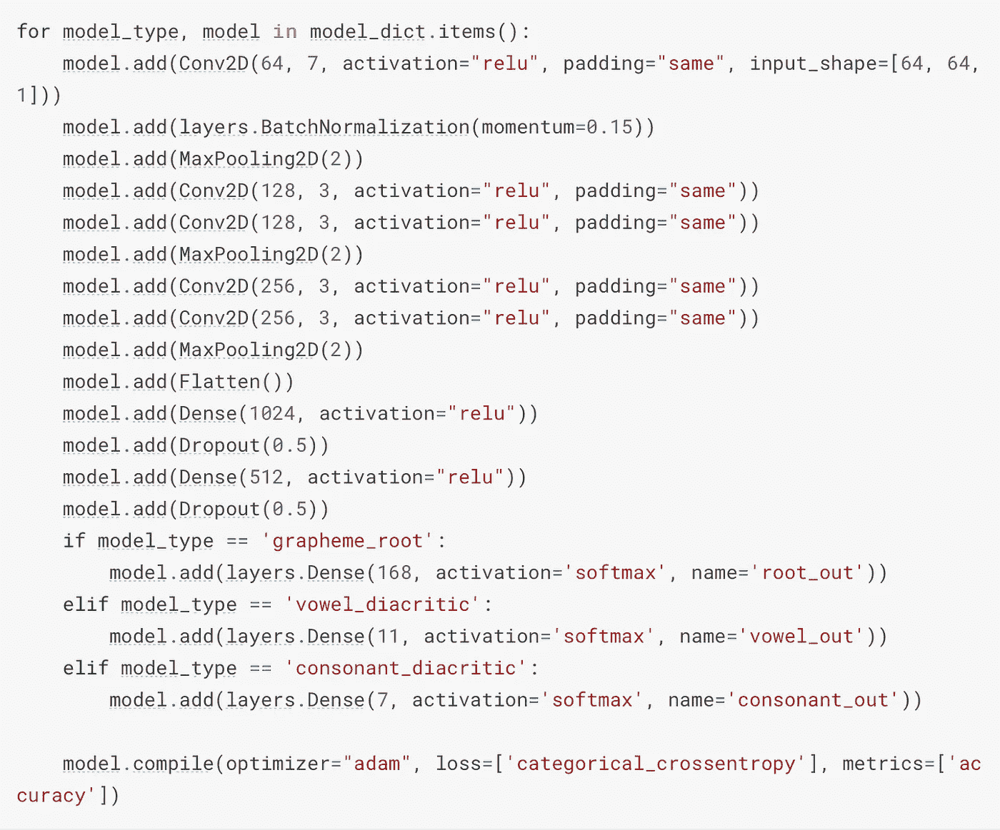****

****图 5****

****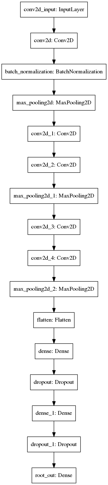****

****图 6****

****如上所述，基线卷积神经网络的输出分支对组成孟加拉语字母表的三个不同部分进行分类:字素根、元音发音符号和辅音发音符号。因此，当我们分析基线模型时，我们需要考虑三个不同部分的准确性。****

****该模型被训练了 1413 个步骤，并在 5021 个样本上进行验证。出于时间和效率的目的，历元的数量被设置为 5，其中每个历元向前和向后通过所有 1413 个步骤。在 5 个时期之后，在验证集上评估模型，并且输出对应于字母表的组成部分的三个准确度值。为神经网络选择 adam 优化器和分类交叉熵损失函数。****

****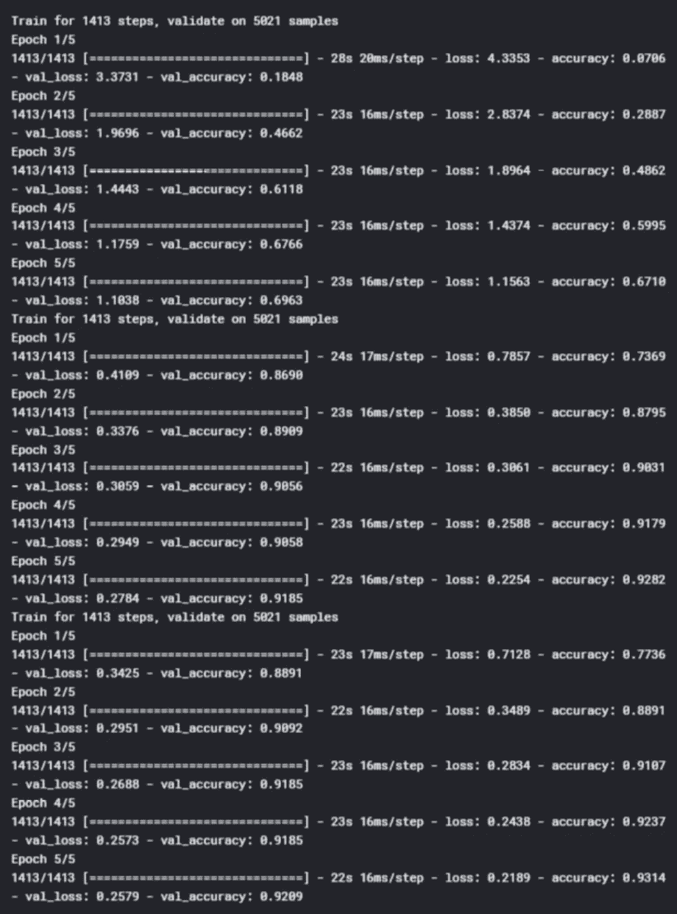****

****图 7****

****不出所料，字形根具有最低的验证准确性值 0.6963，训练准确性为 0.6710(见图 8)。当我们考虑到该模型需要正确分类 168 个字素根时，较低的准确性分数是有意义的，其中许多字素根看起来非常相似(见图 1)。当我们考虑到字素是手写的时，又增加了一层复杂性，因为看起来相似的字素很容易被错误分类。****

****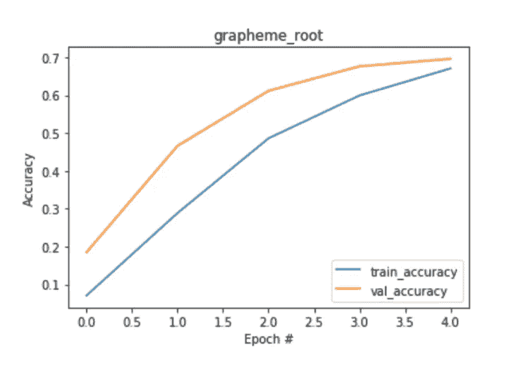****

****图 8****

****元音变音符号(11 类)和辅音变音符号(7 类)被很好地分类，分别具有. 9185 和. 9209 的高准确度分数。虽然这些精度值相当高，但在类数量较少的情况下，这些值并不意外。图 9 和图 10 描绘了发音符号的训练和验证分数。注意，在这两个图中，训练和验证曲线相交。****

****总的来说，我们的基线模型表现得相当好。接下来的步骤包括通过增加模型被训练的时期的数量来改进基线模型，尝试不同的优化器如 nadam，测试不同的激活函数和超调不同的参数。****

****我们计划追求的另一个途径是使用迁移学习来训练和构建我们的模型。我们发现了一篇发表于 2019 年 2 月的论文，该论文在深度卷积神经网络(链接如下)和相应的 GitHub 页面上使用了迁移学习，该页面具有与神经网络对应的权重和代码。这篇新颖的论文在“BanglaLekha-Isolated dataset”(chatter JEE et al .，2019)上经过 47 个时代后，达到了 96.12%的非常高的准确率。因此，我们希望将论文和 GitHub 代码中概述的神经网络用于我们的项目。请注意，我们还计划利用数据扩充来提高我们的模型准确性。当检测现实生活的原始数据时，数据扩充可以导致更稳健的模型(通过训练图片的空间方向/大小的变化)。****

******附加数字:******

****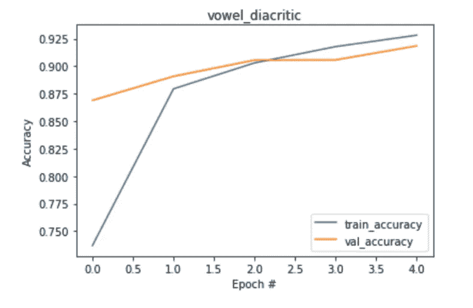****

****图 9****

****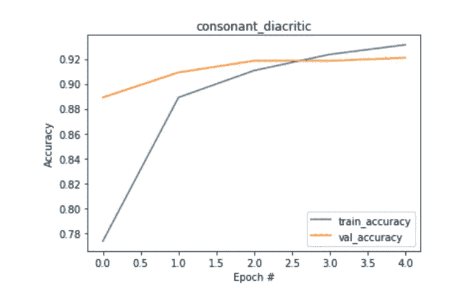****

****图 10****

****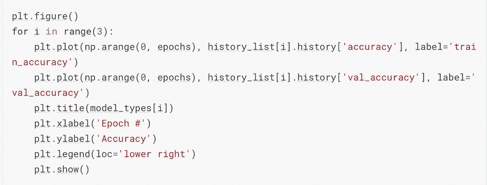****

****图 11(精确度图表代码)****

******链接和资源:******

*****转移我们下一步计划使用的学习论文和 Github 代码:*【https://arxiv.org/html/1902.11133】****

*****我们用来获取启动代码和引导程序的笔记本:*[https://www . ka ggle . com/deshwalmahesh/Bengali-ai-complete-beginner-tutorial-95-ACC/data](https://www.kaggle.com/deshwalmahesh/bengali-ai-complete-beginner-tutorial-95-acc/data)，[https://www . ka ggle . com/chekoduadarsh/tutorial-design-your-own-CNN-layer-by-layer](https://www.kaggle.com/chekoduadarsh/tutorial-design-your-own-cnn-layer-by-layer)，[https://www . ka ggle . com/chekoduadarsh/multi-output-cn](https://www.kaggle.com/chekoduadarsh/multi-output-cnn-starter-kit)****

*****我们为 EDA 查阅的笔记本:*[https://www . ka ggle . com/kaushal 2896/Bengali-graphemes-starter-EDA-multi-output-CNN](https://www.kaggle.com/kaushal2896/bengali-graphemes-starter-eda-multi-output-cnn)，[https://www.kaggle.com/pestipeti/bengali-quick-eda](https://www.kaggle.com/pestipeti/bengali-quick-eda)，[https://www . ka ggle . com/gp reda/Bengali-ai-handled-grapheme-getting-started](https://www.kaggle.com/gpreda/bengali-ai-handwritten-grapheme-getting-started)****