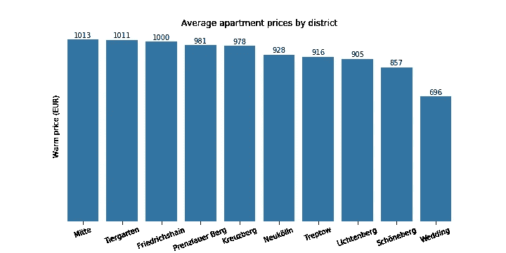
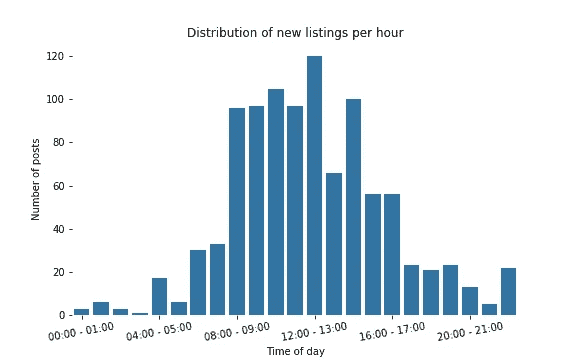
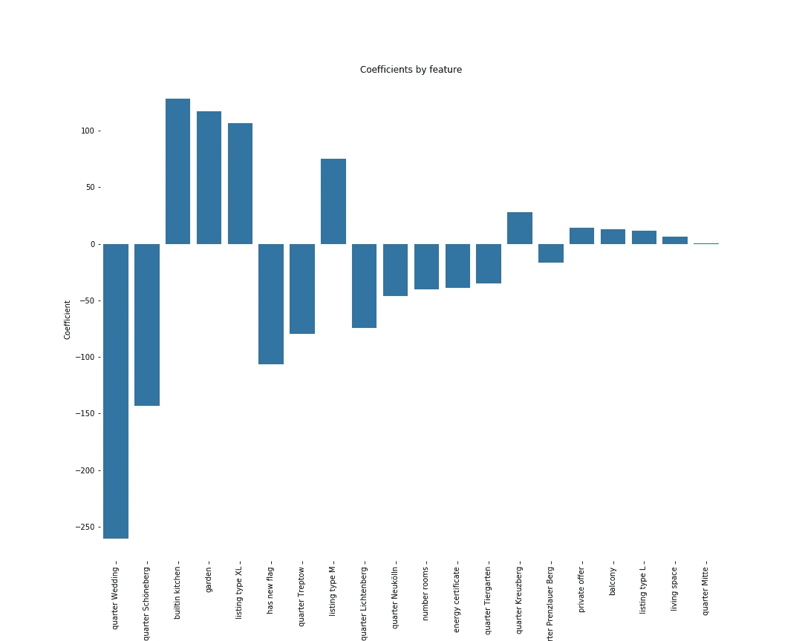
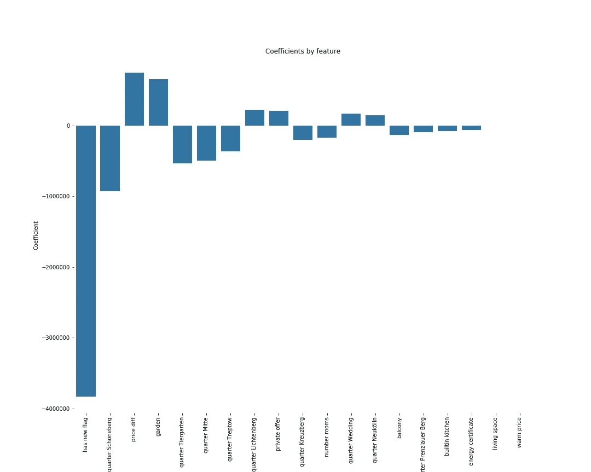

# 柏林房屋租赁市场分析

> 原文：<https://towardsdatascience.com/berlin-house-rental-market-analysis-18dfc0c2ca9?source=collection_archive---------37----------------------->

## 我支付的价格公平吗？

# **简介**

不久前，柏林曾是一个与低生活成本相关的地方，吸引了许多以低廉价格寻求高质量生活的人。然而，也许由于这种流行和其他宏观经济变化，那些日子已经成为过去。

问问目前住在柏林的任何人，他们都会告诉你获得房屋租赁合同有多难，这不仅是因为报价稀缺和对公寓的大量需求，也是因为价格飙升，尽管国家采取了监管措施。

有了以上的基调，并发现自己正在寻找一个新的住处，我决定使用数据驱动的方法来帮助我进行搜索，并给我基于数据做出好决定的信心。因此，在这篇文章中，我将描述我在这个过程中的一些发现。

在几个月的时间里，我从网站[上收集了一些柏林某些地区的市场数据——有些地区没有包括在内，因为我不想在那里生活。根据我收集的数据，我有兴趣回答几个有助于我搜索的问题，但主要问题是:](http://www.immobilienscout24.de)

*   最贵和不贵的地区有哪些？
*   什么时候发布新房源最受欢迎？
*   我支付的价格公平吗？
*   是什么让一些房源比其他房源更有吸引力？

我会在这篇文章中尝试回答这些问题，所以请继续阅读！

## **最贵和最便宜的地区是哪里？**

我想看看我的预算允许我住在哪里，因此知道某个地区的平均要价是第一步。

*澄清* ***暖价*** *的含义很重要:在德国房价通常分为冷价和暖价，分别对应于取暖费、维修费、垃圾收集费和其他维护费用前后的价格。因此，我们最感兴趣的租赁成本是温暖的价格。*

下面的柱状图以降序显示了该数据集中柏林最昂贵的地区。正如我们所料，最昂贵的区域是 Mitte、Tiergarten、Friedrichshain、Prenzlauer Berg 和 Kreuzberg，这些区域通常是城市的标志性区域，因此更受欢迎。另一方面，我们有 **Wedding、Schö neberg、Lichtenberg 和 Treptow，**可以认为是在市中心之外，因此比预期的要便宜。

**什么时候发布新房源最受欢迎？**

由于市场竞争非常激烈，房源消失得非常快，我很想知道新房源出现的最受欢迎时间，这样我就可以更快地做出反应。

在下图中，我们可以看到列表发布的时间分布。据观察，发布新列表的最受欢迎的时间是在早上，在午餐时间之前达到高峰(12:00-13:00)。

我支付的价格合理吗？

也许最有趣的问题是，我想知道一个房源的要价是否合理，这样我就可以有一个申请公寓或者更重要的是接受报价的依据。

为了实现这一点，我建立了一个线性回归模型来预测最终(温暖)价格，使用公寓是否有阳台、花园或内置厨房，是否是新的或最近装修的，是否来自私人或房地产中介，总居住面积，房间数量或其所在的地区等变量作为特征。

结果如下所示，其中指标的相对强度以降序绘制(正的和负的)。

可以得出结论，最强的指标是公寓是否位于 Wedding 或 Schö neberg，这对价格有负面影响。有点不奇怪的是，一套带有嵌入式厨房或花园的公寓与较高的价格密切相关，但也许更令人惊讶的是，房间数量具有负系数，这意味着房间数量越多，最终价格越低。

尽管居住空间的系数与其他相比相对较低，但人们必须考虑到这是一个连续变量，其变化比布尔变量(在 0 和 1 之间变化)大得多。因此，居住面积每增加一个单位(1 平方米)，价格预计将增加约 6 欧元。

有了这个模型，我对自己的决定变得更加自信，并且能够判断一套公寓的要价是否公平。

**是什么让一些上市公司比其他公司更有吸引力？**

另外，我还想知道上市公司的哪些特征对了解上市公司是否有吸引力更重要。为此，我用一个列表保持在线的时间作为衡量标准，在线时间越短，吸引力和兴趣越高。

为了实现这一点，我运行了一个线性回归模型来预测一个列表保持在线的时间，使用的功能与之前线性模型中使用的相同，加上温暖价格和温暖价格与寒冷价格之间的标准化差异。模型的结果如下图所示。

在这种情况下，如果一个系数为正，那么它与更多的在线时间相关联，反之亦然。例如，可以得出这样的结论:如果一个房源是新建的(或已经翻修过的)，有更多的房间或更大的居住空间，有阳台或内置厨房，或者位于 Schö neberg、Tiergarten、Mitte、Treptow 或 Kreuzberg 等街区，那么它在网上停留的时间就更短(受到更多的关注，更快地找到某个人)。另一方面，如果价格差异或温暖价格较高，或者如果房源位于 Lichtenberg、Wedding 或 neuklln 等吸引力较低的街区，则房源会在网上停留更长时间。有点令人惊讶的是，有花园的列表与更多的在线时间相关联。

# 结论

在这篇文章中，我们通过分析一个由柏林在线出租公寓组成的数据集，获得了一些见解。更具体地说，我们:

*   看到最贵的调查小区是 **Mitte** ，最少的是 **Wedding** 。
*   看到**发布新房源最热门的时间**是在**早上**。
*   观察到**最重要的暖价预测指标**是房源是否位于**婚礼**或**舍内贝格**附近，以及是否有**嵌入式厨房**或**花园。**
*   得出的结论是，与对房源更感兴趣最相关的特征是:它是否是新的、有内置厨房、阳台、房间和居住空间。至于最受欢迎的地区，我们看到最有吸引力的街区是**舍内贝格**、**蒂尔加滕**、**米特**、**特雷普托**和**克罗伊茨贝格。**

希望这能对你将来在柏林寻找公寓有所帮助！要查看更详细的分析，请查看 [Github repo](https://github.com/diogomatoschaves/berlin-house-prices-analysis) 。