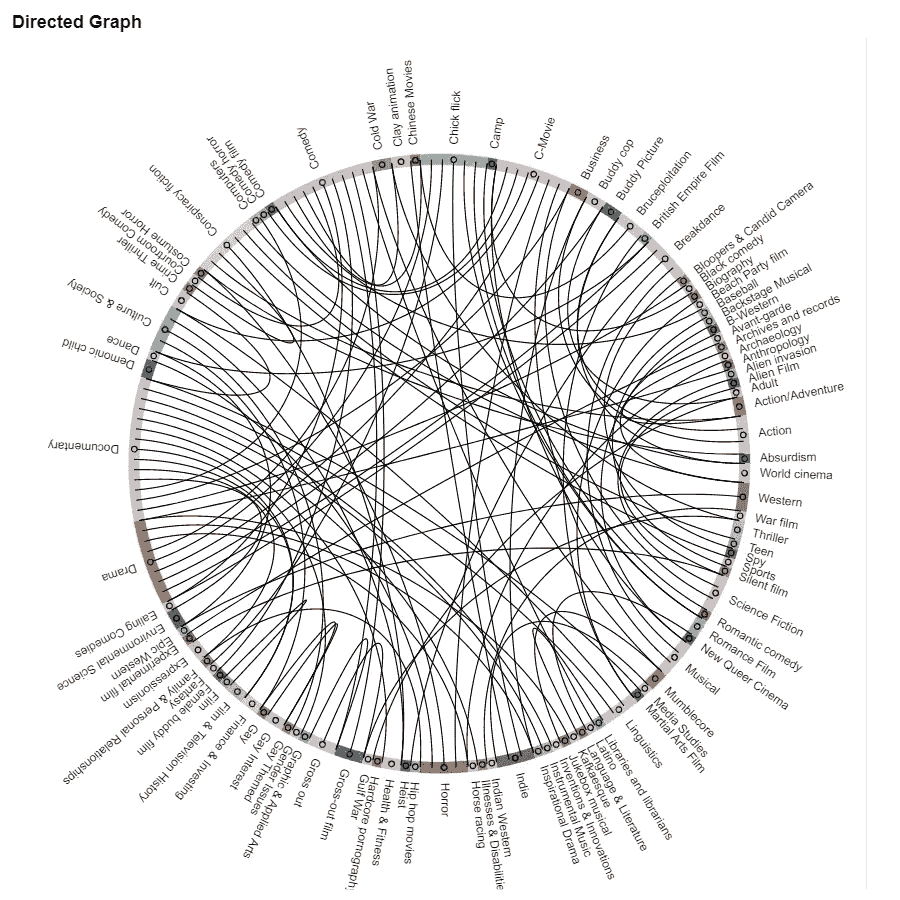

# 多标签文本分类

> 原文：<https://towardsdatascience.com/bert-multilabel-text-classification-a7f560db34e5?source=collection_archive---------19----------------------->

# 介绍

在[我的上一篇文章](/multi-label-text-classification-5c505fdedca8)中，我介绍了各种机器学习方法，这些方法能够为单个电影描述指定一组相关的流派(请访问文章获取数据集)。分类器链模型获得了最好的 F1 值= 0.43。我要验证的想法是用 BERT 嵌入来训练神经网络。

[BERT](https://github.com/google-research/bert) (来自变形金刚的双向编码器表示)是由谷歌人工智能语言的研究人员开发的一个新模型。

它的主要创新是将一种流行的注意力模型 Transformer 的双向训练应用于语言建模。这导致了比单向语言模型更深刻的语言上下文和流程感。

# 密码

[Bert_serving](https://pypi.org/project/bert-serving-server/) 支持使用 Bert 模型作为句子编码服务，用于将可变长度的句子映射到固定长度的句子。

为了找到最佳的参数，我使用了[神圣模块](https://github.com/IDSIA/sacred)。神圣是一个工具，帮助您配置，组织，记录和复制实验，以便:

*   记录你实验的所有参数
*   轻松运行不同设置的实验
*   在数据库中保存单次运行的配置

修改后的参数如下:

1.  **max_seq_len** —序列的最大长度。找到的最佳值是 **256** ，这需要使用 GPU
2.  **batch_size** —将通过网络传播的样本数量。选择的号码是 **128**
3.  **gamma** —聚焦损失中的聚焦参数，平滑调整简单示例向下加权的速率。焦点损失旨在通过降低内联体(简单的例子)的权重来解决类别不平衡，这样即使它们的数量很大，它们对总损失的贡献也很小。它侧重于训练一组稀疏的硬例子。在我们的例子中，伽马的最佳值是 **2**

得到了 F1 = **0.49**

# 标签共现

我们需要记住，在我们的数据集中有多个标签，有时一个标签表示另一个标签的出现。为了检查这种百分比依赖性，我创建了共现矩阵。例如，现在我们知道:

```
Action Comedy -> Action, 0.9722222222222222
Action Comedy -> Comedy, 0.9629629629629629
Action Thrillers -> Action, 0.9492537313432836
Action Thrillers -> Thriller, 0.9253731343283582
Adventure Comedy -> Comedy, 0.9101123595505618
```

下图显示了前 100 个最强的依赖关系。



标签共现的路由弦

有了获得的知识，我们现在可以尝试修改我们的预测。经过几次尝试，我决定将结果标签的值改为 1，前提是它与指示标签的同现度大于或等于 0.9。

更新后的 F1 成绩是 **0.5** ，小进步。

# 结果

示例结果如下所示。

```
First Platoon centers around Rock Brannigan ([[Scott Gibson  and his ragtag squad of ex-military zombie hunters trying to make a living in the desert Southwest two years after the zombie apocalypse. Along the way they encounter the grizzled Pa Jericho , and the eccentric Rex Necro .
**Action, Comedy, Horror, Parody, Science Fiction**The life of the S&M-theme artist and author Seiu Ito is depicted in the film. His artistic life and Sadian philosophy, inspired by his torturing of his two wives and Tae, his favorite prostitute, are portrayed as shown in his journalistic writings. Tae is eventually driven insane due to Ito's attentions.
**Drama, Japanese Movies, World cinema**
```

# 结论

使用 BERT 嵌入技术使 F1 得分提高了 7%(总体提高了 50%)。

在未来的工作中，我认为减少标签的数量，只保留主要的标签是个好主意。由于“动作喜剧”在 100%的情况下是“动作”，在 100%的情况下是“喜剧”，也许我们真的不需要这个类别。

感谢您的阅读。