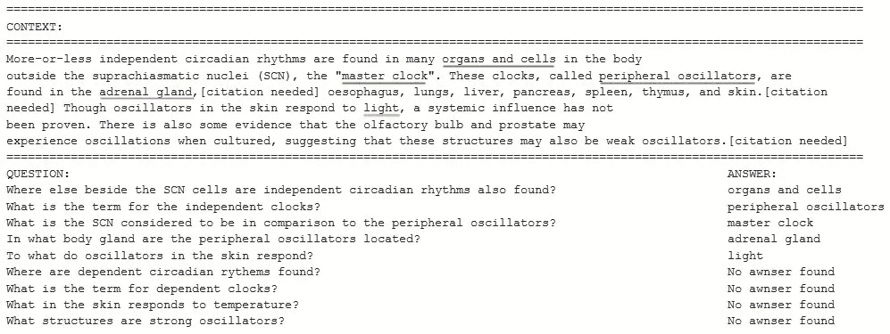
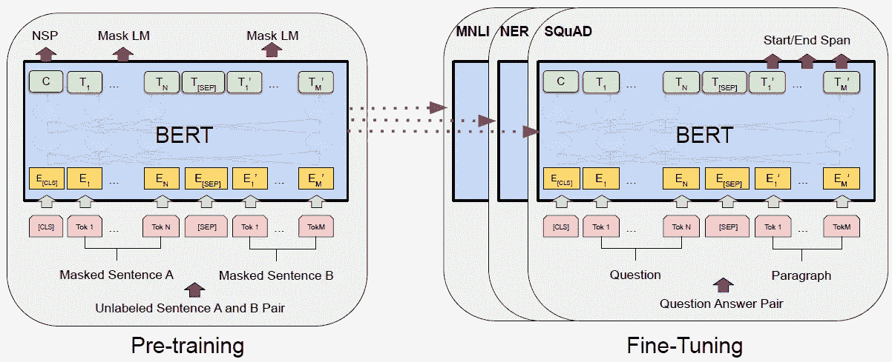
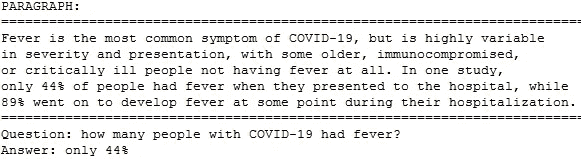

# BERT NLP——如何构建问答机器人

> 原文：<https://towardsdatascience.com/bert-nlp-how-to-build-a-question-answering-bot-98b1d1594d7b?source=collection_archive---------6----------------------->

## 通过亲自动手的 PyTorch 代码理解直觉，BERT 在 SQuAD 上进行了微调。


斯蒂夫·约翰森在 [Unsplash](https://unsplash.com/photos/6ZvMJlNF4YU) 上的抽象画

本文将介绍基于神经网络创建和编码问答系统的关键思想。实现使用谷歌的语言模型，称为预训练伯特。实践证明 PyTorch 代码的问题回答与伯特微调和班是在文章的最后提供。

# 什么是问答？

在问答任务中，模型接收关于文本内容的问题，并被要求在文本中标记答案的开始和结束。



带答案的文本和相关问题示例

在上面的例子中，问题*的答案是“除了 SCN 细胞之外，在哪里还发现了独立的昼夜节律？”*位于红色突出显示的位置。问题*“独立时钟的术语是什么？”*在蓝色位置回答。

如果我们有一个非常大的这样的文本集，以及样本问题和答案在文本中的位置，我们可以训练一个神经网络来学习上下文、问题和答案之间的关系。给定与训练文本相似的新上下文，由此产生的网络将能够回答看不见的问题。

几十年来，机器阅读理解一直吸引着计算机科学家的注意力。最近大规模标记数据集的产生使研究人员能够建立受监督的神经系统，自动回答用自然语言提出的问题。

# 小队数据集

[斯坦福问答数据集(SQuAD)](https://rajpurkar.github.io/SQuAD-explorer/) 是用于阅读理解的大规模标记数据集的主要例子。Rajpurkar 等人开发了 SQuAD 2.0，它结合了一组维基百科文章中关于同一段落的 10 万个可回答问题和 5 万个无法回答的问题。这些无法回答的问题是由人群工作者以敌对的方式写出来的，看起来与可回答的问题相似。


小队数据集的快照

`doc_tokens`描述上下文，即我们希望模型理解的文本。

```
At the 52nd Annual Grammy Awards, Beyoncé received ten nominations, including Album of the Year for I Am... Sasha Fierce, Record of the Year for "Halo", and Song of the Year for "Single Ladies (Put a Ring on It)", among others. She tied with Lauryn Hill for most Grammy nominations in a single year by a female artist. In 2010, Beyoncé was featured on Lady Gaga's single "Telephone" and its music video. The song topped the US Pop Songs chart, becoming the sixth number-one for both Beyoncé and Gaga, tying them with Mariah Carey for most number-ones since the Nielsen Top 40 airplay chart launched in 1992\. "Telephone" received a Grammy Award nomination for Best Pop Collaboration with Vocals.
```

`question_text`描述应该从上下文中回答的问题。

```
How many awards was Beyonce nominated for at the 52nd Grammy Awards?
```

`orig_answer_text`代表问题的正确答案。

```
ten
```

答案总是从上下文中开始于`start_position` 并结束于`end_position`的部分。如果该问题在上下文中没有任何答案，`is_impossible` 的值为`true`。

# 问答中的迁移学习

SQuAD 数据集提供了 15 万个问题，这在深度学习世界中并不算多。迁移学习背后的想法是采用一个在非常大的数据集上训练的模型，然后使用 SQuAD 数据集对该模型进行微调。



BERT 的整体预培训和微调程序。图片由 [Jacob Devlin 等人@ Google AI Language](https://arxiv.org/pdf/1810.04805.pdf) (来源:Arxiv 上的原始 BERT 论文)

BERT 是一个训练有素的 [Transformer](/lost-in-translation-found-by-transformer-46a16bf6418f) 编码器堆栈，基本版有 12 个，大版有 24 个。伯特接受了维基百科和图书语料库的培训，图书语料库包含超过 10，000 本不同流派的书籍。我将在下面的文章中详细介绍 Transformer 架构。

[](/lost-in-translation-found-by-transformer-46a16bf6418f) [## 伯特解释道。迷失在翻译中。被变形金刚发现。

### 打造下一个聊天机器人？伯特，GPT-2:解决变压器模型的奥秘。

towardsdatascience.com](/lost-in-translation-found-by-transformer-46a16bf6418f) 

我们可以使用 BERT 从小队文本中提取高质量的语言特征，只需在顶部添加一个线性层。线性图层有两个输出，第一个输出用于预测当前子笔画是答案的开始位置的概率，第二个输出用于预测答案的结束位置。

下面你可以找到一个模型的总结。为了简单起见，我只显示了第一个和最后一个编码器层。同一层通常会重复 12 次。我们可以在开头看到*Bert embeddeds*层，后面是每个编码器层的 Transformer 架构: *BertAttention* ， *BertIntermediate* ， *BertOutput* 。最后，我们有两个输出的 *BertPooler* 和*线性*层。

训练模型相对简单。底层已经有了很好的英语单词表示，我们只需要训练顶层，在底层进行一些调整来适应我们的问答任务。为此，您可以定制我在下面的文章中提供的代码。

[](/bert-for-dummies-step-by-step-tutorial-fb90890ffe03) [## 伯特为假人-一步一步教程

### 变压器 DIY 实用指南。经过实践验证的 PyTorch 代码，用于对 BERT 进行微调的意图分类。

towardsdatascience.com](/bert-for-dummies-step-by-step-tutorial-fb90890ffe03) 

你可能期望 F1 分数在 74%左右。如果我们查看当前的 [SQuAD 1.0 排行榜](https://rajpurkar.github.io/SQuAD-explorer/)，我们会看到对测试数据集的评估使我们进入了前 100 名，鉴于免费 GPU 上可用的资源有限，这是可以接受的。

微调后的模型可用于对我们选择的文本和问题进行推理。



# 结论

在本文中，我解释了如何在 SQUaD 数据集上微调预训练的 BERT 模型，以解决任何文本上的问答任务。

你可以用 BERT 改编我的 [PyTorch 代码用于 NLU 来解决你的问答任务。](https://drive.google.com/file/d/1Zp2_Uka8oGDYsSe5ELk-xz6wIX8OIkB7/view?usp=sharing)

一些读者可能会发现这本[谷歌 Colab 笔记本](https://drive.google.com/file/d/1Zp2_Uka8oGDYsSe5ELk-xz6wIX8OIkB7/view?usp=sharing)中的完整代码更加简单明了。功劳归于[微软首席数据科学家 Prachur Bhargava](https://www.linkedin.com/in/prachur-bhargava-83478a4/) 和[美国运通软件工程师 Himanshu Mohan](https://www.linkedin.com/in/himanshu-mohan-869561137/) ，他们优雅地解决了在 Google Colab 上训练模型的内存问题。谢谢你，Prachur 和 Himanshu！

你可以在我下面的文章中了解更多关于语言模型的知识。

[](/representing-text-in-natural-language-processing-1eead30e57d8) [## 自然语言处理中的文本表示

### 理解书面单词:温习 Word2vec、GloVe、TF-IDF、单词袋、N-grams、1-hot 编码…

towardsdatascience.com](/representing-text-in-natural-language-processing-1eead30e57d8) [](/bert-for-dummies-step-by-step-tutorial-fb90890ffe03) [## 伯特为假人-一步一步教程

### 变压器 DIY 实用指南。经过实践验证的 PyTorch 代码，用于对 BERT 进行微调的意图分类。

towardsdatascience.com](/bert-for-dummies-step-by-step-tutorial-fb90890ffe03) [](/topic-modeling-with-latent-dirichlet-allocation-by-example-3b22cd10c835) [## 具有潜在狄利克雷分配(LDA)的主题建模教程

### 这是一本实用指南，包含经过实践检验的 Python 代码。找到人们在推特上谈论的内容。

towardsdatascience.com](/topic-modeling-with-latent-dirichlet-allocation-by-example-3b22cd10c835) [](/sentiment-analysis-a-benchmark-903279cab44a) [## 情感分析:一个基准

### 递归神经网络解释。使用 FCNNs、CNN、RNNs 和嵌入对客户评论进行分类。

towardsdatascience.com](/sentiment-analysis-a-benchmark-903279cab44a) [](/natural-language-understanding-with-sequence-to-sequence-models-e87d41ad258b) [## 基于序列对序列模型的自然语言理解

### 如何预测客户询问背后的意图？Seq2Seq 型号说明。在 ATIS 数据集上演示的槽填充…

towardsdatascience.com](/natural-language-understanding-with-sequence-to-sequence-models-e87d41ad258b) [](/heres-how-to-build-a-language-translator-in-few-lines-of-code-using-keras-30f7e0b3aa1d) [## 假人的神经机器翻译——5 分钟指南

### AI 能让濒危语言不消失吗？

towardsdatascience.com](/heres-how-to-build-a-language-translator-in-few-lines-of-code-using-keras-30f7e0b3aa1d) [](/truecasing-in-natural-language-processing-12c4df086c21) [## 自然语言处理中的真实大小写

### 恢复推文和短信中的大写字母可以提高可读性。正确的正确大小写对于…至关重要

towardsdatascience.com](/truecasing-in-natural-language-processing-12c4df086c21) 

感谢阅读。