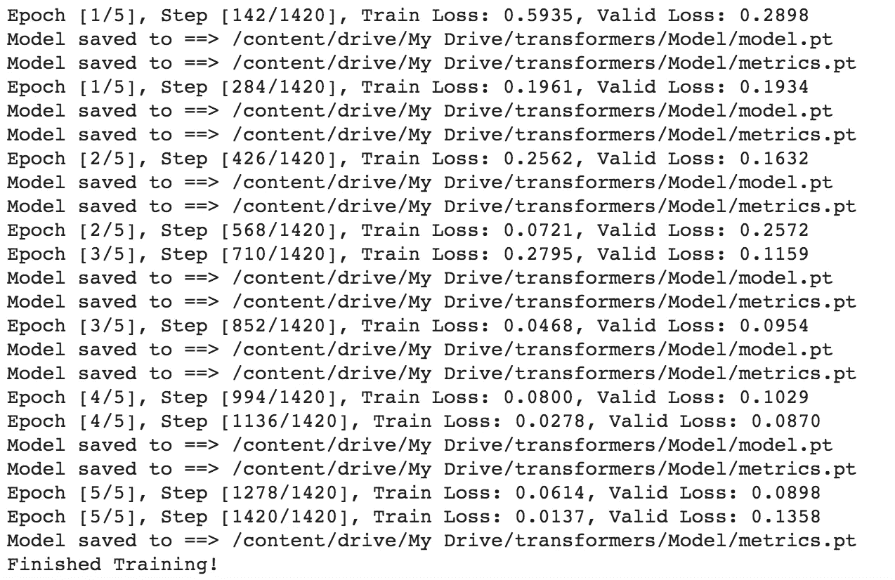
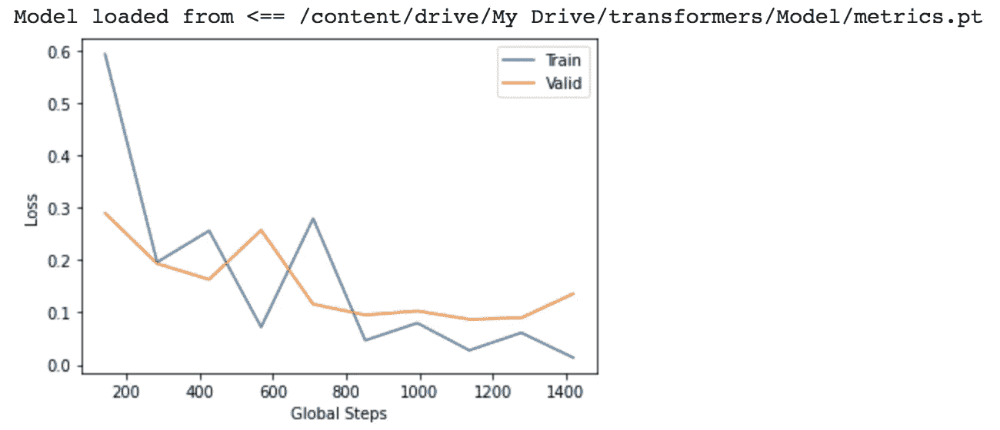
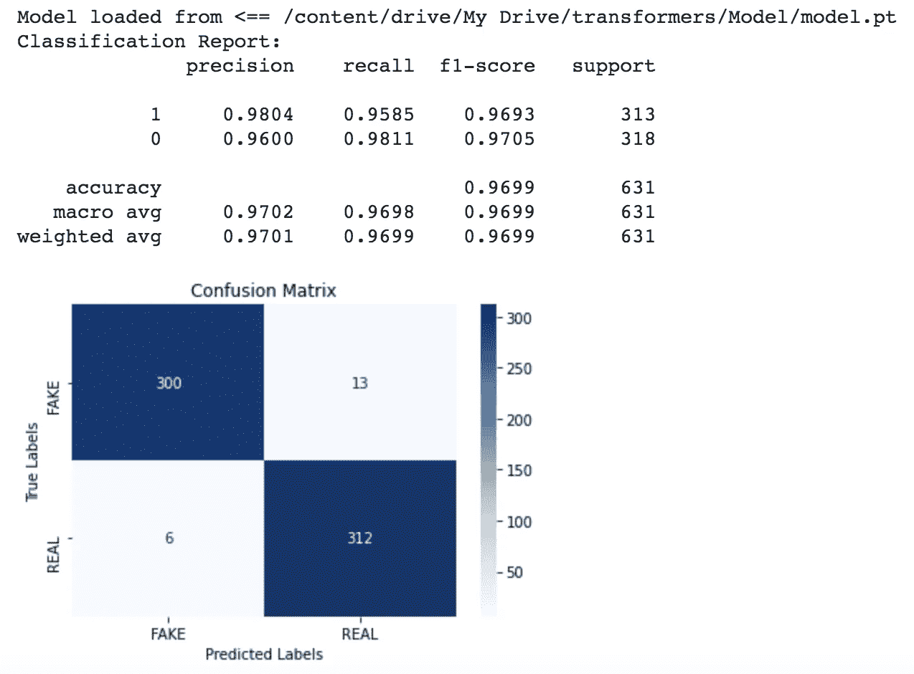

# 使用 Pytorch 的 BERT 文本分类

> 原文：<https://towardsdatascience.com/bert-text-classification-using-pytorch-723dfb8b6b5b?source=collection_archive---------0----------------------->

## 使用 Huggingface 库提供的 BERT 分类任何文本

照片由[克莱门特·H](https://unsplash.com/@clemhlrdt?utm_source=medium&utm_medium=referral)在 [Unsplash](https://unsplash.com?utm_source=medium&utm_medium=referral) 上拍摄

# 介绍

**文本分类**是自然语言处理中最常见的任务之一。它被广泛应用于各种应用中，包括情感分析、垃圾邮件过滤、新闻分类等。在这里，我们向您展示如何使用最先进的模型来检测假新闻(将文章分类为真实或虚假)，这是一个可以扩展到任何文本分类任务的教程。

[**变压器**](https://papers.nips.cc/paper/7181-attention-is-all-you-need.pdf) 是当前最先进的 NLP 架构的基本构建模块。它的主要优势是它的多头注意力机制，与以前的竞争模型(如递归神经网络)相比，它可以提高性能并显著提高并行性。在本教程中，我们将使用预先训练好的 [**BERT**](https://arxiv.org/abs/1810.04805) ，这是最流行的变形金刚模型之一，并在假新闻检测上对其进行微调。在后面的教程中，我还使用了一个 [**LSTM** 来完成同样的任务，如果感兴趣的话，请检查一下！](/lstm-text-classification-using-pytorch-2c6c657f8fc0)

这篇文章的**主要源代码**可以在[这个 Google Colab 笔记本](https://colab.research.google.com/drive/1P4Hq0btDUDOTGkCHGzZbAx1lb0bTzMMa?usp=sharing)中找到。

**预处理代码**在[这款 Google Colab 笔记本](https://colab.research.google.com/drive/1xqkvuNDg0Opk-aZpicTVPNY4wUdC7Y7v?usp=sharing)中也有。

# **入门**

[Huggingface](https://huggingface.co/transformers/) 是用 Python 实现最新变形器的最知名的库。它提供了清晰的文档和教程，介绍了如何为各种不同的任务实现几十种不同的转换器。我们将使用 [Pytorch](https://pytorch.org/) ，因此请确保 Pytorch 已安装。在确保安装了相关库之后，您可以通过以下方式安装 transformers 库:

`pip install transformers`

对于数据集，我们将使用来自 Kaggle 的真实和虚假新闻数据集[**。**](https://www.kaggle.com/nopdev/real-and-fake-news-dataset)

# 步骤 1:导入库

这里要注意的最重要的库是，我们导入了 BERTokenizer 和 BERTSequenceClassification，以便稍后构造记号化器和模型。

# 步骤 2:预处理和准备数据集

在原始数据集中，我们添加了一个额外的 TitleText 列，它是标题和文本的串联。我们想用标题和正文来检验一篇文章是否是假的。

对于记号赋予器，我们使用“bert-base-uncased”版本的 BertTokenizer。使用 [TorchText](https://pytorch.org/text/) ，我们首先创建文本字段和标签字段。文本字段将用于包含新闻文章，标签是真正的目标。我们将每篇文章限制为 BERT 输入的前 128 个标记。然后，我们从数据集 csv 文件中创建一个 TabularDataset，使用这两个字段来生成训练集、验证集和测试集。然后我们创建迭代器来批量准备它们。

*注意:为了在 TorchText 中使用 BERT tokenizer，我们必须设置* `*use_vocab=False*` *和* `*tokenize=tokenizer.encode*` *。这将让 TorchText 知道，我们不会使用我们的数据集从头开始构建我们自己的词汇表，而是使用预先训练的 BERT 标记器及其相应的单词到索引的映射。*

# 步骤 3:构建模型

我们使用的是“bert-base-uncased”版本的 bert，这是一个针对小写英文文本训练的较小模型(具有 12 层、768 个隐藏、12 个头、110M 参数)。查看 [Huggingface 的文档](https://huggingface.co/transformers/pretrained_models.html)了解其他版本的 BERT 或其他变压器模型。

# 第四步:培训

我们分别为模型检查点和训练指标编写保存和加载函数。请注意，模型检查点的保存功能并不保存优化器。我们不保存优化器，因为优化器通常会占用非常大的存储空间，并且我们假设不需要从以前的检查点进行训练。训练度量存储训练损失、验证损失和全局步骤，以便以后可以进行关于训练过程的可视化。

我们使用 Adam 优化器和合适的学习率来调整 5 个时期的 BERT。

我们使用二进制交叉熵作为损失函数，因为假新闻检测是两类问题。在计算目标与其自身之间的损耗之前，确保输出通过 Sigmoid。

在训练期间，我们根据验证集评估我们的模型参数。每次验证损失减少时，我们保存模型，以便我们最终得到具有最低验证损失的模型，该模型可以被认为是最佳模型。以下是培训期间的输出:

*作者图片*

训练之后，我们可以使用下面的代码绘制一个图表:

*作者图片*

# 第五步:评估

对于评估，我们使用我们训练的模型预测文章，并针对真实标签进行评估。我们打印出分类报告，其中包括测试准确度，精确度，召回，F1 分数。我们还打印出混淆矩阵，以查看我们的模型对每个类正确和不正确地预测了多少数据。

*作者图片*

在对我们的模型进行评估后，我们发现我们的模型达到了令人印象深刻的 96.99%的准确率！

# 结论

我们发现微调 BERT 在我们的数据集上表现非常好，并且由于开源的 Huggingface Transformers 库，实现起来非常简单。这可以毫无困难地扩展到任何文本分类数据集。

这里是我写的其他文章，如果感兴趣的话😊：

 [## 基于 Pytorch 的 LSTM 文本分类

### 一步一步的指导你如何在 Pytorch 中建立一个双向 LSTM！

towardsdatascience.com](/lstm-text-classification-using-pytorch-2c6c657f8fc0)  [## 使用 Pytorch 微调用于文本生成的 GPT2

### 使用 Pytorch 和 Huggingface 微调用于文本生成的 GPT2。我们在 CMU 图书摘要数据集上进行训练，以生成…

towardsdatascience.com](/fine-tuning-gpt2-for-text-generation-using-pytorch-2ee61a4f1ba7)  [## 控制语言模型的文本生成

### 控制机器生成文本的样式和内容的实际操作方法

towardsdatascience.com](/controlling-text-generation-from-language-models-6334935e80cf)  [## 计算机专业学生应该知道的最佳免费资源

### 有效学习的最重要的事情之一是拥有合适的资源，这不是一个简单的过程

medium.com](https://medium.com/@itsuncheng/best-free-resources-that-computer-science-students-should-definitely-know-d148c51b956e) 

# 参考

[1] A .瓦斯瓦尼，n .沙泽尔，n .帕尔马等。、[注意力是你所需要的全部](https://papers.nips.cc/paper/7181-attention-is-all-you-need.pdf) (2017)，第 31 届神经信息处理系统会议

[2] J. Devlin，M. Chang，K. Lee 和 K. Toutanova， [BERT:用于语言理解的深度双向转换器的预训练](https://arxiv.org/pdf/1810.04805.pdf) (2019)，计算语言学协会北美分会 2019 年年会