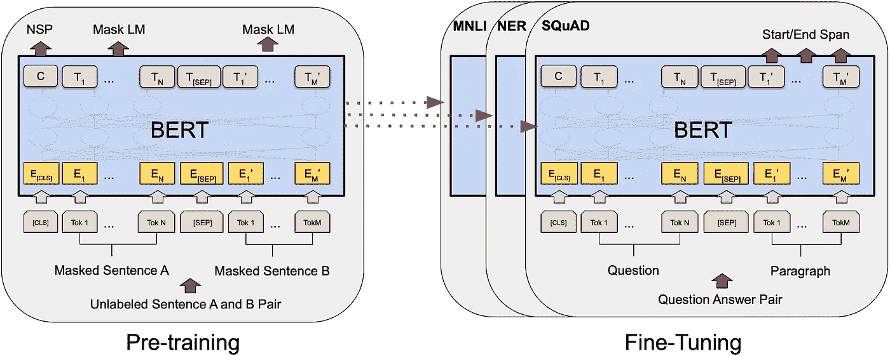

# 伯特:为什么它会彻底改变自然语言处理

> 原文：<https://towardsdatascience.com/bert-why-its-been-revolutionizing-nlp-5d1bcae76a13?source=collection_archive---------16----------------------->

## BERT 是一种语言模型，在许多任务上拥有高性能。但是是什么让它这么好呢？

BERT 代表变压器的双向编码器表示，是一种于 2018 年发布的语言模型，在多项任务上实现了最先进的性能，包括问答和语言理解。它不仅击败了之前最先进的计算模型，还超越了人类在问答方面的表现。

伯特是什么？ BERT 是一个将单词转换成数字的计算模型。这个过程至关重要，因为机器学习模型接受数字(而不是单词)作为输入，所以一种将单词转换为数字的算法允许你在原始文本数据上训练机器学习模型。

BERT 是一个将单词转换成数字的计算模型。图片来自 [(Devlin 等人，2019)](https://arxiv.org/pdf/1810.04805.pdf) 。

**伯特有什么了不起的？**对我来说，伯特之所以如此伟大，主要有三点。

*   第一:根据大量数据进行预先训练。
*   第二:考虑单词的上下文。
*   第三:开源。

大家讨论一下。

**#1:伯特预先接受了大量数据的训练。**最初的 BERT 模型有两种大小:BERT-base(在图书语料库上训练:~8 亿字)和 BERT-large(在英文维基百科上训练:~ 2，500 万字)。这两个模型都有庞大的训练集！正如机器学习领域的任何人都知道的那样，大数据的力量几乎是不可战胜的。当你看过 2，500 万个单词时，你会变得相当好，即使是在新单词上。这意味着，由于 BERT 经过了良好的预训练，因此它可以应用于小数据集，并且仍然具有良好的性能。我在这里用一个例子:我最近参与了一个开发新冠肺炎问答系统的项目。我应用了 BERT-base，在没有对数据集进行微调的情况下，在 15 个类别中获得了 58.1%的准确率。对我来说更有趣的是，“COVID”这个词甚至不在 BERT 的词汇中，但它仍然有相当高的准确性。

伯特能够解释一个单词的上下文。以前的单词嵌入方法会为一个单词返回相同的向量，不管它如何使用，而 BERT 会根据它周围的单词为同一个单词返回不同的向量。例如，在下面的示例中，旧方法将为“信任”返回相同的嵌入:

> 我不能信任你。
> 
> 他们不再信任他们的朋友。
> 
> 他有一个信托基金。

另一方面，BERT 考虑了上下文，并会返回“信任”的不同嵌入，因为该词在不同的上下文中使用。如果您能够区分一个单词的不同用例，您就有了更多的可用信息，并且您的性能可能会因此而提高。一个相关的语言建模方法是 [ELMo](https://arxiv.org/pdf/1802.05365.pdf) ，它也考虑了上下文。

**#3: BERT 是开源的。容易接近是一大优势。机器学习领域的许多工作正被推动成为开源，因为开源代码通过允许其他研究人员轻松应用你的想法来促进发展。伯特的代码是在 GitHub 上发布的[，它包括一个广泛的自述文件，其中有关于如何使用代码的深入信息，这对任何想要使用它的人都非常有帮助。](https://github.com/google-research/bert)**

对我来说，我认为我能够在几分钟内下载一个 BERT 的工作模型，并且花了不到一个小时编写代码，让我在自己的数据集上运行它。

当您将这三个方面结合在一起时，您将获得一个极其强大的语言模型，它可以在 SQuAD、GLUE 和 MultiNLI 等知名数据集上实现一流的性能。它有一些相当大的优势，使它如此强大和适用。

它是在大量数据上预先训练的，所以你可以把它应用到你自己的(可能很小的)数据集上。它有上下文嵌入，所以它的性能会很好。它是开源的，所以你可以下载并使用它。它的应用非常广泛，这就是它革新 NLP 的原因。

谷歌的研究人员(最初的创造者)计划使用 BERT 来理解谷歌搜索，并提高谷歌自己的回答服务的准确性。其他人发现 BERT 不仅仅在谷歌搜索中有用。BERT 似乎承诺在计算语言学的关键领域进行改进，包括聊天机器人、问答、摘要和情感检测。BERT 的广泛适用性显而易见:自从一年前发表以来，[这篇论文](https://arxiv.org/pdf/1810.04805.pdf)已经被引用了 8500 多次。此外，向计算语言学协会(ACL)会议(最大的国际 NLP 会议)提交的论文在 BERT 发表后翻了一番，从 2018 年的 1，544 篇论文增加到 2019 年的 2，905 篇论文。

BERT 将继续革新 NLP 领域，因为它为大范围任务的小数据集提供了高性能的机会。

延伸阅读:

*   [Devlin 等人的原始论文](https://arxiv.org/pdf/1810.04805.pdf)
*   ELMo，一个使用上下文嵌入的类似语言模型。