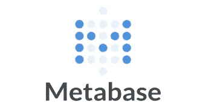
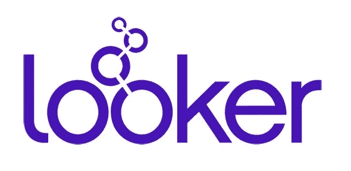

# 2020 年最佳商业智能工具:第一轮，战斗！

> 原文：<https://towardsdatascience.com/best-7-business-intelligence-tools-2020-round-one-fight-3afd4185fd59?source=collection_archive---------35----------------------->

## BI 行业在 2019 年爆发。以下是 2020 年最好最值得关注的 BI 工具。留意这些玩家。

应该选择什么 BI 工具？(原图来自维基百科)

去年，分析界发生了许多变化。一些大型 BI 公司被科技巨头收购。一些斗志昂扬的新创公司获得了成功。商业智能继续进入一个又一个行业，从一个不错的必需品变成一个绝对必须品。这似乎是一个对最值得关注的选择进行大汇总的好时机。

# 以下是 2020 年 7 个最好/最值得关注的商业智能工具

选择你的商务智能工具(来自维基百科的原始图片)

# Knowi

Knowi 标志(来自 Knowi.com)

Knowi 是商业智能雷达上的一个新名字，只是最近才开始成为 Looker 和 Tableau 等公司的真正竞争对手。Knowi 平台采用独特的商业智能方法，专注于传统智能工具中没有的三大区别点。这些是数据虚拟化、基于搜索的分析以及对 NoSQL 数据分析的本机支持。

*   **数据虚拟化:**数据虚拟化在数据集成领域越来越受关注，但 Knowi 是唯一一个将该技术引入商业智能的平台。数据虚拟化添加了一个逻辑数据层，允许应用程序检索和操作数据，而无需事先了解数据的结构。在 BI 中，这意味着能够拥有仪表板和数据分析，而不必首先使用 ETL 将所有东西迁移到单个数据仓库。
*   **基于搜索的分析:**搜索驱动的分析是对您的数据提出问题的能力，就像您在谷歌中键入问题一样，并获得真实的可操作数据、图表或仪表盘来响应您的查询。基于搜索的分析有时也被称为自然语言商业智能。Knowi 在这方面下了很大的赌注，最近发布了这项功能，并很快部署了该功能的 Slack 版本。
*   **原生 NoSQL 数据分析:**大多数 BI 工具需要特殊的连接器来从 MongoDB 等来源获取数据，或者需要将数据转移到结构化数据仓库。Knowi 利用数据虚拟化的优势，无需 ETL 或连接器就可以本机连接到大多数 NoSQL 数据源。

另一项值得注意的是，Knowi 支持**白标嵌入式分析**。这意味着你可以在你的产品中嵌入 Knowi 品牌，而不是 Knowi 品牌。现在有一些成长中的创业公司，他们的产品有一部分是伪装的。

Knowi 还支持你期望从 BI 工具中得到的所有标准特性:数据可视化、交互式仪表板、报告、查询和分析。

**值得注意是因为:**拥有一些前沿功能，可能会对商业智能世界产生重大影响。

**主要不利因素:** Knowi 是一家初创公司，因此他们可能会缺少一些大公司的精华。

# 功率 BI

Power BI 标志(来自 powerbi.microsoft.com)

[Power BI](https://powerbi.microsoft.com/en-us/) 是微软在商业智能游戏中的重磅武器。如果你在微软和 Azure 生态系统中，你可能已经在某种程度上使用了 Power BI。Power BI 是专门为喜爱 Microsoft Excel 的人设计的一个**简单过渡工具。**以下是它的一些特性:

*   简单的拖放界面。
*   无代码平台。允许用户在 GUI 界面中做任何事情。
*   可以在桌面或云中使用。
*   平稳集成到任何以 Microsoft/Windows 为中心的工作流中。
*   捆绑到 Office 365 中

**值得注意是因为:** Azure 一直处于增长阶段，这给微软生态系统带来了整体提升，并有可能推动 Power BI 的发展。

**主要缺点:** Power BI 不能连接很多数据源，因为它的预建连接器库有限。据报道，在大型数据集上也有性能问题。

# 元数据库

元数据库徽标(来自 metabase.com)

[Metabase](https://www.metabase.com/) 在许多方面与 Looker 完全相反，因为它完全开源且完全免费。Metabase 的设计主要考虑了更简单的用例，这就是它相当轻量级的原因。以下是一些突出的特点:

*   交互式仪表盘。
*   使用类似 SQL 的查询语言。
*   数据可视化图表在视觉上很吸引人。
*   工作环境干净且易于操作。
*   不断增长的开源社区支持一致的免费更新。

**值得注意是因为**:这是一个对商业用例可行的开源选项。

**主要缺点:**你需要建立自己的服务器，并用你的元数据库安装来维护它。

# （舞台上由人扮的）静态画面

Tableau 标志(来自 Tableau.com)

[Tableau](https://www.tableau.com/) 是商业情报的守旧派。如果你在商业分析或数据科学领域工作过一段时间，你应该知道这个名字，并且可能至少用过一次。Tableau 无疑是商业智能工具的市场领导者。这里有几个众所周知的特点:

*   友好的低代码界面，用于制作可视化和仪表板。
*   业界一些最有吸引力的开箱即用的可视化技术。
*   150 多个用于运行常见数据分析操作的预建函数。
*   用户访问控制和共享性。
*   强大的移动体验…如果你想在手机上进行数据分析。
*   生成报告。

**值得关注的原因:**2020 年还是山中之王。

**主要缺点:** Tableau 自 2003 年就已经存在，在大多数情况下，它仍被用作下载到本地计算机的程序。该公司已经做了大量工作将其移植到云中，但它在该领域的表现不如许多较新的商业智能工具。

# 检查员

Looker 标志(来自 looker.com)

近年来, [Looker](https://looker.com/) 已经成为商务智能领域的一个大玩家。Looker 往往比其主要竞争对手 Tableau 更能吸引懂技术的观众。它非常强调编写 SQL 查询，但也具有构建仪表板和可视化的所有标准特性。Looker 跨垂直行业使用，用户遍布各行各业。以下是 Looker 的几个突出特点:

*   基于网络的交互式仪表板。
*   支持移动设备。
*   可以在内部或云中安装
*   名为 LookML 的内置机器学习/数据建模语言。
*   Git 集成。
*   对 SQL 查询的强大支持。
*   专为数据探索而设计，是数据工程师和数据科学家的好工具。

**值得关注的原因:**最近被谷歌以 26 亿美元收购。

**主要缺点:**学习曲线陡峭。谷歌收购后不确定的未来。

# 谷歌数据工作室

谷歌数据工作室(来自 datastudio.google.com)

经常被忽视的是， [Google Data Studio](https://datastudio.google.com/) 可以满足商业智能软件的一些简单用例的需求。谷歌数据工作室于 2016 年作为新的免费谷歌服务出现。不可否认，它能够连接的数据源数量相当有限。一些用户通过将他们的数据移植到 Google Sheets，然后将 Data Studio 连接到那个 Google Sheets 文件来解决这个问题。但看起来，就像 PowerBI 一样，只有当你所做的大部分事情已经在谷歌生态系统中时，谷歌数据工作室才是一个很好的选择。以下是一些特征:

*   完全免费。
*   基于 Web 的数据可视化和交互式仪表板。
*   轻松连接到任何基于谷歌的数据源，如谷歌分析，谷歌广告词，YouTube 和谷歌搜索控制台。
*   简洁的用户界面。
*   好用。

**值得注意是因为:**尽管它可以用于许多用例，尤其是与网站数据分析有关的用例，但它并不经常被认为是一种商业智能工具。

**主要缺点:**对数据源的严重限制

# Sisense /潜望镜数据

Sisense 标志(来自 sisense.com)

在过去的一年里，Sisense 已经与潜望镜数据融合在一起。这两个商业智能工具合并起来提供了一个 BI 解决方案，该解决方案收集和合并来自多个来源的数据，同时管理收集、集成和可视化步骤本身。以下是一些值得注意的特征:

*   Sisense / Periscope 组合产品提供了端到端的分析解决方案。
*   智能平台可以在内部或云中使用。
*   该工具支持移动设备。
*   与众多数据源集成。

**值得关注的原因:**si sense Periscope 组合产品改变了他们的市场定位和作为商业智能平台的价值主张。看看他们在 2020 年如何定位自己将会很有趣。

**主要缺点:**一些用户报告说，在他们能够让产品正常工作之前，实施过程又长又贵。

# 非商业智能荣誉奖

# ETL / ELT 解决方案

对于大多数 BI 工具，您需要在数据仓库中清理和准备数据。为此，您需要一个 ETL 解决方案。在 ETL 中，您提取、转换数据并将其加载到数据仓库中。在这里，我们列出了几个伟大的选择。

这里有必要快速指出例外情况。有了 Knowi，因为它建立在数据虚拟化的基础上，所以实际上*不需要*数据仓库或 ETL 来进行数据分析或构建仪表板。但是随着他们的数据管道的成熟，许多 Knowi 用户仍然合并了数据仓库和 ETL。然后，他们可以使用 Knowi 来组合和分析自己的仓库数据，或者将它与其他数据源组合起来。

SiSense + Periscope 组合智能工具包含 ETL。

## 盛装

Panoply 徽标(来自 Panoply.io)

Panoply 对于 ETL 和 ELT 来说都是一个很好的选择。Panoply 本机集成了 150 多个数据源，包括 Instagram、脸书、谷歌分析、YouTube、ElasticSearch 和 MongoDB。Panoply 也可以与 Python 或 r 结合使用。

## Xplenty

Xplenty 标志(来自 Xplenty.com)

Xplenty 是另一个很好的 ETL 选项。它完全基于云，具有许多平台上的转换工具来清理和转换您的数据。Xplenty 似乎也非常强调数据安全性。

# 结论

不幸的是，当涉及到 BI 工具时，没有完美的胜利。赢家取决于组织的需求。

说到选择 BI 工具，没有明确的宿命。决定谁是你公司的赢家很大程度上取决于你的用例。如果您的公司看到了数据仓库的价值，那么使用 Xplenty 或 Panoply，然后在其上放置一个 BI 工具，如 Looker、Tableau 或 Knowi，可能会很好。如果你在微软生态系统上有大量投资，PowerBI 是一个显而易见的选择。如果你在寻找免费的东西，Google Data Studio 或 Metabase 可能是你用例的赢家。如果你有大量的 NoSQL 数据或存储在不同数据源的数据，并且希望先获取数据，而不是将其全部转移到同一个数据仓库(并且你不介意与一家成长中的初创公司合作)，Knowi 可能是一个不错的选择。