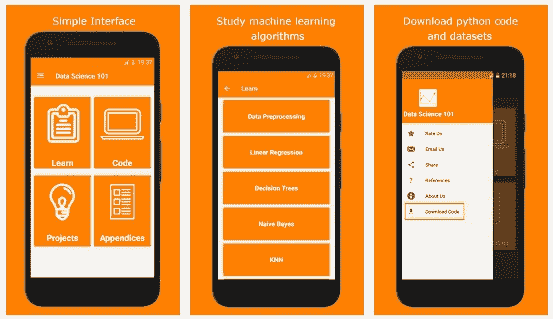
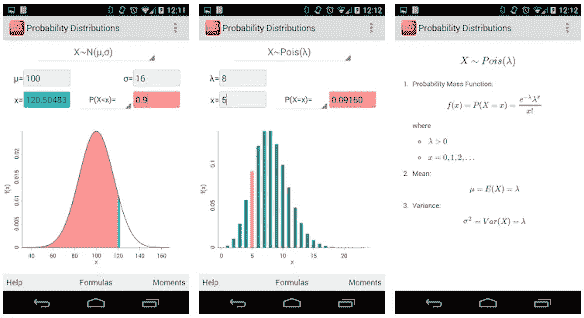

# 学习数据科学的最佳应用

> 原文：<https://towardsdatascience.com/best-apps-to-learn-data-science-in-2020-52c480cda178?source=collection_archive---------9----------------------->

## 这些应用程序可以很容易地集成到你的学习过程中，以帮助巩固概念，保持你的大脑敏锐！

由 [Unsplash](https://unsplash.com?utm_source=medium&utm_medium=referral) 上的 [Becca Tapert](https://unsplash.com/@beccatapert?utm_source=medium&utm_medium=referral) 拍摄的照片

如今，每个人和他们的母亲都开始意识到**数据科学将在我们的社会中扮演的关键角色**。我一直在这个领域工作，因为“商业智能”是一个描述数据透视表的花哨术语，所以我看到了从 BI 到大数据、数据科学、机器学习和神经网络等的演变。我记得在 Coursera 上学习大数据课程时，我感到完全迷失了，我还记得那些不眠之夜，我试图配置一个虚拟机，这样我就可以...Hadoop 的一些东西。但本文并非传记，言归正传！

如今的在线资源量简直*可笑*。要学的东西太多，要尝试的课程太多。阅读 Medium 上的某些主题，似乎每个人都是有抱负的数据科学家或深度学习博士。别误会，我觉得这种热情很棒。但是对于进入这个领域的新人来说，试图找出从哪里开始，或者如何保持专注可能是压倒性的，甚至是令人沮丧的。

> 就我个人而言，我意识到比我选择哪门课程更重要的是，当我提出自己的学习框架时，我学得更快，也更有动力

我不认为有一个单一的步伐或框架适合所有人，因此我不会浪费你的时间——也不会浪费我的时间——来详细解释我的旅程。但一如既往，如果你想了解更多，可以在下面留下评论。

我想与你分享的部分过程是关于**保持你的大脑敏锐并准备好处理任何数据科学任务**，即使你不坐在电脑前。

现在，这些应用程序*本身*不会神奇地将你转变为数据科学家。希望明确这不是重点！这里的目标是用你的手机巩固你在其他地方学到的东西，并保持你的分析能力。默认情况下，我会寻找那些旨在交付简短、简单和清晰任务的应用。理想情况下，你应该可以在上下班的时候使用它们，在排队等东西的时候，在午休的时候，你会有这样的想法…

> 我还尝试为每一个添加了一个短视频，这样你就可以在决定安装它们之前很容易地检查它们。

# 1.数据营

如果你在搜索关于数据科学的在线资源时，从未见过 [Datacamp](https://play.google.com/store/apps/details?id=com.datacamp&hl=en_IN) ，那你的浏览器一定有问题！Datacamp 是一个拥有数百门课程的惊人平台。从电子表格到 SQL、Python、R，甚至 Git。

一年多以前，Datacamp 是我开始 Python 之旅的地方，我看到他们的订阅价格上涨了，因为他们增加了几十门新课程，并完善了社区论坛体验。**你不会学不完**的东西，这是肯定的！

关于应用程序，它是为初学者和高级用户设计的，让你练习你已经完成的每门课程的特定部分。这是一个很好的方法来复习简短的片段，巩固你所学的知识。

我主要用它来做可以在电话上轻松完成的**小练习**，但是有很多东西你可以探索。我找不到专门针对这款应用的视频，但这里有一个视频很好地概述了它们提供的功能。这是一个商业帐户，但工具大多与个人订阅相同。你随时可以拿给你的老板看，说服他/她给你的团队买一个企业账户！

# 2.举起

很简单:Elevate 被设计成你大脑的私人教练**。每天，该应用程序将根据你之前的表现向你展示 3 个挑战，它们专注于提高处理速度、注意力、记忆力、口语(是的，口语！)，逻辑等。**

考虑到分析和沟通技能对数据科学家的重要性，这是一个很好的培训工具。在切换到 Lumosity 之前，我使用了 Elevate 一段时间(前面有更多关于 Lumosity 的内容)，最近当我写这篇文章时，我又安装了它。

我猜免费版可以提供更多的种类，但至少你可以在订阅前知道他们提供什么样的锻炼。

 [## 阅读法比奥·内维斯(以及媒体上成千上万的其他作家)的每一个故事

### 作为一个媒体会员，你的会员费的一部分会给你阅读的作家，你可以完全接触到每一个故事…

medium.com](https://medium.com/@fneves/membership) 

# 3.发光度

这是我最近才发现的一款应用，尽管它是最受推荐的应用之一，拥有数百万用户。我认为 [Lumosity](https://play.google.com/store/apps/details?id=com.lumoslabs.lumosity) 是 Elevate 的替代品，但它们并不完全相同。

声明和应用程序结构都类似于 Elevate。一个个性化的大脑教练，免费版每天为你提供 3 个挑战。我确实觉得 Lumosity 练习更有挑战性，更有趣，而且肯定更容易上瘾。

现在我想起来，我确实使用 Elevate 有一段时间了，所以可能我只是很高兴看到一些新的练习！

如上所述，该应用程序提供免费版本或 14 天的订阅试用。如果你正在寻找一种大脑兴奋剂，我建议你试一试。

> 我省略了 NeuroNation，因为免费版本非常有限，但他们声称它可以改变你的生活，他们的网站上有很多**科学标识**。像那样大胆的声明总是让我怀疑，所以也许下次…

接下来，**统计**应用。

# 4.数据科学基础课程

[数据科学 101](https://play.google.com/store/apps/details?id=com.successcrazzy.datascience101&hl=en) 顾名思义，是一款教育类 app，可以帮助用户了解机器学习、分类模型等数据科学主题。

它主要是一个面向初学者的应用程序，但任何需要高质量资源来研究该领域并了解不同 ML 算法(如回归、K-最近邻、支持向量网络(SVM)等)的内部工作原理的人都可以使用。

最棒的是，它不仅充当了一个备忘单，而且它还有一些准备使用的代码片段**。**

它又轻又简单。试一试，看看对你有没有用！

# 5.基本统计

如果我们要在这个数据驱动的时代生存下去，我们都需要一些基本的统计学知识。[基础统计](https://play.google.com/store/apps/details?id=com.techtweets.basicstatistics&hl=en_IN)可以帮你**刷新概念**我们大多数人都忘记了高中和大学之间的某个时候。

基础统计学感觉就像是如果有人从我们统计学班最优秀的学生那里拿到笔记，汇编成一个超级简单的 app。

我相信你知道在你学习的时候这些笔记是多么的方便！

# 6.概率分布

[概率分布](https://play.google.com/store/apps/details?id=com.mbognar.probdist&hl=en_IN)是对之前应用的一个很好的补充*。在这里你可以在手机上绘制和可视化各种概率分布。老实说，你可能想跳过这一条，直到你对统计学有所了解。*

它绝对不是一个可以一直带在身边的应用，但当你在酒吧和你的书呆子朋友争论概率时，它是一个很好的工具。是的，书呆子也去酒吧！

接下来，我们继续进行**编程**。

# 7.编程中心

[编程中心](https://play.google.com/store/apps/details?id=com.freeit.java&hl=en_IN)就像是编码应用的圣杯。里面有各种各样的编程语言，而且运行得非常好。它包含的语言有 HTML，Javascript，C，C++，C#，Swift，Python，R 编程，Java，CSS。他们还收集了数千个代码示例，您可以将它们移植到您的计算机上。

这不是一个深入的审查，所以我会保持简短。我喜欢**互动**的体验，以及**快速**编译代码的方式。当然，如果你想要完整的体验，你需要付费订阅，但是你仍然可以用免费版做很多事情。

开发者也要吃饭吧？

如果你只是测试选择哪种语言，这可能是开始你的编码之旅的好方法。

# 8.量子 Python

如果没有专门的 **Python** 资源，这篇文章是不完整的！如果你读过我以前的任何一篇文章，你就会知道我在项目中主要使用 Python。除非你在过去的两三年里一直生活在岩石下，否则你会知道 Python 是最好的通用语言之一。包括数据科学项目。

QPython 至少有两个版本，一个面向初学者，一个面向高级用户(还有一些技术特性)。应用程序的名字一开始可能会令人困惑，但如果你刚刚开始使用，请使用 [QPython Ox](https://play.google.com/store/apps/details?id=org.qpython.qpy&hl=en_IN) 。对于更高级的用户，使用 [QPython 3x](https://play.google.com/store/apps/details?id=org.qpython.qpy3&hl=en_IN) 应用程序。 ***但是请阅读他们在应用商店*** *的描述，这样你就完全知道你在安装什么*。他们非常清楚不同应用版本的含义。

不幸的是，我相信该应用程序只适用于 Android 用户，但它的功能包括一个 Python 解释器和编辑器，运行时环境，QPYI 和 SL4A 库。它也兼容 Python 2.7。

这不是一个短视频，但我发现开始使用该应用程序真的很有用。如果你对更高级的东西感兴趣，我建议检查这个频道，因为他有很多关于它的教程！

我知道在 Medium 上有大量的“最佳 X 对 Y”的文章，但我试图保持简短，就像我刚开始时喜欢读的文章一样。

如果您刚刚接触数据科学，我希望这些链接对您有用，如果您想更进一步，请查看我的其他文章。我已经发布了几个项目，比如网络抓取教程，以[发展一个 Instagram 账户](/increase-your-instagram-followers-with-a-simple-python-bot-fde048dce20d)，以及[从 Kayak](/if-you-like-to-travel-let-python-help-you-scrape-the-best-fares-5a1f26213086) 获取航班价格，这里仅举几个例子。

*更新:*

我认为在这个列表中加入数据科学是公平的！我读了很多文章

*感谢您的阅读！一如既往，我欢迎反馈和建设性的批评。如果你想取得联系，可以在这里联系我****或者直接回复下面的文章。***