# 游览伊斯坦布尔的最佳去处

> 原文：<https://towardsdatascience.com/best-areas-to-stay-at-while-visiting-istanbul-4f02478e7e8?source=collection_archive---------34----------------------->

## 使用 K-means 聚类下一个目的地的区域

*这篇博文是 IBM 数据科学专业认证最终任务的一部分:“邻里之战”。*

[法提赫·于鲁尔](https://unsplash.com/@fatihyurur?utm_source=medium&utm_medium=referral)在 [Unsplash](https://unsplash.com?utm_source=medium&utm_medium=referral) 上的照片

和我的妻子一起，我们都是热情的旅行者。我们尽量不去城镇，我们已经一起去了五大洲的近 30 个国家。虽然我们喜欢旅行中的意外冒险，但我们喜欢在去任何地方之前做好准备。这就是为什么，对于我的 IBM 数据科学专业认证课程的顶点项目，我决定解决我们在准备即将到来的旅程时经常面临的问题。

当计划去一个新的地方旅行时，我们经常很难决定在旅行期间哪个地方最适合居住。一些主要问题是住宿费用和该地区的安全。此外，因为我们是游客，所以我们希望尽可能靠近旅游景点和推荐的餐馆。由于标准的数量，做出最佳选择可能不是那么简单。

在此，我将对去伊斯坦布尔旅行时需要考虑的不同标准进行分析。在此分析的基础上，对其区域进行分类，以表明最适宜居住的区域。

我们俩都没去过土耳其，它在我们的清单上已经有一段时间了。希望，当疫情平静下来，我们将最终有机会去那里，并使用这些发现为我们的准备工作。

正如简介中提到的，需要几个数据集来充分探索给定的问题。对于去伊斯坦布尔旅行的情况，使用了以下数据集:

*   伊斯坦布尔各区列表，包括简单的统计数据，如人口、面积和人口密度

 [## 伊斯坦布尔地区列表

### 从维基百科，免费的百科全书跳转到导航跳转到搜索这是一个列表，伊斯坦布尔的区在…

en.wikipedia.org](https://en.wikipedia.org/wiki/List_of_districts_of_Istanbul) 

*   伊斯坦布尔各区边界的地理空间数据，用于可视化，从

 [## GADM

### GADM 为所有国家和地区提供地图和空间数据。您可以浏览我们的地图或下载数据来制作您自己的地图。

gadm.org](https://gadm.org/) 

*   伊斯坦布尔各区的平均租金价格。由于缺乏短期住宿价格的免费 API 或数据集，如酒店、招待所或 Airbnb，因此假设每个地区的公寓租金价格与短期住宿价格正相关。

 [## 伊斯坦布尔的平均租金价格为 1486 土耳其里拉

### 2019 年第三季度房租指数数据显示，伊斯坦布尔房租指数下降 2.25 点……

www.realtygroup.com.tr](https://www.realtygroup.com.tr/average-rent-price-in-istanbul-is-1486-tl/) 

*   每个区报告的犯罪数量。犯罪数据用于计算每个街区的犯罪指数，基于犯罪数量、人口并根据犯罪的严重性进行加权。在方法部分有更多描述。

> 北卡罗来纳州埃尔贡和佛罗里达州耶尔米贝索卢(2007 年)。伊斯坦布尔不同地区的犯罪率分布。土耳其研究，8(3)，435-455 页。土井:10.1468868686867

*   从 [Triposo API](https://www.triposo.com/api/) 获取伊斯坦布尔的热门景点及其分数和位置坐标。该数据用于计算地区吸引力得分，基于地区到吸引力的距离，并通过其得分的倒数进行加权。
*   从 [Triposo API](https://www.triposo.com/api/) 获取伊斯坦布尔顶级餐馆及其得分和位置坐标。该数据用于计算地区食品得分，基于地区到餐馆的距离，并根据得分的倒数进行加权。

在为了确定最佳停留区域，使用了 K-means 聚类方法。K-means 方法基于提供的特征将未标记的可观察对象(区域)划分成给定数量的簇，使得每个可观察对象被分配到具有最近中心的簇中。这种方法非常适合给定的问题，即根据相似性对地区进行分组。

为此，需要将收集的数据转化为有用的见解。

*   使用的第一个功能是**住宿价格**。因为找到的数据代表每个地区的平均租金价格，所以没有必要对现有的数据集进行额外的修改。
*   用于分类的另一个特征是**犯罪指数**，它量化了该地区的安全性。它的计算是基于加拿大国家统计局描述的 T2 犯罪严重指数 T3。它考虑到每种犯罪的危险程度。“严重性权重”来自法院对所犯罪行类型的判决(监禁率和刑期)。罪行越严重，它所获得的“严重性权重”就越高。在这里，使用了加拿大中针对犯罪类型给出的[权重。为了更容易，犯罪指数被归一化，其中最危险的地区获得*犯罪指数* =100，而*犯罪指数* = 0 将表示没有犯罪。犯罪指数的计算方法是将某一类犯罪的报案数量考虑在内，用该犯罪的“严重性权重”进行加权，将所有犯罪类型相加，然后除以该地区的人口:](https://www150.statcan.gc.ca/n1/pub/85-004-x/2009001/t001-eng.htm)

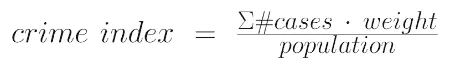

*   接下来使用的两个特征是**地区-景点**和**地区-美食**分数。他们分别根据到顶级景点和餐馆的距离，量化该地区的位置有多好。为了得到这些，哈弗辛公式被用来计算地区中心到每个位置的距离。哈弗辛公式计算两点之间的距离，假设地球是完美的球形。此外，计算的距离由在 [Triposo](https://www.triposo.com/api/) 上获得的位置分数的倒数加权。这种方式反映了即使给定的地点位于更远的地方，但是如果它具有更好的评级，它仍然会被选择访问更近的具有更低评级的地方。随后对每个地区到所有景点和餐馆的加权距离进行平均，以分别获得距离-景点和距离-食物得分。由于所描述的分数反映了距离和评级的倒数，分数较低的地区被认为更适合游客居住。哈弗辛公式，其中ϕ是纬度， *λ* 是经度， *R* 是地球半径:

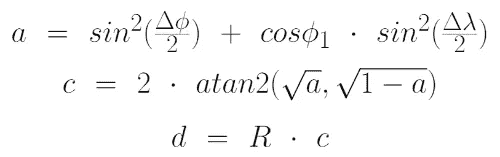

在调查收集的数据时，注意到所使用的犯罪统计数据集缺少一些地区的值。因此，在进入拟合过程之前，必须进行数据插补，以便能够将所有地区纳入分类。为了不偏不倚地对待有缺失数据的区，任何缺失值都将替换为有犯罪统计数据的区的平均犯罪指数。

在进行分类之前，使用 scikit-learn 的 StandardScaler 对所有特征进行标准化。这是为了确保所有特征对拟合过程具有相同的影响。

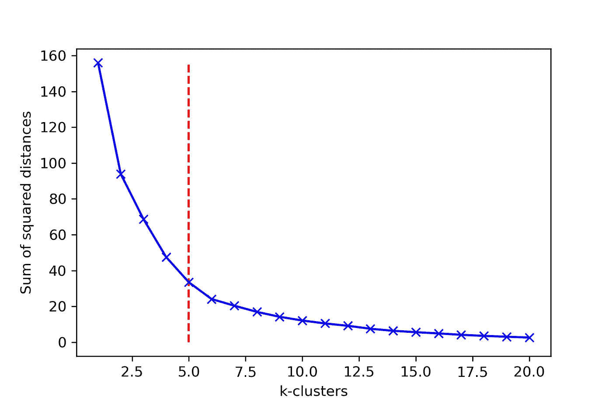

**图一**。确定用于 K-均值聚类的聚类数的肘方法。红色虚线显示选择的集群数量。

肘形法用于确定各区应划分的聚类数。为此，对记录相关误差的一系列聚类数进行 K-均值拟合。当然，选择的 k-聚类越多，获得的拟合误差越低。然而，为了避免过度拟合，必须在聚类数量和误差之间进行权衡。如图 1 所示，在 5–6 以上增加更多的聚类不会显著减少误差。因此，对于该分析，选择了 5 个 k-簇。

如前所述，伊斯坦堡的 39 个区被分为 5 个集群。在所有地区中，19 个被分配到群组 0，10 个被分配到群组 1，4 个被分配到群组 2，3 个被分配到群组 3，3 个被分配到群组 4。为了确定哪个聚类包含最适合居住的地区，根据给定聚类中地区的每个要素的平均值对聚类进行评级，如表 1 所示。正如方法一节所述，每个特性的设计都是为了使特性值最低的地区更适合居住(即较低的租金、较低的犯罪率、到最佳评级场所的较短距离)。因此，表 1 中的聚类 0 被认为包含最适合居住的地区，因为它在租金价格方面排名第三，在犯罪指数方面排名第一，在地区景点得分方面排名第一，在地区美食得分方面排名第一，加起来为 3+1+1+1=6，是所有聚类中最低的。

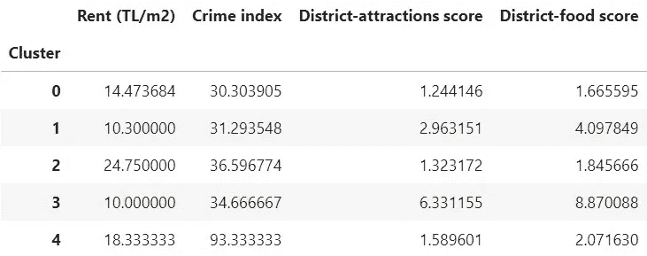

**表 1。**并列排列每个聚类的平均要素，从最适合居住的区域聚类到最不适合居住的区域聚类进行排序。

图 2 显示了显示所获得的聚类的每个特征的基本统计信息的箱线图。

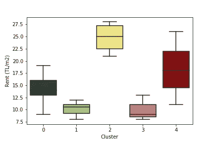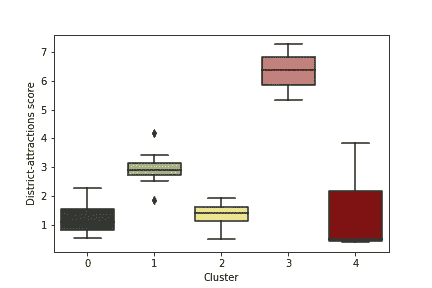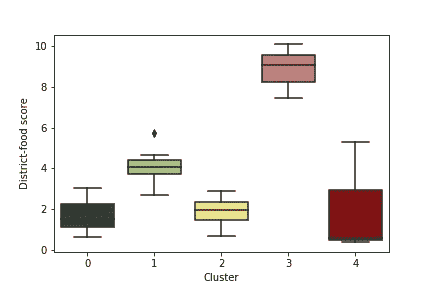

***图二。*** *箱线图显示每个考虑特征的聚类统计。左上角:平均租金价格；右上:犯罪指数；左下:地区吸引力得分；右下:地区食物得分。*

为了在空间上可视化与伊斯坦布尔市相关的分析和统计数据，收集的信息叠加在一些地图上。图 3 显示了各区的分类，图 4 显示了前 100 家餐馆和观光地的位置，图 5 显示了每平方米的平均租金价格，图 6 显示了计算的犯罪指数。叠加在交互式地图上的所有收集的统计数据可在以下位置查看:

[https://nb viewer . jupyter . org/github/nowacowski/Coursera _ Capstone/blob/master/伊斯坦布尔/伊斯坦布尔 _ 地图. html](https://nbviewer.jupyter.org/github/nowacowski/Coursera_Capstone/blob/master/Istanbul/istanbul_map.html)

将箱线图与相关地图进行比较，可以对确定的聚类得出一些结论。

*   **最佳居住区，被归类为集群 0，位于严格的市中心之外。**
*   正如所料，租金价格最低的集群由距离市中心最远的区域组成。然而，租金最高的集群(明显高于其他集群，图 2 的左上图)不在严格的市中心，而是位于伊斯坦布尔欧洲和亚洲部分之间的欧洲海岸。
*   查看犯罪指数箱线图(图 2 右上图)，可以注意到第 4 类和其他类之间的显著差异。第 4 类区的平均犯罪指数是所有其他类区的 3 倍。集群 4 中的两个区位于严格的市中心，然而，第三个区位于远离市中心的地方。对犯罪统计数据的更好检查表明，位于中心的聚类 4 的区确实是犯罪数量最高的区之一，但是，其他区获得的高犯罪分数可能是由该区的低人口造成的。
*   聚类的地区吸引力和地区食物得分盒图似乎显示了几乎相同的统计数据(图 2 底部的图表)。研究图 4 上的地图，可以得出这样的结论，这是因为餐馆和观光地彼此非常接近。此外，因为所有排名靠前的地方都拥挤在市中心，所以计算出的分数高度依赖于各区离市中心的距离。

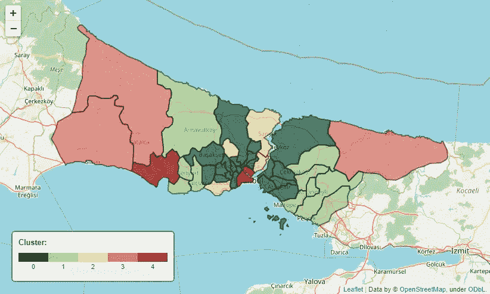

**图三。**伊斯坦布尔地图，根据指定的聚类划分为不同颜色的区域。

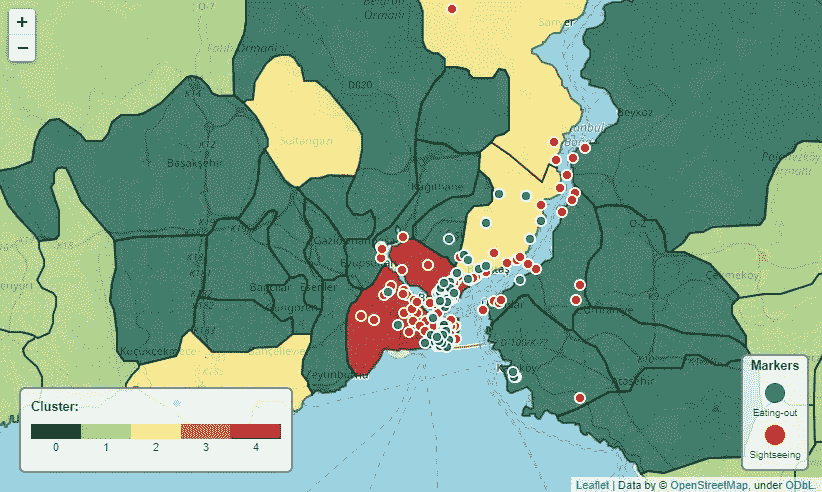

**图 4。**伊斯坦布尔的特写地图，根据所分配的区域划分成不同的区域，标记出前 100 个外出就餐(蓝点)和观光(红点)的地方。

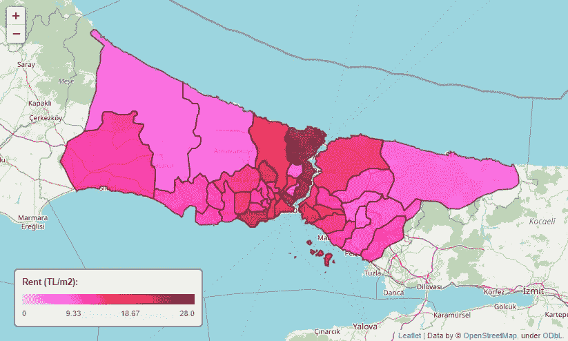

**图五。根据图例上显示的每平方米平均租金来划分区域的伊斯坦布尔地图。**

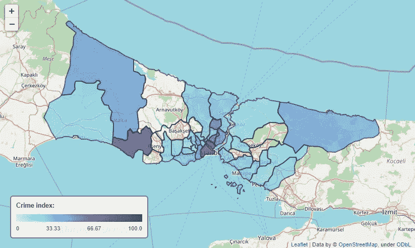

**图 6。**伊斯坦布尔地图，根据计算出的犯罪指数着色，如图例所示。未着色区对应于没有犯罪统计数据的区。

通过实施 K-means 算法，伊斯坦堡的 39 个区根据价格、安全以及与最佳餐馆和观光地的距离被分为 5 组。通过对获得的结果进行排序，可以推断出伊斯坦布尔最佳和最差的住宿区。

最适合居住的是位于市中心外围的地区，而由于高物价和高犯罪率，最差的是位于市中心的地区。

虽然最终结果似乎与通常的观点一致，即最好靠近中心而不是在中心本身，但是所执行的分析仍然可以改进。使用的犯罪统计数据来自 10 多年前。在此期间，很多事情可能会发生变化，因此，使用更新的数据会更有好处。对于住宿价格，使用了长期租金价格，而不是每晚的酒店价格。虽然假设两者是相关的，但是如果没有这两个数据，就不能完全确定。至于地区吸引力和地区食物得分，使用直线距离。相反，通勤时间会更好，区分难以到达的区域，例如位于岛屿上的区域。

Jupyter 笔记本包含创建本报告的逐步流程，可在以下位置查看:

[https://nb viewer . jupyter . org/github/nowacowski/Coursera _ Capstone/blob/master/伊斯坦布尔/伊斯坦布尔 _ 旅行. ipynb](https://nbviewer.jupyter.org/github/nowacowski/Coursera_Capstone/blob/master/Istanbul/Istanbul_travel.ipynb)