# 最佳人工智能读物

> 原文：<https://towardsdatascience.com/best-artificial-intelligence-books-to-read-30d19ece0799?source=collection_archive---------9----------------------->

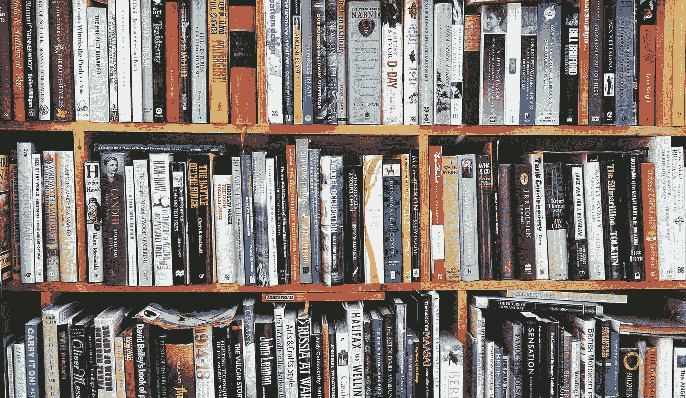

图片来自 [stocksnap.io](https://stocksnap.io/photo/GTWPBBTRRN)

# 人工智能和机器学习非小说类书籍的终极清单

在这个列表中，我试图收集关于人工智能、机器学习和机器人的 10 本最重要和最受欢迎的书籍。我花了一年的时间阅读每一本书，我完全推荐所有的书(好吧，也许有些比其他的更多)。这本集子很好地脱离了所有的技术内容，所以不要期望找到充满数学和算法的技术书籍。

相反，只有从哲学或商业角度分析人工智能的非虚构书籍。在我看来，每个机器学习工程师，对机器学习感兴趣的程序员，希望将 AI 应用到业务中的专业人士都应该至少阅读其中两本。如果我告诉你[这个星球上的每个人](https://data-flair.training/blogs/why-learn-ai/)都应该读一本，不要惊讶。

[人工智能](https://www.businessinsider.com/artificial-intelligence?r=US&IR=T)已经慢慢证明自己是未来所有技术进步的主要力量，预计将在塑造我们的日常生活方面发挥重要作用，超出我们大多数人的想象。

让我们开始吧:

# [德乌斯人:明日简史](https://amzn.to/2uOCCyZ)

[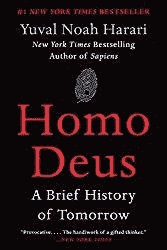](https://www.amazon.com/gp/product/0062464345/ref=as_li_tl?ie=UTF8&camp=1789&creative=9325&creativeASIN=0062464345&linkCode=as2&tag=theaisummer-20&linkId=b23c9a2349b510f2a2551824e25bc421)

畅销书《智人》(Sapiens)描述了人类从类人猿到超级智能生物的进化过程，在出版后，Yuav Noah Harari(历史学家、哲学家和耶路撒冷大学历史系教授)继续他对未来的探索。

在他的书《德乌斯人》中，他认为人类会更加努力地去获得完全的幸福、不朽和上帝般的力量，这可能会导致各种各样的未来。人类会对机器失去控制吗？这个人会被当作神来崇拜吗？但整本书的主要思想是，它将以将我们的智力从情感中分离出来而告终。哈拉里深入研究哲学问题，如意识、人类情感、个人主义，所以如果你想进行一些哲学上的提问和思考，请务必阅读这本书。

# [奇点临近:当人类超越生物学](https://amzn.to/39FbMs0)

[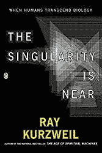](https://www.amazon.com/gp/product/0143037889/ref=as_li_tl?ie=UTF8&camp=1789&creative=9325&creativeASIN=0143037889&linkCode=as2&tag=theaisummer-20&linkId=85ea2b7a803def6ad6a268dd3d53151c)

雷·库兹韦尔(Ray Kurzweil)是一位发明家和未来学家，迄今为止已经写了 5 本畅销书，并通过他的书《奇点临近》(The Singularity is Near)对普及术语“技术奇点”负有部分责任。这本书侧重于人工智能的一个更具技术性的方面，而不是哲学的观点，并分析了智能机器人在人类生活中的社会学影响。它还介绍了与机器融合的可能性，并作为一个控制论的存在活着，像一个半机械人(做一个太空堡垒卡拉狄加参考，抱歉我控制不住自己)。

正如比尔·盖茨所说:“在预测人工智能的未来方面，雷·库兹韦尔是我所知道的最好的人。他引人入胜的新书设想了一个未来，在这个未来，信息技术发展如此之快，以至于人类能够超越其生物学限制——以我们还无法想象的方式改变我们的生活。”

# [超级智能:路径、危险、策略](https://amzn.to/3bHu11O)

[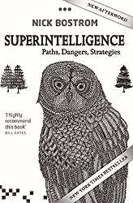](https://www.amazon.com/gp/product/0198739834/ref=as_li_tl?ie=UTF8&camp=1789&creative=9325&creativeASIN=0198739834&linkCode=as2&tag=theaisummer-20&linkId=0116f5bba8c458b914a120c272dc8be2)

尼克·博斯特伦教授的《超级智能》是一本关于人工智能安全的书。博斯特罗姆想象我们如何能够创造一个远超我们想象的人工智能，以及它会带来什么风险。他想到了事情如何出错的例子，以及超级智能是否能取代我们成为地球上的主导生命形式。

有一件事让我印象深刻，那就是人类和大猩猩的并行性。如果大猩猩的命运更多地取决于人类而不是它们自己，这是否意味着人类的命运将更多地取决于人工智能而不是我们的物种？另一本关于人工智能的伟大哲学著作，它提出的问题比它回答的问题还多(这是应该的)

# [生活 3.0:成为人工智能时代的人类](https://amzn.to/39Gc3dU)

[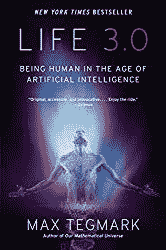](https://www.amazon.com/gp/product/1101970316/ref=as_li_tl?ie=UTF8&camp=1789&creative=9325&creativeASIN=1101970316&linkCode=as2&tag=theaisummer-20&linkId=ba4d72ff70579fdc77bff135ef4069ff)

宇宙学家、麻省理工学院教授马克斯·泰格马克的《生命 3.0》。生命 1.0 来自生物进化，生命 2.0 来自文化进化，生命 3.0 来自技术进化。它再次描述了事情是如何变糟的。但它通过使用真实生活元素的实际例子来做到这一点，并提出具体的行动来防止它们。

听听这个:一家名为 Omega 的公司使用一个名为 Prometheus 的超级智能人工智能代理接管了世界，该代理能够开发突破性系统，优化管理全球资源，甚至创造其他机器。所有这些都是在没有人意识到人工智能在背后支持的情况下实现的。这本书就是这样开始的。你觉得这听起来合理吗？对我来说的确如此。

# [人工智能超级大国:中国、硅谷和新世界秩序](https://amzn.to/2SxdLsp)

[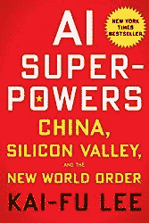](https://www.amazon.com/gp/product/132854639X/ref=as_li_tl?ie=UTF8&camp=1789&creative=9325&creativeASIN=132854639X&linkCode=as2&tag=theaisummer-20&linkId=34b2ca936e196c8f7c19db15066a05af)

李开复(他开发了世界上第一个非特定人语音识别系统，并在谷歌、苹果和微软担任高管职位)认为，人工智能带来的巨大变化可能比我们预期的要早得多，并探讨了中国未来的影响。按照他的说法:“如果数据是新的石油，那么中国就是新的沙特阿拉伯”。也许未来终究不是西方的。

他专注于人工智能导致的全球失业问题，并清晰地描述了哪些工作将受到影响，多快以及我们如何提供解决方案。他的书最好的一点是，它不会进入模糊的世界末日预测，而是根据真实世界的数据和他在该领域的经验形成有根据的猜测。

# [生活分析:理解人工智能、机器学习和数据分析](https://amzn.to/31ZuI1P)

[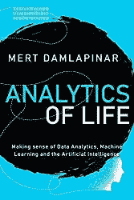](https://www.amazon.com/gp/product/B082LRXNF5/ref=as_li_tl?ie=UTF8&camp=1789&creative=9325&creativeASIN=B082LRXNF5&linkCode=as2&tag=theaisummer-20&linkId=ab57dca70b5f1401a0c2a6f7ba79b6ae)

梅尔特·达姆拉皮纳的《生活分析》是一本非常棒的书，适合想要了解人工智能和高级数据分析的商人、经理、营销人员和企业家。它首先解释了什么是机器学习和大数据，然后涵盖了医疗保健、营销、政府和自然领域的应用实例，解释了哪些工作将被取代，以及公司和初创公司如何应用人工智能来解决他们的用例。总结一下主要思想:AI 可以而且将会改造几乎每一个行业。如果你是专业人士，想要深入机器学习的世界，这是必须的

# [大师算法:对终极学习机的探索将如何重塑我们的世界](https://amzn.to/3bBJnEZ)

[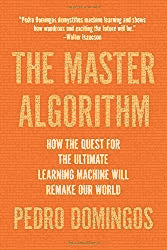](https://www.amazon.com/gp/product/0465094279/ref=as_li_tl?ie=UTF8&camp=1789&creative=9325&creativeASIN=0465094279&linkCode=as2&tag=theaisummer-20&linkId=f920c426c4179d75aaa2320def102631)

如果你想要机器学习的最佳高层次概述，只需看看佩德罗·多明戈斯(Pedro Domingos)的《大师算法》(Master Algorithm)就行了。多明戈斯设法在一本书里组织 ML 的整个领域并且包括从领域的历史到最新的突破的一切。

它通过将算法分为 5 个不同的思想流派，创建了该领域的概念模型。对于什么是最佳广义算法，每个学校都有自己的观点。然后，他更详细地介绍了它的学派和算法，最后，他提出，最终的主算法是所有这些算法的结合，我们会逐渐朝着这个目标前进。

# [如何创造思维:揭示人类思维的秘密](https://amzn.to/2OVftl5)

[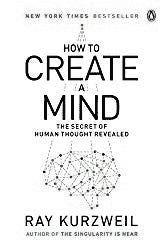](https://www.amazon.com/gp/product/0143124048/ref=as_li_tl?ie=UTF8&camp=1789&creative=9325&creativeASIN=0143124048&linkCode=as2&tag=theaisummer-20&linkId=803ad297fe930c284bb8d2adb81cbae3)

《如何创造思维》是雷·库兹韦尔的第二本书。这一次，他将对人工智能的探索推进了一步。创造人工大脑的最好方法是什么？答案是对我们自己的生物大脑进行逆向工程，准确理解它是如何工作的，然后应用这些积累的知识来创造智能机器。

受最新神经科学研究的启发，他描述了我们的大脑只不过是“模式识别器的自组织层次系统”，这些见解将使我们能够使用硅和编程来重建它。

# [我们最后的发明](https://amzn.to/2UUKNV9)

[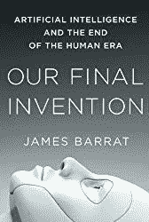](https://www.amazon.com/gp/product/1250058783/ref=as_li_tl?ie=UTF8&camp=1789&creative=9325&creativeASIN=1250058783&linkCode=as2&tag=theaisummer-20&linkId=917b4fc7d34c78c39067565be543f72f)

在这本书中，詹姆斯·巴拉特(国家地理、探索、公共广播公司等纪录片制作人)将人工智能描述为人类的最终发明。它清楚地暴露了普通人工智能可能带来的风险，它表明超级智能不一定意味着仁慈，它总结了过去几年对潜在人工智能线程的研究。这是通过广泛的研究和对该领域的人的详细采访得出的结论。

我们最后的发明可能有一点悲观的基调，它可能会让你感到绝望，但这就是为什么它是一本伟大的书。它迫使你思考我们的未来，试图找到新的方法来阻止这一切的发生。最佳的社会意识。

# [人+机器:重新想象人工智能时代的工作](https://amzn.to/2vCoysm)

[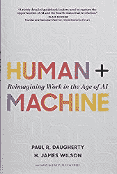](https://www.amazon.com/gp/product/1633693864/ref=as_li_tl?ie=UTF8&camp=1789&creative=9325&creativeASIN=1633693864&linkCode=as2&tag=theaisummer-20&linkId=214faa69b5007a84cd241525d29bd234)

埃森哲的领导者保罗·r·多赫蒂和 h·詹姆士·威尔森用他们的经验揭示了公司如何使用人工智能来推动创新和提高盈利能力，以及人工智能如何明确地改变所有业务流程，从客户服务和新发明到生产力和工作场所文化。我喜欢将它描述为一本剧本，供其他商业领袖理解人工智能将对他们的公司产生的积极影响，以及教育和培训的必要性，以防止造成的破坏。

【https://theaisummer.com】原载于 2020 年 2 月 15 日**。**