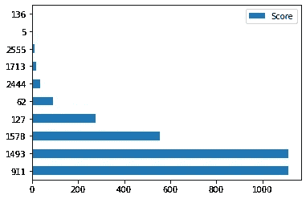
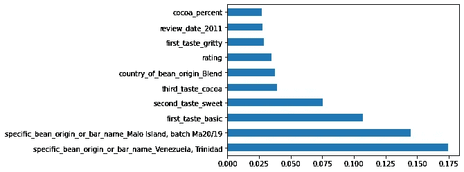
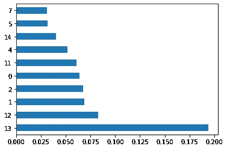
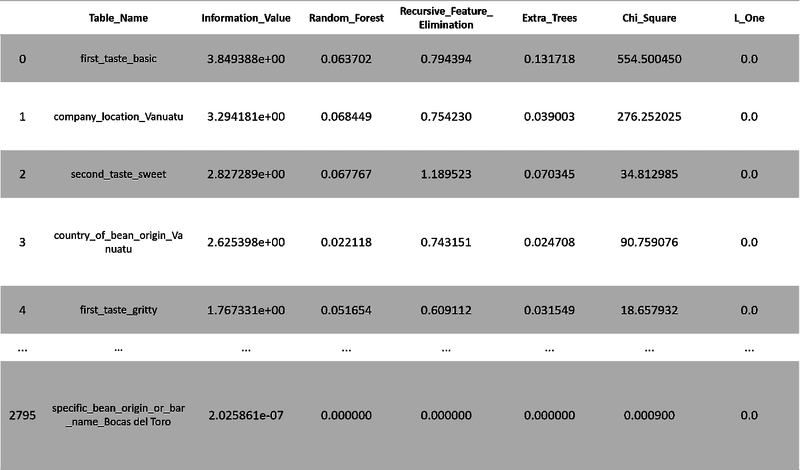

# 每个数据科学家都应该知道的最佳防弹 Python 要素选择方法

> 原文：<https://towardsdatascience.com/best-bulletproof-python-feature-selection-methods-every-data-scientist-should-know-7c1027a833c6?source=collection_archive---------22----------------------->

## 用几行代码实现 5 种最佳特征选择方法


亚历山大·科特利亚尔在 [Unsplash](https://unsplash.com/s/photos/hd-neon--free-candies?utm_source=unsplash&utm_medium=referral&utm_content=creditCopyText) 上的照片

在大多数数据科学项目中，特性选择是探索性数据分析之后的第二个自然步骤。该过程包括选择正确的特征以获得最佳预测。易于使用的特征选择方法通常包括 SelectFromModel、带有递归特征消除的特征排序、基于过滤器的单变量选择、特征重要性、投票选择器。要成为独角兽数据科学家，掌握最新的特征选择方法是一项必备技能。在本文中，我们将回顾 Kaggle winners 的特征选择方法，这些方法可以用简短的 python 代码实现。对于本文，我们将分析巧克力棒评级数据集样本，以“烟熏味”作为目标特征。

你可以在这里找到完整的数据集:。


照片由 [Maciej Gerszewski](https://unsplash.com/@shakalmag?utm_source=unsplash&utm_medium=referral&utm_content=creditCopyText) 在 [Unsplash](https://unsplash.com/s/photos/confectionery?utm_source=unsplash&utm_medium=referral&utm_content=creditCopyText) 上拍摄

一个具有挑战性的数据集，在分类编码后包含超过 2800 个特征。

1.  **从模型中选择**

这种方法基于使用算法(SVC，线性，套索..)只返回最相关的特征。

```
**#import libraries**
from sklearn.linear_model import LassoCV
from sklearn.feature_selection import SelectFromModel**#Fit the model** clf = LassoCV().fit(X, y)**#Selected features** importance = np.abs(clf.coef_)
idx_third = importance.argsort()[-3]
threshold = importance[idx_third] + 0.01
idx_features = (-importance).argsort()[:10]
name_features = np.array(feature_names)[idx_features]
print('Selected features: {}'.format(name_features))
```

**精选特色:**[' cocoa _ percent ' ' first _ taste _ 辛辣葡萄干' ' first _ taste _ pure ' ' first _ taste _ 葡萄干' ' first _ taste _ 葡萄干' ' first _ taste _ 覆盆子' ' first _ taste _ raw ' ' first _ taste _ 红莓' ' first _ taste _ 红果'，' first _ taste _ 红酒']


照片由[德鲁·比默](https://unsplash.com/@drew_beamer?utm_source=unsplash&utm_medium=referral&utm_content=creditCopyText)在 [Unsplash](https://unsplash.com/s/photos/hd-red-neon?utm_source=unsplash&utm_medium=referral&utm_content=creditCopyText) 上拍摄

2.**递归特征消除的特征排序**

递归特征消除(RFE)方法将权重(系数或特征重要性)分配给递归提取数量减少的特征的特征。重复该循环，直到达到最佳特征数量。

```
**#import libraries** from sklearn.svm import SVC
from sklearn.model_selection import StratifiedKFold
from sklearn.feature_selection import RFECV
import matplotlib.pyplot as plt**#Fit the model** svc = SVC(kernel="linear")
rfecv = RFECV(estimator=svc, step=1, cv=StratifiedKFold(2), scoring='accuracy')
rfecv.fit(X, y)**#Selected features** print(X.columns[rfecv.get_support()])
print("Optimal number of features : %d" % rfecv.n_features_)
```

**精选特色:**[' specific _ bean _ origin _ or _ bar _ name _ Malo Island，batch Ma20/19 '，' specific _ bean _ origin _ or _ bar _ name _ Venezuela，Trinidad '，' second_taste_sweet']


由[安迪·HYD](https://unsplash.com/@andy_hyd?utm_source=unsplash&utm_medium=referral&utm_content=creditCopyText)在 [Unsplash](https://unsplash.com/s/photos/venezuela-cocoa?utm_source=unsplash&utm_medium=referral&utm_content=creditCopyText) 上拍摄的照片

**3。基于单变量选择的过滤器**

统计 scikit-learn library SelectKBest 获得最具影响力的功能。下面的代码使用相关/卡方统计测试来选择最佳特征

```
**#import libraries** from sklearn.feature_selection import SelectKBest
from sklearn.feature_selection import chi2
import matplotlib.pyplot as plt**#Fit the model** bestfeatures = SelectKBest(score_func=chi2, k=10)
fit = bestfeatures.fit(X,y)
dfscores = pd.DataFrame(fit.scores_)
dfcolumns = pd.DataFrame(X.columns)**#concatenate the two dataframes** featureScores = pd.concat([dfcolumns,dfscores],axis=1)
featureScores.columns = ['Specs','Score']**#print 10 best features** print(featureScores.nlargest(10,'Score').plot(kind='barh'))**#plot graph of feature importances** plt.show()**#Name selected features** X.iloc[:,62].name,X.iloc[:,127].name,X.iloc[:,1578].name,X.iloc[:,1493].name,X.iloc[:,911].name
```



使用选择最佳方法的 10 个最佳特性**(作者提供**图片)

**所选功能:**[' country _ of _ bean _ origin _ Vanuatu '，' company_location_Vanuatu '，' first_taste_basic '，' specific _ bean _ origin _ or _ bar _ name _ Venezuela，Trinidad '，' specific _ bean _ origin _ or _ bar _ name _ Malo Island，batch Ma20/19']


亚历山大·布朗迪诺在 [Unsplash](https://unsplash.com/s/photos/cacao?utm_source=unsplash&utm_medium=referral&utm_content=creditCopyText) 上拍摄的照片

**4。特征重要性**

该方法使用基于树的分类器对特征进行评分。分数越高，该特征对于预测我们的目标特征越重要。

```
**#import libraries** from sklearn.ensemble import ExtraTreesClassifier
import matplotlib.pyplot as plt**#Fit the model** model = ExtraTreesClassifier()
model.fit(X,y)
print(model.feature_importances_)**#plot graph of feature importances** feat_importances = pd.Series(model.feature_importances_, index=X.columns)
feat_importances.nlargest(10).plot(kind='barh')
plt.show()
```



巧克力数据集中的前 10 个特征**(作者提供的**图片)


Gabriel Santiago 在 Unsplash[上拍摄的照片](https://unsplash.com/s/photos/hd-neon-sweets?utm_source=unsplash&utm_medium=referral&utm_content=creditCopyText)

**5。使用 Xuniverse** 的投票选择器

该方法对每个算法的特征进行评分，以最小的努力选择最佳的算法。

```
**#import libraries** !pip install xverse
from xverse.ensemble import VotingSelector
import matplotlib.pyplot as plt**#Fit the model** clf = VotingSelector()
clf.fit(X, y)**#Selected features** clf.feature_importances_
print(clf.feature_importances_['Random_Forest'].nlargest(10).plot(kind='barh'))
plt.show()**#Name selected features** clf.feature_importances_['Variable_Name'][2],clf.feature_importances_['Variable_Name'][1],clf.feature_importances_['Variable_Name'][12],clf.feature_importances_['Variable_Name'][13]
```



使用随机森林模型的巧克力数据集中的前 10 个特征**(作者提供**图片)

**所选特征:** ['first_taste_basic '，' company_location_Vanuatu '，' rating '，' specific _ bean _ origin _ or _ bar _ name _ Malo Island，batch Ma20/19']

```
**#Selected features with 6 models** clf.feature_importances_
```



使用 6 个模型的巧克力数据集中的前 4 个特征**(作者的**图片)

更多详情，请点击 github.com 的[号](https://github.com/Sundar0989/XuniVerse/blob/master/Xverse.ipynb)


照片由[本杰明·戴维斯](https://unsplash.com/@bendavisual?utm_source=unsplash&utm_medium=referral&utm_content=creditCopyText)在 [Unsplash](https://unsplash.com/s/photos/universe?utm_source=unsplash&utm_medium=referral&utm_content=creditCopyText) 上拍摄

如果你有空闲时间，我建议你看看这个:

[](https://medium.com/@adityaguptai/all-about-feature-selection-f98bf5b1201c) [## 关于特征选择的一切

### 1.什么是特征选择？

medium.com](https://medium.com/@adityaguptai/all-about-feature-selection-f98bf5b1201c) 

**总结一下**

参考此链接[木质巧克力](https://www.kaggle.com/philboaz/chocolate-features-selection-2020?scriptVersionId=39418633)了解巧克力棒功能的完整选择。这一简要概述提醒我们在数据科学中使用多种特征选择方法的重要性。这篇文章涵盖了提取最佳特性的 5 种基本 python 特性选择方法，并分享了有用的文档。

**希望你喜欢，继续探索！**