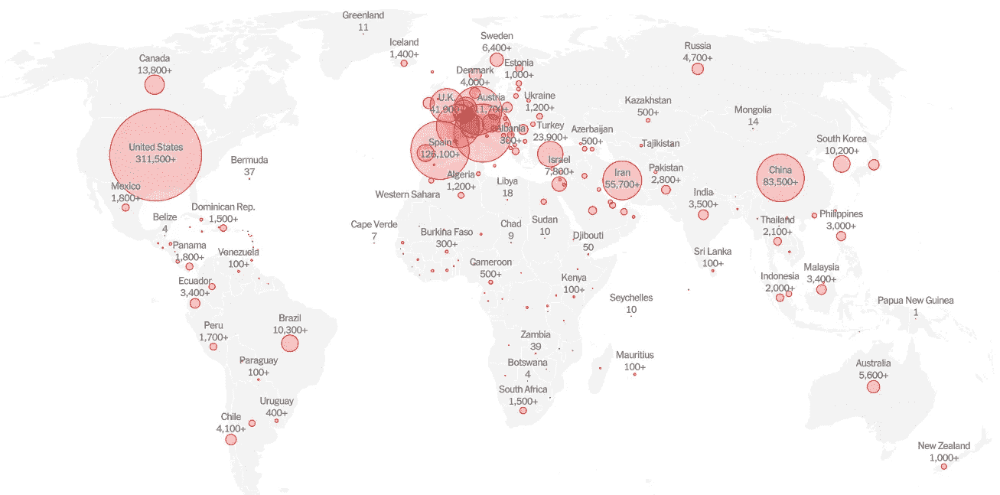
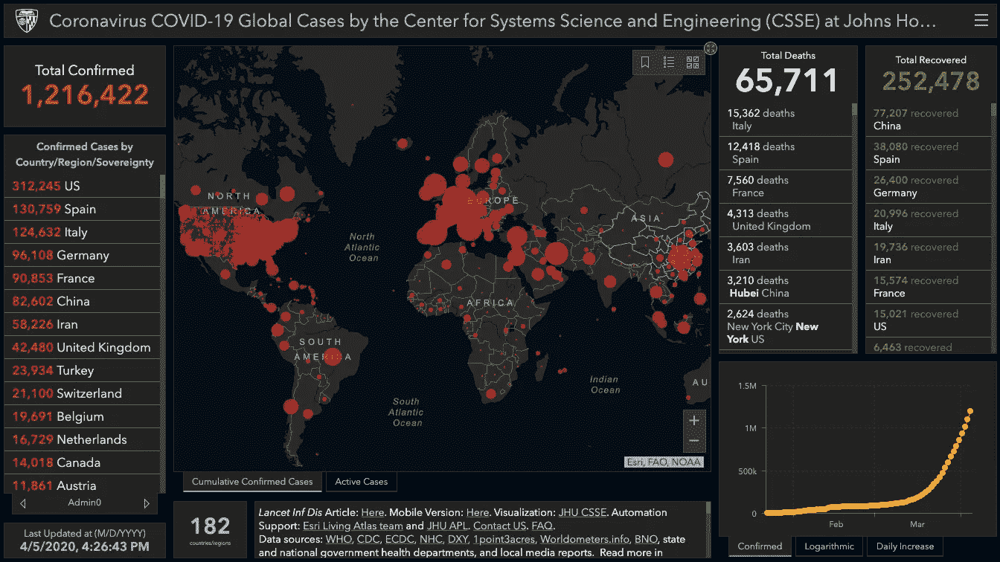
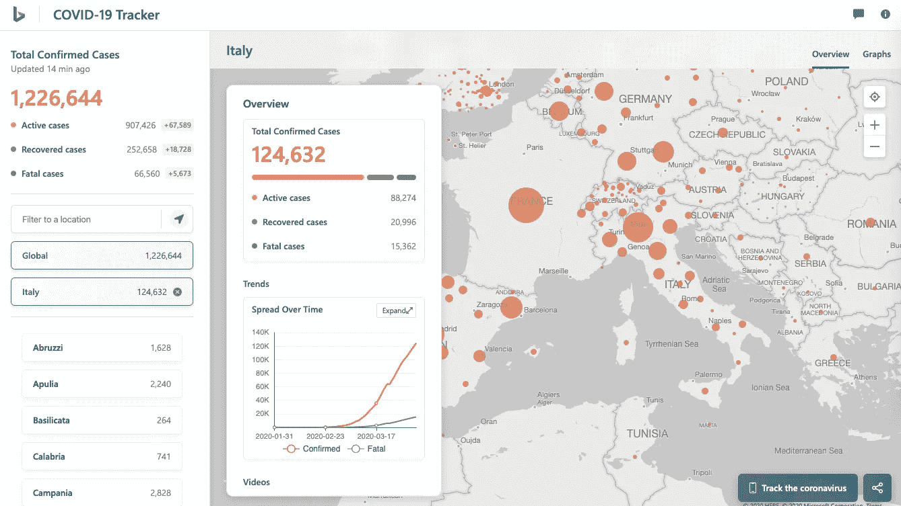
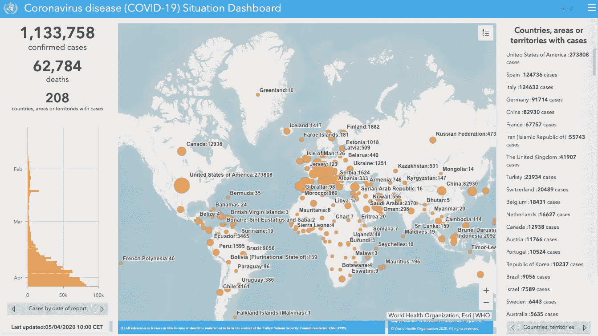
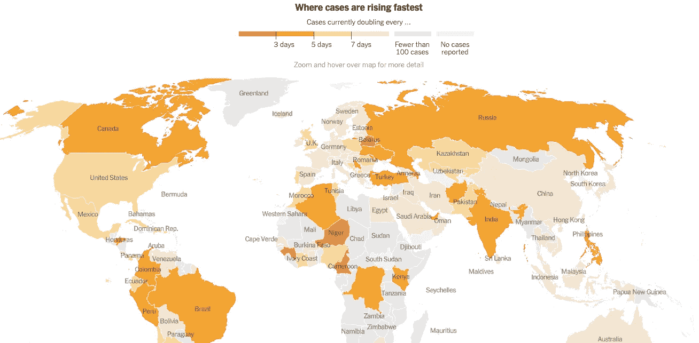

# 追踪冠状病毒的最佳仪表板

> 原文：<https://towardsdatascience.com/best-dashboards-to-track-coronavirus-7ac4b8b79445?source=collection_archive---------48----------------------->

## 要关注的区域和前 5 大全球仪表板列表

冠状病毒的传播带来了与之相关的各种数据的传播。海量数据催生了多个仪表盘，帮助总结可用信息，并以视觉上吸引人的方式呈现出来。以下是一些最好的在线仪表板，帮助您在全球范围内跟踪冠状病毒。

# 第一名——约翰·霍普斯金大学

由约翰·霍普斯金大学系统科学与工程中心(CSSE)开发，这是目前访问量最大的[仪表盘](https://www.arcgis.com/apps/opsdashboard/index.html#/bda7594740fd40299423467b48e9ecf6)。其背后的 JHU 团队从世卫组织和多个国家卫生部门收集数据。数据每天更新多次，每日快照上传到他们的 [GitHub 库](https://github.com/CSSEGISandData/COVID-19)供公众使用。

**链接** : [此处](https://www.arcgis.com/apps/opsdashboard/index.html#/bda7594740fd40299423467b48e9ecf6)
**优点**:全球数据的主要来源，有时更新速度比每日世卫组织局势报告还快。
**缺点**:在灰暗的黑色背景上使用吓人的红色。只需一个时间序列图即可查看一段时间内的全球案例。没有长期的国别比较。

# # 2——谷歌数据工作室

DataOutlier 的这个极简仪表板使用了来自 JHU 的数据。它包括多个时间序列图表，以查看不同指标随时间推移的进度。显示的数据是交互式的，可以通过选择世卫组织定义的地区或国家进行更改。

**链接** : [此处](http://bit.ly/covid19db) **优点**:干净、交互界面，颜色更酷，不那么吓人。每日和累积指标的多个时间序列图表。缺点:数据每天只更新一次。

# 第三——微软必应

微软的[仪表盘](https://www.bing.com/covid)干净且反应灵敏。而 JHU 仪表板仅显示少数国家/地区的省/州级数据(中国、美国、加拿大、澳大利亚等。)，该仪表板包含许多国家/地区的次国家/地区(城市、省)数据。

**链接**:此处**优点**:多图表、多粒度数据的干净界面。
**缺点**:结果中的相关视频是多余的。

# #4 —世界卫生组织

这个来自世卫组织的[仪表盘](https://experience.arcgis.com/experience/685d0ace521648f8a5beeeee1b9125cd)和 JHU 的非常相似。由于它是基于官方的世卫组织数据，这些数字通常落后于 JHU 数据的更新。

**链接** : [此处](https://experience.arcgis.com/experience/685d0ace521648f8a5beeeee1b9125cd) **优点**:世卫组织官方数据
**缺点**:数据落后于 JHU。没有显示一段时间数据的国家级图表。

# 第五名——纽约时报

《纽约时报》拥有你在其他地方找不到的大量数据、图表和评论。他们正在收集美国的详细数据，直到县一级，并在他们的 GitHub 上公开分享。

**链接** : [此处](https://www.nytimes.com/interactive/2020/world/coronavirus-maps.html) **优点**:优秀的自定义可视化，详细的图表和解说。
**缺点**:格式更像是一篇文章，而不是仪表盘。

# 特定区域仪表板

*   美国:[疾病控制中心](http://cdc.gov/coronavirus/2019-ncov/cases-updates/cases-in-us.html)
*   中国:[疾病预防控制中心](http://2019ncov.chinacdc.cn/2019-nCoV/)
*   印度:[卫生部&家庭福利](https://www.mohfw.gov.in/)，[志愿者](https://www.covid19india.org/)
*   德国:[罗伯特·科赫学院](https://experience.arcgis.com/experience/478220a4c454480e823b17327b2bf1d4)
*   意大利:[联合国世界粮食计划](https://www.arcgis.com/apps/opsdashboard/index.html#/4f74fc222b7041cd9cc3c52e62af1b8c)
*   日本: [JAG 日本公司](https://www.arcgis.com/apps/opsdashboard/index.html#/641eba7fef234a47880e1e1dc4de85ce)
*   韩国: [ESRI 韩国](https://esrikrmkt.maps.arcgis.com/apps/MapSeries/index.html?appid=b379f788425349168d02669285758af0)
*   新加坡:[卫生部](https://experience.arcgis.com/experience/7e30edc490a5441a874f9efe67bd8b89)， [Upcode 学院](https://www.againstcovid19.com/singapore/dashboard)
*   香港:[政府](https://chp-dashboard.geodata.gov.hk/covid-19/en.html)
*   巴基斯坦:政府
*   泰国:[公共卫生部](https://mophgis.maps.arcgis.com/apps/opsdashboard/index.html#/210413ebb5ff49bb8914808af6473322)
*   菲律宾:[卫生部](https://ncovtracker.doh.gov.ph/)