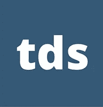
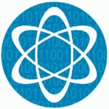
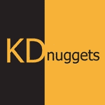
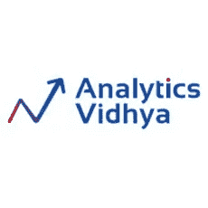
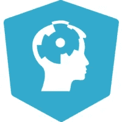
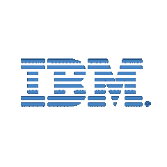
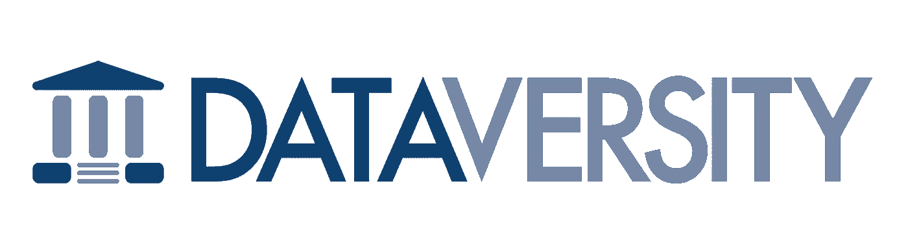

# 2020 年最佳数据科学博客

> 原文：<https://towardsdatascience.com/best-data-science-blogs-to-follow-in-2020-d03044169eb4?source=collection_archive---------12----------------------->

## 最值得信赖和享有盛誉的来源，让您了解数据科学领域的最新动态。

照片由[像素](https://www.pexels.com/photo/business-charts-commerce-computer-265087/?utm_content=attributionCopyText&utm_medium=referral&utm_source=pexels)的[皮克斯拜](https://www.pexels.com/@pixabay?utm_content=attributionCopyText&utm_medium=referral&utm_source=pexels)拍摄

> 数据科学是让数据变得有用的学科。

数据科学正以惊人的速度增长，以满足渴望权力的[**人工智能相关技术**](https://blog.digitalogy.co/artificial-intelligence-technologies/) 的需求，如机器学习、神经网络和深度学习。由于这些快速的变化，个人和企业可能会发现跟踪行业中的众多变化是令人困惑的。随着行业被更新的趋势和技术所淹没，企业可能会觉得有必要了解并采用这些趋势和技术来优化他们的数据处理和分析过程。

在这篇文章中，我旨在强调一些最值得信赖和最有声望的来源，让您了解数据科学领域的最新动态。

> *数据确实为我们所做的一切提供了动力。*
> 
> *——领英首席执行官杰夫·韦纳*

# 最佳数据科学博客

互联网上充斥着许多关于这些趋势的研究和深入分析的文章、时事通讯、白皮书和报告。我们列出了一些顶级的在线资源和门户网站，它们经常更新，全面涵盖了数据科学的所有内容。

# 1.**走向数据科学**

图片来源— [走向数据科学](https://towardsdatascience.com/)

> 共享概念、想法和代码的媒体出版物。

*   **加盟中—**2016 年 10 月
*   **网站链接—**[https://towardsdatascience.com/](https://towardsdatascience.com/)
*   **作者—** 超过 5000 人(截至 2020 年 1 月)
*   推特关注者——46.4 万关注者( [@TDataScience](https://twitter.com/TDataScience) )
*   **脸书追随者—**25868([@ tdata science](https://www.facebook.com/towardsdatascience/))
*   **Linkedin 粉丝—**202368([@ tdata science](https://www.linkedin.com/company/towards-data-science/))

《走向数据科学》是一份**媒体出版物**，酝酿着**面向受众的内容**不仅仅是关于[数据科学](https://towardsdatascience.com/data-science/home)，而是众多相关技术，如[机器学习](https://towardsdatascience.com/machine-learning/home)、[编程](https://towardsdatascience.com/programming/home)、[可视化、](https://towardsdatascience.com/data-visualization/home)和人工智能，横跨超过 **5800 篇已发表文章**。

“走向数据科学”正在帮助建立一个内容生态系统，通过让热情的读者和爱好者访问大量精心策划的帖子来激发新想法并教育他们，从而迎合他们。

该平台欢迎有识之士以**教程、**技巧、**分析**和**实践经验**的形式向读者分享他们对这些创新的看法。它是获得评论的最可靠来源之一，也是该技术多样化实现的真实例子之一。

# 2.**数据科学中心**

图片来源— [数据科学中心](https://www.datasciencecentral.com/)

> 面向大数据从业者的在线资源

*   **成立—** 2012 年
*   **创办人—** [文森特·格兰维尔](https://www.linkedin.com/in/vincentg/)
*   **网站链接—**[https://www.datasciencecentral.com/](https://www.datasciencecentral.com/)
*   **推特粉丝—**17.06 亿粉丝
*   **脸书追随者—**32201
*   Linkedin 上的关注者——163021 人

数据科学中心是数据科学内容的领先存储库之一，定期更新人工智能、机器学习、深度学习、分析、大数据等领域的最新趋势。

**拥有超过 350 篇文章**，它以明确的方式为各种各样的受众提供了一个内容丰富的平台，包括学生、极客、行业领先的专家和从业者。数据科学中心始终欢迎爱好者及其用户发表意见，并向他人展示来自数据科学世界的**最新发现。**

对于对数据科学和相关技术有着类似热情的读者，[数据科学中心提供了一个论坛](https://www.datasciencecentral.com/forum)，在这里他们可以表达自己的想法和经验，并参与直观的讨论。

 [## 数据科学家的最佳数据科学工具

### 数据科学工具，使任务可以实现

towardsdatascience.com](/best-data-science-tools-for-data-scientists-75be64144a88) 

# 3.**数据科学 Reddit**

图片来源— [Reddit](https://www.reddit.com/)

*   **网站链接—**[https://www.reddit.com/r/datascience/](https://www.reddit.com/r/datascience/)
*   **创建于**—2011 年 8 月 6 日
*   **追随者—**247 名追随者

> 数据科学从业者和专业人士讨论和辩论数据科学职业问题的地方。

Reddit 是世界知名的新闻和讨论网站，拥有数百个不同的社区和数百万活跃用户。reddit 喜欢这样称呼它，一个这样的社区或 subreddit 是 **r/DataScience** ，有超过 **247，000 名成员**经常光顾，平均每时每刻都有超过**400 名活跃成员**。

每天有超过几十个帖子，成员们**对各种最新趋势和技术进行深入讨论**，分享实践经验，并在平台上发布他们的问题，社区帮助解决这些问题。

用户可以在 subreddit 上以文本和链接的形式自由发布他们的观察结果和数据科学世界的最新进展，让每个人都了解最新情况。

# 4.KDnuggets

图片来源— [KDnuggets](https://www.kdnuggets.com/)

*   **创办**—1993 年 2 月(作为新闻信)
*   **创始人—**[Gregory Piatetsky-Shapiro](https://www.linkedin.com/in/gpiatetsky/)(数据挖掘会议的联合创始人)
*   **网站链接—**[https://www.kdnuggets.com/](https://www.kdnuggets.com/)
*   推特关注者——17.47 万关注者
*   脸书追随者—29956 人
*   **Linkedin 粉丝**—18169 人

> “KD”代表“知识发现”。

KDnuggets 是一个著名的网站，旨在获取世界上一些快速发展的技术的信息，包括数据科学、人工智能、分析、机器学习、数据挖掘和大数据。

它每个月有超过 50 万**的独立访客**，在 Twitter、脸书、LinkedIn 和 RSS 订阅源上有超过 26 万的累积用户。KDnuggets 一直在报道计算机科学世界中所有有影响力的事件，并通过博客、新闻、网络研讨会和各种教程呈现这些事件**。**

KDnuggets 提供了一个广泛的现成数据集集合**，以及一个面向数据科学的软件库**，可以帮助您开始使用。为了迎合以职业为导向的读者，KDnuggets 有**专门的课程和工作板块**，提供最受欢迎的技能和相关工作岗位的课程。

 [## 2020 年的数据科学趋势

### 新十年的关键数据科学趋势

towardsdatascience.com](/data-science-trends-for-2020-9b2ee27af499) 

# 5.分析 Vidhya

图片来源— [分析 Vidhya](https://www.analyticsvidhya.com/)

*   **成立—** 2014 年
*   **由**——[库纳尔·贾因](https://www.linkedin.com/in/jaink/)创立
*   **网站链接—【https://www.analyticsvidhya.com/】T22**
*   推特关注者——25.7 万关注者
*   脸书追随者—60817 人
*   Linkedin 上的粉丝人数

Analytics Vidhya 通过其**四个重要支柱**提供了一个完整的数据科学生态系统，这些支柱让您了解行业的顶级趋势，通过在线课程巩固您的基础知识，允许您在黑客马拉松上与其他个人互动，并使您成为平台上各种工作的有竞争力的候选人。

凭借超过**320 万的月访问量**，它是洞察不断增长的数据科学、机器学习、深度学习和人工智能领域的良好平台之一。读者可以找到各种技术和趋势、认证在线课程、实践测试、教程、在线竞赛访问以及数据科学领域的最新工作机会。

# 6.**数据科学|谷歌新闻**

图片来源— [谷歌新闻](https://news.google.com/datascience)

*   **链接——**【https://news.google.com/datascience】T2

**谷歌的新闻平台**涵盖了各种主题的最新趋势和信息，包括行业的一般新闻和特定趋势。作为互联网上几乎所有领先信息来源的保留节目，谷歌新闻提供了一些最著名的数据科学平台的同样广泛的最新创新。

借助谷歌对所有数据科学新闻的一站式解决方案，读者可以获得海量信息，涵盖主题的各个方面。所有这些高质量的信息仅仅是在**谷歌新闻应用或网站**上的简单搜索，简化了可访问性。

 [## 面向所有人的顶级谷歌人工智能工具

### 使用谷歌人工智能中心将想法变为现实

towardsdatascience.com](/top-google-ai-tools-for-everyone-60346ab7e08) 

# 7.**数据营**

图像来源— [数据营](https://www.datacamp.com/)

> 在线学习数据科学最聪明的方法

*   **成立于** — 2013 年
*   **创始人—** 马丁·托伊维森、乔纳森·科内利森、迪特·德·梅斯梅尔
*   **网站链接—**[https://www.datacamp.com/](https://www.datacamp.com/)
*   推特关注者——51.4 万关注者
*   脸书追随者—956384 人
*   Linkedin 上的粉丝人数

DataCamp 是一家**行业领先的数据科学在线课程提供商**，提供数据科学行业中一些广泛使用的工具的实践经验，如 Python、R、Scala、Power BI、Excel、tableau 等。除了提供超过 **300 门课程**，涵盖数据科学的每个关键过程，DataCamp **还提供了一个社区部分**，其中充满了关于数据科学、人工智能、机器学习、深度学习等**热门趋势的**内容、教程和备忘单**。**

热心的读者还可以免费浏览参考资料部分，查看一些业内知名领袖和研究人员的白皮书和网络研讨会，为读者提供不可或缺的知识。

# 8.IBM 大数据和分析中心

图片来源— [IBM 大数据&分析中心](https://www.ibmbigdatahub.com/)

*   **网站链接—**【https://www.ibmbigdatahub.com/ 
*   **推特粉丝—**19.74 万粉丝
*   领英粉丝—172482 人

这家跨国巨头为数千家成功企业提供支持，是数据科学和人工智能行业众多创新中的关键人物。 **IBM** 相信与世界分享知识，并且**为数据科学狂热者和感兴趣的读者创建了 IBM 大数据&分析中心**，在这里可以以系统的方式轻松访问所有信息。

IBM 涵盖各种行业、技术和分析等方面，以易于理解的形式提供了众多行业特定问题及其解决方案的 360 度概述，以加深理解。

# 9. **InsideBIGDATA**

图像来源— [InsideBIGDATA](https://insidebigdata.com/)

> 你的机器学习资源

*   **成立**—2011 年 8 月 28 日
*   **经营人—** [里奇·布鲁克纳](https://www.linkedin.com/in/richbrueckner/)
*   **网站链接—**[https://insidebigdata.com/](https://insidebigdata.com/)

InsideBIGDATA 是最受欢迎的新闻平台之一，它提供有关 IT 世界最新战略和技术的定期更新和新闻。InsideBIGDATA 涵盖了大数据、数据科学、机器学习、深度学习和人工智能等广泛的主题，出色地提供了关于上述主题的有影响力的行业观点和重要提示。

这些信息以各种格式准确呈现，如**报告、简讯、资源、白皮书以及来自数据科学和大数据领域的一些顶级影响者的采访**。

# 10.**脸书数据科学博客**

图片来源— [脸书](https://www.facebook.com/)

> 获得洞察力，实现有意义的社交互动

*   **链接—**[https://research.fb.com/category/data-science/](https://research.fb.com/category/data-science/)
*   脸书页面追随者—493638

顶级社交媒体巨头脸书也是数据科学行业的重要参与者。**超过 26 亿用户的庞大用户群**迫使脸书投资于可靠和胜任的数据科学技术，以深入了解其用户。

由于类似这样的几个关键原因，脸书积极研究更好的数据管理技术和创新，并将他们的发现发布在脸书数据科学博客上。读者可以从脸书一些著名的数据科学专家那里了解最新的研究趋势以及它们如何影响他们的用户。

 [## 核心数据科学(CDS)

### 推进数据科学的前沿核心数据科学(CDS)是一个研究和开发团队，致力于改善…

research.fb.com](https://research.fb.com/teams/core-data-science/) 

# 11.数据机器人

图片来源— [数据机器人](https://www.datarobot.com/)

*   **成立于** — 2012 年
*   **由**创立——[杰里米·阿钦](https://www.linkedin.com/in/jeremy-achin-b425583a/)，[汤姆·德·戈多伊](https://www.linkedin.com/in/tom-de-godoy/)
*   **网站链接—**[https://www.datarobot.com/](https://www.datarobot.com/)
*   **推特粉丝—**1640 万粉丝
*   脸书追随者—5489 人
*   Linkedin 的关注者

DataRobot 是一个平台，让企业在运营中采用人工智能自动化，帮助他们在激烈的竞争中取得成功。除了将人工智能纳入组织战略之外，DataRobot 还以非常结构化的方式提供了大量来自专家的经过彻底研究的资源，涉及机器学习、人工智能和数据科学等多个主题。

读者和爱好者可以通过几种流行的格式获得数据科学和人工智能世界的最新更新，如博客、案例研究、白皮书、播客、视频、分析师报告等。

# 12.数据大学

图像来源— [数据多样性](https://www.dataversity.net/)

> 面向数据专业人员的教育资源

*   **成立于** — 2012 年
*   **由**创立——[托尼·肖](https://www.dataversity.net/contributors/tony-shaw/#:~:text=Founder%20%26%20CEO%2C%20DATAVERSITY,and%20it's%20predecessor%20Wilshire%20Conferences.)
*   **网站链接—**【https://www.dataversity.net/ 
*   **推特粉丝—**22.5 万粉丝
*   脸书追随者—6495 人
*   Linkedin 的追随者—5884 人

DATAVERSITY 致力于向其受众(主要包括日常处理数据的企业、IT 专业人员、开发人员和专家)提供对数据科学行业几项独特创新的丰富理解。

通过从各种来源(包括案例研究、会议、在线活动、网络研讨会、大量研究报告和专家意见)收集的重要见解，我们的目标是向不同的受众提供单一的信息来源。读者可以访问现场网络研讨会、白皮书、在线培训材料、博客和文章，在那里他们可以分解复杂的创新，为读者描绘一幅更清晰的画面。

# 结论

随着数据科学家需求的快速增长，自学行业最新创新的需求变得势在必行。随着互联网成为几乎所有可以想象的信息的巨大集合，找到正确的知识来源可能会变得具有挑战性。在这篇文章中，我们旨在通过 12 个平台简化您的搜索，这些平台可以方便地告诉您为什么数据科学存在，以及您如何跟上技术的各种变化。

> ***注:*** *为了消除各种各样的问题，我想提醒你一个事实，这篇文章仅代表我想分享的个人观点，你有权不同意它。*

# 更多有趣的阅读—

我希望这篇文章对你有用！以下是一些有趣的读物，希望你也喜欢

 [## 2020 年人工智能工程师的顶级编程语言

### 从几种编程语言中，人工智能工程师和科学家可以挑选出适合他们需要的语言

towardsdatascience.com](/top-programming-languages-for-ai-engineers-in-2020-33a9f16a80b0)  [## 2020 年你必须使用的最好的 Python IDEs 和代码编辑器

### 具有显著特性的顶级 Python IDEs 和代码编辑器

towardsdatascience.com](/best-python-ides-and-code-editors-you-must-use-in-2020-2303a53db24)  [## 2020 年必读的机器学习书籍

### 看看吧，你为什么要读它们？

towardsdatascience.com](/machine-learning-books-you-must-read-in-2020-d6e0620b34d7)  [## 机器学习和深度学习的最佳 Python 库

### 现代机器学习模型和项目的 Python 库

towardsdatascience.com](/best-python-libraries-for-machine-learning-and-deep-learning-b0bd40c7e8c) 

> **关于作者**
> 
> **克莱尔 D** 。是[**Digitalogy**](https://www.digitalogy.co/)**—**的内容制作者和营销人员，这是一个技术采购和定制匹配市场，根据全球各地的特定需求，将人们与预先筛选的&顶尖开发人员和设计师联系起来。在[**Linkedin**](https://www.linkedin.com/company/digitalogy)[**Twitter**](https://twitter.com/DigitalogyCorp)[**insta gram**](https://www.instagram.com/digitalogycorp)上连接 **Digitalogy** 。