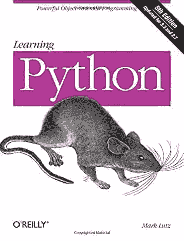
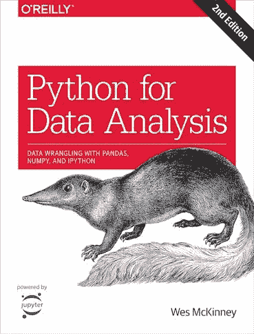
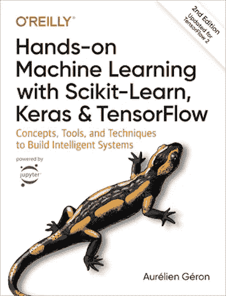

# 最佳数据科学书籍

> 原文：<https://towardsdatascience.com/best-data-science-books-be1ab472876d?source=collection_archive---------59----------------------->

## 帮助您学习数据科学的前三本书

图片由[皮沙贝](https://pixabay.com/?utm_source=link-attribution&utm_medium=referral&utm_campaign=image&utm_content=1659717)的[格哈特 G.](https://pixabay.com/users/blende12-201217/?utm_source=link-attribution&utm_medium=referral&utm_campaign=image&utm_content=1659717) 拍摄

**简介**

很多人问我，我为想要开始数据科学之旅的人推荐什么资源。本节列出了我推荐你作为数据科学家一生中至少应该阅读一次的书籍。

学做数据科学家需要看这些书吗？答案是:没有。网上有很多和这些书一样好的教程和免费资料。然而，如果你买得起，并能把它们作为补充材料阅读，它们会成为很好的学习资源。与在线教程不同，这些书有一个结构，并以一种有组织和结构化的方式教授概念。这意味着你可以把时间花在学习上，而不是浪费在互联网上寻找好的教程。

我在这里推荐的书籍涵盖了作为一名数据科学家你将需要掌握的主要话题:编程(python)、数据分析和机器学习(包括深度学习)。我知道有很多关于每个主题的书，但这些是我在学习过程中用过的书，我真的可以推荐它们。

**Python 编程**

[亚马逊](https://www.amazon.com/gp/product/1449355730/ref=as_li_tl?ie=UTF8&camp=1789&creative=9325&creativeASIN=1449355730&linkCode=as2&tag=aboutdatablog-20&linkId=c639ee8e1c452b0ffddd56088e6e88d6)(附属链接)

作为一名数据科学家，你首先应该是一名优秀的程序员，或者至少努力达到至少一门语言的编程水平。我推荐学习 python，因为它在数据科学中的常见用法和相对简单的学习曲线。

这本书就像一本 python 圣经。它大约有 1600 页，涵盖了所有基本和更高级的 python 概念。

对于开始学习 python 的人来说，这是一本好书，因为它对语言和编程概念有深入的解释，并且内容以简单易懂的方式呈现。

对于那些已经使用 python 有一段时间，但希望更好地掌握它，提高对语言和常见概念(尤其是面向对象编程)的理解的人来说，这也将是一个非常好的修订。

你可以从[这里](https://www.amazon.com/gp/product/1449355730/ref=as_li_tl?ie=UTF8&camp=1789&creative=9325&creativeASIN=1449355730&linkCode=as2&tag=aboutdatablog-20&linkId=c639ee8e1c452b0ffddd56088e6e88d6)(附属链接)得到这本书。

**数据分析**

[亚马逊](https://www.amazon.com/gp/product/1491957662/ref=as_li_tl?ie=UTF8&camp=1789&creative=9325&creativeASIN=1491957662&linkCode=as2&tag=aboutdatablog-20&linkId=c8b83e318900ef06c5484f8246a07117)(附属链接)

这本书几乎涵盖了与 pandas 有关的数据分析、数据清理和数据预处理的所有内容。而数据科学大部分时间都在做什么？

不幸或幸运的是，我们花了大部分时间来准备数据，以适应机器学习算法。这本书涵盖了所有内容，对于数据分析师或初级数据科学家来说，python 足够让他们熟悉数据分析的编程和库。

另外，这本书是由《熊猫套餐》的作者韦斯·麦金尼写的。如果不是最受欢迎的 python 数据分析库的作者，谁是学习数据分析的最佳人选呢？

你可以从[这里](https://www.amazon.com/gp/product/1491957662/ref=as_li_tl?ie=UTF8&camp=1789&creative=9325&creativeASIN=1491957662&linkCode=as2&tag=aboutdatablog-20&linkId=c8b83e318900ef06c5484f8246a07117)(附属链接)得到这本书。

**机器学习**

[亚马逊](https://www.amazon.com/gp/product/1492032646/ref=as_li_tl?ie=UTF8&camp=1789&creative=9325&creativeASIN=1492032646&linkCode=as2&tag=aboutdatablog-20&linkId=8916c5e2b50739df74d75153ccf978ee)(附属链接)。

如果你只买一本关于机器学习的书，那将是我的选择。

这可能是一本面向初学者数据科学家的书，他们希望对机器学习算法以及如何使用 scikit-learn 在现实生活中实现这些算法有一个概述。

对于已经熟悉机器学习概念并想要一本书来快速参考和复习的人来说，这也是一个很好的修订。

此外，它还有一个精彩的第二部分，重点是 Keras 和 TensorFlow 的 od 深度学习。

你可以从[这里](https://www.amazon.com/gp/product/1492032646/ref=as_li_tl?ie=UTF8&camp=1789&creative=9325&creativeASIN=1492032646&linkCode=as2&tag=aboutdatablog-20&linkId=8916c5e2b50739df74d75153ccf978ee)(附属链接)得到这本书。

**数据科学中的其他主题**

成为一名数据科学家不仅仅涉及 python 编程、数据分析和机器学习。这个职业还有其他你应该掌握的话题。我首先想到的领域是数学和统计学。

我不推荐任何关于这些主题的书籍，因为我一直依赖于我的高中和大学知识，并通过在线教程和资源提供这些知识。如果我读到任何关于这些话题的好书，我会更新这个列表。

*最初发表于 aboutdatablog.com:* [最佳数据科学书籍](https://www.aboutdatablog.com/post/best-data-science-books)，*2020 年 8 月 19 日。*

*PS:我正在 Medium 和*[***aboutdatablog.com***](https://www.aboutdatablog.com/)*上撰写以简单易懂的方式解释基本数据科学概念的文章。你可以订阅我的* [***邮件列表***](https://medium.com/subscribe/@konkiewicz.m) *在我每次写新文章的时候得到通知。如果你还不是中等会员，你可以在这里加入***。**

*下面还有一些你可能喜欢的帖子*

* [## 作为一名有抱负的数据科学家，你应该关注的中型作家

### 我最喜欢的 10 个数据科学博主，让你的学习之旅更轻松。

towardsdatascience.com](/medium-writers-you-should-follow-as-an-aspiring-data-scientist-13d5a7e6c5dc)  [## 熊猫概况和探索性数据分析的第一行代码！

### 了解如何为自动 EDA 安装和使用 pandas profiling

towardsdatascience.com](/pandas-profiling-and-exploratory-data-analysis-with-line-one-of-code-423111991e58)  [## Jupyter 笔记本自动完成

### 数据科学家的最佳生产力工具，如果您还没有使用它，您应该使用它…

towardsdatascience.com](/jupyter-notebook-autocompletion-f291008c66c)  [## 9 大 Jupyter 笔记本扩展

### 改进笔记本电脑功能，提高您的工作效率

towardsdatascience.com](/top-9-jupyter-notebook-extensions-7a5d30269bc8)*